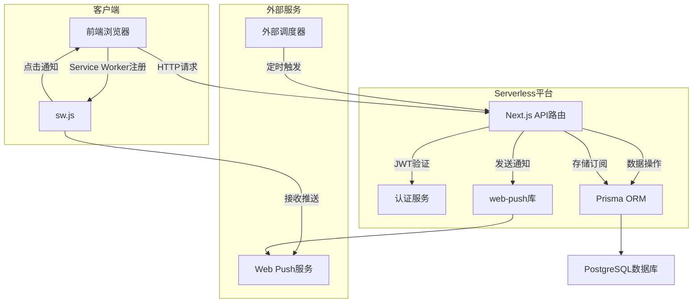

# 架构模式与设计原则

<cite>
**本文档引用的文件**  
- [login/route.ts](file://app/api/auth/login/route.ts)
- [register/route.ts](file://app/api/auth/register/route.ts)
- [events/route.ts](file://app/api/events/route.ts)
- [auth.ts](file://lib/auth.ts)
- [prisma.ts](file://lib/prisma.ts)
- [middleware.ts](file://middleware.ts)
- [web-push.ts](file://lib/web-push.ts)
- [subscribe/route.ts](file://app/api/push/subscribe/route.ts)
- [vapid-public-key/route.ts](file://app/api/push/vapid-public-key/route.ts)
- [scheduler.ts](file://lib/scheduler.ts)
- [reminder-jobs.ts](file://lib/reminder-jobs.ts)
- [run/route.ts](file://app/api/scheduler/run/route.ts)
- [schema.prisma](file://prisma/schema.prisma)
- [ServiceWorkerRegistration.tsx](file://components/ServiceWorkerRegistration.tsx)
- [sw.js](file://public/sw.js)
- [vercel.json](file://vercel.json)
</cite>

## 目录
1. [引言](#引言)
2. [分层架构设计](#分层架构设计)
3. [无状态服务与JWT会话管理](#无状态服务与jwt会话管理)
4. [Next.js中间件与认证职责边界](#nextjs中间件与认证职责边界)
5. [Serverless环境下的性能优化](#serverless环境下的性能优化)
6. [Web Push推送机制与VAPID协议](#web-push推送机制与vapid协议)
7. [系统上下文图](#系统上下文图)
8. [总结](#总结)

## 引言
本系统是一个基于Next.js的全栈待办事项应用，支持CSV导入、事件提醒和Web推送功能。系统部署于Vercel平台，采用Serverless架构，具备良好的可扩展性和维护性。本文档旨在总结系统的整体架构模式与关键设计决策，涵盖分层架构、无状态服务、中间件职责、性能优化及推送机制等核心方面。

## 分层架构设计
系统采用典型的三层架构模式：API路由层、服务逻辑层和数据访问层，实现了关注点分离、可测试性和可维护性。

### API路由层
位于`app/api`目录下的路由处理程序（Route Handlers）负责接收HTTP请求、解析输入、调用服务逻辑并返回响应。例如，用户登录请求由`/api/auth/login/route.ts`处理，该文件验证输入、查询数据库并生成JWT令牌。

### 服务逻辑层
位于`lib/`目录下的模块封装了核心业务逻辑。例如：
- `lib/auth.ts`：提供密码哈希、JWT签发与验证功能
- `lib/reminder-jobs.ts`：根据事件标签生成提醒任务
- `lib/scheduler.ts`：执行定时提醒调度

### 数据访问层
通过Prisma ORM实现数据持久化，`lib/prisma.ts`导出单例Prisma客户端，确保连接复用。数据模型定义在`prisma/schema.prisma`中，包含用户、事件、提醒规则、提醒任务和推送订阅等实体。

**分层优势**：
- **关注点分离**：各层职责清晰，便于团队协作
- **可测试性**：服务层逻辑可独立于HTTP上下文进行单元测试
- **可维护性**：修改数据访问逻辑不影响API接口定义

**Section sources**
- [login/route.ts](file://app/api/auth/login/route.ts#L1-L57)
- [auth.ts](file://lib/auth.ts#L1-L30)
- [prisma.ts](file://lib/prisma.ts#L1-L20)
- [schema.prisma](file://prisma/schema.prisma#L1-L86)

## 无状态服务与JWT会话管理
系统采用无状态服务设计，通过JWT实现会话管理，支持在Vercel等Serverless平台上的水平扩展。

### JWT认证流程
1. 用户登录时，`/api/auth/login/route.ts`验证凭据后调用`signToken()`生成JWT
2. JWT通过HTTP-only Cookie返回客户端
3. 后续请求携带Cookie，由中间件或API路由调用`verifyToken()`验证

### 无状态优势
- **可扩展性**：无需共享会话存储，每个函数实例独立处理请求
- **容错性**：实例故障不影响用户会话
- **Serverless友好**：符合FaaS的短暂执行模型

**Section sources**
- [login/route.ts](file://app/api/auth/login/route.ts#L35-L37)
- [auth.ts](file://lib/auth.ts#L14-L29)

## Next.js中间件与认证职责边界
`middleware.ts`文件实现了请求过滤与认证，与API路由内的内联验证形成清晰的职责边界。

### 中间件职责
- **路径保护**：拦截对`/calendar`等受保护路径的访问
- **未授权重定向**：无Token时重定向至登录页
- **已登录跳转**：已登录用户访问登录页时跳转至日历页

### API路由内联验证
- **细粒度控制**：每个API端点可自定义认证逻辑
- **Token刷新**：可在API中实现Token续期
- **特殊处理**：如`/api/events`需验证Token并提取用户ID

**职责边界**：中间件处理通用认证流，API路由处理业务特定的权限和数据验证。

**Section sources**
- [middleware.ts](file://middleware.ts#L1-L50)
- [events/route.ts](file://app/api/events/route.ts#L17-L25)

## Serverless环境下的性能优化
系统针对Serverless环境进行了多项性能优化，确保快速响应和成本效益。

### Prisma连接复用
`lib/prisma.ts`使用全局变量缓存Prisma客户端实例，避免在热启动时重复创建连接，减少数据库连接开销。

### 冷启动优化
- **轻量依赖**：仅引入必要库，减少包体积
- **边缘函数**：简单操作（如获取VAPID公钥）可部署为边缘函数
- **连接池**：通过`@prisma/adapter-pg`使用连接池适配器

### 边缘函数适用场景
适合部署在边缘网络的场景包括：
- 静态资源服务
- 简单的API（如`/api/push/vapid-public-key`）
- 地理位置相关的个性化内容

**Section sources**
- [prisma.ts](file://lib/prisma.ts#L5-L19)
- [vapid-public-key/route.ts](file://app/api/push/vapid-public-key/route.ts#L1-L13)

## Web Push推送机制与VAPID协议
系统采用Web Push技术实现浏览器推送，相比第三方服务更具隐私性和可控性。

### 为何选择Web Push
- **隐私保护**：无需依赖第三方推送服务
- **成本效益**：避免第三方服务费用
- **完全控制**：可自定义推送内容和行为
- **现代浏览器支持**：主流浏览器均支持Push API

### VAPID协议角色
VAPID（Voluntary Application Server Identification）协议用于：
- **身份验证**：向推送服务证明应用身份
- **安全性**：防止恶意应用滥用推送服务
- **订阅管理**：基于公钥识别应用，管理订阅

服务端通过`web-push`库设置VAPID详情，客户端通过`/api/push/vapid-public-key`获取公钥用于订阅。

**Section sources**
- [web-push.ts](file://lib/web-push.ts#L1-L54)
- [subscribe/route.ts](file://app/api/push/subscribe/route.ts#L1-L96)
- [vapid-public-key/route.ts](file://app/api/push/vapid-public-key/route.ts#L1-L13)

## 系统上下文图
以下图表展示了系统各组件的交互关系：

**Diagram sources**
- [events/route.ts](file://app/api/events/route.ts#L1-L200)
- [web-push.ts](file://lib/web-push.ts#L1-L54)
- [scheduler.ts](file://lib/scheduler.ts#L1-L86)
- [sw.js](file://public/sw.js#L1-L78)

## 总结
本系统通过分层架构实现了良好的代码组织和可维护性，采用无状态JWT认证支持Serverless环境的水平扩展。Next.js中间件与API内联验证形成清晰的职责边界，Prisma连接复用和边缘函数优化了性能。Web Push结合VAPID协议提供了安全可控的推送能力，Vercel的Cron配置确保了定时任务的可靠执行。整体设计充分考虑了现代全栈应用在可扩展性、安全性和用户体验方面的综合需求。

**Section sources**
- [vercel.json](file://vercel.json#L1-L8)
- [run/route.ts](file://app/api/scheduler/run/route.ts#L1-L37)
- [scheduler.ts](file://lib/scheduler.ts#L1-L86)