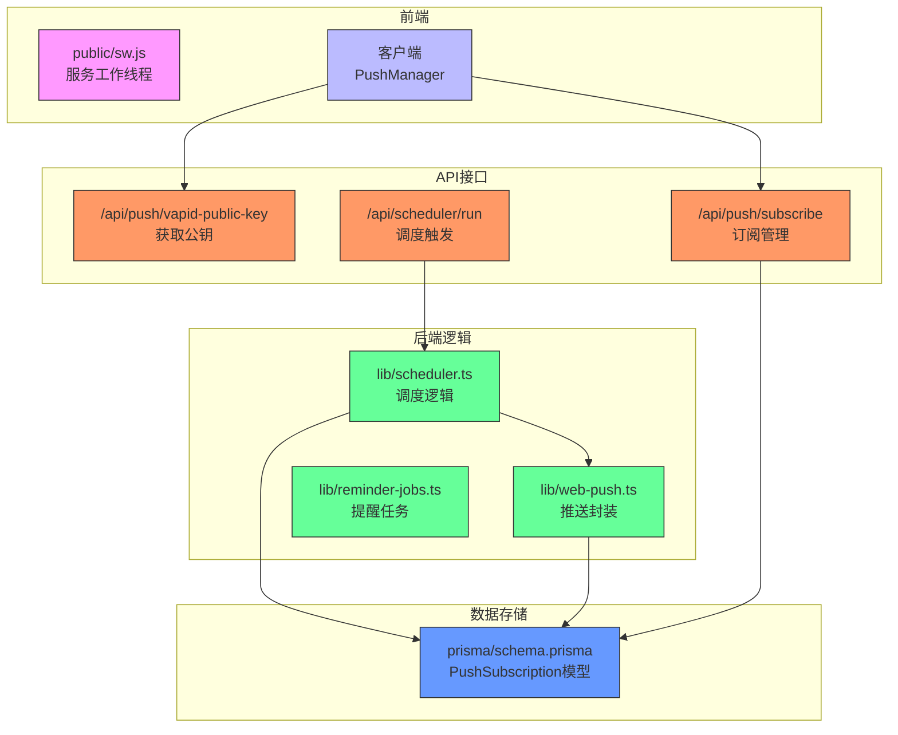
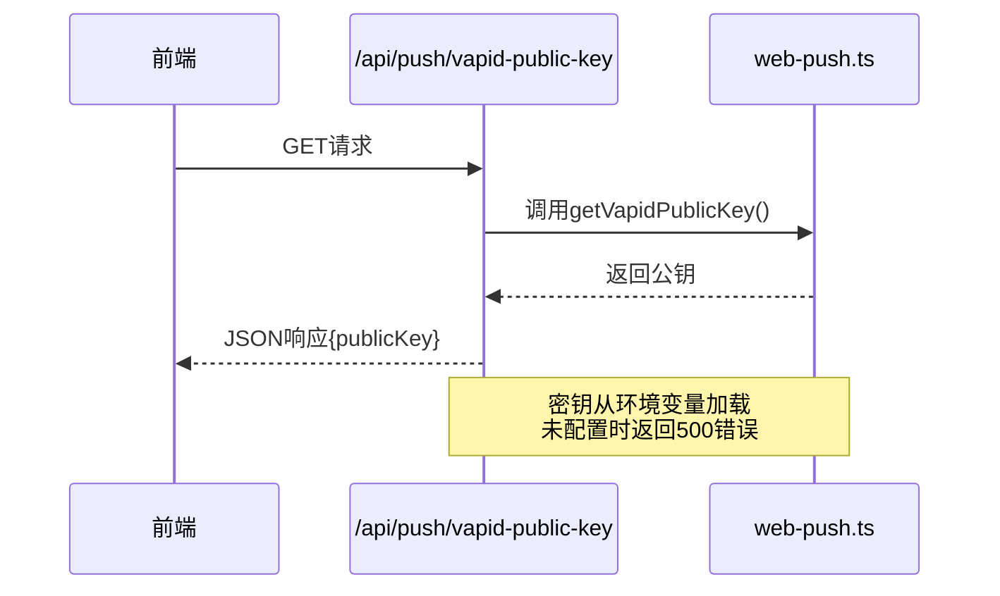
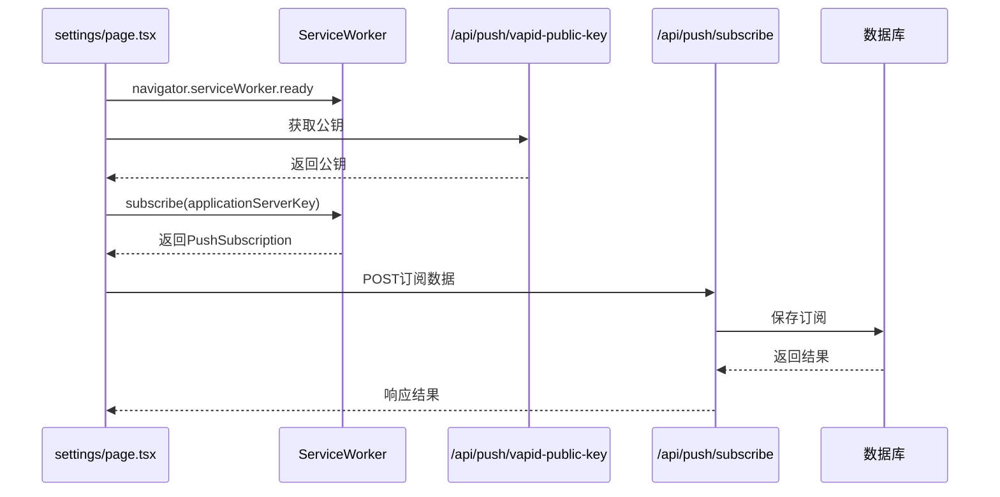
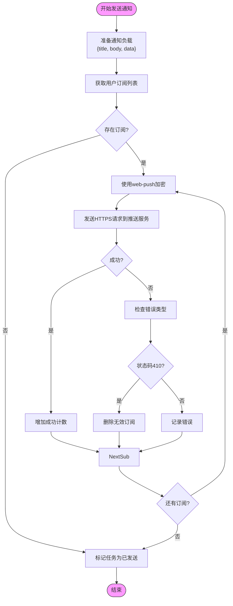
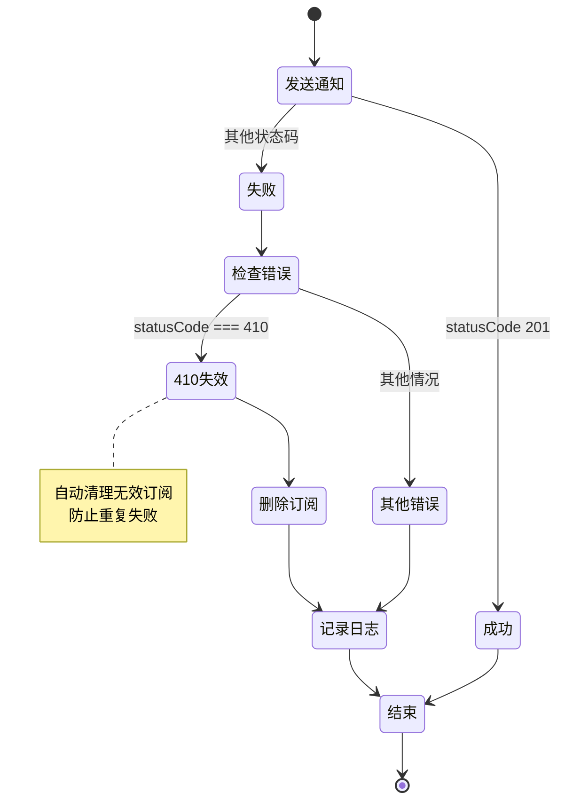
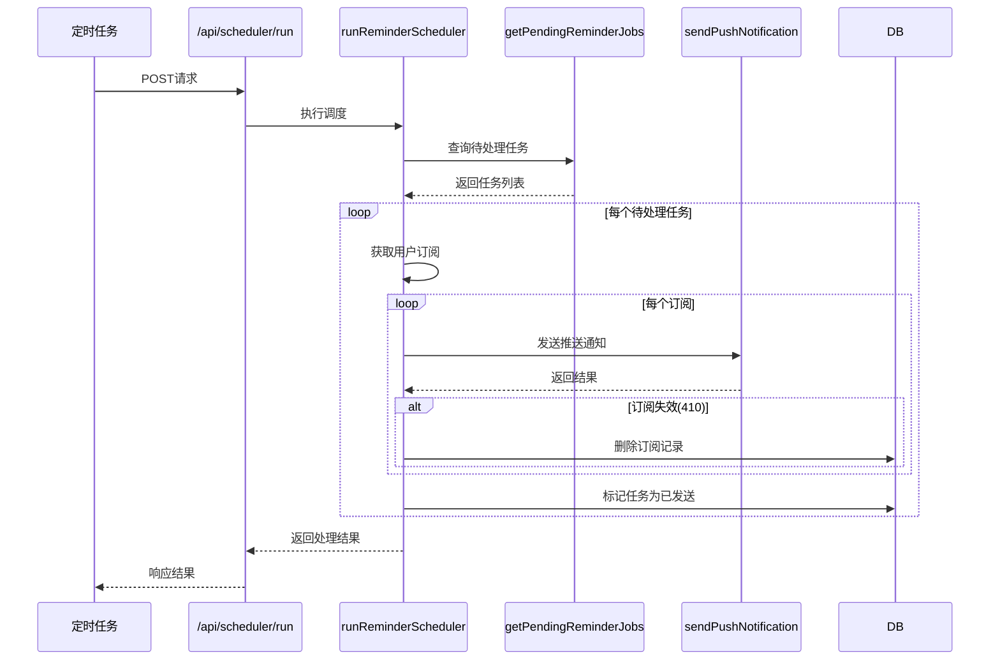
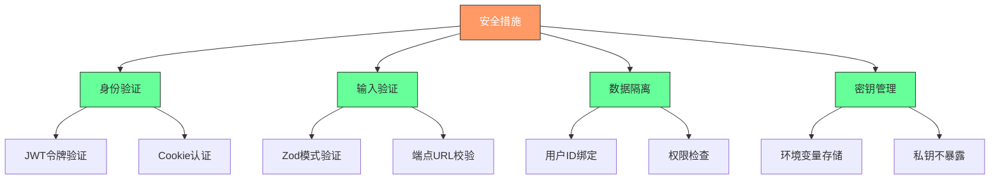
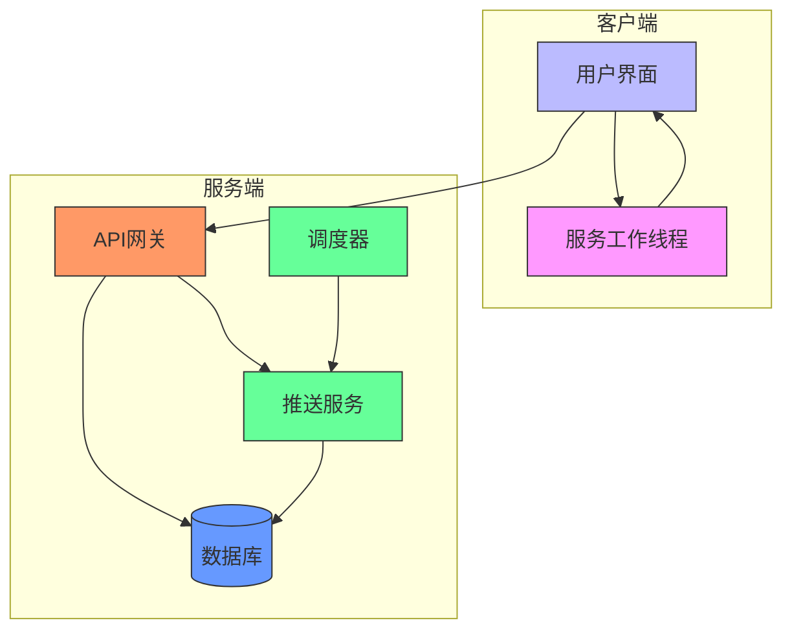

# Web Push推送服务

<cite>
**本文档中引用的文件**   
- [web-push.ts](file://lib/web-push.ts)
- [vapid-public-key/route.ts](file://app/api/push/vapid-public-key/route.ts)
- [subscribe/route.ts](file://app/api/push/subscribe/route.ts)
- [sw.js](file://public/sw.js)
- [scheduler.ts](file://lib/scheduler.ts)
- [reminder-jobs.ts](file://lib/reminder-jobs.ts)
- [schema.prisma](file://prisma/schema.prisma)
- [ServiceWorkerRegistration.tsx](file://components/ServiceWorkerRegistration.tsx)
- [NotificationPermissionPrompt.tsx](file://components/NotificationPermissionPrompt.tsx)
- [settings/page.tsx](file://app/settings/page.tsx)
- [WEB_PUSH_DEBUG.md](file://docs/WEB_PUSH_DEBUG.md)
- [SCHEDULER_SETUP.md](file://docs/SCHEDULER_SETUP.md)
</cite>

## 目录
1. [项目结构](#项目结构)
2. [核心组件](#核心组件)
3. [VAPID密钥机制](#vapid密钥机制)
4. [前端与后端协同流程](#前端与后端协同流程)
5. [加密消息推送过程](#加密消息推送过程)
6. [错误处理与订阅清理](#错误处理与订阅清理)
7. [调度器集成](#调度器集成)
8. [安全考虑](#安全考虑)
9. [架构概览](#架构概览)
10. [依赖分析](#依赖分析)

## 项目结构

本项目采用Next.js架构，Web Push相关功能分布在多个目录中。核心推送逻辑位于`lib/web-push.ts`，API路由定义在`app/api/push/`目录下，前端服务工作线程位于`public/sw.js`。数据库模型通过Prisma定义在`prisma/schema.prisma`中。



**Diagram sources**
- [web-push.ts](file://lib/web-push.ts)
- [vapid-public-key/route.ts](file://app/api/push/vapid-public-key/route.ts)
- [subscribe/route.ts](file://app/api/push/subscribe/route.ts)
- [sw.js](file://public/sw.js)
- [scheduler.ts](file://lib/scheduler.ts)
- [schema.prisma](file://prisma/schema.prisma)

**Section sources**
- [lib/web-push.ts](file://lib/web-push.ts)
- [app/api/push/vapid-public-key/route.ts](file://app/api/push/vapid-public-key/route.ts)
- [app/api/push/subscribe/route.ts](file://app/api/push/subscribe/route.ts)
- [public/sw.js](file://public/sw.js)
- [lib/scheduler.ts](file://lib/scheduler.ts)
- [prisma/schema.prisma](file://prisma/schema.prisma)

## 核心组件

系统核心组件包括Web Push封装库、API路由处理器、服务工作线程和调度器。`web-push.ts`封装了web-push库的核心功能，提供类型安全的推送接口。`subscribe/route.ts`处理订阅的创建与删除，包含完整的身份验证和输入验证。`sw.js`作为服务工作线程，负责接收推送消息并显示通知。

**Section sources**
- [web-push.ts](file://lib/web-push.ts)
- [subscribe/route.ts](file://app/api/push/subscribe/route.ts)
- [sw.js](file://public/sw.js)

## VAPID密钥机制

VAPID（Voluntary Application Server Identification）密钥用于标识推送服务来源。公私钥对通过`npx web-push generate-vapid-keys`命令生成，并存储在环境变量中。公钥通过`NEXT_PUBLIC_VAPID_PUBLIC_KEY`暴露给前端，私钥`VAPID_PRIVATE_KEY`仅在后端使用。`VAPID_SUBJECT`通常设置为联系邮箱。



**Diagram sources**
- [web-push.ts](file://lib/web-push.ts#L5-L53)
- [vapid-public-key/route.ts](file://app/api/push/vapid-public-key/route.ts#L1-L12)

**Section sources**
- [web-push.ts](file://lib/web-push.ts#L1-L53)
- [vapid-public-key/route.ts](file://app/api/push/vapid-public-key/route.ts#L1-L12)

## 前端与后端协同流程

前端通过`PushManager.subscribe`注册推送订阅，后端通过API保存`PushSubscription`对象。流程始于服务工作线程注册，随后获取VAPID公钥，最后发送订阅信息到后端。



**Diagram sources**
- [settings/page.tsx](file://app/settings/page.tsx#L125-L143)
- [subscribe/route.ts](file://app/api/push/subscribe/route.ts#L14-L57)
- [schema.prisma](file://prisma/schema.prisma#L76-L85)

**Section sources**
- [settings/page.tsx](file://app/settings/page.tsx#L125-L143)
- [subscribe/route.ts](file://app/api/push/subscribe/route.ts#L14-L57)
- [schema.prisma](file://prisma/schema.prisma#L76-L85)

## 加密消息推送过程

推送消息通过web-push库进行加密，使用ECDH密钥交换和AES-GCM加密算法。后端构建消息负载，调用`sendPushNotification`方法，库自动处理加密和HTTPS请求发送到推送服务（如FCM）。



**Diagram sources**
- [web-push.ts](file://lib/web-push.ts#L28-L46)
- [scheduler.ts](file://lib/scheduler.ts#L42-L69)

**Section sources**
- [web-push.ts](file://lib/web-push.ts#L28-L46)
- [scheduler.ts](file://lib/scheduler.ts#L42-L69)

## 错误处理与订阅清理

系统处理推送错误，特别是410 Gone状态码，表示订阅已失效。当收到410响应时，系统自动从数据库中删除对应的`PushSubscription`记录，避免后续无效推送尝试。



**Diagram sources**
- [scheduler.ts](file://lib/scheduler.ts#L61-L67)
- [subscribe/route.ts](file://app/api/push/subscribe/route.ts#L64-L65)

**Section sources**
- [scheduler.ts](file://lib/scheduler.ts#L61-L67)
- [subscribe/route.ts](file://app/api/push/subscribe/route.ts#L64-L65)

## 调度器集成

提醒调度器定期检查待处理的提醒任务，当触发时间到达时，调用推送服务发送通知。调度器通过`/api/scheduler/run`端点触发，可配置为每分钟运行一次。



**Diagram sources**
- [scheduler.ts](file://lib/scheduler.ts#L8-L85)
- [reminder-jobs.ts](file://lib/reminder-jobs.ts#L77-L97)
- [api/scheduler/run/route.ts](file://app/api/scheduler/run/route.ts#L8-L17)

**Section sources**
- [scheduler.ts](file://lib/scheduler.ts#L8-L85)
- [reminder-jobs.ts](file://lib/reminder-jobs.ts#L77-L97)
- [api/scheduler/run/route.ts](file://app/api/scheduler/run/route.ts#L8-L17)

## 安全考虑

系统实施多层安全措施：使用JWT验证用户身份，通过Zod验证输入数据，敏感操作需要身份验证。订阅数据与用户ID绑定，防止跨用户访问。环境变量存储VAPID私钥，避免泄露。



**Diagram sources**
- [subscribe/route.ts](file://app/api/push/subscribe/route.ts#L16-L24)
- [web-push.ts](file://lib/web-push.ts#L5-L7)
- [schema.prisma](file://prisma/schema.prisma#L78-L79)

**Section sources**
- [subscribe/route.ts](file://app/api/push/subscribe/route.ts#L16-L24)
- [web-push.ts](file://lib/web-push.ts#L5-L7)
- [schema.prisma](file://prisma/schema.prisma#L78-L79)

## 架构概览

系统采用分层架构，前端通过服务工作线程处理推送，后端API处理订阅管理，调度器驱动提醒发送。所有组件通过清晰的接口交互，确保可维护性和扩展性。



**Diagram sources**
- [sw.js](file://public/sw.js)
- [web-push.ts](file://lib/web-push.ts)
- [scheduler.ts](file://lib/scheduler.ts)
- [schema.prisma](file://prisma/schema.prisma)

**Section sources**
- [sw.js](file://public/sw.js)
- [web-push.ts](file://lib/web-push.ts)
- [scheduler.ts](file://lib/scheduler.ts)
- [schema.prisma](file://prisma/schema.prisma)

## 依赖分析

系统依赖关系清晰，核心依赖包括web-push库、Prisma ORM和Next.js框架。web-push封装提供推送功能，Prisma管理数据库交互，Next.js提供API路由和SSR支持。

```mermaid
dependency-graph
"web-push.ts" --> "web-push"
"subscribe/route.ts" --> "prisma"
"subscribe/route.ts" --> "zod"
"scheduler.ts" --> "web-push.ts"
"scheduler.ts" --> "prisma"
"scheduler.ts" --> "reminder-jobs.ts"
"reminder-jobs.ts" --> "prisma"
"ServiceWorkerRegistration.tsx" --> "sw.js"
"settings/page.tsx" --> "web-push.ts"
"settings/page.tsx" --> "sw.js"
"web-push" --> "node:crypto"
"prisma" --> "postgresql"
style "web-push.ts" fill:#6f9,stroke:#333
style "subscribe/route.ts" fill:#f96,stroke:#333
style "scheduler.ts" fill:#6f9,stroke:#333
style "reminder-jobs.ts" fill:#6f9,stroke:#333
style "web-push" fill:#f9f,stroke:#333
style "prisma" fill:#69f,stroke:#333
```

**Diagram sources**
- [package.json](file://package.json)
- [web-push.ts](file://lib/web-push.ts)
- [subscribe/route.ts](file://app/api/push/subscribe/route.ts)
- [scheduler.ts](file://lib/scheduler.ts)
- [reminder-jobs.ts](file://lib/reminder-jobs.ts)

**Section sources**
- [package.json](file://package.json)
- [web-push.ts](file://lib/web-push.ts)
- [subscribe/route.ts](file://app/api/push/subscribe/route.ts)
- [scheduler.ts](file://lib/scheduler.ts)
- [reminder-jobs.ts](file://lib/reminder-jobs.ts)