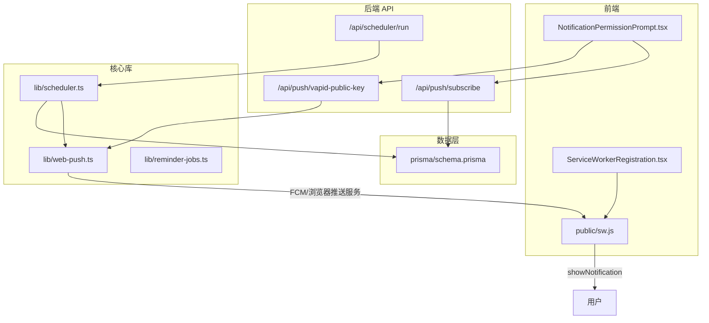
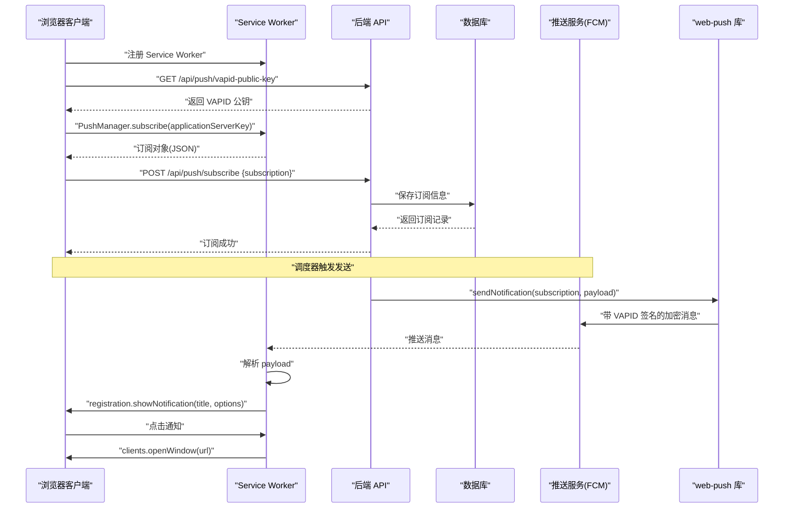
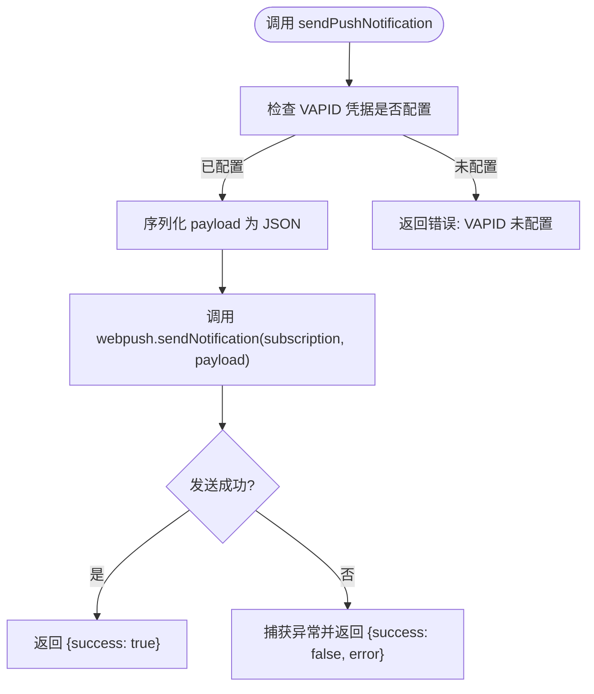
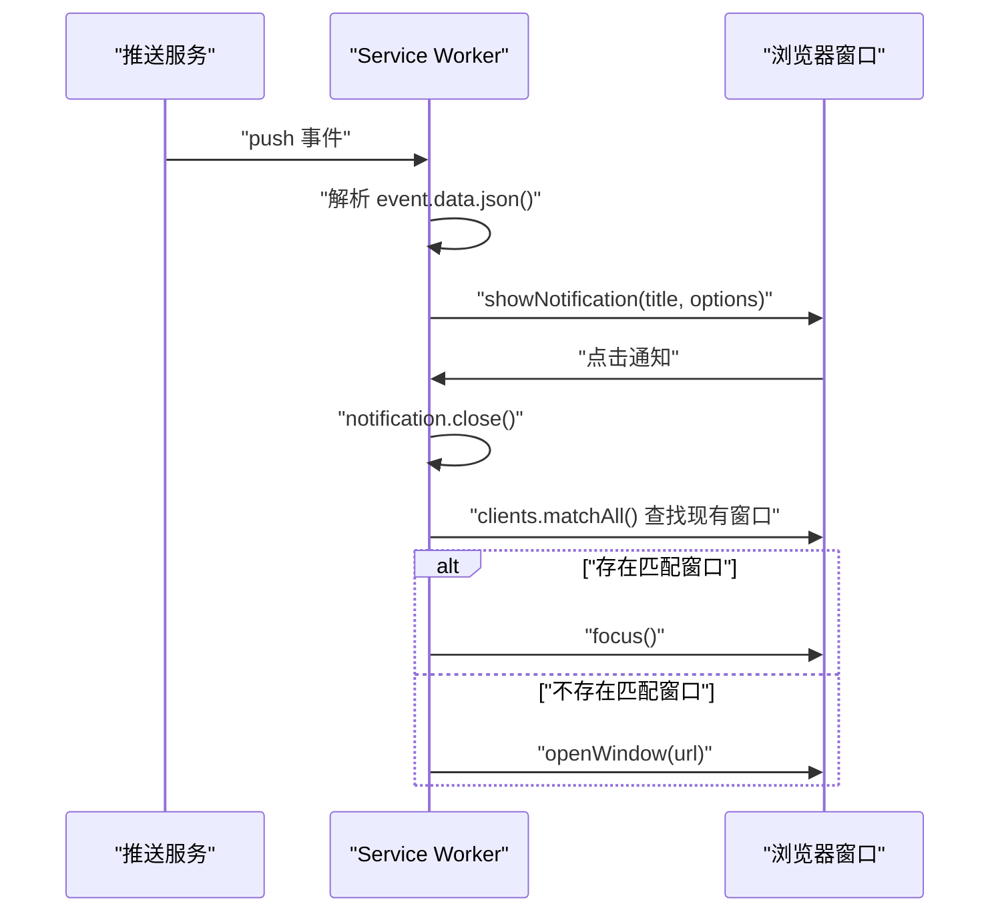
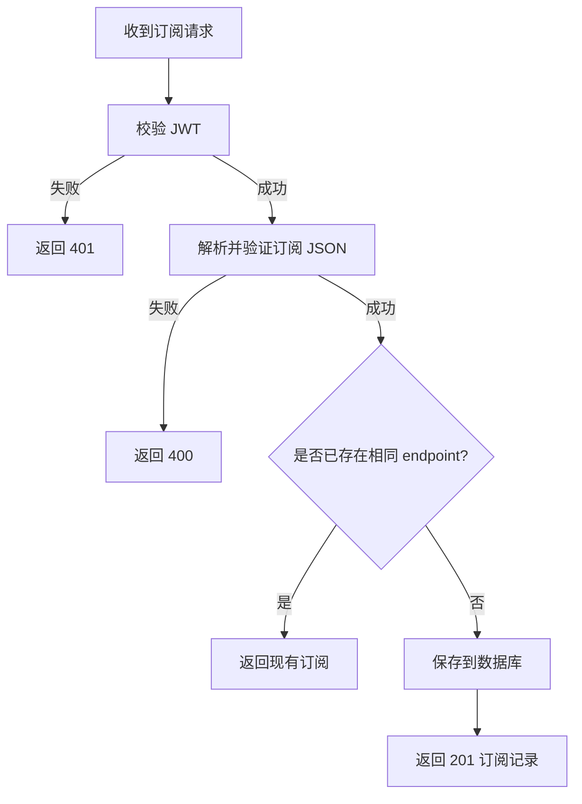
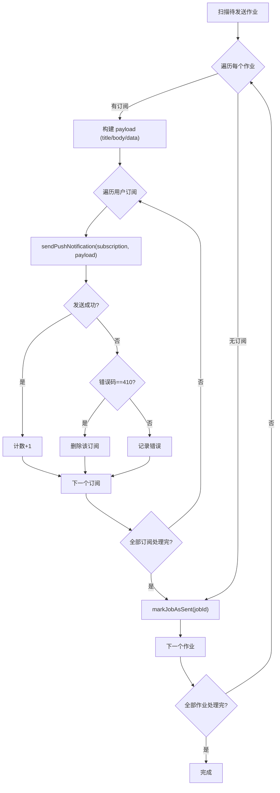
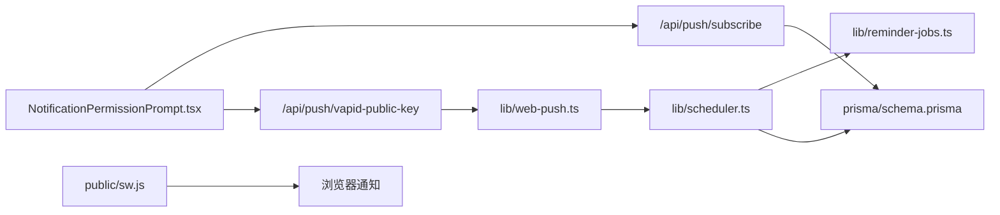

# 推送消息投递

<cite>
**本文引用的文件**
- [lib/web-push.ts](file://lib/web-push.ts)
- [public/sw.js](file://public/sw.js)
- [app/api/push/subscribe/route.ts](file://app/api/push/subscribe/route.ts)
- [app/api/push/vapid-public-key/route.ts](file://app/api/push/vapid-public-key/route.ts)
- [lib/scheduler.ts](file://lib/scheduler.ts)
- [lib/reminder-jobs.ts](file://lib/reminder-jobs.ts)
- [app/api/scheduler/run/route.ts](file://app/api/scheduler/run/route.ts)
- [components/ServiceWorkerRegistration.tsx](file://components/ServiceWorkerRegistration.tsx)
- [components/NotificationPermissionPrompt.tsx](file://components/NotificationPermissionPrompt.tsx)
- [docs/WEB_PUSH_DEBUG.md](file://docs/WEB_PUSH_DEBUG.md)
- [prisma/schema.prisma](file://prisma/schema.prisma)
- [package.json](file://package.json)
- [middleware.ts](file://middleware.ts)
</cite>

## 目录
1. [简介](#简介)
2. [项目结构](#项目结构)
3. [核心组件](#核心组件)
4. [架构总览](#架构总览)
5. [详细组件分析](#详细组件分析)
6. [依赖关系分析](#依赖关系分析)
7. [性能考虑](#性能考虑)
8. [故障排查指南](#故障排查指南)
9. [结论](#结论)

## 简介
本文件深入解析消息推送的端到端投递机制，围绕以下关键点展开：
- 以 lib/web-push.ts 中的 sendPushNotification 函数为核心，说明如何使用 web-push 库对消息 payload 进行加密并发送至浏览器推送服务（如 FCM）。
- 详细描述加密过程依赖的 VAPID 公私钥机制及 HTTPS 协议要求。
- 解释 public/sw.js 中 push 事件监听器如何接收并解析加密消息，调用 registration.showNotification 显示桌面通知。
- 涵盖通知点击处理（notificationclick）的路由跳转逻辑及交互配置（如 requireInteraction、vibrate）。
- 结合 scheduler 模块，说明当提醒任务触发时，系统如何调用推送服务发送通知。
- 提供错误处理策略，包括 410 Gone（订阅失效）和 404（无效订阅）的清理机制。
- 给出性能优化建议，如批量发送限流。

## 项目结构
该应用采用 Next.js 16 的 App Router 架构，推送相关的前后端代码分布如下：
- 前端组件与注册流程：components/ServiceWorkerRegistration.tsx、components/NotificationPermissionPrompt.tsx、public/sw.js
- 后端 API：app/api/push/*、app/api/scheduler/*
- 核心库：lib/web-push.ts、lib/scheduler.ts、lib/reminder-jobs.ts
- 数据模型：prisma/schema.prisma
- 文档：docs/WEB_PUSH_DEBUG.md

图表来源
- [components/ServiceWorkerRegistration.tsx](file://components/ServiceWorkerRegistration.tsx#L1-L30)
- [components/NotificationPermissionPrompt.tsx](file://components/NotificationPermissionPrompt.tsx#L1-L77)
- [public/sw.js](file://public/sw.js#L1-L78)
- [app/api/push/subscribe/route.ts](file://app/api/push/subscribe/route.ts#L1-L96)
- [app/api/push/vapid-public-key/route.ts](file://app/api/push/vapid-public-key/route.ts#L1-L13)
- [app/api/scheduler/run/route.ts](file://app/api/scheduler/run/route.ts#L1-L37)
- [lib/web-push.ts](file://lib/web-push.ts#L1-L54)
- [lib/scheduler.ts](file://lib/scheduler.ts#L1-L86)
- [lib/reminder-jobs.ts](file://lib/reminder-jobs.ts#L1-L109)
- [prisma/schema.prisma](file://prisma/schema.prisma#L1-L86)

章节来源
- [package.json](file://package.json#L1-L62)
- [middleware.ts](file://middleware.ts#L1-L50)

## 核心组件
- web-push 库封装与 VAPID 配置：负责初始化 VAPID 凭据并在发送通知时进行签名与加密。
- 推送订阅 API：验证用户身份，保存订阅信息到数据库。
- VAPID 公钥 API：向客户端暴露公钥，用于订阅时的密钥协商。
- 服务工作者（Service Worker）：接收推送消息、展示桌面通知、处理点击事件。
- 调度器：周期性扫描待发送的提醒任务，批量发送通知并清理失效订阅。
- 提醒作业管理：生成、查询、标记提醒任务为已发送。

章节来源
- [lib/web-push.ts](file://lib/web-push.ts#L1-L54)
- [app/api/push/subscribe/route.ts](file://app/api/push/subscribe/route.ts#L1-L96)
- [app/api/push/vapid-public-key/route.ts](file://app/api/push/vapid-public-key/route.ts#L1-L13)
- [public/sw.js](file://public/sw.js#L1-L78)
- [lib/scheduler.ts](file://lib/scheduler.ts#L1-L86)
- [lib/reminder-jobs.ts](file://lib/reminder-jobs.ts#L1-L109)

## 架构总览
端到端推送流程分为三个阶段：
1) 订阅阶段：浏览器请求权限，通过 Service Worker 注册 PushManager，向后端 API 提交订阅信息。
2) 发送阶段：调度器扫描待发送任务，构造 payload，调用 web-push 发送至推送服务。
3) 展示阶段：Service Worker 在 push 事件中解析 payload，调用 showNotification 显示通知；点击后路由跳转。

图表来源
- [components/ServiceWorkerRegistration.tsx](file://components/ServiceWorkerRegistration.tsx#L1-L30)
- [components/NotificationPermissionPrompt.tsx](file://components/NotificationPermissionPrompt.tsx#L1-L77)
- [app/api/push/vapid-public-key/route.ts](file://app/api/push/vapid-public-key/route.ts#L1-L13)
- [app/api/push/subscribe/route.ts](file://app/api/push/subscribe/route.ts#L1-L96)
- [lib/web-push.ts](file://lib/web-push.ts#L1-L54)
- [public/sw.js](file://public/sw.js#L1-L78)
- [lib/scheduler.ts](file://lib/scheduler.ts#L1-L86)

## 详细组件分析

### web-push 库与 VAPID 加密
- 初始化：从环境变量读取 VAPID 公私钥与主题，调用 setVapidDetails 完成全局配置。
- 发送流程：sendPushNotification 接收订阅对象与 payload，内部将 payload 序列化为 JSON 并调用 webpush.sendNotification。web-push 会使用 VAPID 凭据对消息进行签名，并通过 P-256 ECDH 密钥交换与 auth 密钥完成端到端加密。
- 错误处理：捕获异常并返回包含 success 与 error 的结果对象，便于上层判断与清理。

图表来源
- [lib/web-push.ts](file://lib/web-push.ts#L1-L54)

章节来源
- [lib/web-push.ts](file://lib/web-push.ts#L1-L54)
- [package.json](file://package.json#L35-L35)

### Service Worker 推送与通知交互
- push 事件：解析 event.data.json()，合并默认字段（title、body、icon、badge），调用 registration.showNotification 显示通知。配置项包括 vibrate、tag、requireInteraction 等，确保用户感知与交互。
- notificationclick：关闭通知，优先聚焦已有窗口，否则打开新窗口，目标路径来自 payload.data.url 或默认 /calendar。
- notificationclose：记录关闭事件，便于监控。

图表来源
- [public/sw.js](file://public/sw.js#L12-L73)

章节来源
- [public/sw.js](file://public/sw.js#L1-L78)

### 订阅与取消订阅 API
- POST /api/push/subscribe：校验 JWT，解析并验证订阅 JSON，去重后保存到数据库。
- DELETE /api/push/subscribe：校验 JWT，删除指定 endpoint 的订阅记录。
- 两个接口均包含鉴权与输入校验，返回标准 HTTP 状态码。

图表来源
- [app/api/push/subscribe/route.ts](file://app/api/push/subscribe/route.ts#L14-L62)

章节来源
- [app/api/push/subscribe/route.ts](file://app/api/push/subscribe/route.ts#L1-L96)

### VAPID 公钥 API
- GET /api/push/vapid-public-key：返回服务器配置的 VAPID 公钥，供前端在订阅时使用 applicationServerKey 参数。

章节来源
- [app/api/push/vapid-public-key/route.ts](file://app/api/push/vapid-public-key/route.ts#L1-L13)
- [lib/web-push.ts](file://lib/web-push.ts#L51-L53)

### 调度器与提醒作业
- 生成提醒作业：根据事件标签查找提醒规则，计算多个偏移时间，生成 ReminderJob 并入库。
- 获取待发送作业：查询 sent=false 且 fireTime<=now 的作业，按 fireTime 升序排列。
- 发送与清理：遍历用户的所有订阅，逐个发送；若返回 410，则删除该订阅；最后标记作业为已发送。

图表来源
- [lib/scheduler.ts](file://lib/scheduler.ts#L8-L85)
- [lib/reminder-jobs.ts](file://lib/reminder-jobs.ts#L77-L98)

章节来源
- [lib/scheduler.ts](file://lib/scheduler.ts#L1-L86)
- [lib/reminder-jobs.ts](file://lib/reminder-jobs.ts#L1-L109)

### 前端注册与自动订阅
- ServiceWorkerRegistration：检测浏览器支持后注册 /sw.js。
- NotificationPermissionPrompt：在合适时机请求通知权限，若授权则获取 VAPID 公钥并通过 PushManager.subscribe 订阅，随后向后端提交订阅。

章节来源
- [components/ServiceWorkerRegistration.tsx](file://components/ServiceWorkerRegistration.tsx#L1-L30)
- [components/NotificationPermissionPrompt.tsx](file://components/NotificationPermissionPrompt.tsx#L1-L77)

## 依赖关系分析
- 外部依赖：web-push、@prisma/client、zod、jose 等。
- 内部依赖：lib/web-push.ts 被 lib/scheduler.ts 引用；app/api/* 依赖 lib/reminder-jobs.ts 与 prisma 数据模型；public/sw.js 作为独立运行时组件。
- 关键耦合点：VAPID 公私钥需在服务端统一配置；订阅数据与用户绑定，需严格鉴权。

图表来源
- [lib/web-push.ts](file://lib/web-push.ts#L1-L54)
- [lib/scheduler.ts](file://lib/scheduler.ts#L1-L86)
- [lib/reminder-jobs.ts](file://lib/reminder-jobs.ts#L1-L109)
- [prisma/schema.prisma](file://prisma/schema.prisma#L1-L86)
- [app/api/push/subscribe/route.ts](file://app/api/push/subscribe/route.ts#L1-L96)
- [app/api/push/vapid-public-key/route.ts](file://app/api/push/vapid-public-key/route.ts#L1-L13)
- [components/NotificationPermissionPrompt.tsx](file://components/NotificationPermissionPrompt.tsx#L1-L77)
- [public/sw.js](file://public/sw.js#L1-L78)

## 性能考虑
- 批量发送限流：在 lib/scheduler.ts 中逐条发送订阅，可引入并发限制（如使用队列与最大并发数）避免瞬时压力过大。
- 去重与幂等：订阅 API 已做去重，建议在发送前也做一次去重检查，减少重复投递。
- 错误恢复：对网络抖动与临时错误进行指数退避重试，避免频繁重试导致雪崩。
- 缓存与预热：VAPID 公钥可短期缓存，减少每次请求的往返。
- 数据库索引：确保 PushSubscription 的 userId、endpoint 等字段有索引，提升查询效率。
- payload 精简：仅传递必要字段，避免过大的 JSON 增加传输与解析开销。

## 故障排查指南
- 权限问题：根据 docs/WEB_PUSH_DEBUG.md 的诊断步骤，检查浏览器权限状态、隐身模式测试、HTTPS 要求等。
- 订阅失效：410 Gone 时应删除无效订阅；404 时同样清理无效 endpoint。
- 服务端错误：查看 /api/scheduler/run 的响应与日志，确认 VAPID 配置与数据库连接。
- Service Worker：确认 /sw.js 已正确部署并被浏览器加载。

章节来源
- [docs/WEB_PUSH_DEBUG.md](file://docs/WEB_PUSH_DEBUG.md#L1-L166)
- [lib/scheduler.ts](file://lib/scheduler.ts#L61-L68)
- [middleware.ts](file://middleware.ts#L1-L50)

## 结论
该系统通过 VAPID 签名与端到端加密保障推送安全，借助 Service Worker 实现跨窗口通知与点击路由跳转，配合调度器实现定时提醒的自动化投递。建议在生产环境中强化限流与重试策略、完善错误清理与监控，并持续优化 payload 与数据库访问性能，以获得稳定可靠的推送体验。