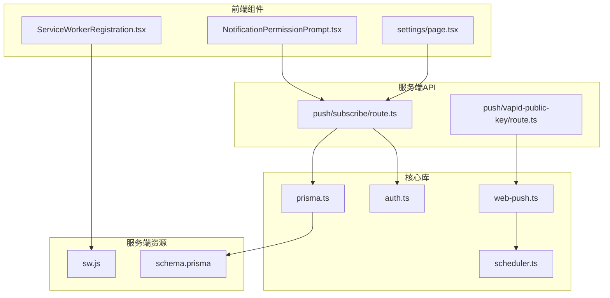
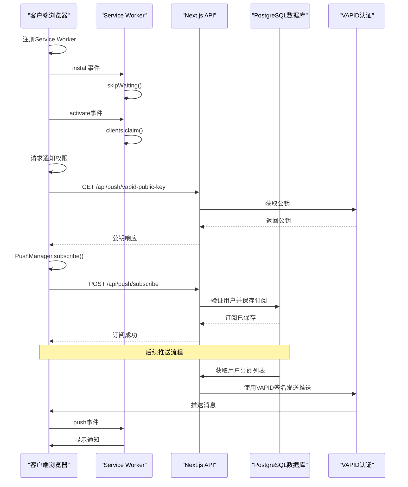
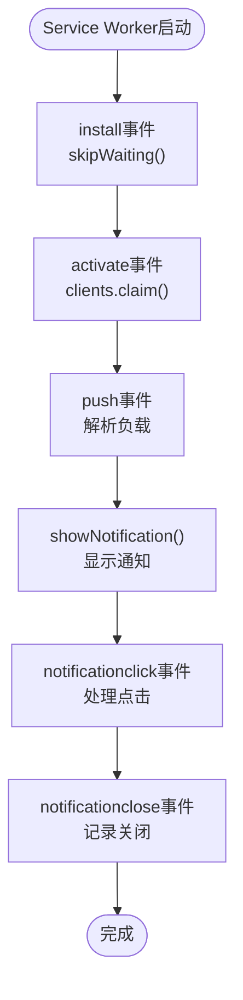
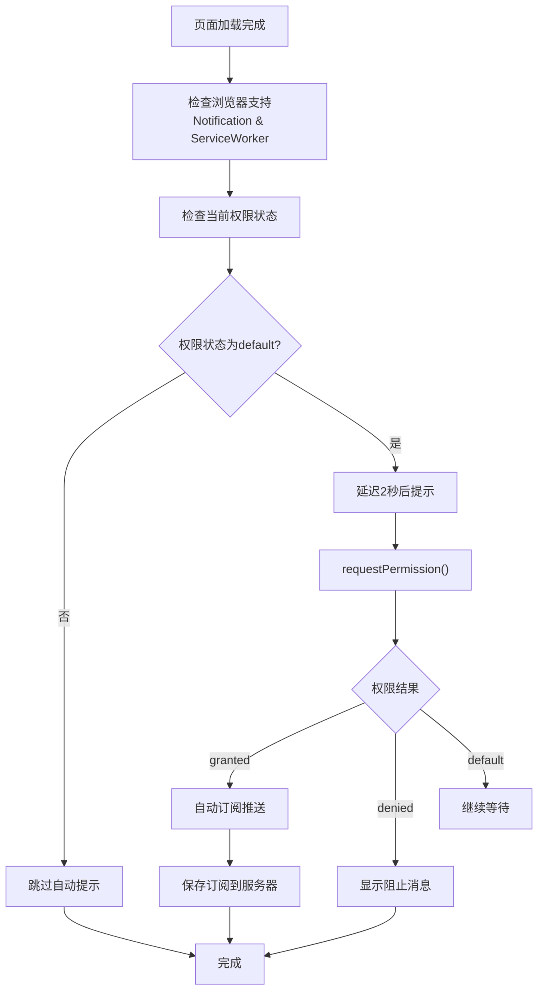
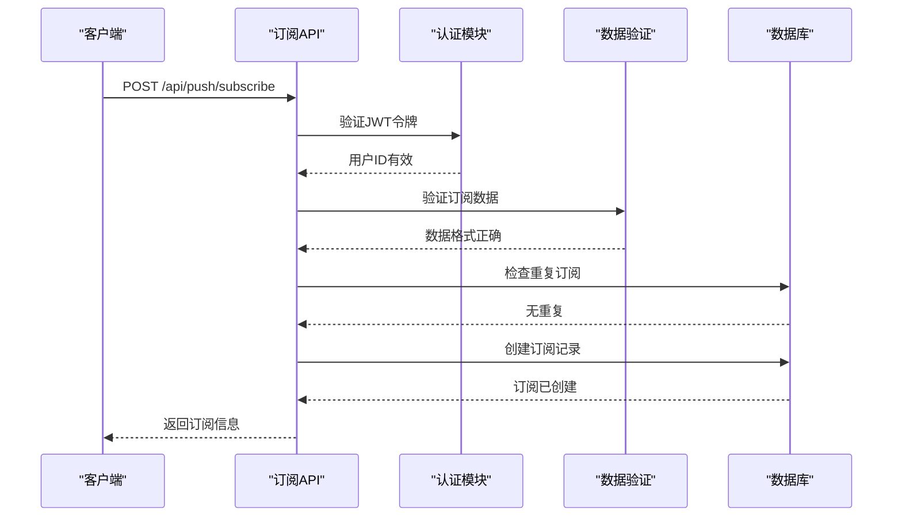
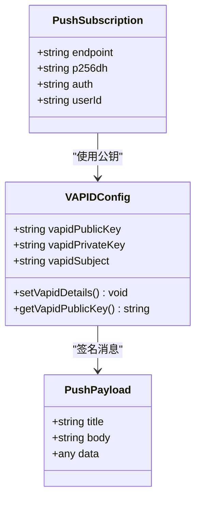
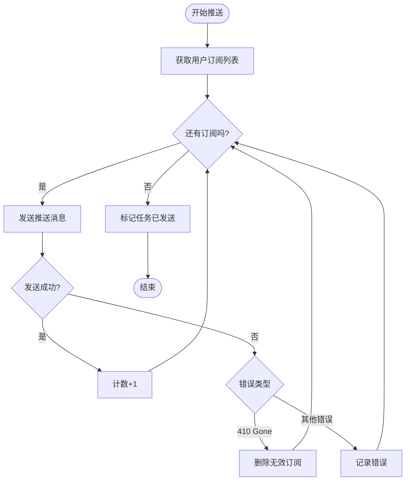
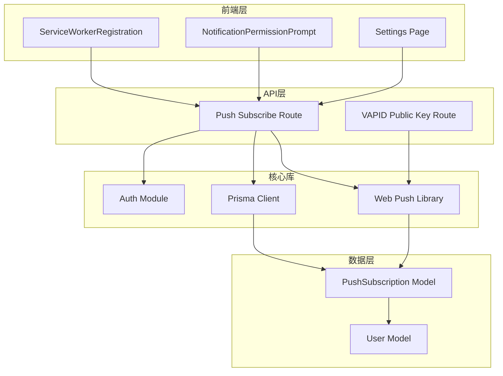

# 推送订阅管理

<cite>
**本文档引用的文件**
- [public/sw.js](file://public/sw.js)
- [app/api/push/subscribe/route.ts](file://app/api/push/subscribe/route.ts)
- [app/api/push/vapid-public-key/route.ts](file://app/api/push/vapid-public-key/route.ts)
- [lib/web-push.ts](file://lib/web-push.ts)
- [components/ServiceWorkerRegistration.tsx](file://components/ServiceWorkerRegistration.tsx)
- [components/NotificationPermissionPrompt.tsx](file://components/NotificationPermissionPrompt.tsx)
- [prisma/schema.prisma](file://prisma/schema.prisma)
- [lib/prisma.ts](file://lib/prisma.ts)
- [lib/auth.ts](file://lib/auth.ts)
- [lib/scheduler.ts](file://lib/scheduler.ts)
- [app/settings/page.tsx](file://app/settings/page.tsx)
- [docs/WEB_PUSH_DEBUG.md](file://docs/WEB_PUSH_DEBUG.md)
</cite>

## 目录
1. [简介](#简介)
2. [项目结构](#项目结构)
3. [核心组件](#核心组件)
4. [架构概览](#架构概览)
5. [详细组件分析](#详细组件分析)
6. [依赖关系分析](#依赖关系分析)
7. [性能考虑](#性能考虑)
8. [故障排除指南](#故障排除指南)
9. [结论](#结论)

## 简介

本文件详细说明了Web推送订阅的完整流程，从前端通过navigator.serviceWorker.register激活public/sw.js开始，到Service Worker的install与activate生命周期处理，再到通过PushManager.subscribe发起订阅请求获取PushSubscription对象。文档涵盖了后端如何接收并持久化存储订阅信息、验证订阅数据有效性、用户权限请求流程、订阅更新机制、取消订阅时的数据清理策略，以及浏览器兼容性问题和常见错误处理。

## 项目结构

该项目采用Next.js框架构建，推送订阅功能分布在以下关键目录中：

**图表来源**
- [components/ServiceWorkerRegistration.tsx](file://components/ServiceWorkerRegistration.tsx#L1-L30)
- [components/NotificationPermissionPrompt.tsx](file://components/NotificationPermissionPrompt.tsx#L1-L77)
- [app/api/push/subscribe/route.ts](file://app/api/push/subscribe/route.ts#L1-L96)
- [lib/web-push.ts](file://lib/web-push.ts#L1-L54)

**章节来源**
- [components/ServiceWorkerRegistration.tsx](file://components/ServiceWorkerRegistration.tsx#L1-L30)
- [app/api/push/subscribe/route.ts](file://app/api/push/subscribe/route.ts#L1-L96)
- [lib/web-push.ts](file://lib/web-push.ts#L1-L54)

## 核心组件

### Service Worker核心功能

Service Worker作为推送通知的核心执行环境，负责处理安装、激活和推送事件：

- **安装阶段**: 跳过等待期，确保快速激活
- **激活阶段**: 获取所有客户端控制权
- **推送处理**: 解析JSON负载，显示通知
- **点击处理**: 处理通知点击事件，打开目标URL
- **关闭处理**: 记录通知关闭事件

### 订阅管理API

后端提供完整的订阅管理接口：

- **POST /api/push/subscribe**: 创建新的推送订阅
- **DELETE /api/push/subscribe**: 删除现有推送订阅
- **GET /api/push/vapid-public-key**: 获取VAPID公钥

### VAPID认证系统

使用web-push库实现VAPID（Vectorized Application Identifier）认证：

- 支持基于JWT的服务器身份验证
- 提供公私钥对用于消息签名
- 确保推送消息的安全传输

**章节来源**
- [public/sw.js](file://public/sw.js#L1-L78)
- [app/api/push/subscribe/route.ts](file://app/api/push/subscribe/route.ts#L1-L96)
- [lib/web-push.ts](file://lib/web-push.ts#L1-L54)

## 架构概览

推送订阅系统的整体架构分为三层：前端交互层、服务端API层和数据存储层。

**图表来源**
- [components/ServiceWorkerRegistration.tsx](file://components/ServiceWorkerRegistration.tsx#L10-L25)
- [components/NotificationPermissionPrompt.tsx](file://components/NotificationPermissionPrompt.tsx#L51-L73)
- [app/api/push/subscribe/route.ts](file://app/api/push/subscribe/route.ts#L14-L62)
- [lib/web-push.ts](file://lib/web-push.ts#L28-L46)

## 详细组件分析

### Service Worker生命周期管理

Service Worker的生命周期包括三个关键阶段：

#### 安装阶段（Install）
- 跳过等待期，立即激活新版本
- 确保用户能够立即获得最新的推送功能

#### 激活阶段（Activate）
- 获取所有客户端的控制权
- 清理旧的缓存资源
- 准备处理推送事件

#### 推送事件处理
- 解析推送负载的JSON格式
- 提供默认通知配置
- 支持自定义通知参数

**图表来源**
- [public/sw.js](file://public/sw.js#L2-L10)
- [public/sw.js](file://public/sw.js#L12-L49)
- [public/sw.js](file://public/sw.js#L51-L77)

**章节来源**
- [public/sw.js](file://public/sw.js#L1-L78)

### 用户权限请求流程

权限请求流程确保用户体验和浏览器安全策略的平衡：

**图表来源**
- [components/NotificationPermissionPrompt.tsx](file://components/NotificationPermissionPrompt.tsx#L9-L49)
- [components/NotificationPermissionPrompt.tsx](file://components/NotificationPermissionPrompt.tsx#L51-L73)

**章节来源**
- [components/NotificationPermissionPrompt.tsx](file://components/NotificationPermissionPrompt.tsx#L1-L77)

### 订阅创建与验证机制

订阅创建过程包含多层验证和安全检查：

#### 前端订阅创建
- 获取VAPID公钥
- 配置userVisibleOnly模式
- 发送订阅请求到服务器

#### 后端验证流程
- JWT令牌验证
- 订阅数据结构验证
- 重复订阅检测
- 数据库持久化

**图表来源**
- [app/api/push/subscribe/route.ts](file://app/api/push/subscribe/route.ts#L14-L62)
- [lib/auth.ts](file://lib/auth.ts#L22-L29)

**章节来源**
- [app/api/push/subscribe/route.ts](file://app/api/push/subscribe/route.ts#L1-L96)
- [lib/auth.ts](file://lib/auth.ts#L1-L30)

### VAPID认证配置

VAPID（Vectorized Application Identifier）为推送消息提供服务器身份验证：

#### 配置结构
- **公钥**: 用于客户端订阅配置
- **私钥**: 用于消息签名
- **主题**: 用于标识应用

#### 认证流程
- 客户端获取公钥
- 服务器使用私钥签名消息
- 客户端验证消息完整性

**图表来源**
- [lib/web-push.ts](file://lib/web-push.ts#L5-L15)
- [lib/web-push.ts](file://lib/web-push.ts#L17-L23)

**章节来源**
- [lib/web-push.ts](file://lib/web-push.ts#L1-L54)

### 订阅数据模型

推送订阅使用Prisma ORM进行数据持久化，支持复杂查询和关系管理：

#### 数据模型结构
- **用户关联**: 每个订阅都绑定到特定用户
- **端点唯一性**: 同一用户在同一端点只能有一个订阅
- **密钥存储**: 存储加密所需的p256dh和auth密钥

#### 查询优化
- 基于用户ID和端点的复合索引
- 支持批量删除无效订阅
- 自动清理过期或无效的订阅

**章节来源**
- [prisma/schema.prisma](file://prisma/schema.prisma#L76-L85)
- [lib/prisma.ts](file://lib/prisma.ts#L1-L20)

### 推送发送与清理机制

系统实现了智能的推送发送和订阅清理机制：

#### 推送发送流程
- 获取用户所有订阅
- 逐个发送推送消息
- 处理410 Gone错误
- 自动删除无效订阅

#### 错误处理策略
- 记录发送失败原因
- 检测订阅失效状态
- 实时清理无效订阅
- 继续发送给其他有效订阅

**图表来源**
- [lib/scheduler.ts](file://lib/scheduler.ts#L42-L73)

**章节来源**
- [lib/scheduler.ts](file://lib/scheduler.ts#L40-L86)

## 依赖关系分析

推送订阅系统涉及多个模块间的复杂依赖关系：

**图表来源**
- [components/ServiceWorkerRegistration.tsx](file://components/ServiceWorkerRegistration.tsx#L1-L30)
- [app/api/push/subscribe/route.ts](file://app/api/push/subscribe/route.ts#L1-L96)
- [lib/web-push.ts](file://lib/web-push.ts#L1-L54)

**章节来源**
- [components/ServiceWorkerRegistration.tsx](file://components/ServiceWorkerRegistration.tsx#L1-L30)
- [app/api/push/subscribe/route.ts](file://app/api/push/subscribe/route.ts#L1-L96)
- [lib/web-push.ts](file://lib/web-push.ts#L1-L54)

## 性能考虑

### 订阅管理性能优化

1. **重复订阅检测**: 在数据库层面避免重复存储相同端点的订阅
2. **批量操作**: 支持批量删除无效订阅，减少数据库往返
3. **异步处理**: 推送发送采用异步方式，避免阻塞主线程

### 内存和资源管理

1. **Service Worker生命周期**: 合理管理内存使用，避免长时间占用
2. **通知资源**: 控制通知图标和媒体资源大小
3. **网络请求**: 优化VAPID公钥获取和订阅创建的网络请求

## 故障排除指南

### 常见浏览器兼容性问题

#### Safari浏览器问题
- 需要macOS 13+或iOS 16.4+支持
- 权限请求需要直接用户手势触发
- 可能需要手动在设置中启用通知

#### Chrome和Firefox问题
- 确保HTTPS环境
- 检查Service Worker支持
- 验证VAPID密钥配置

### 权限相关错误

#### NotAllowedError处理
- 检查浏览器是否支持通知API
- 验证HTTPS环境
- 确认用户手势触发权限请求

#### Permission状态检查
- 使用`Notification.permission`检查当前状态
- 处理`denied`状态下的用户引导
- 提供手动设置指引

### VAPID配置问题

#### 密钥配置错误
- 确认环境变量设置正确
- 验证公私钥匹配
- 检查VAPID主题格式

#### 推送发送失败
- 检查订阅端点有效性
- 验证VAPID签名
- 查看服务器日志

**章节来源**
- [docs/WEB_PUSH_DEBUG.md](file://docs/WEB_PUSH_DEBUG.md#L1-L61)
- [components/NotificationPermissionPrompt.tsx](file://components/NotificationPermissionPrompt.tsx#L91-L122)

## 结论

推送订阅管理系统提供了完整的Web推送通知解决方案，包括：

1. **完整的生命周期管理**: 从Service Worker注册到推送事件处理
2. **严格的安全验证**: JWT令牌验证和VAPID认证双重保障
3. **智能的订阅管理**: 自动检测重复订阅和清理无效订阅
4. **良好的用户体验**: 平滑的权限请求流程和错误处理
5. **完善的错误处理**: 全面的故障排除和调试支持

该系统为用户提供可靠的推送通知体验，同时为开发者提供了清晰的扩展和维护路径。通过合理的架构设计和严格的验证机制，确保了系统的稳定性和安全性。