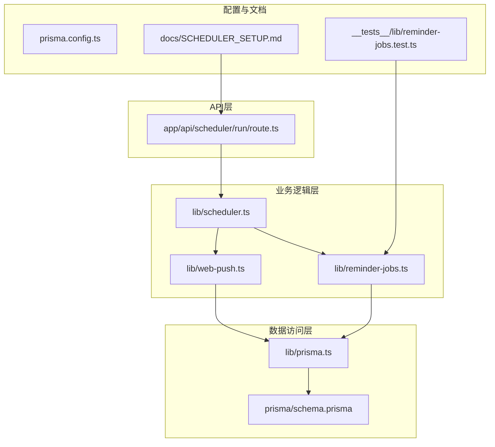
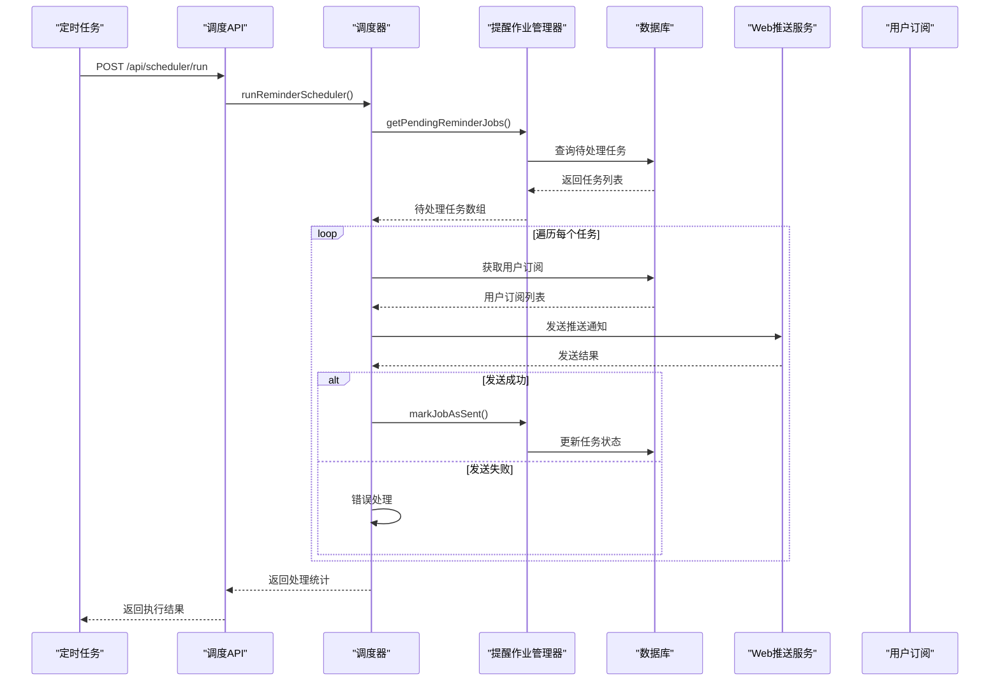
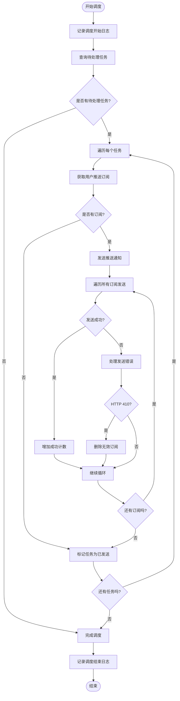
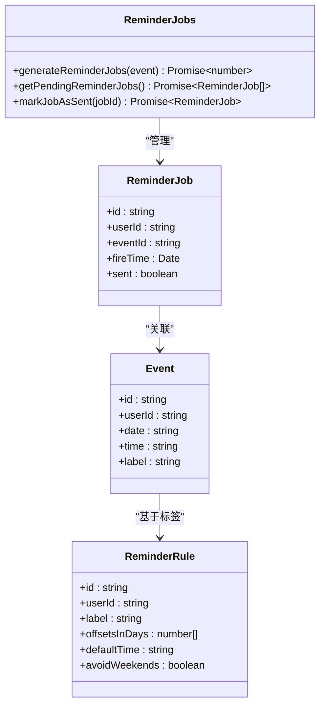
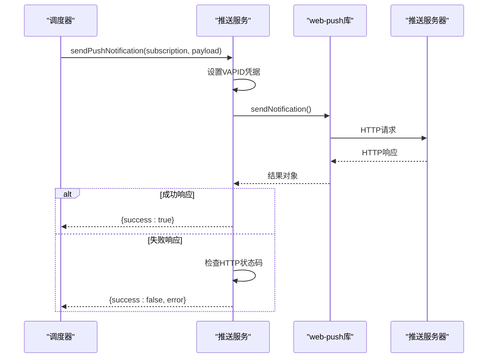
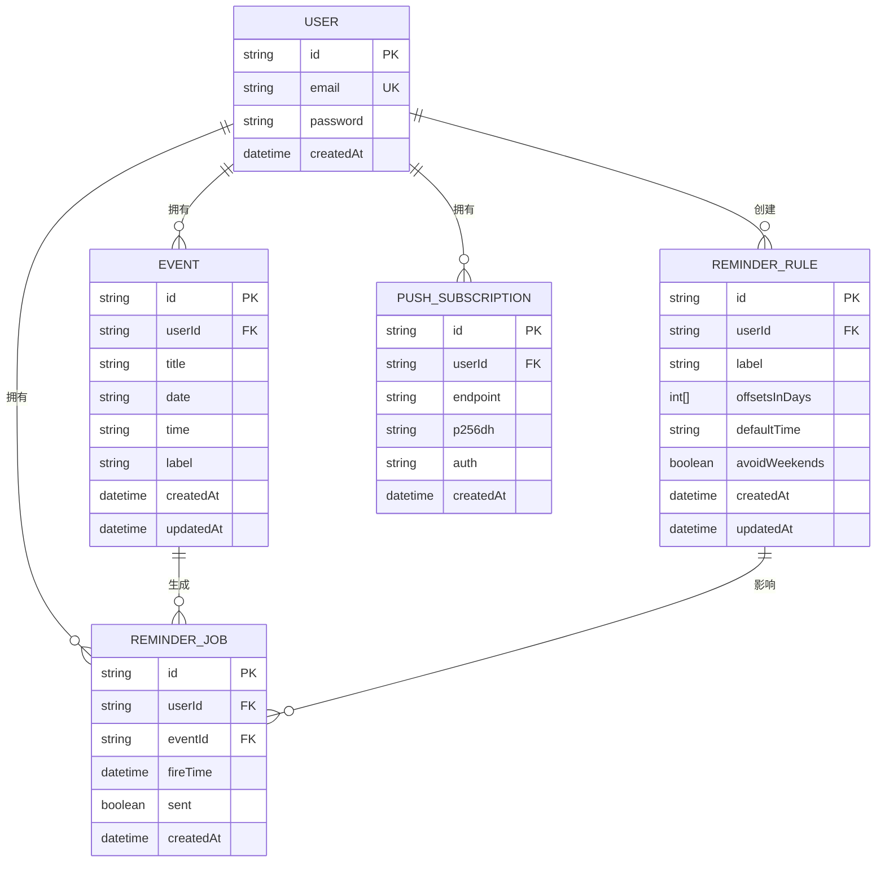
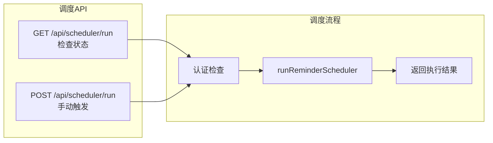

# 提醒调度引擎

<cite>
**本文档引用的文件**
- [lib/scheduler.ts](file://lib/scheduler.ts)
- [lib/reminder-jobs.ts](file://lib/reminder-jobs.ts)
- [app/api/scheduler/run/route.ts](file://app/api/scheduler/run/route.ts)
- [lib/web-push.ts](file://lib/web-push.ts)
- [prisma/schema.prisma](file://prisma/schema.prisma)
- [docs/SCHEDULER_SETUP.md](file://docs/SCHEDULER_SETUP.md)
- [__tests__/lib/reminder-jobs.test.ts](file://__tests__/lib/reminder-jobs.test.ts)
- [vitest.config.ts](file://vitest.config.ts)
- [tests/setup.ts](file://tests/setup.ts)
</cite>

## 目录
1. [简介](#简介)
2. [项目结构](#项目结构)
3. [核心组件](#核心组件)
4. [架构概览](#架构概览)
5. [详细组件分析](#详细组件分析)
6. [依赖关系分析](#依赖关系分析)
7. [性能考虑](#性能考虑)
8. [故障排除指南](#故障排除指南)
9. [结论](#结论)
10. [附录](#附录)

## 简介

提醒调度引擎是一个基于Next.js应用的通知系统，负责定期扫描数据库中的待处理提醒任务并发送Web推送通知。该系统采用定时轮询机制，通过API入口触发调度器运行，实现了完整的任务生命周期管理，包括任务生成、状态跟踪和通知发送。

## 项目结构

该项目采用模块化的文件组织方式，核心调度功能分布在以下关键目录中：



**图表来源**
- [lib/scheduler.ts](file://lib/scheduler.ts#L1-L86)
- [lib/reminder-jobs.ts](file://lib/reminder-jobs.ts#L1-L109)
- [app/api/scheduler/run/route.ts](file://app/api/scheduler/run/route.ts#L1-L37)

**章节来源**
- [lib/scheduler.ts](file://lib/scheduler.ts#L1-L86)
- [lib/reminder-jobs.ts](file://lib/reminder-jobs.ts#L1-L109)
- [app/api/scheduler/run/route.ts](file://app/api/scheduler/run/route.ts#L1-L37)

## 核心组件

### 调度器主控制器
调度器是整个系统的核心协调者，负责：
- 定期扫描待处理的提醒任务
- 获取用户推送订阅信息
- 发送Web推送通知
- 更新任务状态为已发送

### 提醒作业管理器
负责提醒任务的生命周期管理：
- 生成基于规则的提醒任务
- 查询待处理任务
- 标记任务为已发送状态

### Web推送服务
封装了Web Push API的调用，处理通知发送和错误处理。

**章节来源**
- [lib/scheduler.ts](file://lib/scheduler.ts#L8-L85)
- [lib/reminder-jobs.ts](file://lib/reminder-jobs.ts#L15-L72)
- [lib/web-push.ts](file://lib/web-push.ts#L28-L46)

## 架构概览

提醒调度引擎采用分层架构设计，实现了清晰的关注点分离：



**图表来源**
- [app/api/scheduler/run/route.ts](file://app/api/scheduler/run/route.ts#L8-L26)
- [lib/scheduler.ts](file://lib/scheduler.ts#L13-L77)
- [lib/reminder-jobs.ts](file://lib/reminder-jobs.ts#L77-L98)

## 详细组件分析

### 调度器实现机制

调度器采用简单而有效的轮询策略来处理提醒任务：



**图表来源**
- [lib/scheduler.ts](file://lib/scheduler.ts#L17-L77)

#### 并发控制机制

当前实现采用串行处理每个提醒任务的方式，通过以下机制确保数据一致性：
- 每个任务在独立的try-catch块中处理
- 任务状态通过数据库事务性更新
- 无效订阅的清理操作独立执行

#### 错误处理策略

调度器实现了多层次的错误处理：
- **任务级错误处理**：单个任务失败不影响其他任务
- **订阅级错误处理**：针对特定订阅的发送失败进行隔离
- **HTTP状态码检查**：自动检测410 Gone状态并清理无效订阅

**章节来源**
- [lib/scheduler.ts](file://lib/scheduler.ts#L17-L77)

### 提醒作业管理器

提醒作业管理器提供了完整的任务生命周期管理：



**图表来源**
- [lib/reminder-jobs.ts](file://lib/reminder-jobs.ts#L3-L72)
- [prisma/schema.prisma](file://prisma/schema.prisma#L62-L74)

#### 任务生成算法

任务生成过程遵循以下步骤：
1. 删除现有事件的所有提醒任务
2. 查找匹配的提醒规则或使用默认规则
3. 基于偏移天数计算触发时间
4. 应用周末避免逻辑调整
5. 创建所有生成的任务

**章节来源**
- [lib/reminder-jobs.ts](file://lib/reminder-jobs.ts#L15-L72)

### Web推送服务

Web推送服务封装了复杂的推送通知逻辑：



**图表来源**
- [lib/web-push.ts](file://lib/web-push.ts#L28-L46)

**章节来源**
- [lib/web-push.ts](file://lib/web-push.ts#L28-L46)

## 依赖关系分析

### 数据模型关系



**图表来源**
- [prisma/schema.prisma](file://prisma/schema.prisma#L16-L85)

### API接口设计

调度器API提供了简洁的接口设计：



**图表来源**
- [app/api/scheduler/run/route.ts](file://app/api/scheduler/run/route.ts#L8-L36)

**章节来源**
- [app/api/scheduler/run/route.ts](file://app/api/scheduler/run/route.ts#L8-L36)
- [prisma/schema.prisma](file://prisma/schema.prisma#L62-L74)

## 性能考虑

### 数据库索引优化

当前数据库模型已经包含了重要的索引配置，但可以进一步优化：

#### 现有索引
- `ReminderJob`模型已定义了复合索引：`@@index([userId, sent, fireTime])`

#### 建议的额外索引
```sql
-- 用于快速查询待处理任务
CREATE INDEX idx_reminder_job_pending ON "ReminderJob"(sent, fireTime);

-- 用于按用户查询任务
CREATE INDEX idx_reminder_job_user ON "ReminderJob"(userId);

-- 用于事件关联查询
CREATE INDEX idx_reminder_job_event ON "ReminderJob"(eventId);
```

#### 批量处理优化
当前实现采用逐个任务处理的方式，可以考虑以下优化：
- **批量查询**：使用分页查询减少单次查询的数据量
- **批量更新**：将多个任务状态更新合并为单个事务
- **并发限制**：添加最大并发数限制防止资源耗尽

### 缓存策略

建议实现以下缓存机制：
- **规则缓存**：缓存用户常用的提醒规则
- **订阅缓存**：缓存用户的推送订阅信息
- **任务预加载**：预加载即将到期的任务

### 监控指标

建议添加以下监控指标：
- 任务处理吞吐量
- 平均处理延迟
- 失败率统计
- 订阅有效性比率

## 故障排除指南

### 常见问题诊断

#### 任务未被处理
1. **检查数据库连接**：确认Prisma客户端正确初始化
2. **验证索引存在**：确认`ReminderJob`表的索引正常
3. **检查时间同步**：确认服务器时间和数据库时间一致

#### 推送通知失败
1. **检查VAPID密钥**：确认环境变量配置正确
2. **验证订阅有效性**：检查410 Gone错误的订阅清理
3. **网络连通性**：测试推送服务器的可达性

#### API调用失败
1. **认证检查**：验证授权头或令牌
2. **CORS配置**：确认跨域请求允许
3. **超时设置**：调整请求超时时间

### 日志分析

调度器提供了详细的日志输出：
- 调度开始和结束时间
- 处理的任务数量统计
- 单个任务的处理结果
- 错误详情和堆栈跟踪

**章节来源**
- [lib/scheduler.ts](file://lib/scheduler.ts#L9-L84)
- [lib/web-push.ts](file://lib/web-push.ts#L36-L46)

## 结论

提醒调度引擎实现了可靠的定时通知系统，具有以下特点：

### 优势
- **简单可靠**：采用直接的轮询机制，逻辑清晰易懂
- **容错性强**：多层错误处理确保系统稳定性
- **扩展性好**：模块化设计便于功能扩展
- **监控完善**：详细的日志输出便于问题诊断

### 改进建议
- **并发控制**：实现任务级别的互斥锁防止重复执行
- **指数退避**：为失败的推送通知实现指数退避重试
- **批量处理**：优化数据库查询和更新操作
- **监控告警**：添加实时监控和告警机制

该系统为用户提供了一个稳定可靠的提醒服务，通过合理的架构设计和错误处理机制，能够满足生产环境的可靠性要求。

## 附录

### 测试策略

#### 单元测试
使用Vitest框架对核心功能进行测试：
- **模拟数据库操作**：使用Mock模拟Prisma客户端
- **测试边界条件**：验证各种输入参数的处理
- **异步操作测试**：确保Promise和async/await的正确使用

#### 测试配置
- **环境设置**：在`tests/setup.ts`中配置测试环境变量
- **插件配置**：使用React插件支持UI组件测试
- **别名配置**：通过Vite配置支持路径别名

**章节来源**
- [__tests__/lib/reminder-jobs.test.ts](file://__tests__/lib/reminder-jobs.test.ts#L1-L113)
- [vitest.config.ts](file://vitest.config.ts#L1-L16)
- [tests/setup.ts](file://tests/setup.ts#L1-L6)

### 部署配置

#### 生产环境部署
- **定时任务配置**：推荐使用Vercel Cron每分钟触发
- **安全配置**：建议添加认证令牌保护API端点
- **监控配置**：设置日志聚合和错误报告

#### 环境变量
- `NEXT_PUBLIC_VAPID_PUBLIC_KEY`: VAPID公钥
- `VAPID_PRIVATE_KEY`: VAPID私钥
- `VAPID_SUBJECT`: VAPID主题URL
- `DATABASE_URL`: 数据库连接字符串