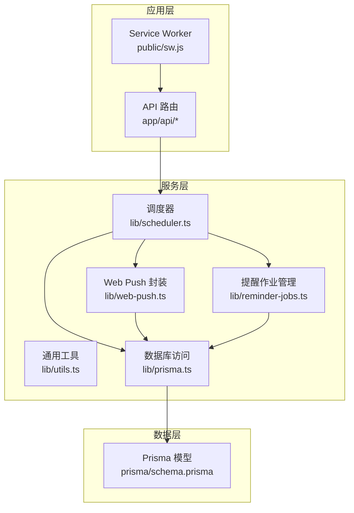
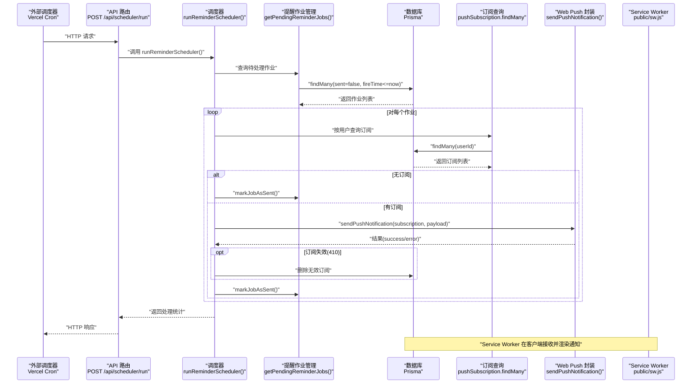
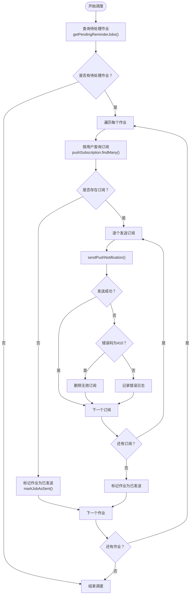
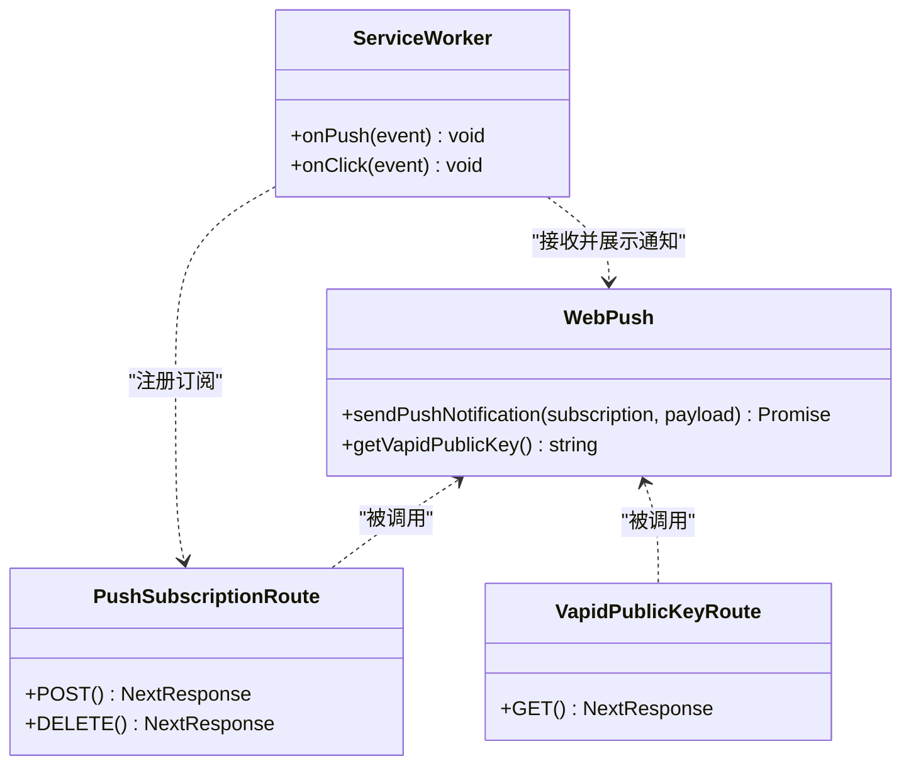
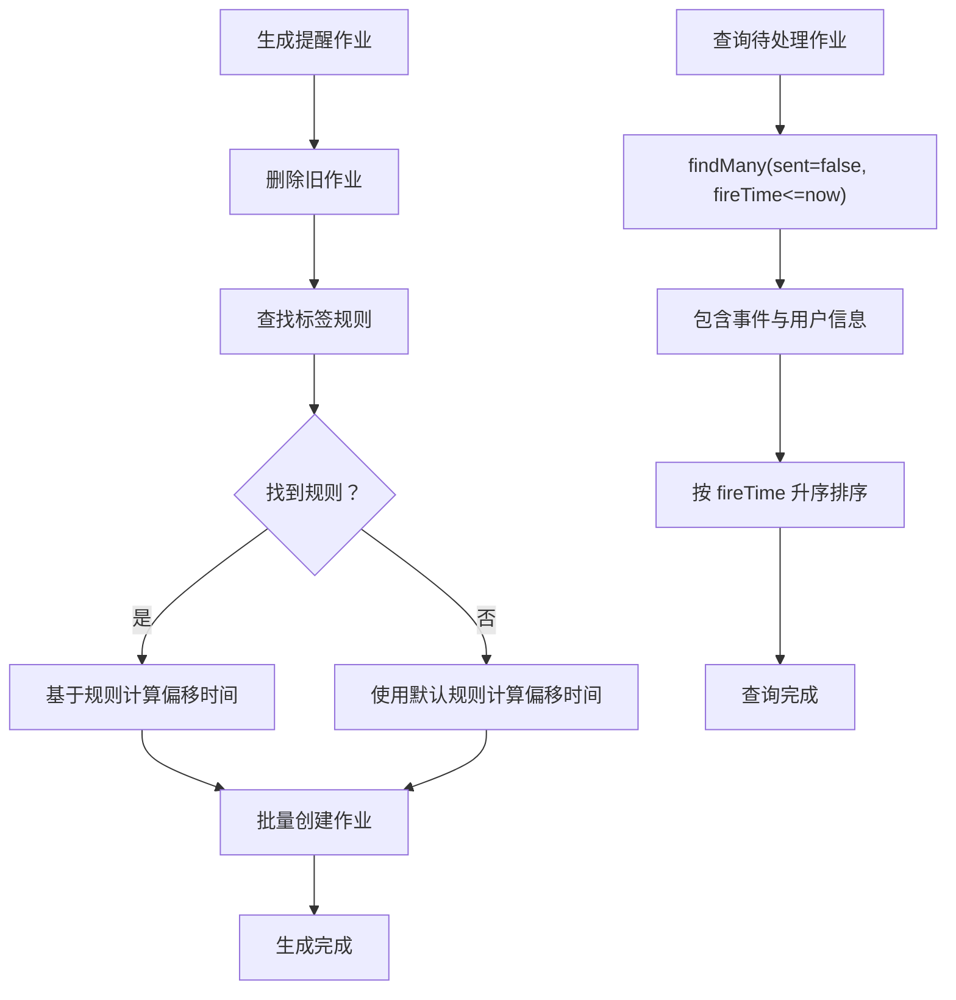
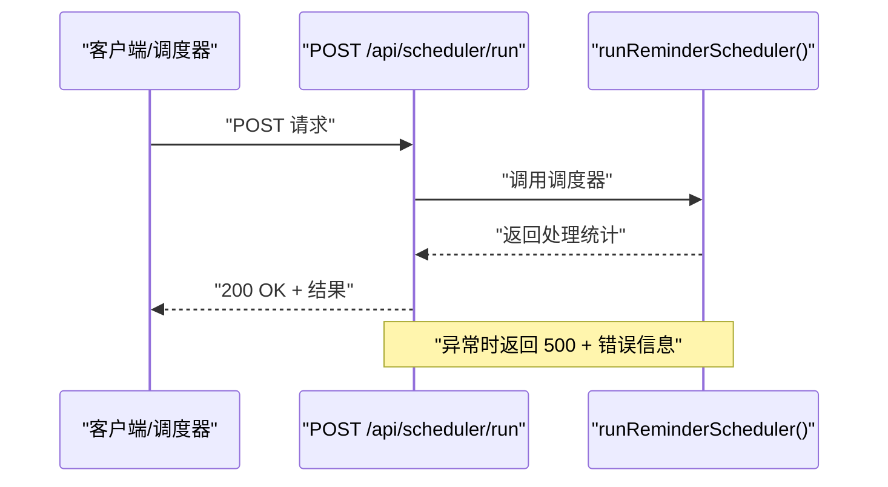
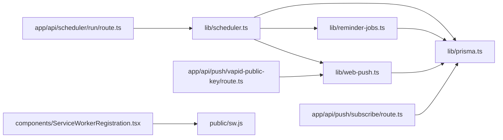

# 核心服务模块

<cite>
**本文档引用的文件**
- [lib/scheduler.ts](file://lib/scheduler.ts)
- [lib/web-push.ts](file://lib/web-push.ts)
- [lib/utils.ts](file://lib/utils.ts)
- [lib/reminder-jobs.ts](file://lib/reminder-jobs.ts)
- [lib/prisma.ts](file://lib/prisma.ts)
- [app/api/scheduler/run/route.ts](file://app/api/scheduler/run/route.ts)
- [app/api/push/subscribe/route.ts](file://app/api/push/subscribe/route.ts)
- [app/api/push/vapid-public-key/route.ts](file://app/api/push/vapid-public-key/route.ts)
- [public/sw.js](file://public/sw.js)
- [components/ServiceWorkerRegistration.tsx](file://components/ServiceWorkerRegistration.tsx)
- [prisma/schema.prisma](file://prisma/schema.prisma)
- [package.json](file://package.json)
</cite>

## 目录
1. [简介](#简介)
2. [项目结构](#项目结构)
3. [核心组件](#核心组件)
4. [架构总览](#架构总览)
5. [详细组件分析](#详细组件分析)
6. [依赖关系分析](#依赖关系分析)
7. [性能考虑](#性能考虑)
8. [故障排除指南](#故障排除指南)
9. [结论](#结论)
10. [附录](#附录)

## 简介
本文件系统性地文档化 lib 目录下的核心服务模块，重点覆盖以下方面：
- scheduler.ts 如何实现基于时间轮询的提醒调度引擎，包括任务查询条件（状态为'pending'且触发时间已到）、执行并发控制及错误重试机制
- web-push.ts 如何封装 VAPID 密钥生成、订阅存储与加密消息推送，以及与 public/sw.js 的协作流程
- utils.ts 中通用工具函数（如日期格式化、CSV 解析辅助）的设计与复用模式
- scheduler/run API 如何作为外部调度器（如 Vercel Cron）的触发入口，执行完整的调度周期
- 服务间调用关系图，展示 API 路由如何协调 scheduler 与 web-push 完成端到端提醒发送
- 服务的可测试性设计，如依赖注入与模拟接口

## 项目结构
本项目采用 Next.js 应用结构，核心服务位于 lib 目录，API 路由位于 app/api 下，公共资源位于 public 目录，数据库模型在 prisma/schema.prisma 中定义。

**图表来源**
- [lib/scheduler.ts](file://lib/scheduler.ts#L1-L86)
- [lib/web-push.ts](file://lib/web-push.ts#L1-L54)
- [lib/reminder-jobs.ts](file://lib/reminder-jobs.ts#L1-L109)
- [lib/prisma.ts](file://lib/prisma.ts#L1-L20)
- [prisma/schema.prisma](file://prisma/schema.prisma#L1-L86)

**章节来源**
- [lib/scheduler.ts](file://lib/scheduler.ts#L1-L86)
- [lib/web-push.ts](file://lib/web-push.ts#L1-L54)
- [lib/reminder-jobs.ts](file://lib/reminder-jobs.ts#L1-L109)
- [lib/prisma.ts](file://lib/prisma.ts#L1-L20)
- [prisma/schema.prisma](file://prisma/schema.prisma#L1-L86)

## 核心组件
本节概述 lib 目录中的四个关键模块及其职责：
- scheduler.ts：调度器主逻辑，负责扫描待处理提醒作业、获取用户订阅、发送推送通知并清理无效订阅
- web-push.ts：Web Push 推送封装，包含 VAPID 密钥初始化、通知发送与公钥暴露
- reminder-jobs.ts：提醒作业生命周期管理，包括生成、查询待处理作业与标记完成
- prisma.ts：数据库客户端初始化与连接池配置
- utils.ts：通用工具函数（当前为样式类合并）

**章节来源**
- [lib/scheduler.ts](file://lib/scheduler.ts#L1-L86)
- [lib/web-push.ts](file://lib/web-push.ts#L1-L54)
- [lib/reminder-jobs.ts](file://lib/reminder-jobs.ts#L1-L109)
- [lib/prisma.ts](file://lib/prisma.ts#L1-L20)
- [lib/utils.ts](file://lib/utils.ts#L1-L7)

## 架构总览
下图展示了从外部调度器到最终用户通知的完整端到端流程，包括 API 触发、调度执行、数据库交互与 Service Worker 渲染。

**图表来源**
- [app/api/scheduler/run/route.ts](file://app/api/scheduler/run/route.ts#L1-L37)
- [lib/scheduler.ts](file://lib/scheduler.ts#L8-L85)
- [lib/reminder-jobs.ts](file://lib/reminder-jobs.ts#L77-L98)
- [lib/web-push.ts](file://lib/web-push.ts#L28-L46)
- [public/sw.js](file://public/sw.js#L12-L49)

## 详细组件分析

### 调度器模块（scheduler.ts）
- 任务查询条件：通过 reminder-jobs.ts 的 getPendingReminderJobs 实现，筛选条件为 sent=false 且 fireTime ≤ 当前时间，并按 fireTime 升序排列
- 执行并发控制：采用串行循环遍历作业，逐个处理订阅发送，避免高并发带来的资源竞争与重复发送
- 错误重试机制：对单个订阅发送失败进行捕获与记录；若返回 410（Gone），自动删除无效订阅以保持订阅表整洁
- 作业完成标记：成功发送后调用 markJobAsSent 将作业标记为已发送，防止重复执行

**图表来源**
- [lib/scheduler.ts](file://lib/scheduler.ts#L17-L77)
- [lib/reminder-jobs.ts](file://lib/reminder-jobs.ts#L77-L98)
- [lib/web-push.ts](file://lib/web-push.ts#L28-L46)

**章节来源**
- [lib/scheduler.ts](file://lib/scheduler.ts#L8-L85)
- [lib/reminder-jobs.ts](file://lib/reminder-jobs.ts#L77-L98)

### Web Push 封装（web-push.ts）
- VAPID 密钥初始化：从环境变量加载公钥、私钥与主题，初始化 web-push 库
- 订阅存储：通过 app/api/push/subscribe/route.ts 提供订阅创建与删除接口，使用 Prisma 进行持久化
- 加密消息推送：sendPushNotification 将负载序列化为 JSON 并通过 web-push 发送，返回统一的成功/失败结构
- 公钥暴露：app/api/push/vapid-public-key/route.ts 暴露公钥供前端注册订阅时使用
- 与 Service Worker 协作：public/sw.js 接收 push 事件，解析负载并调用 showNotification 展示通知，处理 notificationclick 事件导航至目标页面

**图表来源**
- [lib/web-push.ts](file://lib/web-push.ts#L1-L54)
- [app/api/push/subscribe/route.ts](file://app/api/push/subscribe/route.ts#L1-L96)
- [app/api/push/vapid-public-key/route.ts](file://app/api/push/vapid-public-key/route.ts#L1-L13)
- [public/sw.js](file://public/sw.js#L12-L73)

**章节来源**
- [lib/web-push.ts](file://lib/web-push.ts#L1-L54)
- [app/api/push/subscribe/route.ts](file://app/api/push/subscribe/route.ts#L1-L96)
- [app/api/push/vapid-public-key/route.ts](file://app/api/push/vapid-public-key/route.ts#L1-L13)
- [public/sw.js](file://public/sw.js#L1-L78)

### 提醒作业管理（reminder-jobs.ts）
- 生成作业：根据事件标签查找对应提醒规则，若不存在则使用默认规则；计算多个偏移时间点生成多条提醒作业
- 查询待处理：按 sent=false 且 fireTime ≤ now 条件查询，并包含事件与用户信息，按 fireTime 升序排序
- 标记完成：作业发送完成后更新 sent=true，确保不会重复执行

**图表来源**
- [lib/reminder-jobs.ts](file://lib/reminder-jobs.ts#L15-L72)
- [lib/reminder-jobs.ts](file://lib/reminder-jobs.ts#L77-L98)

**章节来源**
- [lib/reminder-jobs.ts](file://lib/reminder-jobs.ts#L1-L109)

### 数据库访问（prisma.ts）
- 连接池：使用 @prisma/adapter-pg 创建 PostgreSQL 连接池，通过 DATABASE_URL 环境变量配置
- 客户端：初始化 PrismaClient 并在非生产环境缓存实例，避免重复创建
- 类型安全：结合 prisma/schema.prisma 的模型定义，提供强类型查询能力

**章节来源**
- [lib/prisma.ts](file://lib/prisma.ts#L1-L20)
- [prisma/schema.prisma](file://prisma/schema.prisma#L1-L86)

### 通用工具（utils.ts）
- 当前实现：cn(...) 函数用于合并 Tailwind CSS 类名，基于 clsx 与 tailwind-merge
- 复用模式：作为全局工具函数，可在组件与服务层复用，保持样式一致性

**章节来源**
- [lib/utils.ts](file://lib/utils.ts#L1-L7)

### API 路由集成（scheduler/run）
- 触发入口：POST /api/scheduler/run 作为外部调度器的触发点，内部调用 runReminderScheduler()
- 健康检查：GET /api/scheduler/run 返回可用状态提示
- 错误处理：统一捕获异常并返回结构化错误响应

**图表来源**
- [app/api/scheduler/run/route.ts](file://app/api/scheduler/run/route.ts#L1-L37)
- [lib/scheduler.ts](file://lib/scheduler.ts#L8-L85)

**章节来源**
- [app/api/scheduler/run/route.ts](file://app/api/scheduler/run/route.ts#L1-L37)

## 依赖关系分析
- 内部依赖
  - scheduler.ts 依赖 reminder-jobs.ts 与 web-push.ts，同时通过 prisma.ts 访问数据库
  - reminder-jobs.ts 仅依赖 prisma.ts
  - web-push.ts 依赖 web-push 库与 prisma.ts
- 外部依赖
  - web-push：用于 VAPID 验证与推送发送
  - @prisma/adapter-pg：PostgreSQL 适配器
  - pg：PostgreSQL 驱动
- 前端协作
  - components/ServiceWorkerRegistration.tsx 注册 public/sw.js
  - public/sw.js 处理 push 与 notificationclick 事件

**图表来源**
- [lib/scheduler.ts](file://lib/scheduler.ts#L1-L3)
- [lib/reminder-jobs.ts](file://lib/reminder-jobs.ts#L1)
- [lib/web-push.ts](file://lib/web-push.ts#L1)
- [lib/prisma.ts](file://lib/prisma.ts#L1)
- [app/api/scheduler/run/route.ts](file://app/api/scheduler/run/route.ts#L1-L2)
- [app/api/push/subscribe/route.ts](file://app/api/push/subscribe/route.ts#L1-L3)
- [app/api/push/vapid-public-key/route.ts](file://app/api/push/vapid-public-key/route.ts#L1-L2)
- [components/ServiceWorkerRegistration.tsx](file://components/ServiceWorkerRegistration.tsx#L1-L29)
- [public/sw.js](file://public/sw.js#L1-L78)

**章节来源**
- [package.json](file://package.json#L11-L36)

## 性能考虑
- 查询优化
  - reminder-jobs.ts 使用索引组合（userId, sent, fireTime）提升查询效率
  - 按 fireTime 升序排序确保最早触发的作业优先处理
- 并发控制
  - scheduler.ts 采用串行处理，避免高并发导致的数据库锁争用与重复发送
- 错误处理
  - 对单个订阅失败进行隔离，不影响其他订阅的发送
  - 自动清理无效订阅，减少后续无效调用
- 缓存与连接
  - prisma.ts 在非生产环境缓存 PrismaClient 实例，减少重复初始化开销

[本节为一般性指导，无需特定文件来源]

## 故障排除指南
- VAPID 密钥未配置
  - 现象：GET /api/push/vapid-public-key 返回 500
  - 处理：设置 NEXT_PUBLIC_VAPID_PUBLIC_KEY、VAPID_PRIVATE_KEY、VAPID_SUBJECT 环境变量
- 订阅无效（410 Gone）
  - 现象：调度器日志出现 410 错误并删除订阅
  - 处理：确认客户端重新注册订阅或等待自动清理
- 认证失败
  - 现象：POST /api/push/subscribe 返回 401
  - 处理：确保请求携带有效 token Cookie
- 调度器异常
  - 现象：POST /api/scheduler/run 返回 500
  - 处理：检查数据库连接、VAPID 配置与网络连通性

**章节来源**
- [app/api/push/vapid-public-key/route.ts](file://app/api/push/vapid-public-key/route.ts#L7-L11)
- [lib/scheduler.ts](file://lib/scheduler.ts#L59-L67)
- [app/api/push/subscribe/route.ts](file://app/api/push/subscribe/route.ts#L16-L24)
- [app/api/scheduler/run/route.ts](file://app/api/scheduler/run/route.ts#L19-L25)

## 结论
本项目通过清晰的服务分层与明确的职责边界，实现了可靠的提醒调度与推送功能。scheduler.ts 采用串行处理策略确保稳定性，web-push.ts 封装了 VAPID 与推送细节，reminder-jobs.ts 提供灵活的提醒规则生成与查询。API 路由作为外部调度器的统一入口，配合 Service Worker 完成端到端的通知体验。整体设计具备良好的可维护性与扩展性。

[本节为总结性内容，无需特定文件来源]

## 附录
- 可测试性设计建议
  - 依赖注入：将 PrismaClient、web-push 实例作为参数传入，便于单元测试替换
  - 模拟接口：使用 Vitest/Mock 对数据库与 web-push 进行模拟，隔离外部依赖
  - 测试策略：针对 scheduler.ts 的串行处理逻辑、web-push.ts 的错误分支与订阅清理逻辑编写针对性测试

[本节为一般性指导，无需特定文件来源]