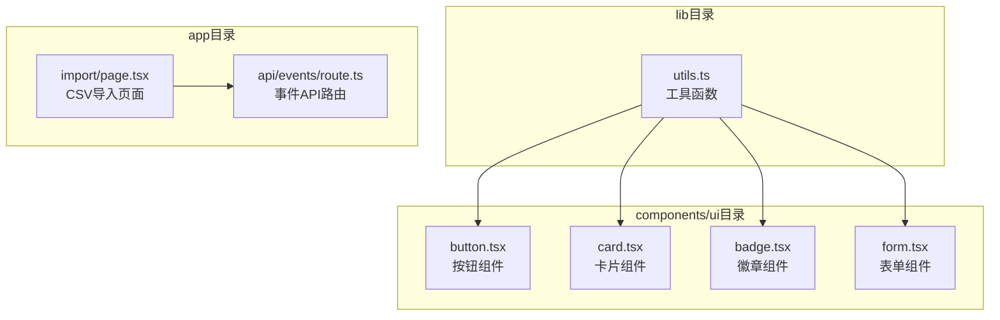
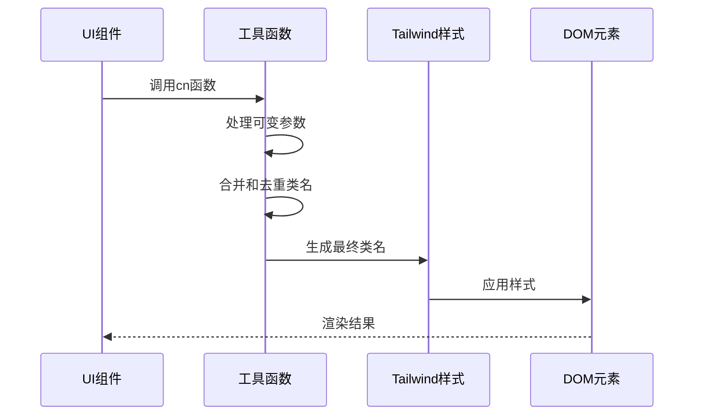
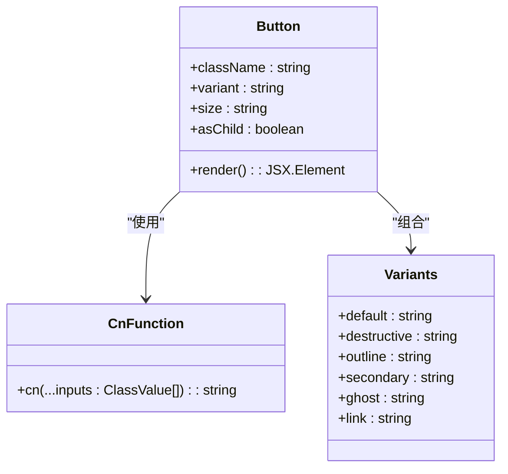
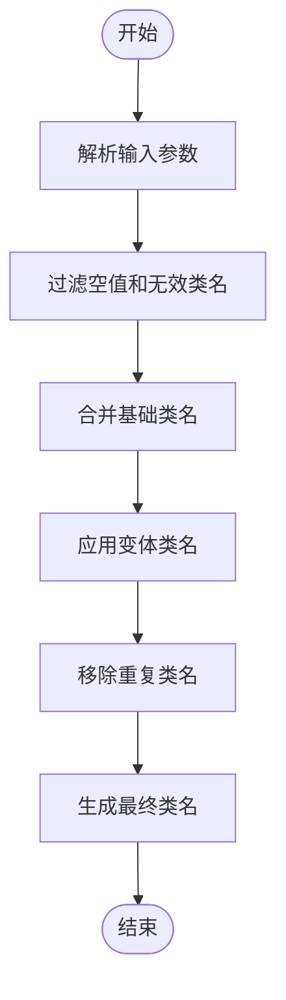
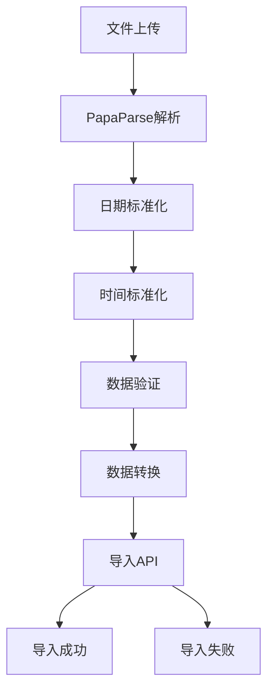
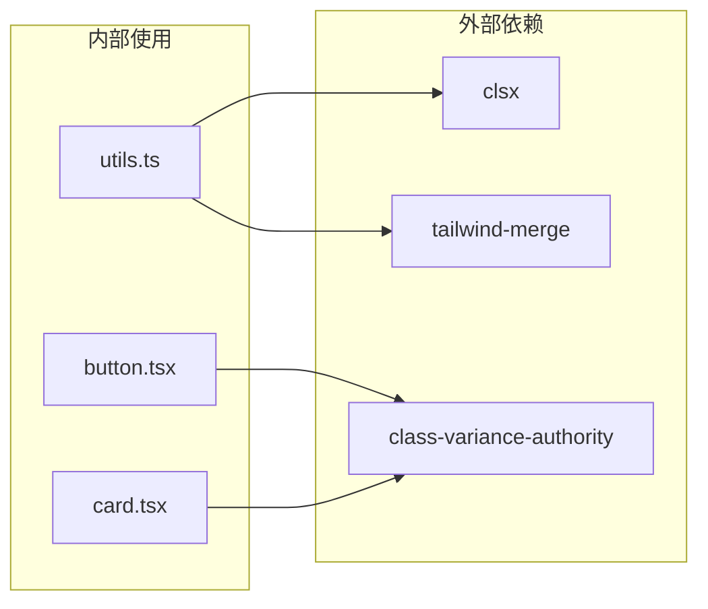
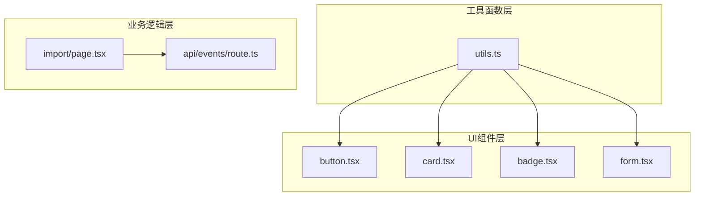

# 通用工具函数

<cite>
**本文档引用的文件**
- [lib/utils.ts](file://lib/utils.ts)
- [components/ui/button.tsx](file://components/ui/button.tsx)
- [components/ui/card.tsx](file://components/ui/card.tsx)
- [app/import/page.tsx](file://app/import/page.tsx)
- [app/api/events/route.ts](file://app/api/events/route.ts)
- [package.json](file://package.json)
</cite>

## 目录
1. [简介](#简介)
2. [项目结构](#项目结构)
3. [核心组件](#核心组件)
4. [架构概览](#架构概览)
5. [详细组件分析](#详细组件分析)
6. [依赖关系分析](#依赖关系分析)
7. [性能考虑](#性能考虑)
8. [故障排除指南](#故障排除指南)
9. [结论](#结论)

## 简介

本文档详细分析了项目中`lib/utils.ts`文件提供的通用工具函数，特别是其在UI组件系统中的复用模式。该文件目前包含一个专门用于CSS类名合并的工具函数，该函数在整个UI组件系统中被广泛复用，实现了样式系统的统一管理和维护。

## 项目结构

项目采用模块化的组织方式，将通用工具函数集中在一个独立的`lib`目录下，便于跨组件和页面的复用。



**图表来源**
- [lib/utils.ts](file://lib/utils.ts#L1-L7)
- [components/ui/button.tsx](file://components/ui/button.tsx#L1-L61)
- [components/ui/card.tsx](file://components/ui/card.tsx#L1-L93)

**章节来源**
- [lib/utils.ts](file://lib/utils.ts#L1-L7)
- [package.json](file://package.json#L1-L62)

## 核心组件

### cn函数 - CSS类名合并工具

`lib/utils.ts`文件当前仅包含一个名为`cn`的工具函数，该函数负责将多个CSS类名进行智能合并和去重。

#### 函数签名
```typescript
export function cn(...inputs: ClassValue[]): string
```

#### 参数说明
- `...inputs: ClassValue[]` - 可变数量的输入参数，支持以下类型：
  - 字符串：直接的CSS类名
  - 对象：键为类名、值为布尔值的条件类名映射
  - 数组：嵌套的类名数组
  - `null`或`undefined`：会被忽略

#### 返回值
- `string` - 合并后的CSS类名字符串，已去除重复和空值

#### 使用示例

**在UI组件中的使用：**
```typescript
// 组件文件中导入和使用
import { cn } from "@/lib/utils"

function Button({ className, variant, size, ...props }) {
  return (
    <Comp
      className={cn(buttonVariants({ variant, size, className }))}
      {...props}
    />
  )
}
```

**在卡片组件中的使用：**
```typescript
function Card({ className, ...props }) {
  return (
    <div
      className={cn(
        "bg-card text-card-foreground flex flex-col gap-6 rounded-xl border py-6 shadow-sm",
        className
      )}
      {...props}
    />
  )
}
```

**章节来源**
- [lib/utils.ts](file://lib/utils.ts#L4-L6)
- [components/ui/button.tsx](file://components/ui/button.tsx#L5-L54)
- [components/ui/card.tsx](file://components/ui/card.tsx#L3-L12)

## 架构概览

该工具函数在整个应用中的架构作用体现在以下几个方面：



**图表来源**
- [lib/utils.ts](file://lib/utils.ts#L4-L6)
- [components/ui/button.tsx](file://components/ui/button.tsx#L5-L54)

### 复用模式分析

该工具函数通过以下模式实现跨组件的复用：

1. **集中式管理**：所有CSS类名处理逻辑集中在单一函数中
2. **组件解耦**：UI组件只需关注业务逻辑，样式处理由工具函数统一处理
3. **类型安全**：利用TypeScript的类型系统确保参数正确性
4. **条件渲染**：支持基于条件的类名动态切换

**章节来源**
- [components/ui/button.tsx](file://components/ui/button.tsx#L1-L61)
- [components/ui/card.tsx](file://components/ui/card.tsx#L1-L93)

## 详细组件分析

### 组件集成分析

#### 按钮组件集成
按钮组件通过`cn`函数实现了复杂的样式变体系统：



**图表来源**
- [components/ui/button.tsx](file://components/ui/button.tsx#L39-L58)
- [lib/utils.ts](file://lib/utils.ts#L4-L6)

#### 卡片组件集成
卡片组件展示了更复杂的类名合并场景：



**图表来源**
- [components/ui/card.tsx](file://components/ui/card.tsx#L5-L16)
- [lib/utils.ts](file://lib/utils.ts#L4-L6)

**章节来源**
- [components/ui/button.tsx](file://components/ui/button.tsx#L39-L58)
- [components/ui/card.tsx](file://components/ui/card.tsx#L5-L16)

### 数据处理流程

虽然utils.ts文件本身不包含数据处理函数，但项目中的CSV导入功能展示了相关的数据处理模式：



**图表来源**
- [app/import/page.tsx](file://app/import/page.tsx#L35-L74)

**章节来源**
- [app/import/page.tsx](file://app/import/page.tsx#L35-L74)

## 依赖关系分析

### 外部依赖

项目对相关依赖的使用情况：



**图表来源**
- [lib/utils.ts](file://lib/utils.ts#L1-L2)
- [package.json](file://package.json#L22-L34)

### 内部依赖关系



**图表来源**
- [lib/utils.ts](file://lib/utils.ts#L4-L6)
- [components/ui/button.tsx](file://components/ui/button.tsx#L5-L54)

**章节来源**
- [package.json](file://package.json#L22-L34)

## 性能考虑

### 函数性能特性

`cn`函数具有以下性能特点：

1. **纯函数设计**：相同输入总是产生相同输出，无副作用
2. **时间复杂度**：O(n)，其中n为输入参数数量
3. **空间复杂度**：O(m)，其中m为最终类名数量
4. **内存优化**：避免创建不必要的中间字符串

### 复用优势

1. **减少代码重复**：统一的类名处理逻辑
2. **提高维护效率**：修改样式逻辑只需一处改动
3. **类型安全保障**：编译时类型检查
4. **运行时性能**：避免重复的样式处理逻辑

## 故障排除指南

### 常见问题及解决方案

1. **类名冲突**
   - 症状：样式显示异常或覆盖
   - 解决方案：检查类名优先级和合并顺序

2. **条件类名不生效**
   - 症状：动态样式切换失效
   - 解决方案：确认条件表达式返回正确的布尔值

3. **样式继承问题**
   - 症状：子组件样式不符合预期
   - 解决方案：检查父组件传入的className参数

### 调试技巧

1. **控制台输出**：在开发环境中打印最终的类名字符串
2. **浏览器开发者工具**：检查DOM元素的实际类名
3. **类型检查**：利用TypeScript的类型系统发现潜在问题

## 结论

`lib/utils.ts`文件虽然目前只包含一个简单的CSS类名合并函数，但它在项目架构中发挥着重要作用。通过集中式的样式处理，该函数实现了：

1. **代码复用性**：在整个UI组件系统中提供一致的样式处理逻辑
2. **维护便利性**：统一的样式管理减少了代码重复
3. **类型安全性**：利用TypeScript确保参数正确性
4. **性能优化**：纯函数设计提供了良好的运行时性能

对于文档目标中提到的其他工具函数（如日期处理、CSV解析、深拷贝等），项目中存在相应的实现，但它们分布在不同的文件中，如CSV解析功能主要在导入页面中实现，日期处理功能在API路由中使用原生JavaScript Date对象。如果需要扩展utils.ts的功能，建议保持纯函数的设计原则，确保函数的可测试性和无副作用特性。