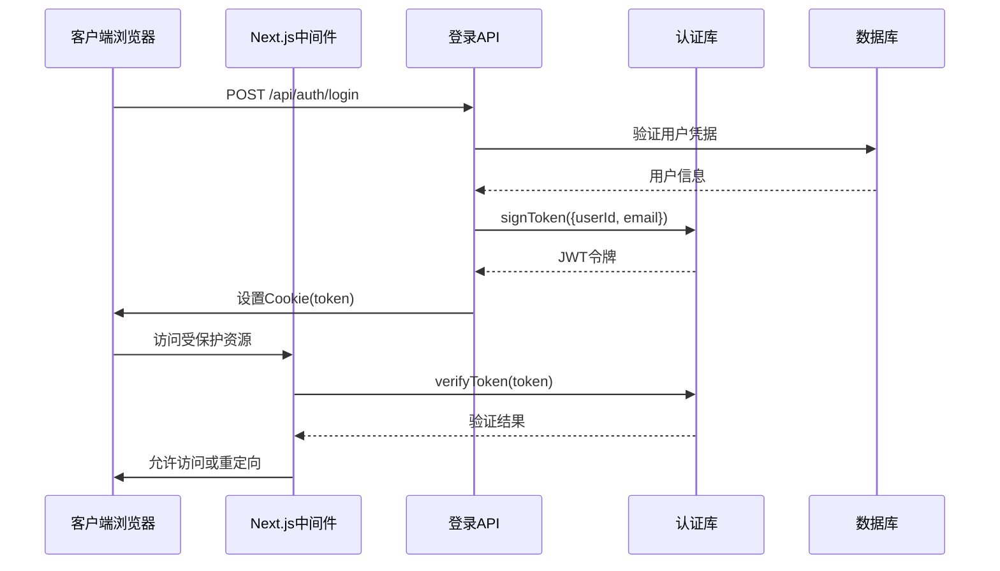
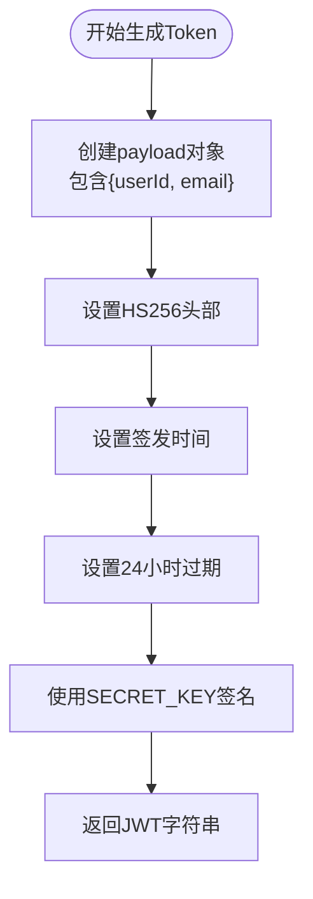
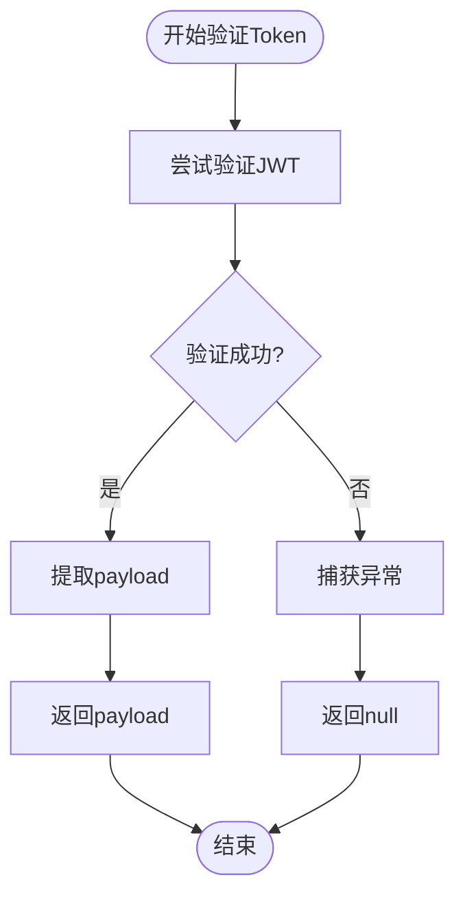
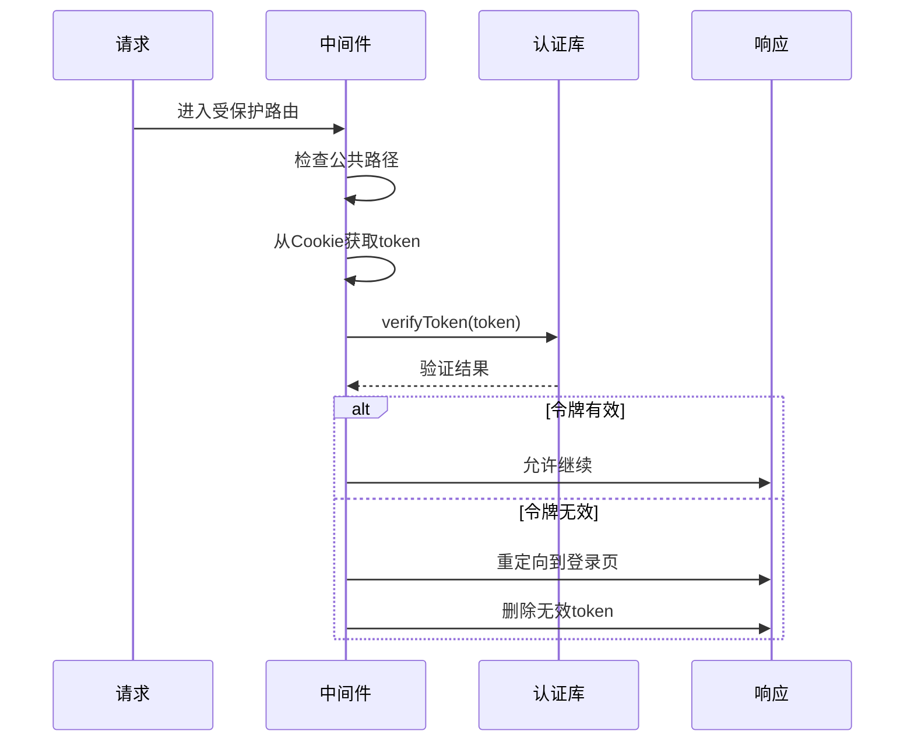

# Token管理

<cite>
**本文档引用的文件**
- [lib/auth.ts](file://lib/auth.ts)
- [middleware.ts](file://middleware.ts)
- [app/api/auth/login/route.ts](file://app/api/auth/login/route.ts)
- [app/api/auth/logout/route.ts](file://app/api/auth/logout/route.ts)
- [app/api/events/route.ts](file://app/api/events/route.ts)
- [app/api/events/[id]/route.ts](file://app/api/events/[id]/route.ts)
- [package.json](file://package.json)
</cite>

## 目录
1. [简介](#简介)
2. [项目结构](#项目结构)
3. [核心组件](#核心组件)
4. [架构概览](#架构概览)
5. [详细组件分析](#详细组件分析)
6. [依赖关系分析](#依赖关系分析)
7. [性能考虑](#性能考虑)
8. [故障排除指南](#故障排除指南)
9. [结论](#结论)

## 简介

本项目实现了基于JWT（JSON Web Token）的认证机制，使用jose库作为核心依赖来生成和验证符合标准的JWT令牌。该系统采用HS256对称加密算法，通过HTTP Cookie存储令牌，实现了完整的用户认证和授权流程。

JWT令牌在本项目中用于保护受保护的API端点和页面路由，确保只有经过身份验证的用户才能访问敏感数据和功能。令牌的有效期设置为24小时，包含用户标识信息，支持自动过期和安全验证。

## 项目结构

项目采用Next.js App Router架构，JWT认证相关的文件分布如下：

```mermaid
graph TB
subgraph "认证相关文件"
A[lib/auth.ts<br/>JWT工具函数]
B[middleware.ts<br/>中间件认证]
end
subgraph "API路由"
C[app/api/auth/login/route.ts<br/>用户登录]
D[app/api/auth/logout/route.ts<br/>用户登出]
E[app/api/events/route.ts<br/>事件API]
F[app/api/events/[id]/route.ts<br/>事件详情API]
end
subgraph "前端页面"
G[app/login/page.tsx<br/>登录页面]
H[app/register/page.tsx<br/>注册页面]
end
A --> C
A --> D
A --> E
A --> F
B --> E
B --> F
```

**图表来源**
- [lib/auth.ts](file://lib/auth.ts#L1-L30)
- [middleware.ts](file://middleware.ts#L1-L50)
- [app/api/auth/login/route.ts](file://app/api/auth/login/route.ts#L1-L57)

**章节来源**
- [lib/auth.ts](file://lib/auth.ts#L1-L30)
- [middleware.ts](file://middleware.ts#L1-L50)

## 核心组件

### JWT工具函数库

lib/auth.ts文件提供了JWT认证的核心功能，包含以下关键组件：

#### 秘密密钥配置
- 使用TextEncoder将环境变量转换为Uint8Array
- 支持开发环境下的默认密钥（dev_secret_key）
- 生产环境必须设置JWT_SECRET环境变量

#### Token生成函数（signToken）
- 接收任意payload对象
- 设置HS256算法头部
- 自动设置签发时间
- 设置24小时过期时间
- 返回签名后的JWT字符串

#### Token验证函数（verifyToken）
- 验证JWT的完整性和有效性
- 捕获过期或篡改的令牌
- 返回null而非抛出异常

**章节来源**
- [lib/auth.ts](file://lib/auth.ts#L1-L30)

## 架构概览

整个JWT认证系统的架构设计体现了分层架构和职责分离的原则：



**图表来源**
- [app/api/auth/login/route.ts](file://app/api/auth/login/route.ts#L35-L49)
- [middleware.ts](file://middleware.ts#L35-L44)

## 详细组件分析

### JWT生成机制（signToken）

signToken函数实现了完整的JWT生成流程：

#### HS256算法选择
- 使用对称加密算法确保性能和安全性平衡
- HS256适合单服务器部署场景
- 密钥长度为256位，提供足够安全强度

#### Payload结构设计
- 包含userId：用户唯一标识符
- 包含email：用户邮箱地址
- 可扩展性：支持添加其他用户相关信息

#### 时间戳管理
- setIssuedAt()：设置签发时间
- setExpirationTime('24h')：设置24小时有效期
- 自动处理过期逻辑



**图表来源**
- [lib/auth.ts](file://lib/auth.ts#L14-L20)

**章节来源**
- [lib/auth.ts](file://lib/auth.ts#L14-L20)

### Token验证机制（verifyToken）

verifyToken函数提供了安全的令牌验证逻辑：

#### 验证流程
- 使用jwtVerify进行完整性检查
- 验证签名是否有效
- 检查过期时间
- 提取payload内容

#### 错误处理策略
- 捕获所有验证异常
- 统一返回null值
- 不暴露具体错误细节



**图表来源**
- [lib/auth.ts](file://lib/auth.ts#L22-L29)

**章节来源**
- [lib/auth.ts](file://lib/auth.ts#L22-L29)

### 中间件集成

middleware.ts实现了全局认证中间件：

#### 路由匹配策略
- 匹配/calendar/:path* 和 /api/events/:path*
- 对公共路径（/login, /register, /api/auth）放行
- 对受保护路径执行认证检查

#### 认证流程
- 从Cookie中提取token
- 调用verifyToken进行验证
- 处理无效token的清理和重定向



**图表来源**
- [middleware.ts](file://middleware.ts#L5-L44)

**章节来源**
- [middleware.ts](file://middleware.ts#L1-L50)

### API路由集成

多个API路由集成了JWT认证：

#### 登录API（/api/auth/login）
- 验证用户凭据
- 生成JWT令牌
- 设置安全的Cookie属性

#### 事件API（/api/events）
- 验证用户权限
- 基于userId过滤数据
- 实现CRUD操作

#### Cookie安全配置
- httpOnly: true 防止XSS攻击
- secure: 仅生产环境启用HTTPS传输
- sameSite: lax 平衡安全性与可用性
- maxAge: 86400秒（24小时）

**章节来源**
- [app/api/auth/login/route.ts](file://app/api/auth/login/route.ts#L35-L49)
- [app/api/events/route.ts](file://app/api/events/route.ts#L15-L25)

## 依赖关系分析

项目对JWT认证的关键依赖关系：

```mermaid
graph LR
subgraph "外部依赖"
A[jose@^6.1.3<br/>JWT库]
B[bcryptjs@^3.0.3<br/>密码哈希]
C[zod@^4.1.13<br/>数据验证]
end
subgraph "内部模块"
D[lib/auth.ts<br/>JWT工具函数]
E[middleware.ts<br/>认证中间件]
F[app/api/*<br/>API路由]
end
A --> D
B --> F
C --> F
D --> E
D --> F
```

**图表来源**
- [package.json](file://package.json#L24-L36)
- [lib/auth.ts](file://lib/auth.ts#L1-L2)

**章节来源**
- [package.json](file://package.json#L1-L62)

## 性能考虑

### 加密算法选择
- HS256相比RS256具有更好的性能表现
- 适合单服务器部署场景
- 减少CPU开销和响应延迟

### 缓存策略
- 中间件中可考虑实现轻量级缓存
- 避免重复的异步加密验证
- 在Edge环境中优化性能

### 内存管理
- SECRET_KEY作为全局常量避免重复编码
- payload对象最小化以减少内存占用
- 及时清理无效的Cookie令牌

## 故障排除指南

### 常见问题及解决方案

#### 环境变量配置问题
**问题**：JWT_SECRET未设置导致开发模式下使用默认密钥
**解决方案**：
- 在生产环境设置JWT_SECRET环境变量
- 使用强随机字符串作为密钥值
- 确保密钥在所有服务器实例间保持一致

#### Token过期问题
**问题**：用户登录后很快被重定向到登录页
**解决方案**：
- 检查系统时间同步
- 验证Cookie的maxAge设置
- 确认服务器时区配置正确

#### 跨域认证问题
**问题**：前端请求无法携带Cookie
**解决方案**：
- 确保CORS配置允许凭证传递
- 检查sameSite设置
- 验证域名和路径配置

#### 性能问题
**问题**：中间件验证影响页面加载速度
**解决方案**：
- 考虑在API层进行深度验证
- 实现轻量级的快速验证
- 优化数据库查询性能

**章节来源**
- [lib/auth.ts](file://lib/auth.ts#L4-L4)
- [middleware.ts](file://middleware.ts#L30-L34)

## 结论

本项目的JWT认证系统实现了完整的身份验证和授权机制，具有以下特点：

### 安全性优势
- 使用标准的HS256算法确保安全性
- 采用HTTP Only Cookie防止XSS攻击
- 实现严格的过期管理和错误处理

### 开发体验
- 清晰的API接口设计
- 完整的TypeScript类型支持
- 易于扩展的架构设计

### 最佳实践
- 环境变量驱动的安全配置
- 分层架构确保代码组织清晰
- 中间件统一处理认证逻辑

该系统为Next.js应用提供了可靠的JWT认证解决方案，可根据具体需求进行扩展和定制。