# 中间件授权逻辑

<cite>
**本文档引用的文件**
- [middleware.ts](file://middleware.ts)
- [lib/auth.ts](file://lib/auth.ts)
- [app/api/auth/login/route.ts](file://app/api/auth/login/route.ts)
- [app/api/events/route.ts](file://app/api/events/route.ts)
- [app/login/page.tsx](file://app/login/page.tsx)
- [app/calendar/page.tsx](file://app/calendar/page.tsx)
- [app/register/page.tsx](file://app/register/page.tsx)
- [next.config.ts](file://next.config.ts)
</cite>

## 目录
1. [简介](#简介)
2. [项目结构概览](#项目结构概览)
3. [核心组件分析](#核心组件分析)
4. [架构总览](#架构总览)
5. [详细组件分析](#详细组件分析)
6. [依赖关系分析](#依赖关系分析)
7. [性能考虑](#性能考虑)
8. [故障排除指南](#故障排除指南)
9. [结论](#结论)

## 简介

本文件详细文档化了Next.js应用中的中间件授权控制系统。该系统通过middleware.ts实现路由拦截与JWT令牌验证，确保只有经过身份验证的用户才能访问受保护的资源。系统采用JWT（JSON Web Token）作为认证凭证，存储在名为'token'的HTTP Only Cookie中，实现了安全的客户端状态管理。

## 项目结构概览

该应用采用标准的Next.js App Router架构，主要目录结构如下：

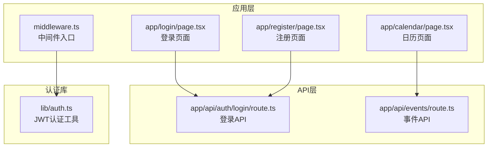

**图表来源**
- [middleware.ts](file://middleware.ts#L1-L50)
- [lib/auth.ts](file://lib/auth.ts#L1-L30)

**章节来源**
- [middleware.ts](file://middleware.ts#L1-L50)
- [lib/auth.ts](file://lib/auth.ts#L1-L30)

## 核心组件分析

### 中间件授权流程

中间件授权系统的核心逻辑分为三个主要阶段：

1. **公共路径处理**：处理无需认证即可访问的页面
2. **受保护路径验证**：对需要认证的资源进行JWT验证
3. **令牌验证与清理**：执行JWT签名验证并处理无效令牌

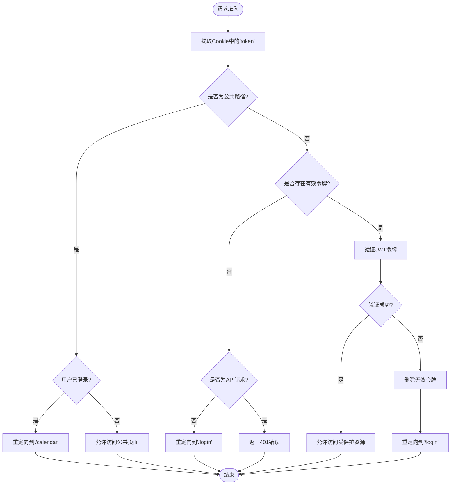

**图表来源**
- [middleware.ts](file://middleware.ts#L5-L45)

**章节来源**
- [middleware.ts](file://middleware.ts#L5-L45)

## 架构总览

整个授权系统的架构设计体现了分层安全策略：

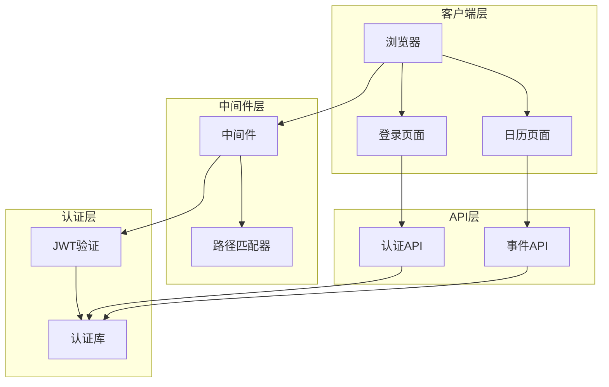

**图表来源**
- [middleware.ts](file://middleware.ts#L47-L49)
- [lib/auth.ts](file://lib/auth.ts#L22-L29)

## 详细组件分析

### 中间件核心实现

#### 路由拦截配置

中间件通过`config.matcher`配置精确控制生效范围：

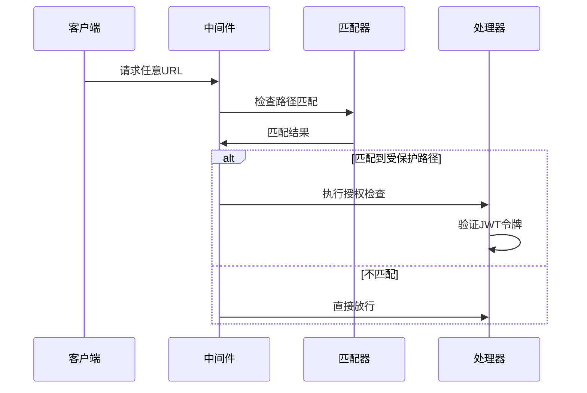

**图表来源**
- [middleware.ts](file://middleware.ts#L47-L49)

#### JWT令牌提取与验证

中间件使用`request.cookies.get('token')`方法提取JWT令牌：

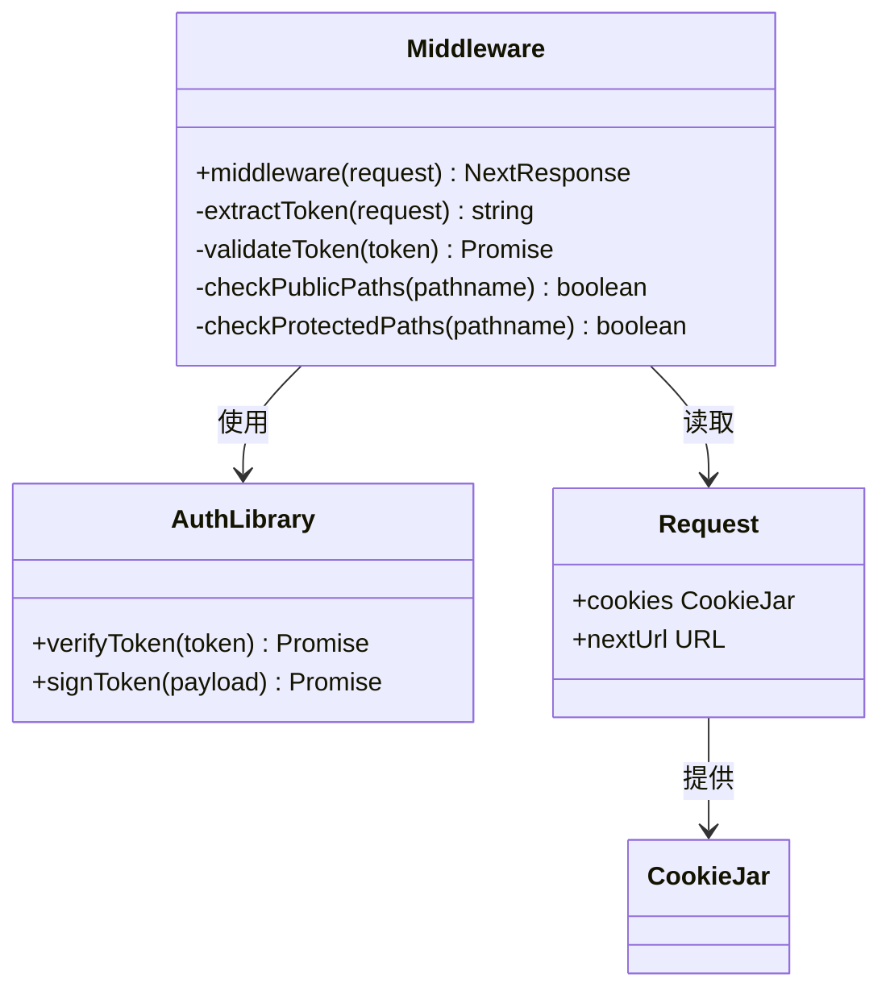

**图表来源**
- [middleware.ts](file://middleware.ts#L5-L45)
- [lib/auth.ts](file://lib/auth.ts#L22-L29)

**章节来源**
- [middleware.ts](file://middleware.ts#L5-L45)
- [lib/auth.ts](file://lib/auth.ts#L22-L29)

### 公共路径处理逻辑

公共路径包括登录页面、注册页面和认证相关的API端点。对于这些路径，中间件实施了智能重定向策略：

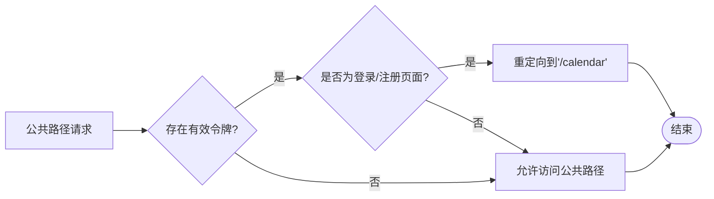

**图表来源**
- [middleware.ts](file://middleware.ts#L10-L20)

**章节来源**
- [middleware.ts](file://middleware.ts#L10-L20)

### 受保护路径处理逻辑

受保护路径的处理遵循严格的验证流程：

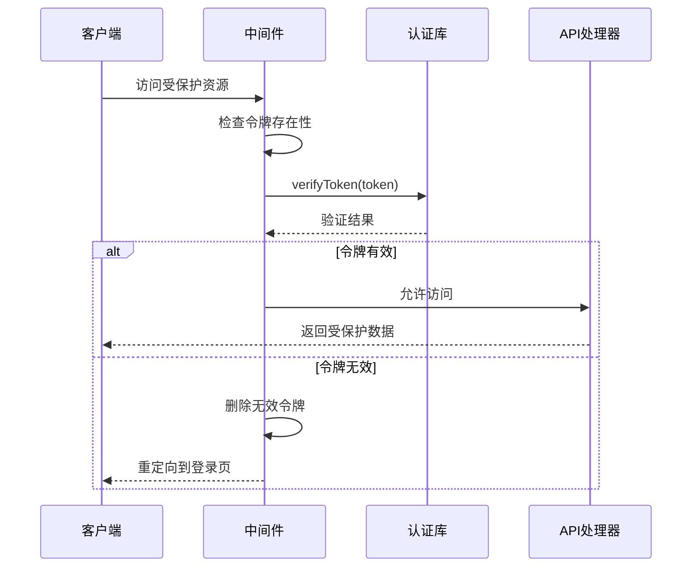

**图表来源**
- [middleware.ts](file://middleware.ts#L22-L44)

**章节来源**
- [middleware.ts](file://middleware.ts#L22-L44)

### API请求处理机制

对于API请求，中间件采用了差异化的处理策略：

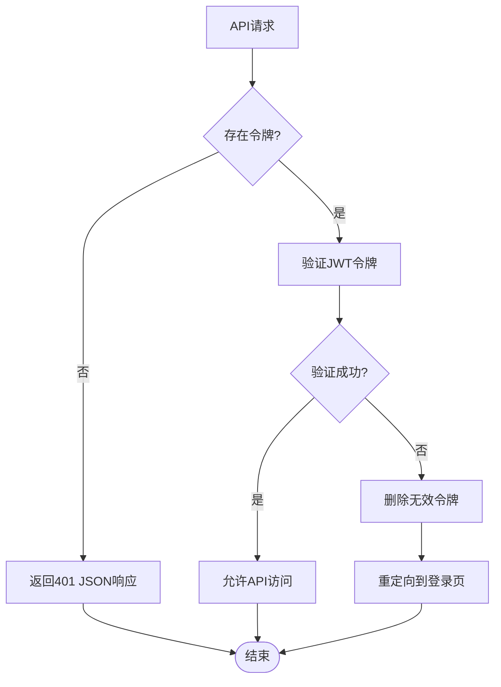

**图表来源**
- [middleware.ts](file://middleware.ts#L23-L28)

**章节来源**
- [middleware.ts](file://middleware.ts#L23-L28)

### 页面请求处理机制

对于页面请求，中间件采用重定向策略：

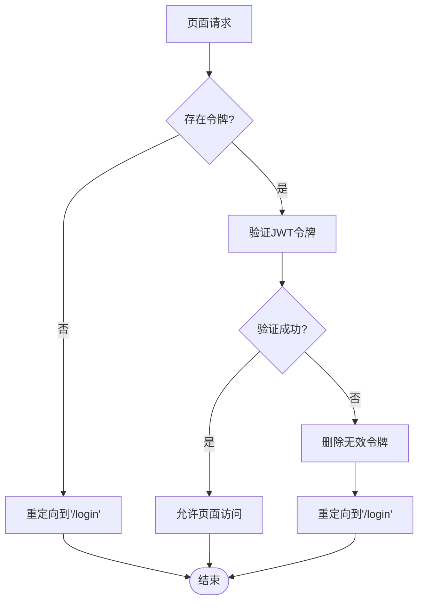

**图表来源**
- [middleware.ts](file://middleware.ts#L27-L28)

**章节来源**
- [middleware.ts](file://middleware.ts#L27-L28)

## 依赖关系分析

### 核心依赖关系

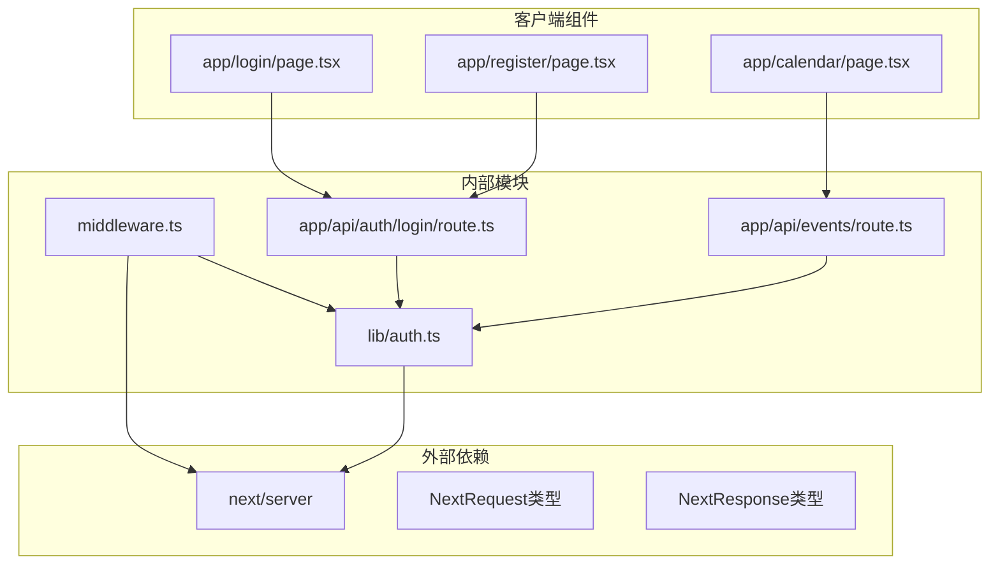

**图表来源**
- [middleware.ts](file://middleware.ts#L1-L3)
- [lib/auth.ts](file://lib/auth.ts#L1-L2)
- [app/api/auth/login/route.ts](file://app/api/auth/login/route.ts#L1-L3)

### 数据流分析

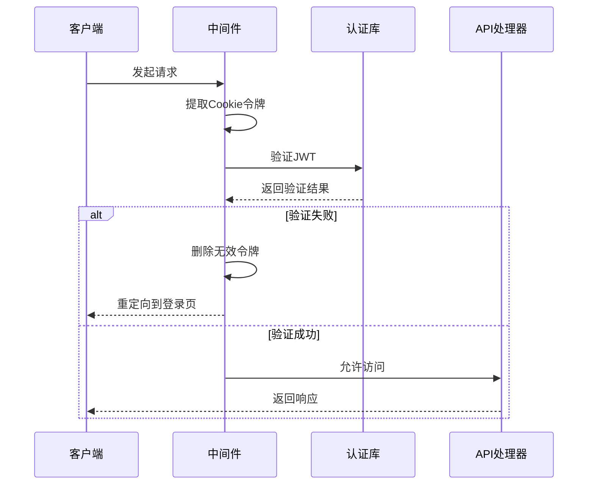

**图表来源**
- [middleware.ts](file://middleware.ts#L35-L44)
- [lib/auth.ts](file://lib/auth.ts#L22-L29)

**章节来源**
- [middleware.ts](file://middleware.ts#L1-L50)
- [lib/auth.ts](file://lib/auth.ts#L1-L30)

## 性能考虑

### 边缘运行时优化

中间件在Edge运行时执行，具有以下性能优势：

1. **快速启动**：Edge函数启动时间短，适合高频请求处理
2. **无状态设计**：中间件不维护会话状态，减少内存开销
3. **异步验证**：JWT验证使用异步操作，避免阻塞主线程

### 缓存策略

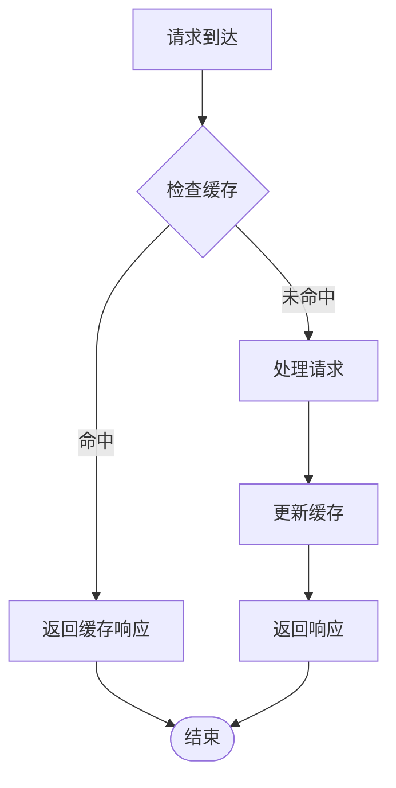

### 路径匹配优化

通过精确的路径匹配配置，中间件只对必要的URL模式执行授权检查：

- `/calendar/:path*` - 日历功能的所有子路径
- `/api/events/:path*` - 事件API的所有子路径

这种精确匹配减少了不必要的中间件执行次数。

**章节来源**
- [middleware.ts](file://middleware.ts#L47-L49)

## 故障排除指南

### 常见问题诊断

#### 令牌验证失败

**症状**：用户被重定向到登录页面，但页面显示认证错误

**排查步骤**：
1. 检查JWT密钥配置是否正确
2. 验证令牌格式是否符合JWT标准
3. 确认令牌未过期

#### 路径匹配问题

**症状**：中间件未按预期拦截某些请求

**排查步骤**：
1. 验证`config.matcher`配置是否正确
2. 检查路径前缀匹配逻辑
3. 确认URL编码和特殊字符处理

#### Cookie设置问题

**症状**：令牌无法正确存储或传递

**排查步骤**：
1. 检查Cookie属性配置（httpOnly、secure、sameSite）
2. 验证Cookie域和路径设置
3. 确认跨域请求的Cookie处理

### 调试技巧

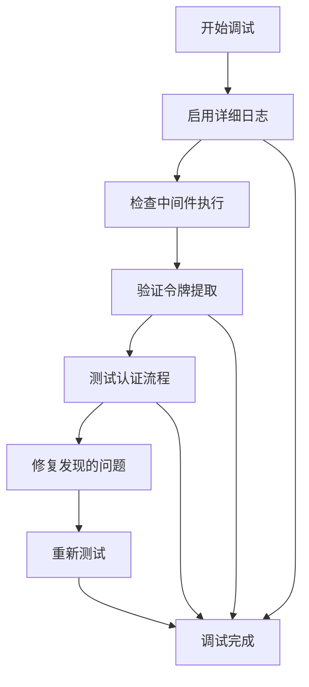

**章节来源**
- [middleware.ts](file://middleware.ts#L30-L34)
- [lib/auth.ts](file://lib/auth.ts#L22-L29)

## 结论

该中间件授权系统通过精心设计的JWT认证机制，实现了高效且安全的路由拦截控制。系统的主要优势包括：

1. **精确的路径控制**：通过`config.matcher`精确控制中间件生效范围
2. **双层验证机制**：中间件进行快速令牌存在性检查，API层进行深度验证
3. **用户体验优化**：智能重定向策略避免了不必要的认证循环
4. **安全性保障**：HTTP Only Cookie防止XSS攻击，JWT提供强认证

该系统为Next.js应用提供了可靠的认证基础设施，支持未来的功能扩展和安全增强。