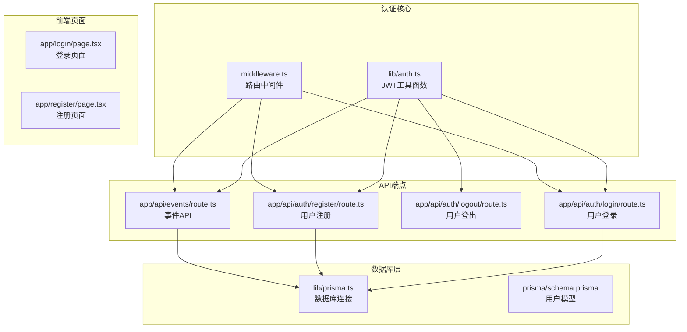
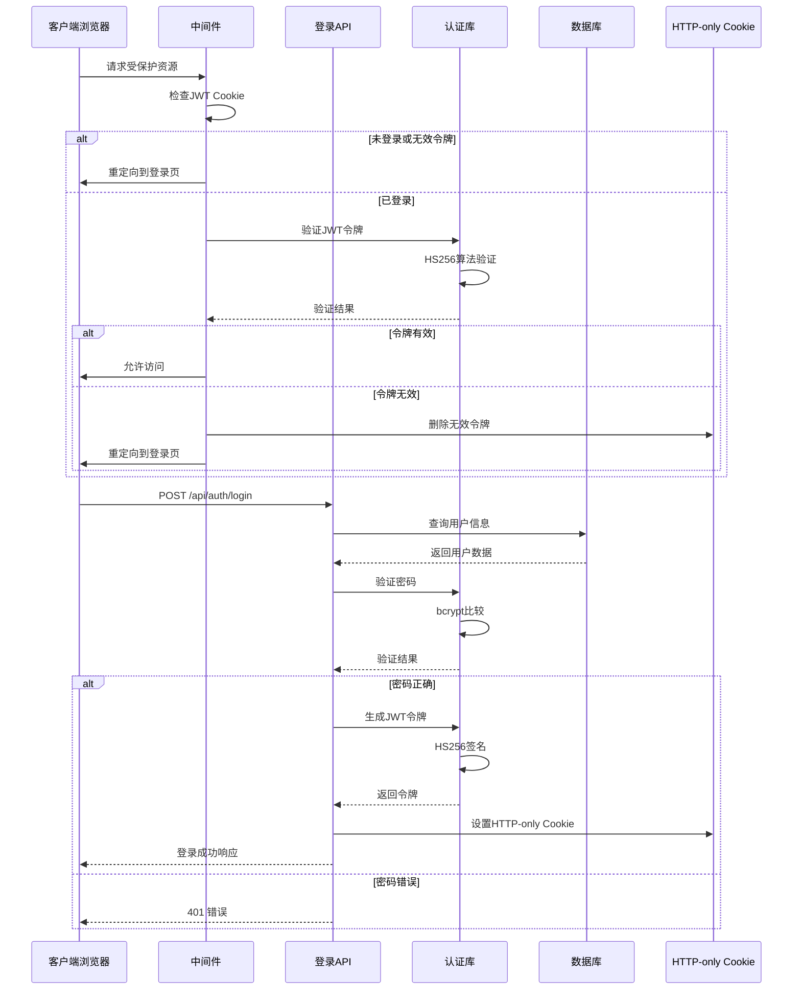
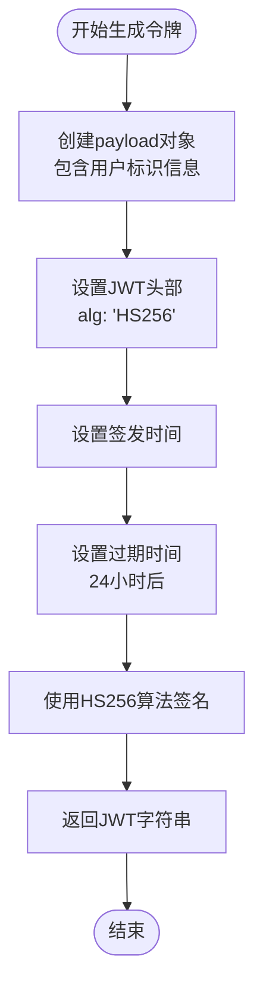
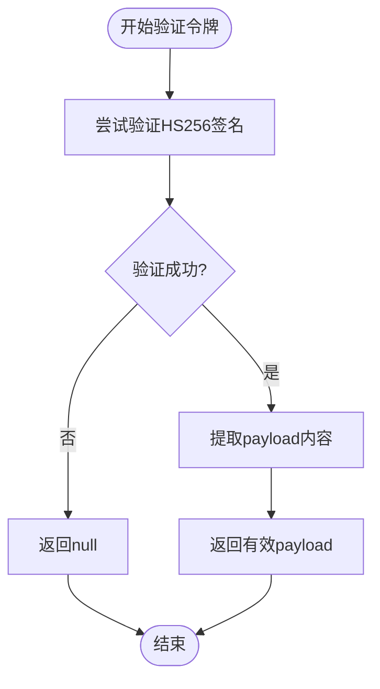
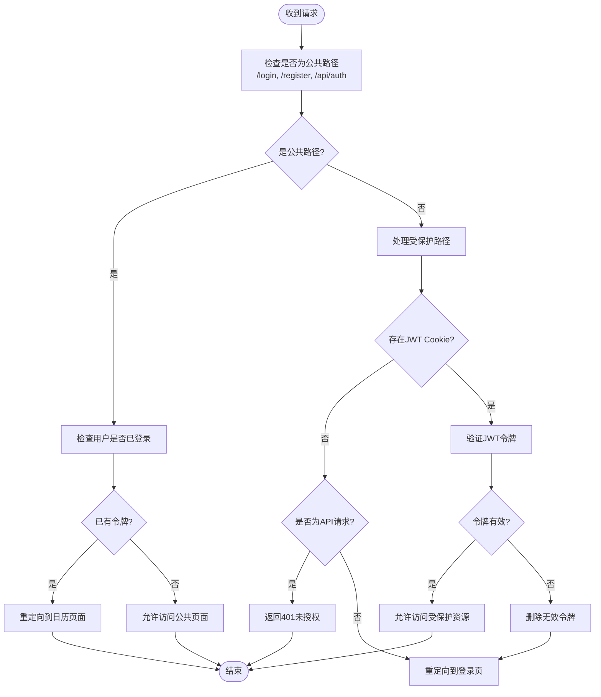
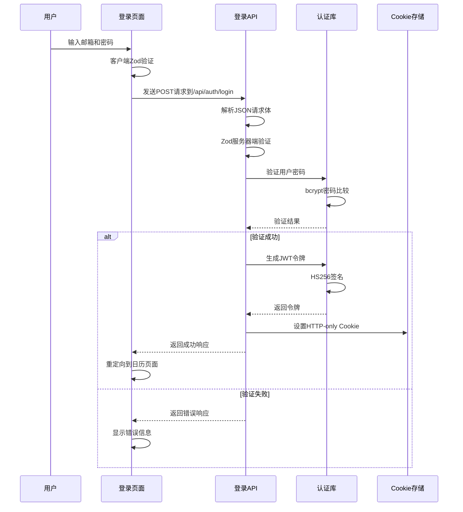
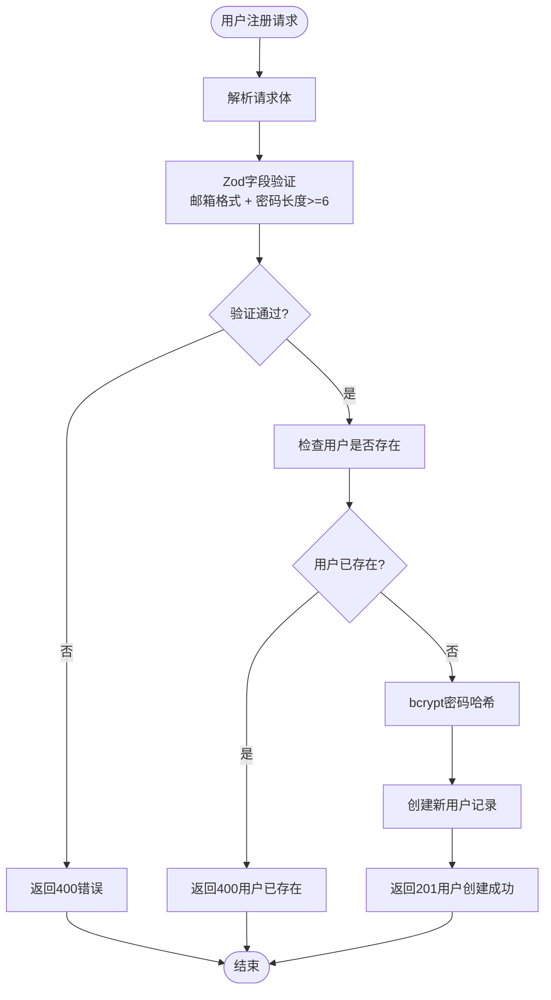
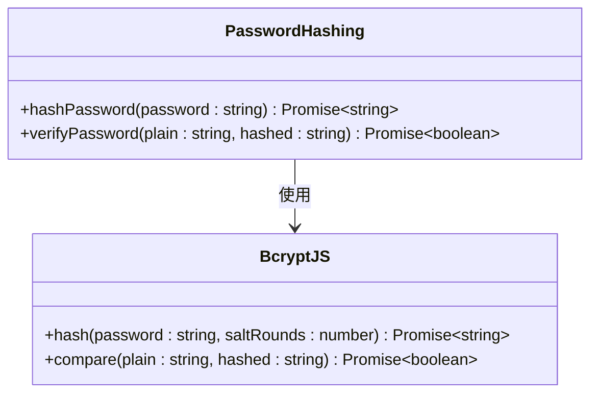
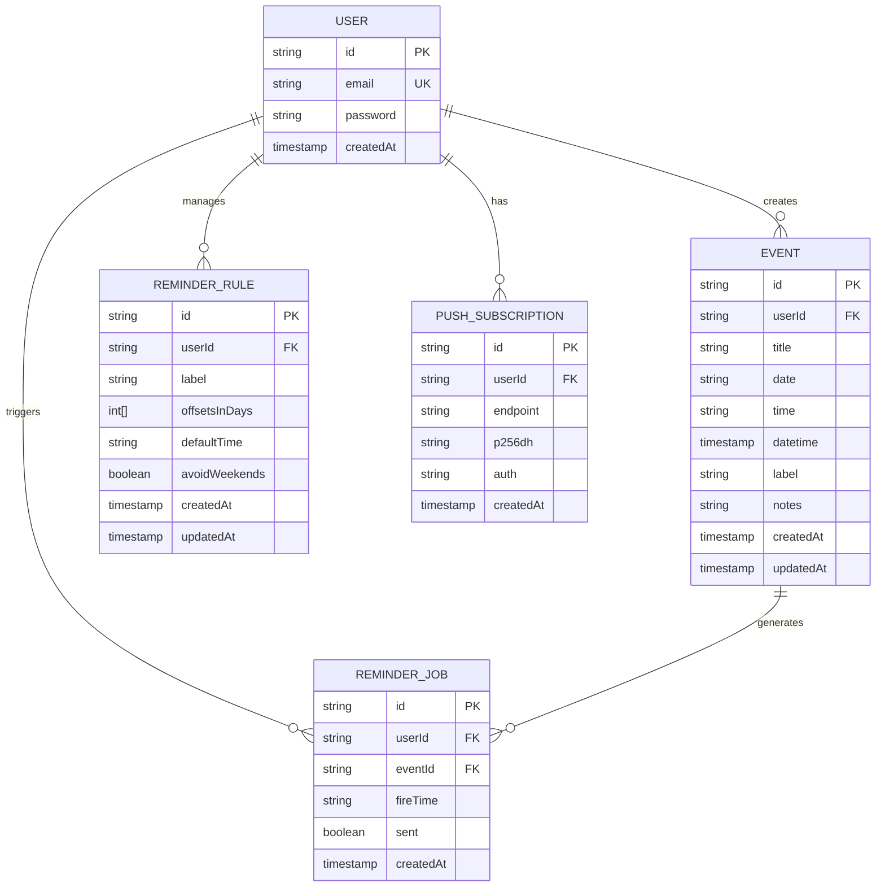

# 认证机制

<cite>
**本文档引用的文件**
- [lib/auth.ts](file://lib/auth.ts)
- [middleware.ts](file://middleware.ts)
- [app/api/auth/login/route.ts](file://app/api/auth/login/route.ts)
- [app/api/auth/register/route.ts](file://app/api/auth/register/route.ts)
- [app/api/auth/logout/route.ts](file://app/api/auth/logout/route.ts)
- [app/api/events/route.ts](file://app/api/events/route.ts)
- [lib/prisma.ts](file://lib/prisma.ts)
- [prisma/schema.prisma](file://prisma/schema.prisma)
- [app/login/page.tsx](file://app/login/page.tsx)
- [app/register/page.tsx](file://app/register/page.tsx)
- [package.json](file://package.json)
</cite>

## 目录
1. [简介](#简介)
2. [项目结构](#项目结构)
3. [核心组件](#核心组件)
4. [架构概览](#架构概览)
5. [详细组件分析](#详细组件分析)
6. [依赖关系分析](#依赖关系分析)
7. [性能考量](#性能考量)
8. [故障排除指南](#故障排除指南)
9. [安全风险与缓解措施](#安全风险与缓解措施)
10. [结论](#结论)

## 简介

本项目采用基于JWT的认证体系，结合bcrypt密码哈希和HTTP-only Cookie进行用户身份验证。系统实现了完整的用户注册、登录、登出功能，并通过中间件拦截受保护路由，确保只有经过身份验证的用户才能访问敏感资源。

## 项目结构

认证相关的核心文件分布如下：



**图表来源**
- [lib/auth.ts](file://lib/auth.ts#L1-L30)
- [middleware.ts](file://middleware.ts#L1-L50)
- [app/api/auth/login/route.ts](file://app/api/auth/login/route.ts#L1-L57)
- [app/api/auth/register/route.ts](file://app/api/auth/register/route.ts#L1-L53)
- [app/api/auth/logout/route.ts](file://app/api/auth/logout/route.ts#L1-L14)

**章节来源**
- [lib/auth.ts](file://lib/auth.ts#L1-L30)
- [middleware.ts](file://middleware.ts#L1-L50)
- [app/api/auth/login/route.ts](file://app/api/auth/login/route.ts#L1-L57)
- [app/api/auth/register/route.ts](file://app/api/auth/register/route.ts#L1-L53)
- [app/api/auth/logout/route.ts](file://app/api/auth/logout/route.ts#L1-L14)

## 核心组件

### JWT认证工具库

认证系统的核心是位于 `lib/auth.ts` 的JWT工具库，提供了以下关键功能：

- **密码哈希**: 使用bcryptjs对用户密码进行安全哈希处理
- **令牌签名**: 基于HS256算法生成JWT令牌
- **令牌验证**: 验证JWT令牌的有效性和完整性

### 中间件拦截器

`middleware.ts` 实现了请求级的身份验证拦截，支持：
- 公共路径放行（/login, /register, /api/auth）
- 受保护路由的JWT验证
- 自动重定向和错误处理

### API端点

系统包含完整的REST API端点：
- `/api/auth/login`: 用户登录认证
- `/api/auth/register`: 用户注册
- `/api/auth/logout`: 用户登出
- `/api/events/*`: 受保护的事件管理API

**章节来源**
- [lib/auth.ts](file://lib/auth.ts#L1-L30)
- [middleware.ts](file://middleware.ts#L1-L50)
- [app/api/auth/login/route.ts](file://app/api/auth/login/route.ts#L1-L57)
- [app/api/auth/register/route.ts](file://app/api/auth/register/route.ts#L1-L53)
- [app/api/auth/logout/route.ts](file://app/api/auth/logout/route.ts#L1-L14)

## 架构概览

认证系统的整体架构采用分层设计，确保安全性与可维护性的平衡：



**图表来源**
- [middleware.ts](file://middleware.ts#L5-L45)
- [app/api/auth/login/route.ts](file://app/api/auth/login/route.ts#L11-L56)
- [lib/auth.ts](file://lib/auth.ts#L6-L29)

## 详细组件分析

### JWT令牌生成与验证

#### 令牌生成流程

`lib/auth.ts` 中的 `signToken` 函数实现了JWT令牌的生成：



**图表来源**
- [lib/auth.ts](file://lib/auth.ts#L14-L20)

#### 令牌验证流程

`verifyToken` 函数负责验证JWT令牌的有效性：



**图表来源**
- [lib/auth.ts](file://lib/auth.ts#L22-L29)

**章节来源**
- [lib/auth.ts](file://lib/auth.ts#L14-L29)

### 中间件拦截机制

#### 路由拦截策略

`middleware.ts` 实现了智能的路由拦截逻辑：



**图表来源**
- [middleware.ts](file://middleware.ts#L5-L45)

**章节来源**
- [middleware.ts](file://middleware.ts#L5-L45)

### 登录流程实现

#### 客户端登录页面

`app/login/page.tsx` 提供了用户友好的登录界面，集成了表单验证和错误处理：



**图表来源**
- [app/login/page.tsx](file://app/login/page.tsx#L32-L54)
- [app/api/auth/login/route.ts](file://app/api/auth/login/route.ts#L11-L56)
- [lib/auth.ts](file://lib/auth.ts#L6-L12)

**章节来源**
- [app/login/page.tsx](file://app/login/page.tsx#L1-L109)
- [app/api/auth/login/route.ts](file://app/api/auth/login/route.ts#L1-L57)

### 注册流程实现

#### 用户注册机制

`app/api/auth/register/route.ts` 实现了完整的用户注册流程：



**图表来源**
- [app/api/auth/register/route.ts](file://app/api/auth/register/route.ts#L11-L53)
- [lib/auth.ts](file://lib/auth.ts#L6-L8)

**章节来源**
- [app/api/auth/register/route.ts](file://app/api/auth/register/route.ts#L1-L53)
- [lib/auth.ts](file://lib/auth.ts#L6-L8)

### 密码安全机制

#### bcrypt密码哈希

系统使用bcryptjs库实现密码的安全存储：

- **哈希成本**: 使用默认成本因子10
- **盐值生成**: bcrypt自动处理盐值生成
- **密码比较**: 使用 `compare()` 函数进行安全比较



**图表来源**
- [lib/auth.ts](file://lib/auth.ts#L1-L12)

**章节来源**
- [lib/auth.ts](file://lib/auth.ts#L1-L12)

### Cookie会话管理

#### HTTP-only Cookie配置

登录成功后，系统通过HTTP-only Cookie存储JWT令牌：

- **httpOnly**: 防止XSS攻击，JavaScript无法访问
- **secure**: 生产环境启用HTTPS传输
- **sameSite**: Lax模式平衡安全性与用户体验
- **maxAge**: 24小时有效期
- **path**: 根路径生效

**章节来源**
- [app/api/auth/login/route.ts](file://app/api/auth/login/route.ts#L43-L49)

## 依赖关系分析

### 核心依赖关系

```mermaid
graph TB
subgraph "外部依赖"
JOSE[jose@6.1.3<br/>JWT处理]
BCRYPT[bcryptjs@3.0.3<br/>密码哈希]
PRISMA[@prisma/client@7.1.0<br/>数据库ORM]
PG[pg@8.16.3<br/>PostgreSQL驱动]
end
subgraph "内部模块"
AUTH_LIB[lib/auth.ts]
PRISMA_LIB[lib/prisma.ts]
MWARE[middleware.ts]
LOGIN_API[app/api/auth/login/route.ts]
REGISTER_API[app/api/auth/register/route.ts]
LOGOUT_API[app/api/auth/logout/route.ts]
end
JOSE --> AUTH_LIB
BCRYPT --> AUTH_LIB
PRISMA --> PRISMA_LIB
PG --> PRISMA_LIB
AUTH_LIB --> LOGIN_API
AUTH_LIB --> REGISTER_API
AUTH_LIB --> LOGOUT_API
AUTH_LIB --> MWARE
PRISMA_LIB --> LOGIN_API
PRISMA_LIB --> REGISTER_API
PRISMA_LIB --> LOGOUT_API
```

**图表来源**
- [package.json](file://package.json#L11-L36)
- [lib/auth.ts](file://lib/auth.ts#L1-L2)
- [lib/prisma.ts](file://lib/prisma.ts#L1-L3)

### 数据模型关系



**图表来源**
- [prisma/schema.prisma](file://prisma/schema.prisma#L16-L86)

**章节来源**
- [package.json](file://package.json#L11-L36)
- [prisma/schema.prisma](file://prisma/schema.prisma#L16-L86)

## 性能考量

### 中间件性能优化

系统在中间件中采用了性能优化策略：

- **边缘计算兼容**: 使用jose库确保在Edge环境中正常运行
- **选择性验证**: 对于公共路径快速放行，避免不必要的令牌验证
- **异步验证**: 在需要时才执行完整的JWT验证，减少不必要的CPU开销

### 数据库查询优化

- **唯一索引**: 用户邮箱字段设置唯一约束，确保查询效率
- **索引策略**: Event模型在(userId, date)上建立复合索引
- **查询限制**: 使用select投影只返回必要字段，减少数据传输

## 故障排除指南

### 常见问题诊断

#### JWT验证失败

**症状**: 用户登录后仍被重定向到登录页

**可能原因**:
1. JWT_SECRET环境变量未正确设置
2. 令牌过期（24小时有效期）
3. 浏览器Cookie被清除或禁用

**解决方案**:
1. 检查 `.env` 文件中的 `JWT_SECRET` 配置
2. 确认浏览器Cookie设置允许存储
3. 清除浏览器缓存后重新登录

#### 密码验证错误

**症状**: 用户密码正确但登录失败

**可能原因**:
1. bcrypt哈希不匹配
2. 数据库中用户记录损坏

**解决方案**:
1. 重新创建用户账户
2. 检查数据库连接配置

#### API访问权限错误

**症状**: 受保护API返回401未授权

**可能原因**:
1. 缺少或无效的JWT Cookie
2. 中间件配置错误

**解决方案**:
1. 确保登录后正确接收并存储Cookie
2. 检查中间件配置的受保护路径

**章节来源**
- [middleware.ts](file://middleware.ts#L30-L44)
- [app/api/auth/login/route.ts](file://app/api/auth/login/route.ts#L26-L33)

## 安全风险与缓解措施

### CSRF防护

**当前方案风险**: 基于Cookie的认证容易受到CSRF攻击

**缓解措施建议**:
1. **SameSite Cookie**: 已使用Lax模式，可进一步提升到Strict
2. **双重提交Cookie**: 在表单中添加CSRF令牌
3. **Origin验证**: 验证请求的Origin头
4. **Custom Headers**: 强制客户端发送自定义认证头

### XSS防护

**现有防护**:
1. **HTTP-only Cookie**: 防止JavaScript访问JWT令牌
2. **输入验证**: 前端和后端双重Zod验证
3. **密码哈希**: 不存储明文密码

**改进建议**:
1. **Content Security Policy**: 添加严格的CSP头
2. **Helmet中间件**: 使用Helmet统一设置安全头
3. **输入净化**: 对用户输入进行HTML实体编码

### 令牌安全

**当前实现**:
1. **HS256算法**: 对称密钥签名
2. **24小时有效期**: 合理的过期时间
3. **环境变量存储**: 秘钥存储在环境变量中

**安全建议**:
1. **定期轮换秘钥**: 建立秘钥轮换机制
2. **刷新令牌**: 实现短期访问令牌+长期刷新令牌
3. **令牌撤销**: 支持管理员撤销特定用户的令牌

### 数据库安全

**现有措施**:
1. **唯一约束**: 邮箱唯一性防止重复用户
2. **参数化查询**: 防止SQL注入
3. **连接池管理**: 合理的数据库连接配置

**改进建议**:
1. **审计日志**: 记录重要的认证相关操作
2. **速率限制**: 防止暴力破解攻击
3. **IP白名单**: 对特定IP地址进行访问控制

**章节来源**
- [middleware.ts](file://middleware.ts#L44-L49)
- [app/api/auth/login/route.ts](file://app/api/auth/login/route.ts#L43-L49)
- [lib/auth.ts](file://lib/auth.ts#L4)

## 结论

本项目的JWT认证体系实现了以下关键特性：

### 已实现的安全功能
- **强密码哈希**: 使用bcryptjs确保密码安全存储
- **JWT令牌管理**: 基于HS256算法的令牌生成与验证
- **Cookie安全**: HTTP-only属性有效防范XSS攻击
- **中间件拦截**: 智能的路由访问控制
- **数据模型设计**: 合理的数据库结构支持扩展

### 架构优势
- **模块化设计**: 认证逻辑独立封装，便于维护
- **前后端分离**: 清晰的API边界和职责划分
- **类型安全**: TypeScript提供编译时类型检查
- **错误处理**: 完善的错误处理和状态码返回

### 改进建议
1. **增强CSRF防护**: 实施双重提交Cookie或自定义头部验证
2. **令牌轮换机制**: 建立定期秘钥轮换和令牌撤销功能
3. **监控告警**: 添加认证相关的监控和异常告警
4. **多因素认证**: 为高价值账户提供MFA选项

该认证体系为Next.js应用提供了坚实的安全基础，通过合理的安全实践和持续改进，能够满足大多数Web应用的认证需求。