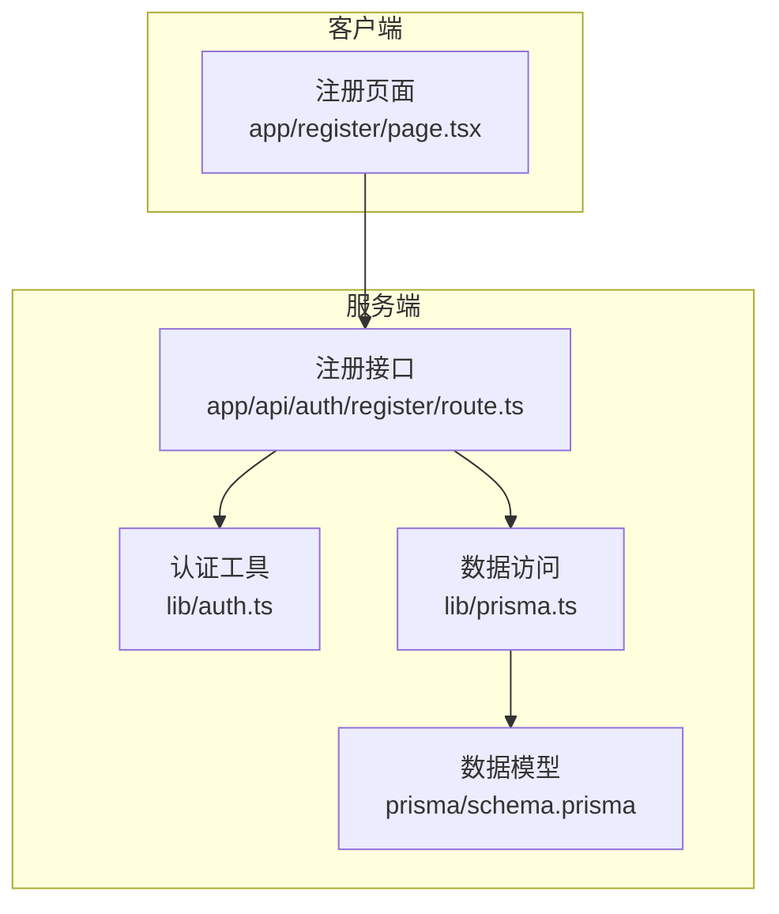
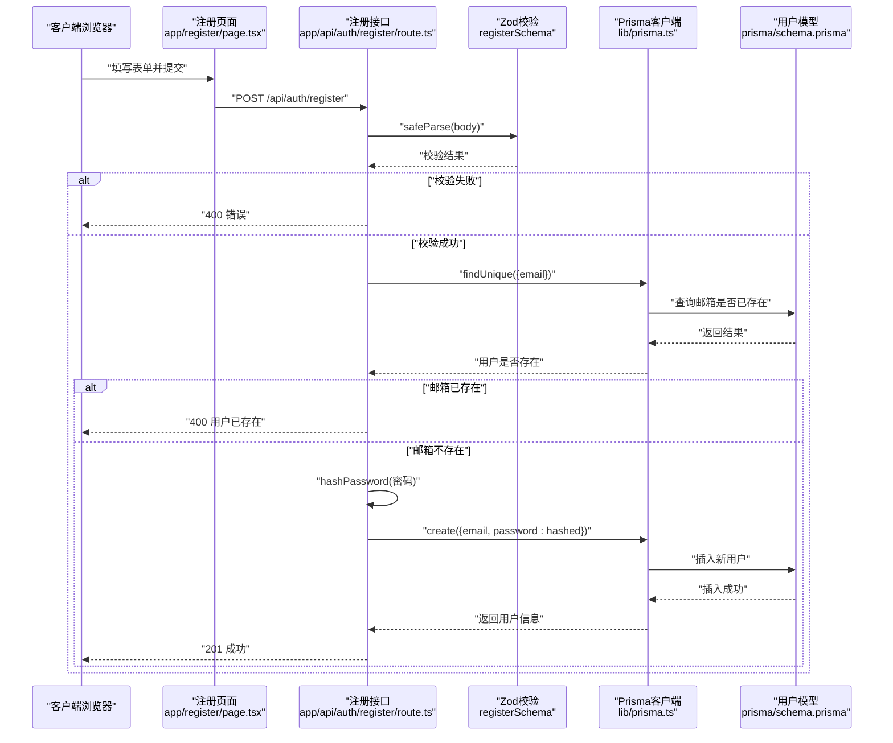
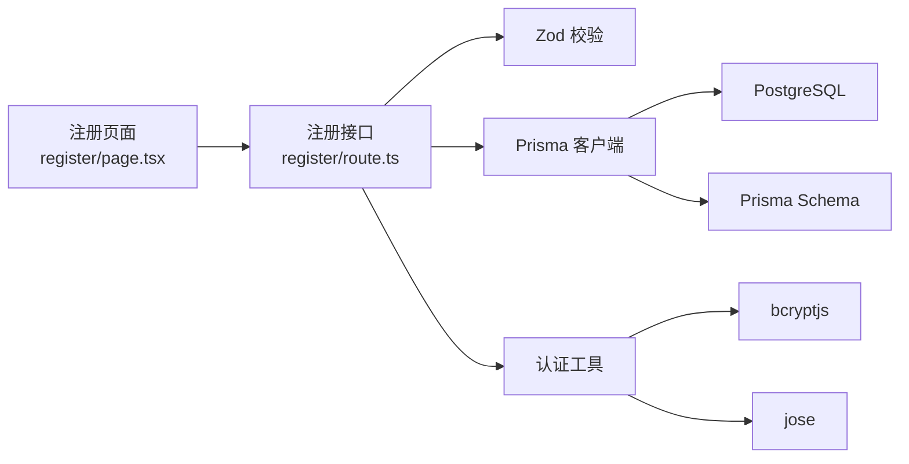

# 注册流程

<cite>
**本文档引用的文件**
- [app/api/auth/register/route.ts](file://app/api/auth/register/route.ts)
- [lib/auth.ts](file://lib/auth.ts)
- [lib/prisma.ts](file://lib/prisma.ts)
- [prisma/schema.prisma](file://prisma/schema.prisma)
- [app/register/page.tsx](file://app/register/page.tsx)
- [app/api/auth/login/route.ts](file://app/api/auth/login/route.ts)
- [middleware.ts](file://middleware.ts)
- [package.json](file://package.json)
</cite>

## 目录
1. [简介](#简介)
2. [项目结构](#项目结构)
3. [核心组件](#核心组件)
4. [架构总览](#架构总览)
5. [详细组件分析](#详细组件分析)
6. [依赖关系分析](#依赖关系分析)
7. [性能考虑](#性能考虑)
8. [故障排除指南](#故障排除指南)
9. [结论](#结论)

## 简介
本文件系统化说明用户注册流程的技术实现，涵盖从客户端表单到服务端处理的完整链路。重点包括：
- 客户端提交的用户信息通过 Zod 定义的 registerSchema 进行校验，特别是密码字段至少6个字符的规则执行
- 服务端检查邮箱唯一性，防止重复注册，若存在相同邮箱则返回400状态码
- 验证通过后，调用 lib/auth.ts 中的 hashPassword 函数，使用 bcrypt 算法（salt rounds=10）对密码进行安全哈希处理
- 通过 Prisma 创建新用户记录，并返回201状态码及用户信息
- 强调安全性设计：密码哈希强度、JWT 签发密钥环境变量管理、数据库唯一约束依赖
- 常见错误场景及其响应：400（格式错误或邮箱已存在）、500（创建失败）

## 项目结构
与注册流程直接相关的文件组织如下：
- 客户端页面：app/register/page.tsx 提供注册表单与前端校验
- 服务端接口：app/api/auth/register/route.ts 实现注册逻辑
- 认证工具：lib/auth.ts 提供密码哈希、JWT 签发与校验
- 数据访问：lib/prisma.ts 提供 Prisma 客户端
- 数据模型：prisma/schema.prisma 定义 User 模型与邮箱唯一约束
- 登录流程：app/api/auth/login/route.ts 展示 JWT Cookie 设置方式
- 中间件：middleware.ts 展示基于 JWT 的访问控制

**图表来源**
- [app/register/page.tsx](file://app/register/page.tsx#L1-L137)
- [app/api/auth/register/route.ts](file://app/api/auth/register/route.ts#L1-L53)
- [lib/auth.ts](file://lib/auth.ts#L1-L30)
- [lib/prisma.ts](file://lib/prisma.ts#L1-L20)
- [prisma/schema.prisma](file://prisma/schema.prisma#L16-L26)

**章节来源**
- [app/register/page.tsx](file://app/register/page.tsx#L1-L137)
- [app/api/auth/register/route.ts](file://app/api/auth/register/route.ts#L1-L53)
- [lib/auth.ts](file://lib/auth.ts#L1-L30)
- [lib/prisma.ts](file://lib/prisma.ts#L1-L20)
- [prisma/schema.prisma](file://prisma/schema.prisma#L16-L26)

## 核心组件
- 注册接口：负责接收请求、参数校验、邮箱唯一性检查、密码哈希、用户创建与响应
- 认证工具：提供密码哈希（bcrypt，salt rounds=10）、JWT 签发与校验
- 数据访问层：通过 Prisma 客户端连接 PostgreSQL，使用唯一约束保障邮箱唯一
- 客户端表单：使用 Zod 与 react-hook-form 在前端进行输入校验与错误提示

**章节来源**
- [app/api/auth/register/route.ts](file://app/api/auth/register/route.ts#L11-L52)
- [lib/auth.ts](file://lib/auth.ts#L6-L8)
- [lib/prisma.ts](file://lib/prisma.ts#L9-L15)
- [app/register/page.tsx](file://app/register/page.tsx#L14-L21)

## 架构总览
注册流程的数据流与控制流如下：

**图表来源**
- [app/register/page.tsx](file://app/register/page.tsx#L39-L59)
- [app/api/auth/register/route.ts](file://app/api/auth/register/route.ts#L11-L52)
- [lib/auth.ts](file://lib/auth.ts#L6-L8)
- [lib/prisma.ts](file://lib/prisma.ts#L13-L15)
- [prisma/schema.prisma](file://prisma/schema.prisma#L16-L26)

## 详细组件分析

### 客户端表单与前端校验
- 使用 Zod 定义 registerSchema，包含 email（邮箱格式）与 password（最少6位）等字段
- 结合 react-hook-form 的 zodResolver，在客户端进行即时校验与错误提示
- 提交时仅发送 email 与 password 字段，避免传输 confirm 字段

关键点：
- 密码最小长度为6位的规则在前端与后端均生效，确保一致性
- 表单提交通过 fetch 调用 /api/auth/register 接口

**章节来源**
- [app/register/page.tsx](file://app/register/page.tsx#L14-L21)
- [app/register/page.tsx](file://app/register/page.tsx#L39-L59)

### 服务端注册接口
- 接收 JSON 请求体，使用 Zod 的 registerSchema.safeParse 进行参数校验
- 若校验失败，返回 400 错误
- 查询邮箱是否已存在，若存在则返回 400 用户已存在
- 使用 hashPassword 对密码进行哈希（bcrypt，salt rounds=10）
- 通过 Prisma 创建用户记录，返回 201 与用户信息

注意：
- 当前实现返回 400 而非 409，但语义上“邮箱已存在”属于冲突场景
- 建议统一为 409 冲突状态码以更准确表达业务冲突

**章节来源**
- [app/api/auth/register/route.ts](file://app/api/auth/register/route.ts#L11-L52)
- [lib/auth.ts](file://lib/auth.ts#L6-L8)
- [lib/prisma.ts](file://lib/prisma.ts#L13-L15)

### 密码哈希与安全策略
- 使用 bcryptjs 的 hash 函数，salt rounds=10
- 将明文密码转换为不可逆哈希值，确保数据库中不存储明文密码
- JWT 密钥来自环境变量 JWT_SECRET，若未配置则回退为开发密钥

建议：
- 生产环境务必设置 JWT_SECRET 环境变量
- 可根据性能需求调整 salt rounds，平衡安全与性能

**章节来源**
- [lib/auth.ts](file://lib/auth.ts#L1-L30)

### 数据库唯一约束与邮箱唯一性
- User 模型的 email 字段声明为 @unique，由 Prisma 生成迁移并在数据库层面强制唯一
- 服务端仍进行一次存在性检查，作为业务层保护与错误提示

**章节来源**
- [prisma/schema.prisma](file://prisma/schema.prisma#L16-L26)

### JWT 签发与 Cookie 返回
- 注册成功后返回用户信息，登录流程中通过 signToken 生成 JWT 并以 HTTP-only Cookie 形式返回
- Cookie 设置包含 httpOnly、secure、sameSite、path、maxAge 等安全属性
- 中间件读取 Cookie 中的 token 并进行验证，实现受保护路径的访问控制

注意：
- 注册接口当前未设置 Cookie；登录接口展示了正确的 Cookie 设置方式

**章节来源**
- [app/api/auth/login/route.ts](file://app/api/auth/login/route.ts#L35-L51)
- [middleware.ts](file://middleware.ts#L5-L44)

## 依赖关系分析
- 注册接口依赖 Zod 进行参数校验，依赖 Prisma 进行数据持久化，依赖认证工具进行密码哈希
- 认证工具依赖 bcryptjs 与 jose，分别用于密码哈希与 JWT 签发
- 数据访问层依赖 PostgreSQL 与 Prisma 客户端，通过环境变量 DATABASE_URL 连接
- 客户端表单依赖 react-hook-form 与 Zod 进行前端校验

**图表来源**
- [app/api/auth/register/route.ts](file://app/api/auth/register/route.ts#L1-L53)
- [lib/auth.ts](file://lib/auth.ts#L1-L30)
- [lib/prisma.ts](file://lib/prisma.ts#L1-L20)
- [prisma/schema.prisma](file://prisma/schema.prisma#L1-L86)
- [app/register/page.tsx](file://app/register/page.tsx#L1-L137)

**章节来源**
- [package.json](file://package.json#L11-L36)
- [lib/prisma.ts](file://lib/prisma.ts#L9-L15)

## 性能考虑
- bcrypt 的 salt rounds=10 已在安全性与性能之间取得良好平衡，可根据服务器负载调整
- Prisma 查询使用唯一索引（邮箱）进行存在性检查，时间复杂度接近 O(log n)
- 建议在高并发场景下对数据库连接池与查询进行监控与优化

[本节为通用性能讨论，无需特定文件来源]

## 故障排除指南
常见错误场景与响应：
- 400 格式错误：请求体不符合 registerSchema 规范
- 400 邮箱已存在：邮箱已在数据库中存在（当前接口返回 400，建议改为 409）
- 500 内部错误：数据库写入失败或其他异常

排查步骤：
- 检查请求体结构与字段类型
- 确认 DATABASE_URL 与 JWT_SECRET 环境变量配置
- 查看服务端日志中的 REGISTER ERROR 输出
- 验证数据库唯一约束是否生效

**章节来源**
- [app/api/auth/register/route.ts](file://app/api/auth/register/route.ts#L16-L18)
- [app/api/auth/register/route.ts](file://app/api/auth/register/route.ts#L26-L28)
- [app/api/auth/register/route.ts](file://app/api/auth/register/route.ts#L45-L50)

## 结论
本注册流程通过前端与后端双重校验、数据库唯一约束与强密码哈希，构建了安全可靠的用户注册机制。建议：
- 统一邮箱冲突的响应码为 409，提升 API 语义准确性
- 在生产环境配置 JWT_SECRET 与 DATABASE_URL 环境变量
- 在高并发场景下评估 bcrypt 轮数与数据库连接池配置
- 在注册成功后可参考登录接口设置 HTTP-only Cookie，实现自动登录体验