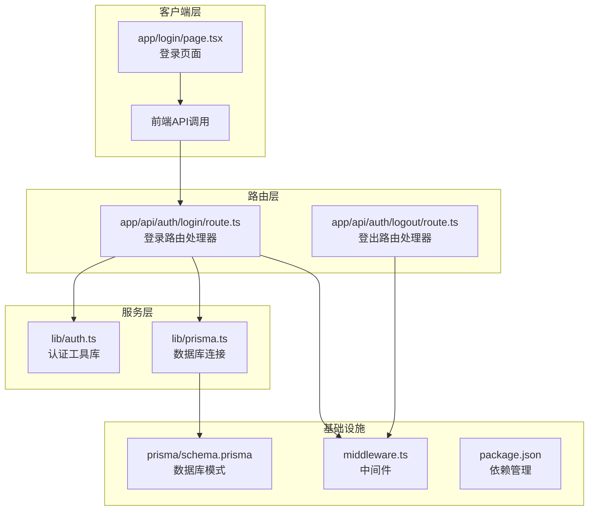
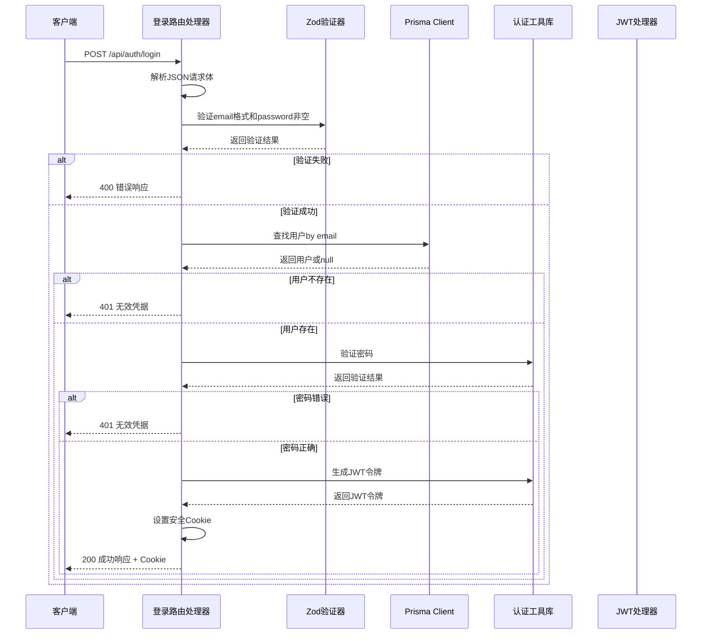
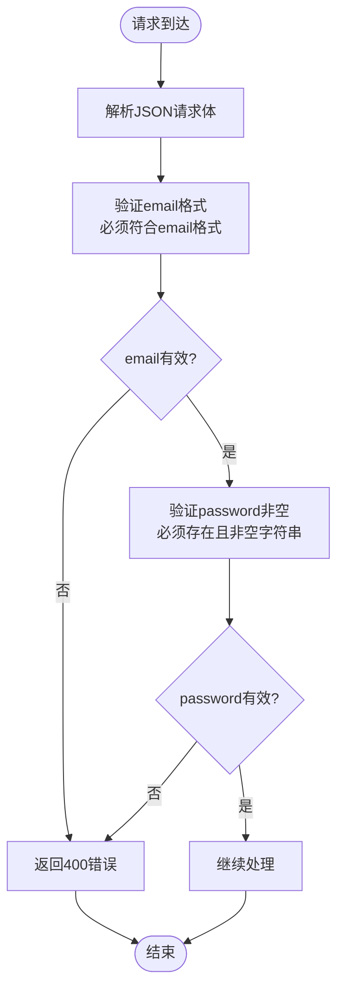
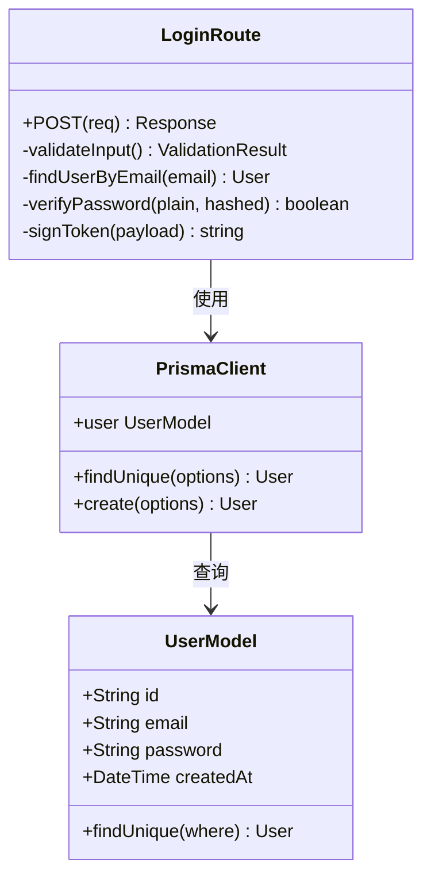
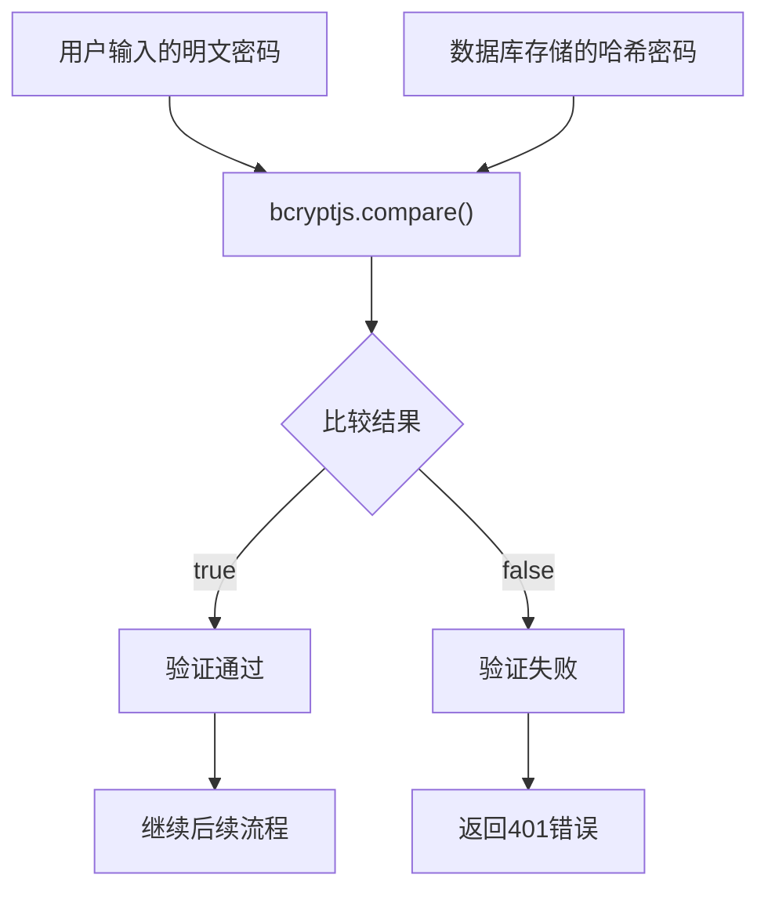
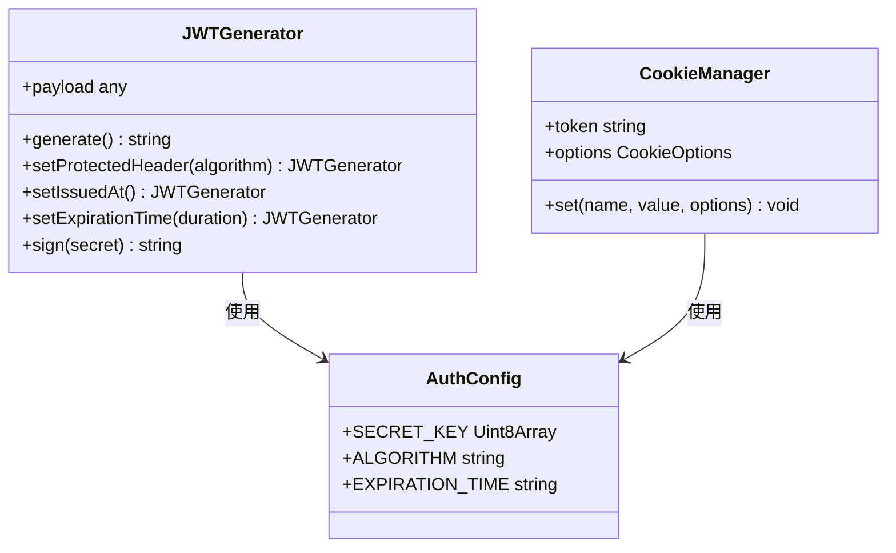
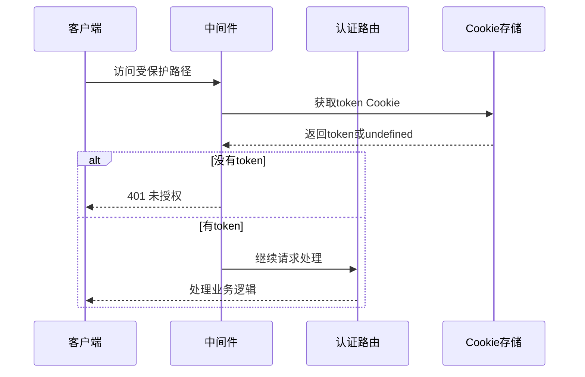
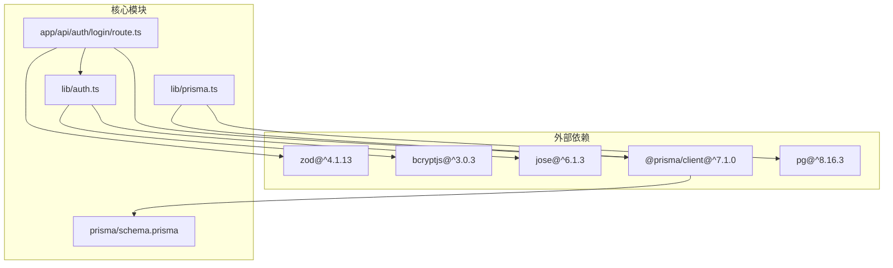

# 登录流程

<cite>
**本文档中引用的文件**
- [app/api/auth/login/route.ts](file://app/api/auth/login/route.ts)
- [lib/auth.ts](file://lib/auth.ts)
- [lib/prisma.ts](file://lib/prisma.ts)
- [prisma/schema.prisma](file://prisma/schema.prisma)
- [middleware.ts](file://middleware.ts)
- [app/login/page.tsx](file://app/login/page.tsx)
- [app/api/auth/logout/route.ts](file://app/api/auth/logout/route.ts)
- [package.json](file://package.json)
</cite>

## 目录
1. [简介](#简介)
2. [项目结构](#项目结构)
3. [核心组件](#核心组件)
4. [架构概览](#架构概览)
5. [详细组件分析](#详细组件分析)
6. [依赖关系分析](#依赖关系分析)
7. [性能考虑](#性能考虑)
8. [故障排除指南](#故障排除指南)
9. [结论](#结论)

## 简介

本文件详细阐述了Todo CSV导入项目中用户登录流程的完整实现机制。该系统采用现代化的Next.js App Router架构，结合Zod进行数据验证、Prisma Client进行数据库操作、bcryptjs进行密码哈希验证，以及JWT进行身份认证。整个流程从客户端发起POST请求到/api/auth/login开始，经过严格的输入验证、用户查找、密码验证、令牌签发和安全Cookie设置，最终完成用户认证。

## 项目结构

该项目采用Next.js App Router的目录结构组织，登录功能相关的文件分布如下：

**图表来源**
- [app/login/page.tsx](file://app/login/page.tsx#L1-L108)
- [app/api/auth/login/route.ts](file://app/api/auth/login/route.ts#L1-L57)
- [lib/auth.ts](file://lib/auth.ts#L1-L30)
- [lib/prisma.ts](file://lib/prisma.ts#L1-L20)

**章节来源**
- [app/login/page.tsx](file://app/login/page.tsx#L1-L108)
- [app/api/auth/login/route.ts](file://app/api/auth/login/route.ts#L1-L57)
- [lib/auth.ts](file://lib/auth.ts#L1-L30)
- [lib/prisma.ts](file://lib/prisma.ts#L1-L20)

## 核心组件

### 登录路由处理器

登录路由处理器位于`app/api/auth/login/route.ts`，负责处理所有登录请求的核心逻辑。该组件实现了完整的认证流程，包括请求验证、用户查找、密码验证和令牌签发。

### 认证工具库

认证工具库位于`lib/auth.ts`，提供了密码哈希、密码验证和JWT令牌生成的核心功能。该库使用bcryptjs进行密码安全处理，使用jose库进行JWT操作。

### 数据库连接

数据库连接位于`lib/prisma.ts`，配置了PostgreSQL连接池和Prisma Client实例，为整个应用提供类型安全的数据库访问能力。

**章节来源**
- [app/api/auth/login/route.ts](file://app/api/auth/login/route.ts#L1-L57)
- [lib/auth.ts](file://lib/auth.ts#L1-L30)
- [lib/prisma.ts](file://lib/prisma.ts#L1-L20)

## 架构概览

登录流程采用分层架构设计，确保了关注点分离和代码的可维护性：

**图表来源**
- [app/api/auth/login/route.ts](file://app/api/auth/login/route.ts#L11-L56)
- [lib/auth.ts](file://lib/auth.ts#L10-L20)
- [lib/prisma.ts](file://lib/prisma.ts#L13-L15)

## 详细组件分析

### 请求验证组件

登录流程的第一步是使用Zod进行严格的数据验证。验证规则定义在路由处理器中：

**图表来源**
- [app/api/auth/login/route.ts](file://app/api/auth/login/route.ts#L6-L9)
- [app/api/auth/login/route.ts](file://app/api/auth/login/route.ts#L14-L18)

验证规则确保：
- email字段必须符合标准的邮箱格式
- password字段必须存在且为非空字符串
- 任何验证失败都会立即返回400状态码

**章节来源**
- [app/api/auth/login/route.ts](file://app/api/auth/login/route.ts#L6-L9)
- [app/api/auth/login/route.ts](file://app/api/auth/login/route.ts#L14-L18)

### 用户查询组件

一旦请求通过Zod验证，系统会使用Prisma Client查询用户信息。查询逻辑基于邮箱地址进行精确匹配：

**图表来源**
- [lib/prisma.ts](file://lib/prisma.ts#L13-L15)
- [prisma/schema.prisma](file://prisma/schema.prisma#L16-L26)
- [app/api/auth/login/route.ts](file://app/api/auth/login/route.ts#L22-L24)

查询特点：
- 使用`findUnique`方法确保邮箱唯一性约束
- 查询条件仅基于email字段
- 返回结果可能为null（用户不存在）

**章节来源**
- [lib/prisma.ts](file://lib/prisma.ts#L13-L15)
- [prisma/schema.prisma](file://prisma/schema.prisma#L16-L26)
- [app/api/auth/login/route.ts](file://app/api/auth/login/route.ts#L22-L24)

### 密码验证组件

密码验证是安全性的关键环节，使用bcryptjs库进行安全的密码比较：

**图表来源**
- [lib/auth.ts](file://lib/auth.ts#L10-L12)
- [app/api/auth/login/route.ts](file://app/api/auth/login/route.ts#L30-L33)

安全特性：
- 使用bcryptjs的`compare`函数进行安全比较
- 避免时间攻击，比较过程具有恒定时间复杂度
- 不会暴露原始密码或哈希值

**章节来源**
- [lib/auth.ts](file://lib/auth.ts#L10-L12)
- [app/api/auth/login/route.ts](file://app/api/auth/login/route.ts#L30-L33)

### JWT令牌生成组件

认证成功后，系统生成JWT令牌并设置安全的Cookie：

**图表来源**
- [lib/auth.ts](file://lib/auth.ts#L14-L20)
- [app/api/auth/login/route.ts](file://app/api/auth/login/route.ts#L35-L49)

令牌配置：
- 算法：HS256（对称密钥）
- 发行时间：自动设置
- 过期时间：24小时
- 载荷：包含用户ID和邮箱

Cookie安全配置：
- httpOnly: true（防止XSS攻击）
- secure: 生产环境启用（HTTPS传输）
- sameSite: lax（跨站请求保护）
- maxAge: 86400秒（24小时）
- path: '/'（全局可用）

**章节来源**
- [lib/auth.ts](file://lib/auth.ts#L14-L20)
- [app/api/auth/login/route.ts](file://app/api/auth/login/route.ts#L35-L49)

### 中间件集成

登录流程与中间件系统无缝集成，确保受保护资源的安全访问：

**图表来源**
- [middleware.ts](file://middleware.ts#L5-L44)
- [app/api/auth/login/route.ts](file://app/api/auth/login/route.ts#L43-L49)

**章节来源**
- [middleware.ts](file://middleware.ts#L5-L44)

## 依赖关系分析

项目依赖关系展现了清晰的模块化架构：

**图表来源**
- [package.json](file://package.json#L11-L36)
- [app/api/auth/login/route.ts](file://app/api/auth/login/route.ts#L1-L4)
- [lib/auth.ts](file://lib/auth.ts#L1-L2)
- [lib/prisma.ts](file://lib/prisma.ts#L1-L3)

**章节来源**
- [package.json](file://package.json#L11-L36)

## 性能考虑

### 缓存策略
- 用户查询结果未实现缓存，建议在高并发场景下添加Redis缓存
- JWT令牌验证在中间件中执行，建议实现本地快速检查

### 数据库优化
- 邮箱字段已建立唯一索引，查询效率高
- 建议添加邮箱查询的复合索引以优化查询性能

### 安全优化
- bcrypt成本因子设置为10，平衡了安全性与性能
- JWT过期时间为24小时，适合大多数应用场景

## 故障排除指南

### 常见错误及解决方案

| HTTP状态码 | 触发条件 | 响应内容 | 解决方案 |
|------------|----------|----------|----------|
| 400 | 输入验证失败 | `{ error: 'Invalid input' }` | 检查email格式和password长度 |
| 401 | 用户不存在或密码错误 | `{ error: 'Invalid credentials' }` | 验证用户是否存在，检查密码 |
| 500 | 服务器内部异常 | `{ error: 'Internal server error' }` | 检查服务器日志，重启服务 |

### 调试步骤

1. **客户端调试**
   - 检查前端表单验证是否正确
   - 确认网络请求格式和头部设置

2. **服务端调试**
   - 查看服务器控制台输出的日志
   - 检查Prisma查询日志
   - 验证JWT密钥配置

3. **数据库调试**
   - 确认用户记录存在且邮箱唯一
   - 检查密码哈希是否正确存储

**章节来源**
- [app/api/auth/login/route.ts](file://app/api/auth/login/route.ts#L16-L18)
- [app/api/auth/login/route.ts](file://app/api/auth/login/route.ts#L26-L28)
- [app/api/auth/login/route.ts](file://app/api/auth/login/route.ts#L52-L55)

## 结论

该登录流程实现了现代Web应用的最佳实践，具备以下特点：

### 安全性
- 严格的输入验证防止恶意数据注入
- bcrypt密码哈希确保密码存储安全
- JWT令牌配合安全Cookie防止XSS和CSRF攻击
- 中间件统一处理认证逻辑

### 可维护性
- 清晰的分层架构便于理解和维护
- 类型安全的Prisma查询减少运行时错误
- 模块化的认证工具库支持代码复用

### 扩展性
- 支持多种认证方式的扩展
- 易于添加多因素认证
- 可配置的安全参数适应不同需求

该实现为Todo CSV导入项目提供了坚实的身份认证基础，确保了用户数据的安全性和系统的可靠性。