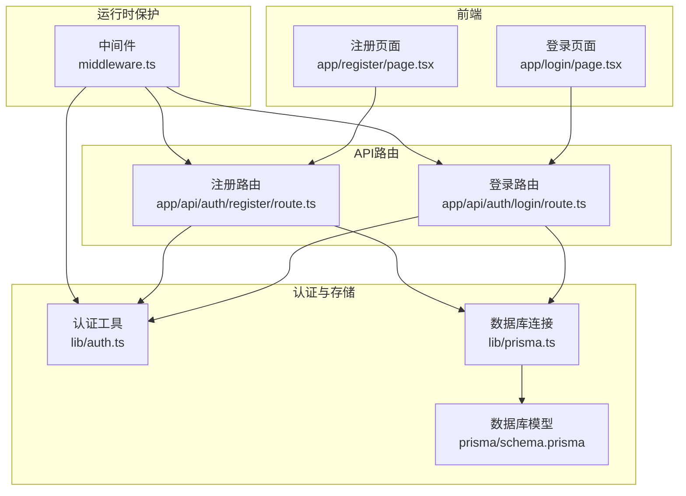
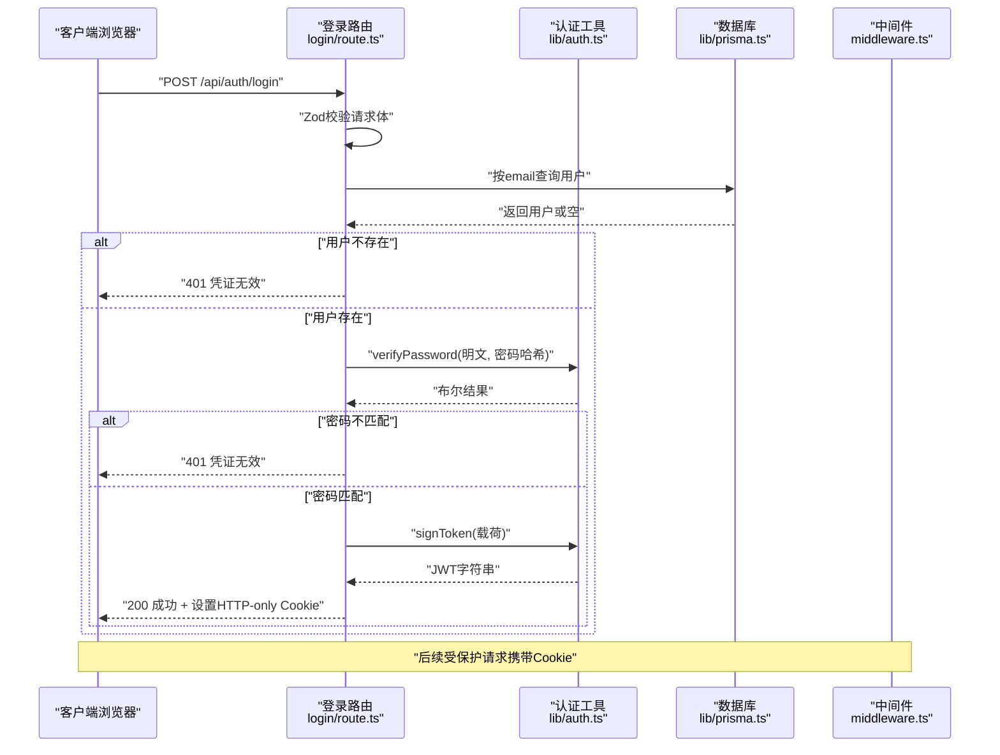
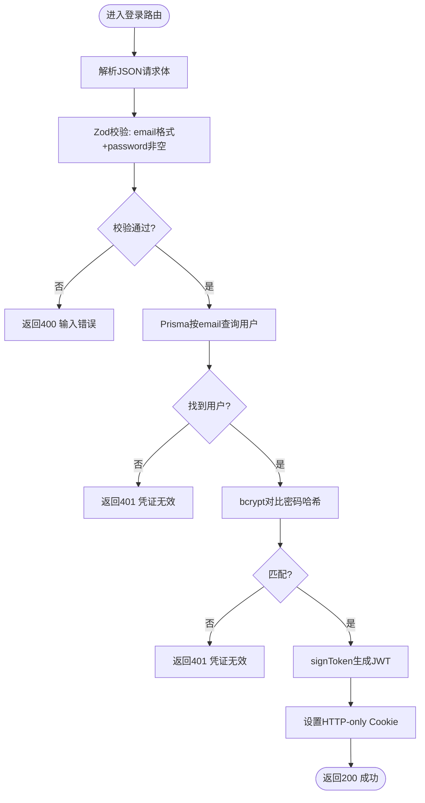
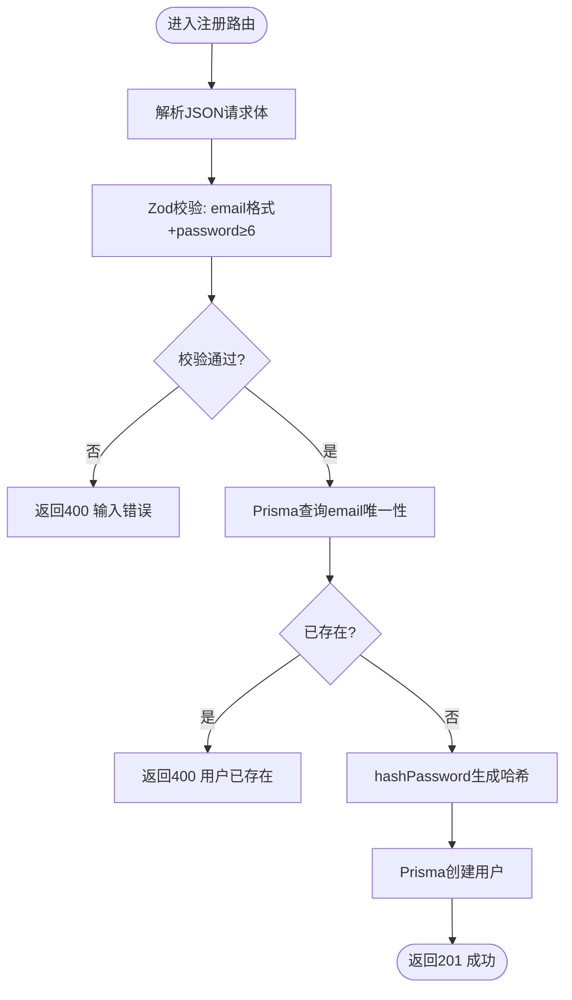
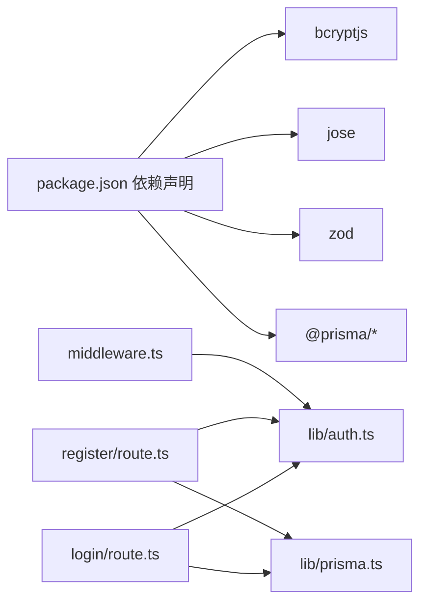

# 认证流程

<cite>
**本文引用的文件**
- [app/api/auth/login/route.ts](file://app/api/auth/login/route.ts)
- [app/api/auth/register/route.ts](file://app/api/auth/register/route.ts)
- [lib/auth.ts](file://lib/auth.ts)
- [lib/prisma.ts](file://lib/prisma.ts)
- [middleware.ts](file://middleware.ts)
- [app/login/page.tsx](file://app/login/page.tsx)
- [app/register/page.tsx](file://app/register/page.tsx)
- [prisma/schema.prisma](file://prisma/schema.prisma)
- [package.json](file://package.json)
</cite>

## 目录
1. [简介](#简介)
2. [项目结构](#项目结构)
3. [核心组件](#核心组件)
4. [架构总览](#架构总览)
5. [详细组件分析](#详细组件分析)
6. [依赖关系分析](#依赖关系分析)
7. [性能考量](#性能考量)
8. [故障排查指南](#故障排查指南)
9. [结论](#结论)

## 简介
本文件系统性文档化用户登录与注册两大核心认证流程，覆盖请求体校验、数据库查询与密码比对、JWT签发与安全Cookie设置、以及中间件保护策略。重点说明：
- 登录流程：Zod校验email格式与password非空，Prisma查询用户，bcryptjs对比哈希，签发JWT并通过HTTP-only Cookie安全返回。
- 注册流程：Zod校验email格式与password最小长度为6，Prisma检查邮箱唯一性，bcryptjs生成安全哈希后入库。
- 错误处理策略：400输入错误、401凭证无效、500服务器异常。
- 序列图展示从客户端到服务端的完整数据流。

## 项目结构
认证相关代码主要分布在以下位置：
- 路由处理器：app/api/auth/login/route.ts、app/api/auth/register/route.ts
- 认证工具：lib/auth.ts（密码哈希/校验、JWT签发/校验）
- 数据库连接：lib/prisma.ts（Prisma客户端与PostgreSQL适配）
- 中间件：middleware.ts（基于Cookie的访问控制）
- 前端页面：app/login/page.tsx、app/register/page.tsx（表单与提交逻辑）

图表来源
- [app/login/page.tsx](file://app/login/page.tsx#L1-L109)
- [app/register/page.tsx](file://app/register/page.tsx#L1-L138)
- [app/api/auth/login/route.ts](file://app/api/auth/login/route.ts#L1-L57)
- [app/api/auth/register/route.ts](file://app/api/auth/register/route.ts#L1-L53)
- [lib/auth.ts](file://lib/auth.ts#L1-L30)
- [lib/prisma.ts](file://lib/prisma.ts#L1-L20)
- [prisma/schema.prisma](file://prisma/schema.prisma#L16-L26)
- [middleware.ts](file://middleware.ts#L1-L50)

章节来源
- [app/login/page.tsx](file://app/login/page.tsx#L1-L109)
- [app/register/page.tsx](file://app/register/page.tsx#L1-L138)
- [app/api/auth/login/route.ts](file://app/api/auth/login/route.ts#L1-L57)
- [app/api/auth/register/route.ts](file://app/api/auth/register/route.ts#L1-L53)
- [lib/auth.ts](file://lib/auth.ts#L1-L30)
- [lib/prisma.ts](file://lib/prisma.ts#L1-L20)
- [prisma/schema.prisma](file://prisma/schema.prisma#L16-L26)
- [middleware.ts](file://middleware.ts#L1-L50)

## 核心组件
- 登录路由处理器：负责请求体Zod校验、用户查询、密码校验、JWT签发与HTTP-only Cookie设置。
- 注册路由处理器：负责请求体Zod校验（含密码最小长度）、邮箱唯一性检查、密码哈希与用户创建。
- 认证工具库：提供bcryptjs哈希/校验、jose JWT签发/校验。
- 数据库连接：基于Prisma与PostgreSQL适配器，提供全局单例PrismaClient。
- 中间件：读取Cookie中的token，对受保护路径进行访问控制与重定向。

章节来源
- [app/api/auth/login/route.ts](file://app/api/auth/login/route.ts#L1-L57)
- [app/api/auth/register/route.ts](file://app/api/auth/register/route.ts#L1-L53)
- [lib/auth.ts](file://lib/auth.ts#L1-L30)
- [lib/prisma.ts](file://lib/prisma.ts#L1-L20)
- [middleware.ts](file://middleware.ts#L1-L50)

## 架构总览
认证体系采用“前端表单 -> API路由 -> 认证工具 -> 数据库”的分层设计，配合中间件实现基于Cookie的会话保护。

图表来源
- [app/api/auth/login/route.ts](file://app/api/auth/login/route.ts#L11-L56)
- [lib/auth.ts](file://lib/auth.ts#L10-L20)
- [lib/prisma.ts](file://lib/prisma.ts#L1-L20)
- [middleware.ts](file://middleware.ts#L5-L44)

章节来源
- [app/api/auth/login/route.ts](file://app/api/auth/login/route.ts#L1-L57)
- [lib/auth.ts](file://lib/auth.ts#L1-L30)
- [lib/prisma.ts](file://lib/prisma.ts#L1-L20)
- [middleware.ts](file://middleware.ts#L1-L50)

## 详细组件分析

### 登录流程（app/api/auth/login/route.ts）
- 请求体校验：使用Zod对象schema，要求email为合法格式，password为非空字符串。
- 用户查询：通过Prisma查询是否存在该email的用户。
- 凭证验证：使用bcryptjs对比明文密码与数据库中的哈希值。
- JWT签发：使用jose的SignJWT生成24小时过期的JWT。
- 安全Cookie设置：通过response.cookies.set设置HTTP-only、secure（生产环境）、sameSite=lax、maxAge=1天的Cookie。
- 错误处理：输入无效返回400；用户不存在或密码错误返回401；内部异常返回500。

图表来源
- [app/api/auth/login/route.ts](file://app/api/auth/login/route.ts#L11-L56)
- [lib/auth.ts](file://lib/auth.ts#L10-L20)
- [lib/prisma.ts](file://lib/prisma.ts#L1-L20)

章节来源
- [app/api/auth/login/route.ts](file://app/api/auth/login/route.ts#L1-L57)
- [lib/auth.ts](file://lib/auth.ts#L1-L30)
- [lib/prisma.ts](file://lib/prisma.ts#L1-L20)

### 注册流程（app/api/auth/register/route.ts）
- 请求体校验：Zod对象schema，要求email合法格式，password最小长度为6。
- 唯一性检查：通过Prisma查询email是否已存在，若存在则返回400。
- 密码哈希：使用bcryptjs对明文密码进行哈希处理。
- 用户创建：将email与hashedPassword写入数据库，返回新建用户信息。
- 错误处理：输入无效返回400；内部异常返回500。

图表来源
- [app/api/auth/register/route.ts](file://app/api/auth/register/route.ts#L11-L52)
- [lib/auth.ts](file://lib/auth.ts#L6-L8)
- [lib/prisma.ts](file://lib/prisma.ts#L1-L20)
- [prisma/schema.prisma](file://prisma/schema.prisma#L16-L26)

章节来源
- [app/api/auth/register/route.ts](file://app/api/auth/register/route.ts#L1-L53)
- [lib/auth.ts](file://lib/auth.ts#L1-L30)
- [lib/prisma.ts](file://lib/prisma.ts#L1-L20)
- [prisma/schema.prisma](file://prisma/schema.prisma#L16-L26)

### 前端交互（app/login/page.tsx 与 app/register/page.tsx）
- 登录页：使用react-hook-form与zodResolver进行前端校验，提交至/api/auth/login，根据响应状态进行路由跳转或错误提示。
- 注册页：使用zodResolver进行email与password校验，包含confirmPassword一致性校验，提交至/api/auth/register，成功后自动跳转到登录页。

章节来源
- [app/login/page.tsx](file://app/login/page.tsx#L1-L109)
- [app/register/page.tsx](file://app/register/page.tsx#L1-L138)

### 中间件保护（middleware.ts）
- 读取Cookie中的token，对受保护路径进行拦截。
- 对于未登录访问API受保护路径，返回401。
- 对于未登录访问页面受保护路径，重定向到登录页。
- 若token存在但无效，删除Cookie并重定向到登录页。
- 对于公共路径（登录、注册、认证API）直接放行。

章节来源
- [middleware.ts](file://middleware.ts#L1-L50)
- [lib/auth.ts](file://lib/auth.ts#L22-L29)

## 依赖关系分析
- 外部依赖：bcryptjs用于密码哈希与校验；jose用于JWT签发与校验；zod用于请求体校验；@prisma/adapter-pg与@prisma/client用于PostgreSQL访问。
- 内部依赖：路由处理器依赖认证工具库与Prisma客户端；中间件依赖认证工具库进行token校验。

图表来源
- [package.json](file://package.json#L11-L36)
- [app/api/auth/login/route.ts](file://app/api/auth/login/route.ts#L1-L57)
- [app/api/auth/register/route.ts](file://app/api/auth/register/route.ts#L1-L53)
- [lib/auth.ts](file://lib/auth.ts#L1-L30)
- [lib/prisma.ts](file://lib/prisma.ts#L1-L20)
- [middleware.ts](file://middleware.ts#L1-L50)

章节来源
- [package.json](file://package.json#L1-L62)
- [app/api/auth/login/route.ts](file://app/api/auth/login/route.ts#L1-L57)
- [app/api/auth/register/route.ts](file://app/api/auth/register/route.ts#L1-L53)
- [lib/auth.ts](file://lib/auth.ts#L1-L30)
- [lib/prisma.ts](file://lib/prisma.ts#L1-L20)
- [middleware.ts](file://middleware.ts#L1-L50)

## 性能考量
- 密码哈希成本：bcrypt默认成本为10，平衡安全性与性能；可按实际服务器负载调整。
- JWT签名/校验：jose为轻量库，Edge兼容良好；建议仅在必要路径进行深度校验，避免在中间件中做昂贵的异步校验。
- 数据库查询：email字段具备唯一索引，查询效率高；建议保持索引与查询条件一致。
- Cookie设置：HTTP-only防止XSS窃取；secure仅在生产环境启用；maxAge设置为1天，兼顾安全与体验。

## 故障排查指南
- 输入错误（400）：检查前端Zod校验与后端Zod schema是否一致；确认请求体JSON格式正确。
- 凭证无效（401）：确认email是否存在；确认password与数据库哈希匹配；检查Cookie是否被正确设置。
- 服务器异常（500）：查看后端日志；检查数据库连接与Prisma配置；确认JWT密钥环境变量可用。
- 中间件重定向：确认Cookie中token存在且有效；检查受保护路径匹配器配置。

章节来源
- [app/api/auth/login/route.ts](file://app/api/auth/login/route.ts#L16-L33)
- [app/api/auth/register/route.ts](file://app/api/auth/register/route.ts#L16-L28)
- [middleware.ts](file://middleware.ts#L23-L44)

## 结论
本认证体系以Zod进行前后端统一校验，bcryptjs保障密码安全，jose实现无状态会话，Prisma提供高效数据访问，配合中间件实现受保护资源访问控制。登录与注册流程清晰、错误处理明确，具备良好的扩展性与安全性基础。