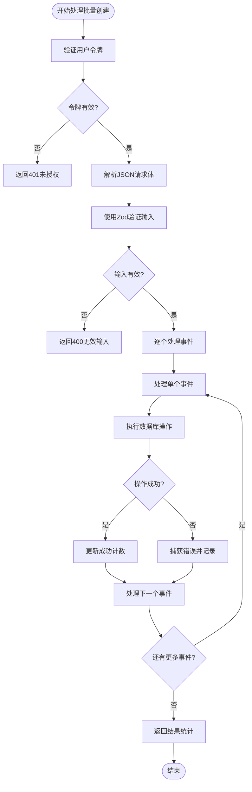
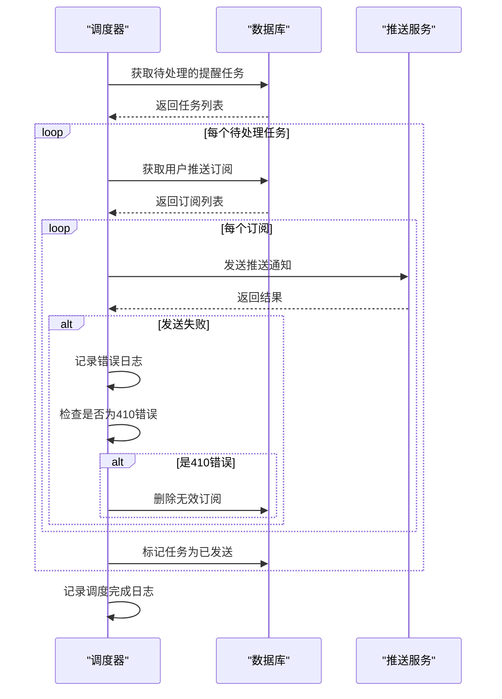
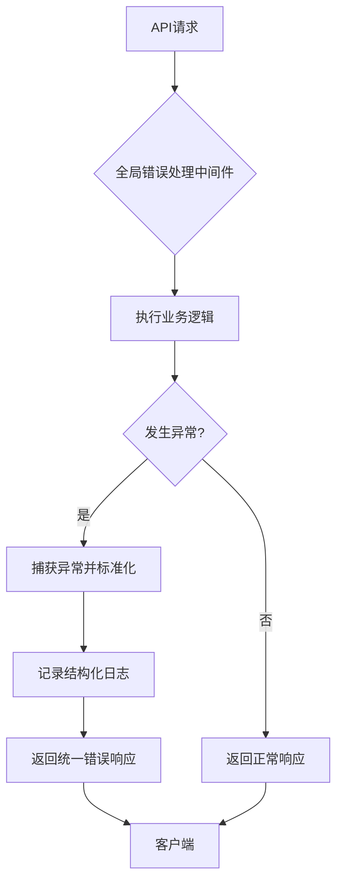
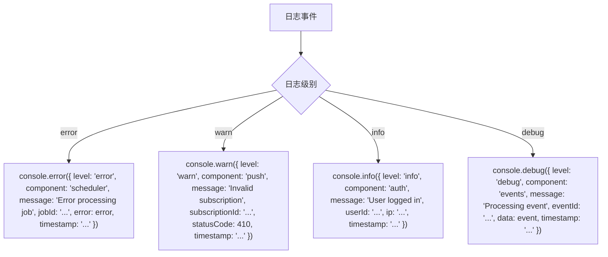
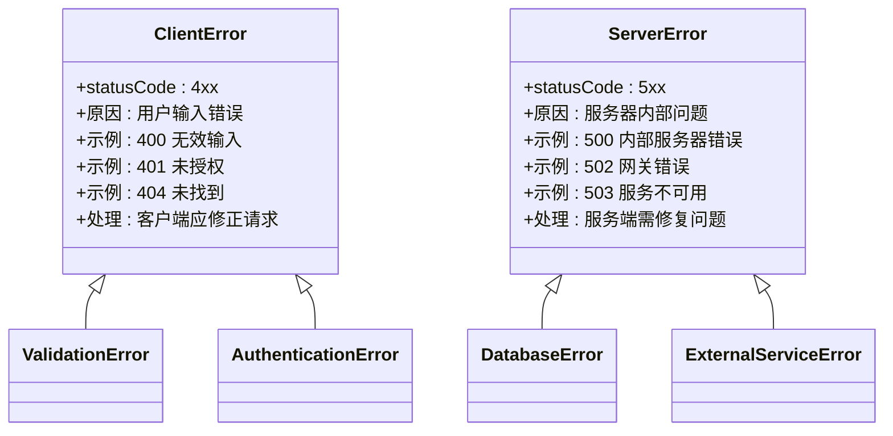
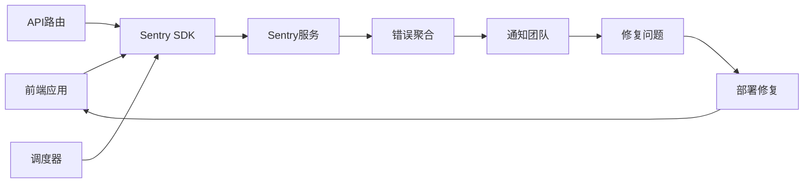

# 错误处理与日志

<cite>
**本文档引用的文件**  
- [middleware.ts](file://middleware.ts)
- [app/api/events/bulk-create/route.ts](file://app/api/events/bulk-create/route.ts)
- [lib/scheduler.ts](file://lib/scheduler.ts)
- [app/api/scheduler/run/route.ts](file://app/api/scheduler/run/route.ts)
- [lib/web-push.ts](file://lib/web-push.ts)
- [lib/reminder-jobs.ts](file://lib/reminder-jobs.ts)
- [lib/auth.ts](file://lib/auth.ts)
- [app/api/auth/login/route.ts](file://app/api/auth/login/route.ts)
- [app/api/auth/register/route.ts](file://app/api/auth/register/route.ts)
- [app/api/events/route.ts](file://app/api/events/route.ts)
- [hooks/use-toast.ts](file://hooks/use-toast.ts)
</cite>

## 目录
1. [简介](#简介)
2. [现有错误处理模式分析](#现有错误处理模式分析)
3. [统一错误响应格式建议](#统一错误响应格式建议)
4. [全局错误处理中间件设计](#全局错误处理中间件设计)
5. [日志记录最佳实践](#日志记录最佳实践)
6. [客户端与服务器错误区分](#客户端与服务器错误区分)
7. [错误监控与追踪建议](#错误监控与追踪建议)
8. [结论](#结论)

## 简介
本文件旨在分析当前代码库中的错误处理模式，并制定统一的错误处理策略。通过分析现有实现，我们将建立标准化的错误响应格式，优化日志记录实践，并建议集成错误监控服务以提高系统的可维护性和可观测性。

## 现有错误处理模式分析

### 认证相关错误处理
在 `middleware.ts` 文件中，系统实现了基于 JWT 的认证中间件。当 JWT 验证失败时，系统会返回 401 未授权状态码，并在重定向到登录页面的同时清理客户端的 token cookie。这种设计确保了无效认证状态能够被及时清除，防止用户陷入认证循环。

在 `app/api/auth/login/route.ts` 中，登录接口对输入验证失败返回 400 错误，对无效凭据返回 401 错误，实现了清晰的错误分类。

**Section sources**
- [middleware.ts](file://middleware.ts#L1-L50)
- [app/api/auth/login/route.ts](file://app/api/auth/login/route.ts#L1-L57)

### 批量创建错误处理
`app/api/events/bulk-create/route.ts` 文件展示了复杂的错误处理模式。该接口使用 Zod 进行输入验证，对无效输入返回 400 错误。在处理 CSV 数据导入时，系统采用批量处理策略：即使部分数据处理失败，也会继续处理其余数据，并在响应中包含详细的错误信息（包括失败索引和具体错误消息）。



**Diagram sources**
- [app/api/events/bulk-create/route.ts](file://app/api/events/bulk-create/route.ts#L1-L133)

**Section sources**
- [app/api/events/bulk-create/route.ts](file://app/api/events/bulk-create/route.ts#L1-L133)

### 调度系统错误处理
`lib/scheduler.ts` 文件中的调度器实现了健壮的错误处理机制。系统在处理推送通知时，对每个订阅单独捕获异常，确保单个订阅的失败不会影响其他订阅的处理。当收到 410 Gone 响应时，系统会自动清理无效的推送订阅，维护了订阅列表的健康状态。



**Diagram sources**
- [lib/scheduler.ts](file://lib/scheduler.ts#L1-L86)
- [lib/web-push.ts](file://lib/web-push.ts#L1-L54)

**Section sources**
- [lib/scheduler.ts](file://lib/scheduler.ts#L1-L86)
- [lib/web-push.ts](file://lib/web-push.ts#L1-L54)

## 统一错误响应格式建议

### 当前问题分析
目前系统中的错误响应格式不一致：
- `middleware.ts` 返回 `{ error: 'Unauthorized' }`
- `bulk-create/route.ts` 返回 `{ error: 'Invalid input', details: result.error }`
- `register/route.ts` 返回 `{ error: "Internal Server Error", detail: String(error?.message ?? error) }`

### 建议的统一格式
建议建立全局错误响应函数，标准化错误输出格式：

```typescript
interface ErrorResponse {
  success: false;
  error: {
    code: string;
    message: string;
    details?: any;
    timestamp: string;
    requestId?: string;
  };
}
```

**Section sources**
- [app/api/events/bulk-create/route.ts](file://app/api/events/bulk-create/route.ts#L34-L36)
- [app/api/auth/register/route.ts](file://app/api/auth/register/route.ts#L47-L49)

## 全局错误处理中间件设计

### 中间件实现建议
建议创建全局错误处理中间件，集中处理所有路由的异常：



**Diagram sources**
- [middleware.ts](file://middleware.ts#L1-L50)
- [app/api/scheduler/run/route.ts](file://app/api/scheduler/run/route.ts#L1-L37)

## 日志记录最佳实践

### 当前日志实践分析
系统已在关键路径添加了日志记录：
- 调度器在开始、结束和关键步骤记录日志
- 各 API 路由在捕获异常时使用 `console.error` 记录错误
- 推送服务记录发送失败的详细信息

### 结构化日志建议
建议将日志升级为结构化格式，便于分析和监控：



**Diagram sources**
- [lib/scheduler.ts](file://lib/scheduler.ts#L9-L85)
- [app/api/auth/login/route.ts](file://app/api/auth/login/route.ts#L52)
- [lib/web-push.ts](file://lib/web-push.ts#L43)

**Section sources**
- [lib/scheduler.ts](file://lib/scheduler.ts#L9-L85)
- [app/api/auth/login/route.ts](file://app/api/auth/login/route.ts#L52)
- [lib/web-push.ts](file://lib/web-push.ts#L43)

## 客户端与服务器错误区分

### 错误分类标准
系统应明确区分客户端错误（4xx）和服务器错误（5xx）：



**Diagram sources**
- [app/api/events/bulk-create/route.ts](file://app/api/events/bulk-create/route.ts#L35)
- [middleware.ts](file://middleware.ts#L25)
- [app/api/events/bulk-create/route.ts](file://app/api/events/bulk-create/route.ts#L130)

**Section sources**
- [app/api/events/bulk-create/route.ts](file://app/api/events/bulk-create/route.ts#L35)
- [middleware.ts](file://middleware.ts#L25)
- [app/api/events/bulk-create/route.ts](file://app/api/events/bulk-create/route.ts#L130)

## 错误监控与追踪建议

### 集成第三方监控服务
建议集成 Sentry 等错误监控服务，实现：



**Diagram sources**
- [lib/scheduler.ts](file://lib/scheduler.ts#L82)
- [app/api/events/bulk-create/route.ts](file://app/api/events/bulk-create/route.ts#L129)

### 用户友好的错误消息
系统应为不同类型的错误提供清晰的用户可读消息：

| 错误类型 | HTTP状态码 | 用户消息 | 开发者信息 |
|---------|----------|--------|----------|
| 输入验证失败 | 400 | "请检查输入内容并重试" | Zod验证错误详情 |
| 未授权访问 | 401 | "请登录后重试" | JWT验证失败原因 |
| 资源未找到 | 404 | "请求的资源不存在" | 请求路径和参数 |
| 内部服务器错误 | 500 | "服务暂时不可用，请稍后重试" | 完整错误堆栈 |

**Section sources**
- [app/api/events/bulk-create/route.ts](file://app/api/events/bulk-create/route.ts#L35)
- [middleware.ts](file://middleware.ts#L25)
- [app/api/events/bulk-create/route.ts](file://app/api/events/bulk-create/route.ts#L130)

## 结论
当前系统的错误处理机制已具备基本功能，但在标准化和可观测性方面仍有改进空间。建议实施全局错误处理中间件，统一错误响应格式，采用结构化日志记录，并集成专业的错误监控服务。这些改进将显著提高系统的可维护性，加快问题诊断速度，并为用户提供更好的错误体验。