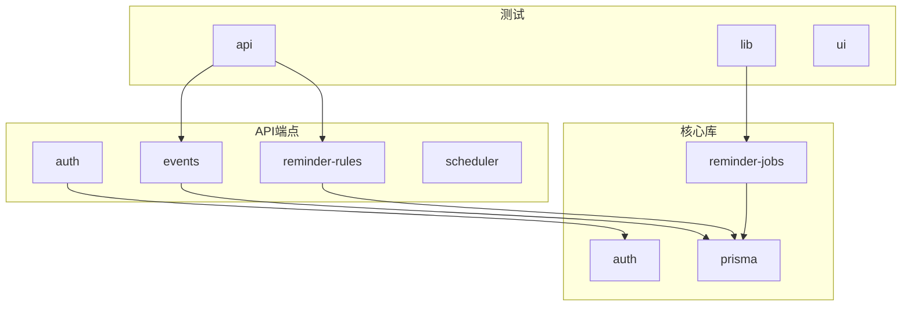
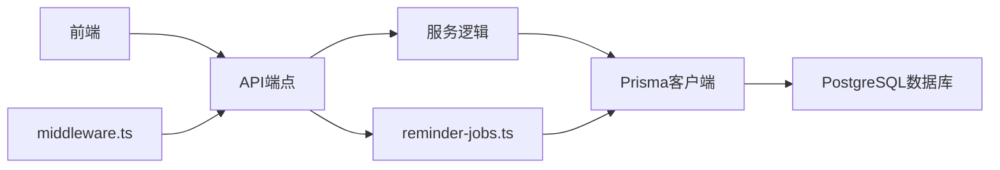
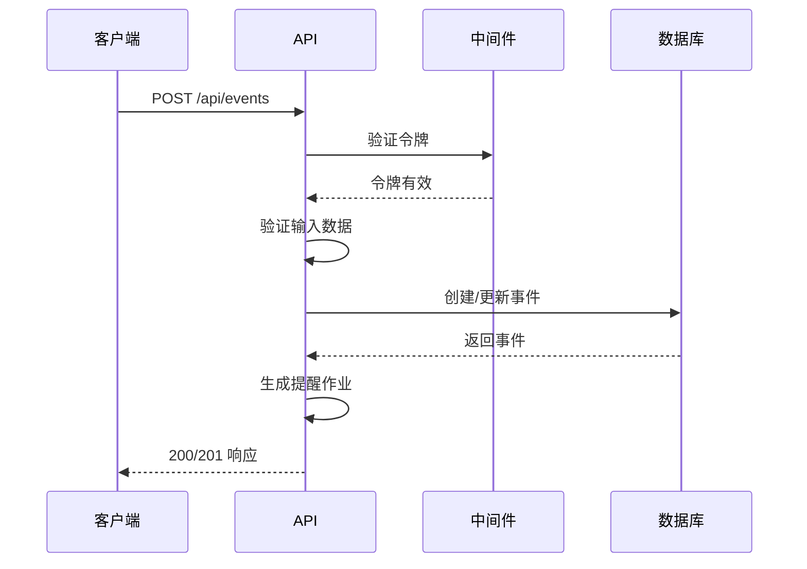
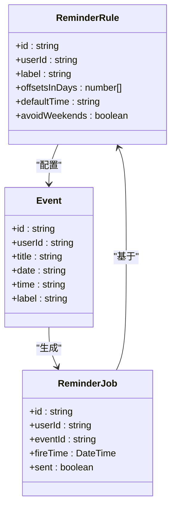
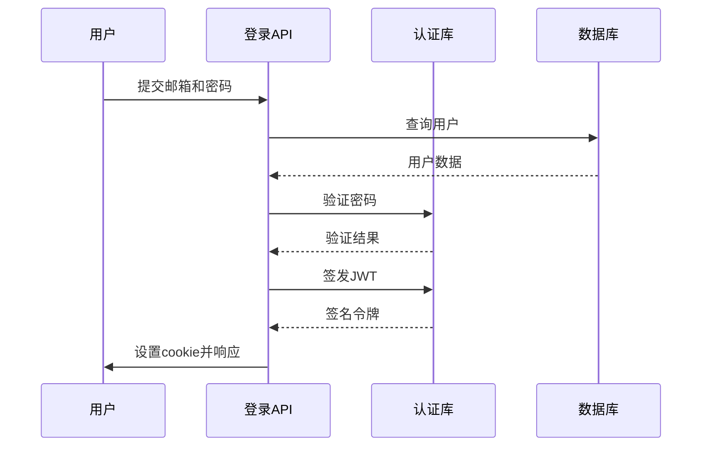
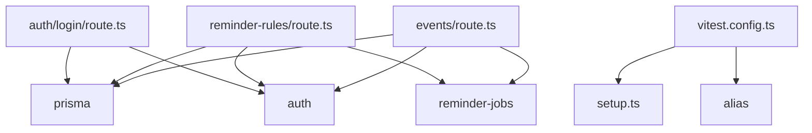

# API测试

<cite>
**本文档中引用的文件**  
- [middleware.ts](file://middleware.ts#L1-L50)
- [events/route.ts](file://app/api/events/route.ts#L1-L200)
- [reminder-rules/route.ts](file://app/api/reminder-rules/route.ts#L1-L109)
- [events/[id]/route.ts](file://app/api/events/[id]/route.ts#L1-L119)
- [reminder-rules/[id]/route.ts](file://app/api/reminder-rules/[id]/route.ts#L1-L158)
- [auth/login/route.ts](file://app/api/auth/login/route.ts#L1-L57)
- [auth/register/route.ts](file://app/api/auth/register/route.ts#L1-L53)
- [lib/auth.ts](file://lib/auth.ts#L1-L30)
- [lib/prisma.ts](file://lib/prisma.ts#L1-L20)
- [prisma/schema.prisma](file://prisma/schema.prisma#L1-L86)
- [lib/reminder-jobs.ts](file://lib/reminder-jobs.ts#L1-L109)
- [vitest.config.ts](file://vitest.config.ts#L1-L16)
- [tests/setup.ts](file://tests/setup.ts#L1-L6)
- [__tests__/api/events.test.ts](file://__tests__/api/events.test.ts)
- [__tests__/api/reminder-rules.test.ts](file://__tests__/api/reminder-rules.test.ts)
</cite>

## 目录
1. [引言](#引言)
2. [项目结构](#项目结构)
3. [核心组件](#核心组件)
4. [架构概述](#架构概述)
5. [详细组件分析](#详细组件分析)
6. [依赖分析](#依赖分析)
7. [性能考虑](#性能考虑)
8. [故障排除指南](#故障排除指南)
9. [结论](#结论)

## 引言
本文档旨在为事件和提醒规则API端点创建系统性测试方案。通过分析代码库，我们将定义全面的测试矩阵，涵盖各种HTTP状态码的验证，包括200成功响应、400参数错误、401未认证、403权限拒绝和404资源不存在等。文档将详细说明如何构造测试数据，并验证响应体结构与数据库变更的一致性。特别关注受middleware.ts保护的API路由的测试方法，包括注入模拟用户身份的策略。最后，提供自动化测试脚本示例，展示如何批量运行API测试并生成报告。

## 项目结构
本项目采用Next.js App Router架构，API端点位于`app/api`目录下，采用TypeScript编写。核心功能包括事件管理、提醒规则配置和用户认证。数据持久化通过Prisma ORM与PostgreSQL数据库交互。测试框架使用Vitest，测试文件位于`__tests__`目录下。项目结构清晰，遵循功能模块化组织原则。

**图示来源**
- [app/api](file://app/api)
- [lib](file://lib)
- [__tests__](file://__tests__)

**本节来源**
- [app/api](file://app/api)
- [lib](file://lib)
- [__tests__](file://__tests__)

## 核心组件
系统的核心组件包括事件API、提醒规则API和认证API。事件API支持创建、读取、更新和删除操作，同时处理批量创建和月度事件查询。提醒规则API允许用户为不同标签配置提醒偏移量和时间。认证API处理用户注册和登录流程。所有受保护的API端点都通过middleware.ts进行身份验证和授权检查。

**本节来源**
- [app/api/events/route.ts](file://app/api/events/route.ts#L1-L200)
- [app/api/reminder-rules/route.ts](file://app/api/reminder-rules/route.ts#L1-L109)
- [app/api/auth/login/route.ts](file://app/api/auth/login/route.ts#L1-L57)

## 架构概述
系统采用分层架构，前端通过Next.js页面组件与后端API交互。API层处理业务逻辑，调用服务层进行数据处理，最终通过Prisma客户端与数据库通信。中间件层负责全局身份验证，确保只有授权用户才能访问受保护的资源。提醒系统通过生成提醒作业（ReminderJob）实现定时通知功能。

**图示来源**
- [middleware.ts](file://middleware.ts#L1-L50)
- [lib/reminder-jobs.ts](file://lib/reminder-jobs.ts#L1-L109)
- [lib/prisma.ts](file://lib/prisma.ts#L1-L20)

## 详细组件分析

### 事件API分析
事件API提供全面的CRUD操作，支持单个和批量事件创建。GET请求根据用户身份和月份参数返回事件及其提醒实例。POST请求验证输入数据，创建或更新事件，并生成相应的提醒作业。受保护的端点首先验证JWT令牌，确保用户身份合法。

**图示来源**
- [app/api/events/route.ts](file://app/api/events/route.ts#L1-L200)
- [lib/reminder-jobs.ts](file://lib/reminder-jobs.ts#L1-L109)

**本节来源**
- [app/api/events/route.ts](file://app/api/events/route.ts#L1-L200)
- [app/api/events/[id]/route.ts](file://app/api/events/[id]/route.ts#L1-L119)

### 提醒规则API分析
提醒规则API允许用户为特定标签配置提醒策略。系统通过唯一约束确保同一用户不能为同一标签创建多个规则。当创建、更新或删除规则时，系统会自动同步受影响事件的提醒作业。这确保了提醒策略的变更能够立即反映在未来的提醒中。

**图示来源**
- [app/api/reminder-rules/route.ts](file://app/api/reminder-rules/route.ts#L1-L109)
- [app/api/reminder-rules/[id]/route.ts](file://app/api/reminder-rules/[id]/route.ts#L1-L158)
- [prisma/schema.prisma](file://prisma/schema.prisma#L1-L86)

**本节来源**
- [app/api/reminder-rules/route.ts](file://app/api/reminder-rules/route.ts#L1-L109)
- [app/api/reminder-rules/[id]/route.ts](file://app/api/reminder-rules/[id]/route.ts#L1-L158)

### 认证机制分析
认证系统基于JWT实现，用户登录后获得签名令牌，存储在HTTP-only cookie中。中间件全局验证令牌有效性，保护所有受保护的路由。注册流程包含密码哈希处理，确保用户凭证安全。系统设计考虑了生产环境的安全性，如HTTPS和SameSite cookie策略。

**图示来源**
- [app/api/auth/login/route.ts](file://app/api/auth/login/route.ts#L1-L57)
- [lib/auth.ts](file://lib/auth.ts#L1-L30)
- [middleware.ts](file://middleware.ts#L1-L50)

**本节来源**
- [app/api/auth/login/route.ts](file://app/api/auth/login/route.ts#L1-L57)
- [lib/auth.ts](file://lib/auth.ts#L1-L30)

## 依赖分析
项目依赖关系清晰，API端点依赖于核心库进行数据访问和业务逻辑处理。Prisma客户端作为数据访问层，连接应用逻辑与PostgreSQL数据库。测试框架Vitest依赖于Jest DOM库进行断言，同时通过Vitest配置文件设置测试环境和别名。

**图示来源**
- [package.json](file://package.json#L1-L62)
- [vitest.config.ts](file://vitest.config.ts#L1-L16)
- [app/api](file://app/api)

**本节来源**
- [package.json](file://package.json#L1-L62)
- [vitest.config.ts](file://vitest.config.ts#L1-L16)

## 性能考虑
系统在设计时考虑了性能优化。中间件对令牌存在性进行快速检查，避免不必要的验证开销。数据库查询使用索引优化，如在Event模型上为userId和date字段创建复合索引。提醒作业的生成和查询也通过索引优化，确保大规模数据下的查询效率。批量操作支持减少网络往返次数，提高整体性能。

## 故障排除指南
测试过程中可能遇到的常见问题包括：JWT令牌验证失败、数据库连接问题、输入验证错误等。建议在测试环境中使用固定的测试密钥，并确保测试数据库处于已知状态。对于中间件保护的API，确保在请求中正确设置认证cookie。使用Vitest的mock功能可以隔离外部依赖，提高测试稳定性和速度。

**本节来源**
- [tests/setup.ts](file://tests/setup.ts#L1-L6)
- [middleware.ts](file://middleware.ts#L1-L50)
- [lib/auth.ts](file://lib/auth.ts#L1-L30)

## 结论
本文档提供了针对事件和提醒规则API的系统性测试方案。通过分析代码库结构和实现细节，我们建立了全面的测试矩阵，涵盖了功能、安全性和数据一致性验证。建议的自动化测试策略能够有效保障API的质量和稳定性，为系统的持续发展提供可靠保障。