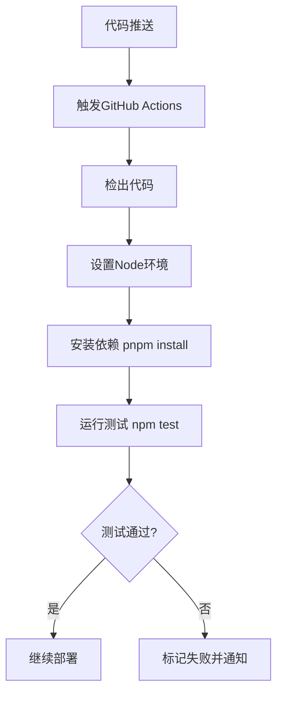
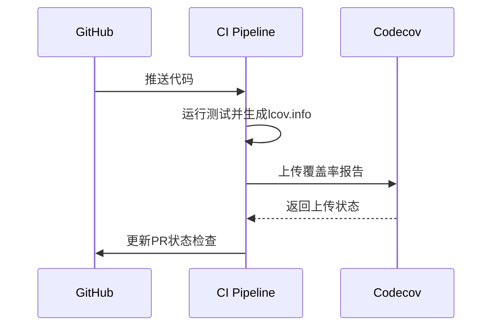
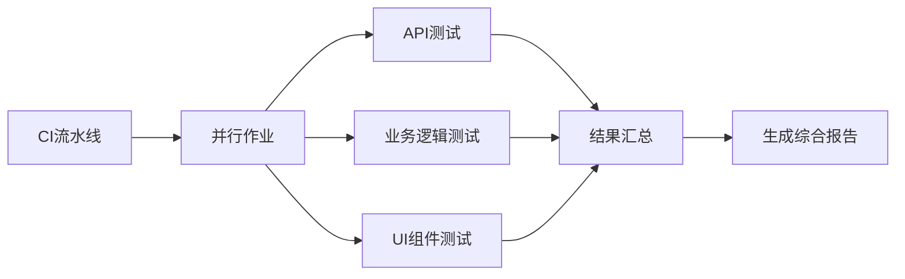

# CI集成

<cite>
**本文档中引用的文件**  
- [package.json](file://package.json)
- [vitest.config.ts](file://vitest.config.ts)
- [tests/setup.ts](file://tests/setup.ts)
- [vercel.json](file://vercel.json)
- [__tests__/api/auth.test.ts](file://__tests__/api/auth.test.ts)
- [__tests__/api/events.test.ts](file://__tests__/api/events.test.ts)
- [__tests__/lib/reminder-jobs.test.ts](file://__tests__/lib/reminder-jobs.test.ts)
</cite>

## 目录
1. [简介](#简介)
2. [项目结构与测试配置](#项目结构与测试配置)
3. [在CI/CD流水线中运行测试](#在cicd流水线中运行测试)
4. [测试覆盖率报告上传](#测试覆盖率报告上传)
5. [CI性能优化建议](#ci性能优化建议)
6. [测试稳定性保障](#测试稳定性保障)
7. [结论](#结论)

## 简介
本文档旨在指导如何将当前项目的测试套件集成到CI/CD流水线中。基于项目中已有的Vitest测试框架和Next.js架构，详细说明如何在Vercel或GitHub Actions等平台配置自动化测试执行流程。文档涵盖构建前测试运行、失败阈值设置、测试覆盖率报告上传以及CI性能优化等关键实践，确保代码质量在持续交付过程中得到有效保障。

## 项目结构与测试配置

本项目采用Next.js 16作为核心框架，使用Vitest进行单元测试和集成测试。测试文件位于`__tests__`目录下，覆盖API路由、业务逻辑和服务函数等多个层面。

```mermaid
graph TD
A[测试套件] --> B[API测试]
A --> C[业务逻辑测试]
B --> D[/__tests__/api/auth.test.ts]
B --> E[/__tests__/api/events.test.ts]
C --> F[/__tests__/lib/reminder-jobs.test.ts]
G[vitest.config.ts] --> H[测试环境配置]
H --> I[Node环境]
H --> J[别名@映射]
H --> K[setupFiles初始化]
```

**图示来源**  
- [vitest.config.ts](file://vitest.config.ts#L1-L16)
- [__tests__/api/auth.test.ts](file://__tests__/api/auth.test.ts#L1-L115)
- [__tests__/lib/reminder-jobs.test.ts](file://__tests__/lib/reminder-jobs.test.ts#L1-L113)

**本节来源**  
- [vitest.config.ts](file://vitest.config.ts#L1-L16)
- [package.json](file://package.json#L1-L62)

## 在CI/CD流水线中运行测试

### 添加测试脚本
首先，在`package.json`中添加测试运行脚本：

```json
"scripts": {
  "test": "vitest run",
  "test:watch": "vitest",
  "test:coverage": "vitest run --coverage"
}
```

### GitHub Actions配置
创建`.github/workflows/test.yml`文件：



**图示来源**  
- [package.json](file://package.json#L5-L10)
- [vitest.config.ts](file://vitest.config.ts#L7-L14)

**本节来源**  
- [package.json](file://package.json#L5-L10)
- [vitest.config.ts](file://vitest.config.ts#L7-L14)

### Vercel集成
Vercel默认在构建时运行`build`脚本。通过`vercel.json`中的cron配置可知项目使用定时任务，应在部署前确保测试通过。

建议在Vercel的项目设置中启用"Automatically run tests before deploy"选项，或通过Vercel CLI配置预部署钩子。

## 测试覆盖率报告上传

### 配置覆盖率工具
Vitest内置支持Istanbul覆盖率报告。在`vitest.config.ts`中扩展配置：

```typescript
export default defineConfig({
  test: {
    coverage: {
      provider: 'istanbul',
      reporter: ['text', 'lcov', 'html'],
      reportsDirectory: './coverage',
      exclude: ['**/node_modules/**', '**/dist/**', '**/*.config.*']
    }
  }
})
```

### 上传至Codecov
在GitHub Actions工作流中添加覆盖率上传步骤：



**图示来源**  
- [vitest.config.ts](file://vitest.config.ts#L7-L14)
- [package.json](file://package.json#L38-L59)

**本节来源**  
- [vitest.config.ts](file://vitest.config.ts#L7-L14)

## CI性能优化建议

### 依赖缓存
在GitHub Actions中缓存pnpm依赖：

```yaml
- name: Cache dependencies
  uses: actions/cache@v4
  with:
    path: ~/.pnpm-store
    key: ${{ runner.os }}-pnpm-${{ hashFiles('**/pnpm-lock.yaml') }}
    restore-keys: |
      ${{ runner.os }}-pnpm-
```

### 并行执行测试
对于大型测试套件，可按模块并行执行：



**图示来源**  
- [__tests__/api/auth.test.ts](file://__tests__/api/auth.test.ts#L1-L115)
- [__tests__/lib/reminder-jobs.test.ts](file://__tests__/lib/reminder-jobs.test.ts#L1-L113)

**本节来源**  
- [pnpm-lock.yaml](file://pnpm-lock.yaml#L1-L200)

## 测试稳定性保障

### 环境隔离
通过`tests/setup.ts`文件可见项目已对环境变量进行mock：

```typescript
process.env.JWT_SECRET = 'test-secret'
```

在CI环境中应确保：
- 使用独立的测试数据库
- 所有外部服务均被mock
- 环境变量通过CI/CD密钥管理

### 避免误报
- **时间相关测试**：使用`vi.useFakeTimers()`控制时间
- **网络请求**：通过`vi.mock()`模拟API调用
- **随机性**：固定测试数据，避免随机值
- **异步操作**：合理设置超时，使用`waitFor`等工具

## 结论
通过将Vitest测试套件集成到CI/CD流水线，可在代码合并前自动验证功能正确性。结合覆盖率报告上传和性能优化策略，可建立高效可靠的持续集成体系。关键在于保持测试的稳定性，避免因环境差异导致的构建失败，确保CI/CD流程真正成为代码质量的守护者。