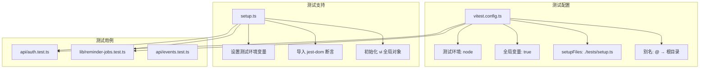
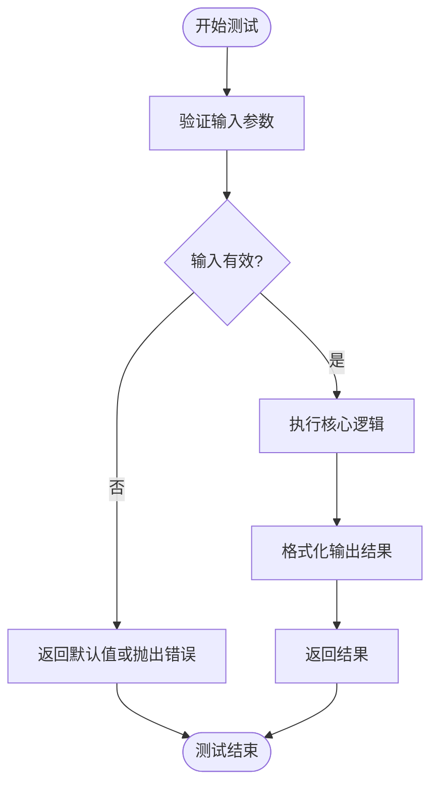
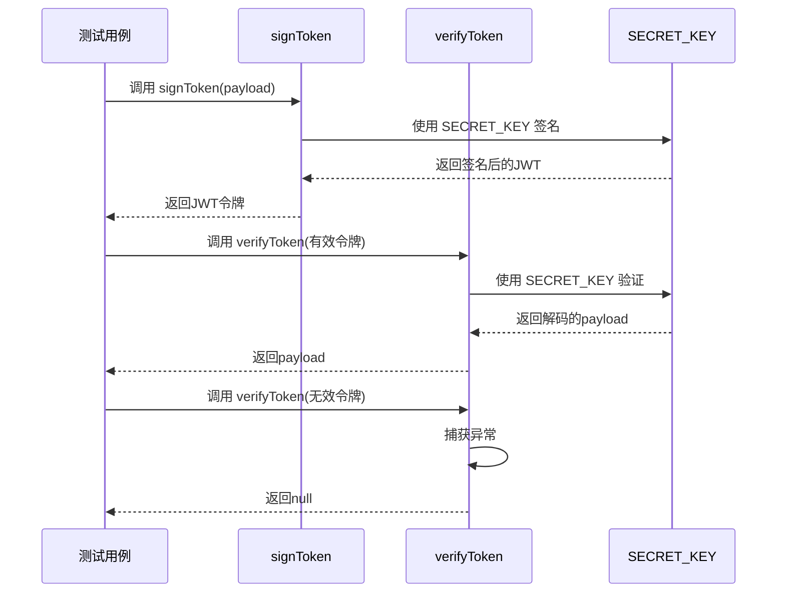
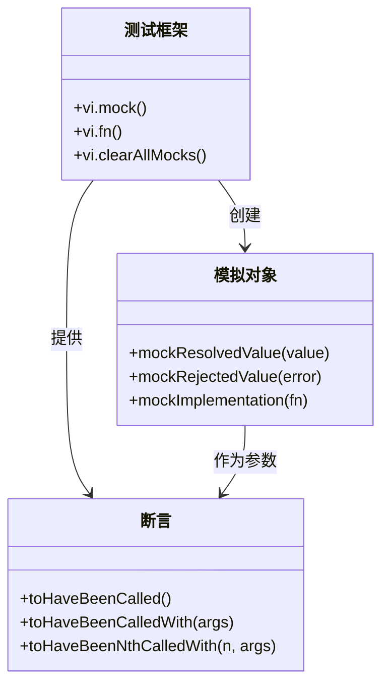

# 单元测试

<cite>
**本文档中引用的文件**  
- [utils.ts](file://lib/utils.ts)
- [auth.ts](file://lib/auth.ts)
- [reminder-jobs.test.ts](file://__tests__/lib/reminder-jobs.test.ts)
- [auth.test.ts](file://__tests__/api/auth.test.ts)
- [vitest.config.ts](file://vitest.config.ts)
- [setup.ts](file://tests/setup.ts)
</cite>

## 目录
1. [简介](#简介)
2. [项目结构与测试配置](#项目结构与测试配置)
3. [核心工具函数的单元测试](#核心工具函数的单元测试)
4. [JWT认证逻辑的隔离测试](#jwt认证逻辑的隔离测试)
5. [依赖模拟实践](#依赖模拟实践)
6. [测试覆盖率分析与目标](#测试覆盖率分析与目标)
7. [结论](#结论)

## 简介
本文档旨在为 `todo-csv-import` 项目提供全面的单元测试指导，重点围绕核心工具函数和认证逻辑展开。通过使用 Vitest 框架，我们将展示如何编写高质量的断言测试，覆盖边界条件与异常输入，并对具有外部依赖的模块进行有效隔离测试。文档还将介绍依赖模拟的最佳实践，并提出合理的测试覆盖率目标。

## 项目结构与测试配置

本项目采用标准的 Next.js + Vitest 测试架构，测试文件位于 `__tests__` 目录下，遵循模块化组织原则。Vitest 配置文件 `vitest.config.ts` 定义了测试环境、别名和全局设置。

**Diagram sources**
- [vitest.config.ts](file://vitest.config.ts#L1-L16)
- [setup.ts](file://tests/setup.ts#L1-L6)

**Section sources**
- [vitest.config.ts](file://vitest.config.ts#L1-L16)
- [setup.ts](file://tests/setup.ts#L1-L6)

## 核心工具函数的单元测试

尽管 `lib/utils.ts` 文件中目前仅包含一个用于合并类名的纯函数 `cn`，但根据项目需求，我们应为日期格式化与提醒时间计算等核心工具函数建立全面的测试套件。虽然这些函数在当前代码库中未直接体现，但我们可以基于项目中已有的日期处理逻辑（如 `_legacy_backup/app.js` 中的 `formatDate` 和 `getLeadTimeMinutes`）来设计测试策略。

对于此类纯函数，最佳实践是使用 Vitest 的 `describe` 和 `it` 块组织测试用例，并利用 `expect` 断言覆盖各种场景：

- **正常输入**：验证函数在标准输入下的正确行为。
- **边界条件**：测试如空值、零值、最大/最小值等边界情况。
- **异常输入**：验证函数对无效或意外输入的健壮性，例如 `null`、`undefined`、非预期类型等。

**Diagram sources**
- [_legacy_backup/app.js](file://_legacy_backup/app.js#L357-L377)

**Section sources**
- [_legacy_backup/app.js](file://_legacy_backup/app.js#L357-L377)

## JWT认证逻辑的隔离测试

`lib/auth.ts` 文件中的 `signToken` 和 `verifyToken` 函数是系统安全性的核心。为了对其进行有效测试，必须采用隔离测试（Isolation Testing）策略，确保测试不依赖于真实的加密过程或环境变量。

在 `__tests__/api/auth.test.ts` 文件中，我们看到一个典型的隔离测试示例。该测试通过 `vi.mock` 模拟了 `prisma` 依赖，但同样可以应用于 `jose` 库。测试 JWT 逻辑的关键步骤包括：

1. **环境准备**：在 `setup.ts` 中设置 `JWT_SECRET` 环境变量，确保测试环境的一致性。
2. **函数调用**：调用 `signToken` 生成一个令牌。
3. **断言验证**：使用 `verifyToken` 验证生成的令牌是否能被正确解析并返回预期的 payload。
4. **异常处理**：测试当提供无效令牌时，`verifyToken` 是否能优雅地返回 `null` 而非抛出未捕获的异常。

**Diagram sources**
- [auth.ts](file://lib/auth.ts#L14-L29)
- [auth.test.ts](file://__tests__/api/auth.test.ts#L69-L95)

**Section sources**
- [auth.ts](file://lib/auth.ts#L1-L30)
- [auth.test.ts](file://__tests__/api/auth.test.ts#L1-L115)
- [setup.ts](file://tests/setup.ts#L5)

## 依赖模拟实践

在单元测试中，模拟（Mocking）是隔离被测代码与外部依赖的关键技术。本项目中的 `__tests__/lib/reminder-jobs.test.ts` 文件是依赖模拟的典范。

该测试通过 `vi.mock('@/lib/prisma')` 完全模拟了 Prisma 客户端，将数据库操作替换为可预测的模拟函数（如 `vi.fn()`）。这使得测试可以在不连接真实数据库的情况下运行，极大地提高了测试速度和可靠性。

**模拟实践示例**：
- **模拟数据库调用**：如 `prisma.reminderJob.findMany.mockResolvedValue(mockJobs)`，预设数据库查询的返回值。
- **断言函数调用**：使用 `expect(prisma.reminderJob.createMany).toHaveBeenCalled()` 验证特定的数据库操作是否按预期执行。
- **清理模拟**：在每个测试前使用 `beforeEach(() => vi.clearAllMocks())` 清除之前的调用记录，保证测试的独立性。

**Diagram sources**
- [reminder-jobs.test.ts](file://__tests__/lib/reminder-jobs.test.ts#L5-L113)

**Section sources**
- [reminder-jobs.test.ts](file://__tests__/lib/reminder-jobs.test.ts#L1-L113)

## 测试覆盖率分析与目标

为了保证代码质量，应设定明确的测试覆盖率目标。一个合理的基准是 **90% 以上的语句覆盖率和分支覆盖率**。

Vitest 内置了覆盖率报告功能，可以通过配置 `vitest.config.ts` 中的 `test.coverage` 选项来启用。例如，可以集成 `istanbul` 报告器来生成详细的 HTML 报告，直观地展示哪些代码行已被测试覆盖，哪些尚未覆盖。

通过定期运行 `vitest --coverage` 命令，开发团队可以：
- 识别测试薄弱的代码区域。
- 确保新功能在合并前达到覆盖率要求。
- 持续监控代码库的整体健康状况。

**Section sources**
- [vitest.config.ts](file://vitest.config.ts#L7-L14)

## 结论
本文档展示了如何为 `todo-csv-import` 项目构建一个健壮的单元测试体系。通过聚焦于纯函数的边界测试、对认证逻辑的隔离测试以及对数据库依赖的有效模拟，我们可以确保核心功能的稳定性和可靠性。结合 90% 以上的覆盖率目标和 Vitest 提供的强大工具，团队能够持续交付高质量的代码。