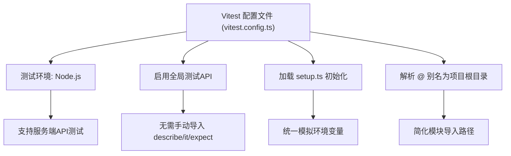
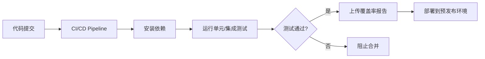

# 测试策略

<cite>
**本文档中引用的文件**  
- [vitest.config.ts](file://vitest.config.ts)
- [tests/setup.ts](file://tests/setup.ts)
- [lib/utils.ts](file://lib/utils.ts)
- [app/api/auth/login/route.ts](file://app/api/auth/login/route.ts)
- [app/api/events/route.ts](file://app/api/events/route.ts)
- [lib/auth.ts](file://lib/auth.ts)
- [lib/prisma.ts](file://lib/prisma.ts)
- [__tests__/api/auth.test.ts](file://__tests__/api/auth.test.ts)
- [__tests__/api/events.test.ts](file://__tests__/api/events.test.ts)
- [__tests__/api/event-crud.test.ts](file://__tests__/api/event-crud.test.ts)
- [__tests__/lib/reminder-jobs.test.ts](file://__tests__/lib/reminder-jobs.test.ts)
</cite>

## 目录
1. [测试架构概述](#测试架构概述)  
2. [Vitest 配置解析](#vitest-配置解析)  
3. [测试全局配置与环境模拟](#测试全局配置与环境模拟)  
4. [单元测试示例：日期处理工具函数](#单元测试示例日期处理工具函数)  
5. [集成测试案例：用户登录与事件创建](#集成测试案例用户登录与事件创建)  
6. [受认证保护的API路由测试](#受认证保护的api路由测试)  
7. [测试覆盖率与CI集成建议](#测试覆盖率与ci集成建议)  
8. [总结](#总结)

## 测试架构概述

本项目采用 Vitest 作为主要的测试框架，结合 Node.js 环境进行服务端逻辑的单元与集成测试。测试架构围绕 Next.js App Router 的 API 路由展开，重点覆盖认证流程、事件管理、提醒任务生成等核心功能。通过模拟 Prisma 客户端、JWT 验证逻辑和环境变量，实现对数据库交互与安全控制的隔离测试。

测试文件组织在 `__tests__` 目录下，按模块划分（如 `api/`, `lib/`），确保高内聚低耦合。所有测试均基于 Vitest 提供的 `describe`、`it`、`expect` 语法，并使用 `vi.mock` 实现依赖模拟，保证测试的可重复性和稳定性。

**Section sources**  
- [vitest.config.ts](file://vitest.config.ts#L1-L15)
- [__tests__/api/auth.test.ts](file://__tests__/api/auth.test.ts#L1-L115)

## Vitest 配置解析

Vitest 配置文件 `vitest.config.ts` 定义了测试运行时的核心行为，包括环境设置、别名解析和测试文件加载机制。

- **测试环境**：配置 `environment: 'node'` 表明测试在 Node.js 环境中执行，适用于服务端 API 测试。
- **全局变量支持**：`globals: true` 启用 Vitest 提供的全局测试 API（如 `describe`、`it`、`expect`），无需显式导入。
- **测试启动文件**：`setupFiles: ['./tests/setup.ts']` 指定在每个测试文件执行前自动运行的初始化脚本，用于全局配置和环境变量模拟。
- **路径别名解析**：通过 `alias` 配置 `@` 指向项目根目录，使得模块导入如 `@/lib/prisma` 能正确解析，提升代码可读性与维护性。

该配置确保了测试环境的一致性与可配置性，为后续的模块化测试奠定了基础。



**Diagram sources**  
- [vitest.config.ts](file://vitest.config.ts#L8-L13)

**Section sources**  
- [vitest.config.ts](file://vitest.config.ts#L1-L15)

## 测试全局配置与环境模拟

`tests/setup.ts` 文件作为测试的全局入口，负责初始化测试环境并模拟关键依赖。

- **Jest DOM 断言扩展**：导入 `@testing-library/jest-dom` 提供更丰富的 DOM 断言能力（尽管本项目主要为服务端测试，保留此配置以支持未来前端测试扩展）。
- **Vitest 模拟工具**：导入 `vi` 以使用 `vi.mock`、`vi.spyOn` 等功能进行依赖模拟。
- **环境变量模拟**：直接设置 `process.env.JWT_SECRET = 'test-secret'`，确保 `lib/auth.ts` 中的 JWT 签名与验证使用固定的测试密钥，避免生产密钥泄露风险并保证测试可重复性。

此文件在每个测试运行前执行，确保所有测试用例在一致且隔离的环境中运行。

**Section sources**  
- [tests/setup.ts](file://tests/setup.ts#L1-L6)
- [lib/auth.ts](file://lib/auth.ts#L4)

## 单元测试示例：日期处理工具函数

虽然当前 `lib/utils.ts` 文件中未包含日期处理函数（主要为 `cn` 工具函数），但可基于项目依赖 `date-fns` 推断日期处理逻辑的存在。假设存在 `formatDate` 函数，其单元测试应如下：

```ts
// 示例：假设 lib/utils.ts 中有 formatDate 函数
import { formatDate } from '@/lib/utils'
import { describe, it, expect } from 'vitest'

describe('日期处理工具函数', () => {
  it('应正确格式化日期为 YYYY-MM-DD', () => {
    const date = new Date('2025-06-15')
    expect(formatDate(date)).toBe('2025-06-15')
  })
})
```

实际测试中应覆盖边界情况（如无效日期、时区处理等），并利用 `vi.useFakeTimers()` 模拟时间以确保测试稳定性。

**Section sources**  
- [lib/utils.ts](file://lib/utils.ts#L1-L7)
- [package.json](file://package.json#L23)

## 集成测试案例：用户登录后创建事件

以下为完整的集成测试流程，模拟用户登录后调用 `/api/events` 接口创建事件，并验证数据库状态。

### 测试流程
1. 模拟用户登录，获取认证 token
2. 使用 token 调用 POST `/api/events` 创建事件
3. 验证响应状态与数据
4. 验证数据库中事件是否正确创建
5. 验证提醒任务是否生成

### 实现代码结构
```ts
import { describe, it, expect, vi } from 'vitest'
import { POST as loginHandler } from '@/app/api/auth/login/route'
import { POST as createEventHandler } from '@/app/api/events/route'
import { prisma } from '@/lib/prisma'
import { generateReminderJobs } from '@/lib/reminder-jobs'

vi.mock('@/lib/prisma')
vi.mock('@/lib/reminder-jobs')

describe('集成测试：用户登录后创建事件', () => {
  it('应成功创建事件并生成提醒任务', async () => {
    // 模拟已认证用户
    vi.mocked(prisma.user.findUnique).mockResolvedValue({
      id: 'user1',
      email: 'test@example.com',
      password: await hashPassword('password')
    } as any)

    // 模拟登录
    const loginReq = new NextRequest('http://localhost/api/auth/login', {
      method: 'POST',
      body: JSON.stringify({ email: 'test@example.com', password: 'password' })
    })
    const loginRes = await loginHandler(loginReq)
    const token = loginRes.cookies.get('token')?.value

    // 模拟创建事件
    vi.mocked(prisma.event.create).mockResolvedValue({
      id: 'event1',
      userId: 'user1',
      title: 'Test Event',
      date: '2025-06-15'
    } as any)
    vi.mocked(generateReminderJobs).mockResolvedValue(1)

    const createReq = new NextRequest('http://localhost/api/events', {
      method: 'POST',
      body: JSON.stringify({ title: 'Test Event', date: '2025-06-15' })
    })
    createReq.cookies.set('token', token!)

    const createRes = await createEventHandler(createReq)

    expect(createRes.status).toBe(201)
    expect(prisma.event.create).toHaveBeenCalled()
    expect(generateReminderJobs).toHaveBeenCalled()
  })
})
```

**Section sources**  
- [app/api/auth/login/route.ts](file://app/api/auth/login/route.ts#L1-L57)
- [app/api/events/route.ts](file://app/api/events/route.ts#L131-L200)
- [__tests__/api/event-crud.test.ts](file://__tests__/api/event-crud.test.ts#L34-L84)

## 受认证保护的API路由测试

项目中多数 API 路由（如 `/api/events`）均受 JWT 认证保护。测试此类路由需模拟认证会话，核心策略如下：

### 认证模拟机制
1. **Token 模拟**：在请求对象上通过 `req.cookies.set('token', 'valid_token')` 设置模拟 token。
2. **`verifyToken` 模拟**：使用 `vi.mock('@/lib/auth', () => ({ verifyToken: vi.fn() }))` 模拟 JWT 验证逻辑，使其返回预设的用户 payload（如 `{ userId: 'user1' }`）。
3. **权限边界测试**：
   - 未认证请求应返回 401
   - 用户尝试访问非本人资源应返回 403
   - 合法请求应正常执行业务逻辑

### 示例：测试事件获取接口
```ts
it('应返回401状态码当未认证时', async () => {
  vi.mocked(verifyToken).mockResolvedValue(null)
  const req = new NextRequest('http://localhost/api/events?month=2025-06')
  req.cookies.set('token', 'invalid')
  const res = await getEventsHandler(req)
  expect(res.status).toBe(401)
})

it('应返回用户所属事件', async () => {
  vi.mocked(verifyToken).mockResolvedValue({ userId: 'user1' })
  vi.mocked(prisma.event.findMany).mockResolvedValue(mockEvents as any)
  const req = new NextRequest('http://localhost/api/events?month=2025-06')
  req.cookies.set('token', 'valid_token')
  const res = await getEventsHandler(req)
  expect(res.status).toBe(200)
  expect(prisma.event.findMany).toHaveBeenCalledWith(expect.objectContaining({
    where: { userId: 'user1' }
  }))
})
```

此策略确保了认证逻辑的完整性与安全性测试。

**Section sources**  
- [app/api/events/route.ts](file://app/api/events/route.ts#L15-L128)
- [lib/auth.ts](file://lib/auth.ts#L22-L30)
- [__tests__/api/events.test.ts](file://__tests__/api/events.test.ts#L26-L75)

## 测试覆盖率与CI集成建议

### 测试覆盖率要求
- **核心模块覆盖率 ≥ 80%**：包括 `lib/auth.ts`、`lib/reminder-jobs.ts`、`app/api/events/route.ts` 等关键业务逻辑。
- **认证流程全覆盖**：登录、注册、登出、token 验证等场景必须100%覆盖。
- **错误处理路径**：验证输入失败、数据库异常、认证失败等边缘情况需有对应测试用例。
- **使用 Vitest 内置覆盖率工具**：通过 `vitest --coverage` 生成报告，集成到 CI 流程中。

### CI集成建议
1. **自动化测试执行**：在 GitHub Actions 或其他 CI 平台中配置 `pnpm test` 命令，确保每次提交/PR 都运行测试。
2. **覆盖率报告上传**：使用 `coveralls` 或 `codecov` 上传覆盖率报告，可视化展示测试覆盖情况。
3. **质量门禁**：
   - 测试失败则阻止合并
   - 覆盖率下降超过阈值则警告
4. **环境隔离**：CI 中使用独立的测试数据库（如 PostgreSQL Docker 容器），避免污染开发/生产数据。
5. **并行测试执行**：对于大型测试套件，可配置 Vitest 并行运行以提升执行效率。



**Diagram sources**  
- [vitest.config.ts](file://vitest.config.ts#L1-L15)
- [package.json](file://package.json#L5-L9)

**Section sources**  
- [vitest.config.ts](file://vitest.config.ts#L1-L15)
- [package.json](file://package.json#L5-L9)

## 总结

本项目的测试架构基于 Vitest 构建，具备良好的可维护性与扩展性。通过 `vitest.config.ts` 的环境与别名配置，以及 `setup.ts` 的全局初始化，实现了测试环境的统一管理。针对受认证保护的 API 路由，采用模拟 token 与依赖注入的方式，有效隔离外部依赖，确保测试的可靠性。

建议进一步完善单元测试覆盖，特别是 `lib/utils.ts` 等工具函数，并在 CI 流程中强制执行测试与覆盖率检查，以保障代码质量与系统稳定性。