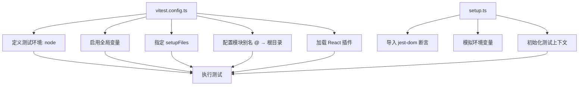
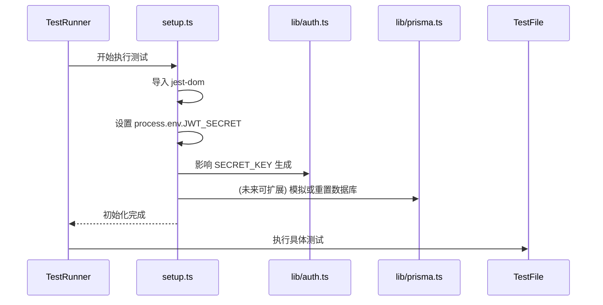

# 测试配置

<cite>
**本文档中引用的文件**  
- [vitest.config.ts](file://vitest.config.ts)
- [tests/setup.ts](file://tests/setup.ts)
- [lib/auth.ts](file://lib/auth.ts)
- [lib/prisma.ts](file://lib/prisma.ts)
- [prisma/schema.prisma](file://prisma/schema.prisma)
- [package.json](file://package.json)
- [tsconfig.json](file://tsconfig.json)
</cite>

## 目录
1. [简介](#简介)
2. [项目结构与测试布局](#项目结构与测试布局)
3. [核心测试配置机制](#核心测试配置机制)
4. [模块别名与路径解析](#模块别名与路径解析)
5. [环境变量注入与全局配置](#环境变量注入与全局配置)
6. [测试环境与全局设置](#测试环境与全局设置)
7. [setup.ts 中的测试上下文初始化](#setup.ts-中的测试上下文初始化)
8. [测试文件匹配与执行规则](#测试文件匹配与执行规则)
9. [扩展测试配置：E2E 与快照测试](#扩展测试配置e2e-与快照测试)
10. [常见配置错误及修复方法](#常见配置错误及修复方法)
11. [结论](#结论)

## 简介
本文档详细说明 `todo-csv-import` 项目的测试配置机制，重点解析 `vitest.config.ts` 中的模块别名、环境变量注入、测试环境全局配置及测试文件匹配规则。同时，深入探讨 `setup.ts` 文件如何通过全局配置初始化测试上下文，包括模拟 Prisma 客户端、设置 JWT 认证环境和重置数据库状态。文档提供配置代码片段示例，并解释每个配置项的作用，指导如何扩展测试配置以支持端到端（E2E）测试或快照测试，并指出常见配置错误及其修复方法。

## 项目结构与测试布局
本项目采用基于 Next.js 的现代前端架构，测试相关文件集中存放在根目录下的 `tests/` 文件夹中。主要测试配置文件包括：
- `vitest.config.ts`：Vitest 测试框架的核心配置文件
- `tests/setup.ts`：测试运行前的全局初始化脚本

测试用例分布在 `__tests__` 目录下，覆盖 API 路由、批量创建等功能模块。项目使用 Vitest 作为测试运行器，结合 `@testing-library` 系列工具进行 DOM 和行为测试。

**Section sources**
- [vitest.config.ts](file://vitest.config.ts#L1-L15)
- [tests/setup.ts](file://tests/setup.ts#L1-L5)

## 核心测试配置机制
项目的测试配置基于 Vitest 框架构建，通过 `vitest.config.ts` 文件定义测试环境的行为。该配置文件利用 Vite 的插件系统集成 React 支持，并为测试环境提供必要的别名、全局变量和初始化逻辑。



**Diagram sources**
- [vitest.config.ts](file://vitest.config.ts#L1-L15)
- [tests/setup.ts](file://tests/setup.ts#L1-L5)

## 模块别名与路径解析
`vitest.config.ts` 中通过 `alias` 配置项定义了模块别名 `@`，将其映射到项目根目录：

```ts
alias: {
    '@': resolve(__dirname, './')
}
```

此配置允许在测试和源码中使用绝对路径导入，例如 `import '@/lib/auth'`，避免了相对路径 `../../../lib/auth` 的冗长和易错问题。

该别名配置与 `tsconfig.json` 中的 `paths` 设置保持一致：

```json
"paths": {
  "@/*": ["./*"]
}
```

确保 TypeScript 编译器和 Vitest 测试运行器对模块解析行为一致，防止出现“模块未找到”错误。

**Section sources**
- [vitest.config.ts](file://vitest.config.ts#L11-L13)
- [tsconfig.json](file://tsconfig.json#L21-L23)

## 环境变量注入与全局配置
测试环境需要模拟生产环境中的关键配置，如 JWT 密钥、数据库连接等。`setup.ts` 文件通过直接修改 `process.env` 对象来注入测试专用的环境变量：

```ts
process.env.JWT_SECRET = 'test-secret'
```

此配置确保 `lib/auth.ts` 中的 `signToken` 和 `verifyToken` 函数在测试环境中使用可预测的密钥，避免依赖外部 `.env` 文件。

此外，`vitest.config.ts` 中的 `globals: true` 配置项自动将 Vitest 的全局 API（如 `describe`、`it`、`expect`、`vi`）注入到测试上下文中，无需在每个测试文件中显式导入。

**Section sources**
- [vitest.config.ts](file://vitest.config.ts#L8-L10)
- [tests/setup.ts](file://tests/setup.ts#L4-L5)
- [lib/auth.ts](file://lib/auth.ts#L4)

## 测试环境与全局设置
`vitest.config.ts` 明确指定测试环境为 `node`：

```ts
environment: 'node'
```

这表示所有测试将在 Node.js 环境中运行，适用于 API 路由、服务逻辑等后端功能的测试。对于需要 DOM 操作的组件测试，可结合 `jsdom` 或 `happy-dom` 模拟浏览器环境。

`setupFiles` 配置项指定在每个测试文件执行前自动运行 `./tests/setup.ts`，确保所有测试共享相同的初始化状态：

```ts
setupFiles: ['./tests/setup.ts']
```

这种机制保证了环境变量、模拟对象和全局配置的一致性，避免测试间的状态污染。

**Section sources**
- [vitest.config.ts](file://vitest.config.ts#L8-L10)
- [tests/setup.ts](file://tests/setup.ts#L1-L5)

## setup.ts 中的测试上下文初始化
`setup.ts` 是测试初始化的核心文件，负责构建一致的测试上下文。其主要职责包括：

1. **导入测试工具**：引入 `@testing-library/jest-dom` 以扩展 Jest 的 DOM 断言能力。
2. **模拟环境变量**：设置 `JWT_SECRET` 等关键环境变量，确保认证逻辑在测试中可预测。
3. **准备模拟对象**：虽然当前文件未直接模拟 Prisma，但可通过 `vi.spyOn` 或模块替换在后续测试中实现。

未来可在此文件中扩展数据库重置逻辑，例如在每个测试前后调用 Prisma 的 `deleteMany` 清空相关表，确保测试的独立性和可重复性。



**Diagram sources**
- [tests/setup.ts](file://tests/setup.ts#L1-L5)
- [lib/auth.ts](file://lib/auth.ts#L4)
- [lib/prisma.ts](file://lib/prisma.ts#L9)

## 测试文件匹配与执行规则
Vitest 默认会查找项目中所有匹配 `**/*.{test,spec}.{js,ts,jsx,tsx}` 模式的文件并执行。本项目将测试文件组织在 `__tests__` 目录下，遵循功能模块划分（如 `api/auth.test.ts`）。

`vitest.config.ts` 中的配置确保这些测试文件能够正确解析模块别名、访问全局变量并使用 React 插件处理 JSX 语法。测试文件通过动态导入（`await import('@/app/api/auth/login/route')`）来加载 Next.js 路由处理程序，实现对 API 端点的单元测试。

**Section sources**
- [vitest.config.ts](file://vitest.config.ts#L6-L7)
- [__tests__/api/auth.test.ts](file://__tests__/api/auth.test.ts#L78)

## 扩展测试配置：E2E 与快照测试
为支持更全面的测试需求，可对现有配置进行扩展：

### 端到端（E2E）测试
1. **添加 Playwright 或 Cypress**：在 `package.json` 中安装 E2E 测试框架。
2. **配置独立环境**：在 `vitest.config.ts` 中为 E2E 测试创建不同的配置，或使用独立的配置文件。
3. **启动开发服务器**：在运行 E2E 测试前启动 Next.js 开发服务器。

### 快照测试
1. **启用快照序列化**：Vitest 默认支持快照测试，可直接使用 `expect(component).toMatchSnapshot()`。
2. **配置快照路径**：通过 `snapshotFormat` 或 `resolveSnapshotPath` 自定义快照文件存储位置。
3. **集成组件测试**：结合 `@testing-library/react` 对 React 组件进行渲染和快照比对。

```mermaid
flowchart LR
A[测试类型] --> B[单元测试]
A --> C[E2E测试]
A --> D[快照测试]
B --> E[vitest.config.ts + setup.ts]
C --> F[Playwright/Cypress + 启动服务器]
D --> G[@testing-library/react + toMatchSnapshot]
```

**Diagram sources**
- [vitest.config.ts](file://vitest.config.ts#L1-L15)
- [__tests__/api/auth.test.ts](file://__tests__/api/auth.test.ts#L0)

## 常见配置错误及修复方法
### 1. 模块解析失败
**现象**：`Cannot find module '@/lib/auth'`  
**原因**：`vitest.config.ts` 中的 `alias` 未正确配置或与 `tsconfig.json` 不一致  
**修复**：确保 `vitest.config.ts` 和 `tsconfig.json` 中的路径映射完全匹配

### 2. 环境变量未加载
**现象**：`process.env.JWT_SECRET` 为 `undefined`，导致认证失败  
**原因**：`setup.ts` 未正确执行或环境变量设置顺序错误  
**修复**：确认 `vitest.config.ts` 中 `setupFiles` 正确指向 `setup.ts`，并在文件顶部设置环境变量

### 3. Prisma 客户端连接失败
**现象**：数据库操作抛出连接错误  
**原因**：`DATABASE_URL` 环境变量未设置  
**修复**：在 `setup.ts` 中添加 `process.env.DATABASE_URL = 'postgresql://...'` 指向测试数据库

### 4. 全局变量未定义
**现象**：`describe is not defined`  
**原因**：`vitest.config.ts` 中 `globals: false` 或 `setupFiles` 未正确加载  
**修复**：确保 `test.globals` 设置为 `true`

**Section sources**
- [vitest.config.ts](file://vitest.config.ts#L9-L10)
- [tests/setup.ts](file://tests/setup.ts#L4-L5)
- [lib/prisma.ts](file://lib/prisma.ts#L9)

## 结论
本项目的测试配置通过 `vitest.config.ts` 和 `setup.ts` 协同工作，建立了稳定可靠的测试环境。模块别名简化了导入路径，环境变量注入确保了认证逻辑的可测试性，全局配置和初始化脚本保证了测试的一致性。通过理解这些配置机制，开发者可以有效编写和维护测试用例，并根据需要扩展支持 E2E 和快照测试。遵循最佳实践并及时修复常见配置错误，将有助于提升代码质量和开发效率。