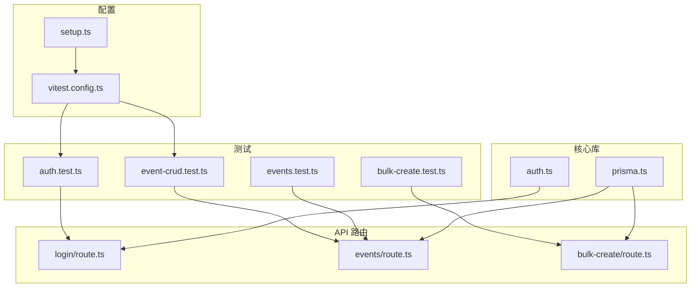
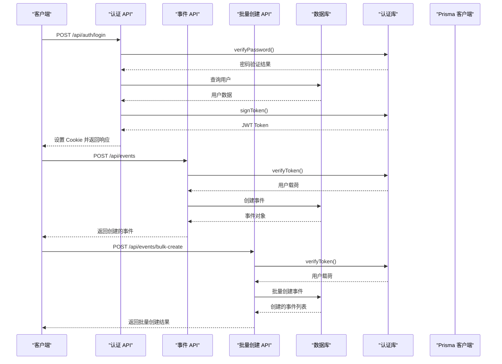
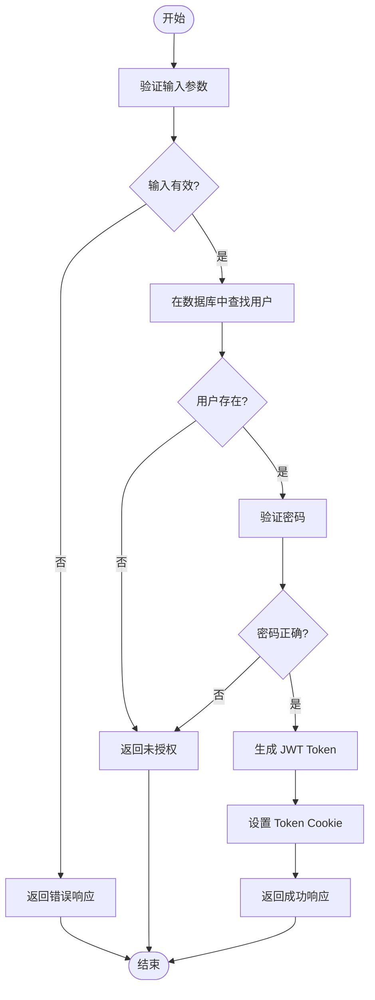
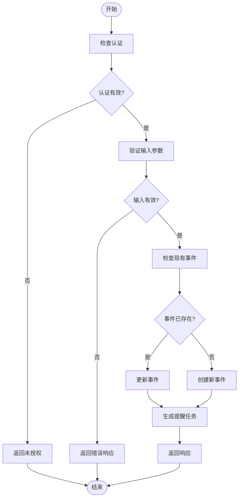
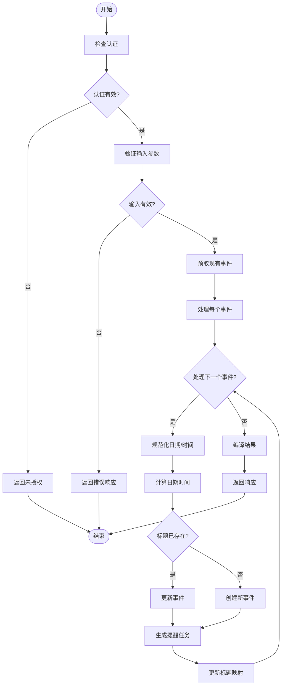
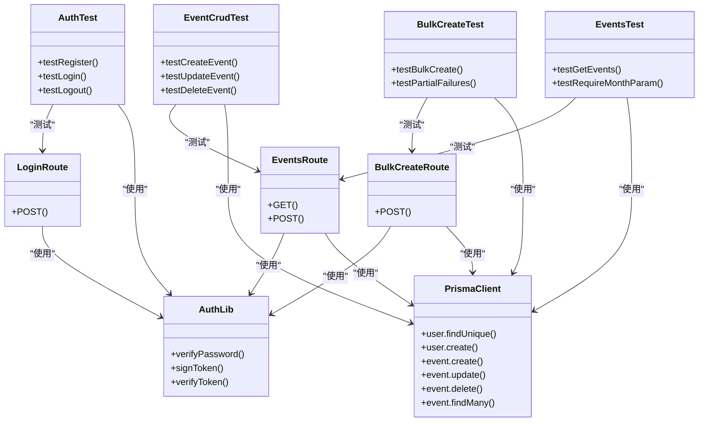

# 集成测试

<cite>
**本文档中引用的文件**   
- [auth.test.ts](file://__tests__/api/auth.test.ts)
- [event-crud.test.ts](file://__tests__/api/event-crud.test.ts)
- [bulk-create.test.ts](file://__tests__/api/bulk-create.test.ts)
- [events.test.ts](file://__tests__/api/events.test.ts)
- [login/route.ts](file://app/api/auth/login/route.ts)
- [events/route.ts](file://app/api/events/route.ts)
- [bulk-create/route.ts](file://app/api/events/bulk-create/route.ts)
- [prisma.ts](file://lib/prisma.ts)
- [auth.ts](file://lib/auth.ts)
- [schema.prisma](file://prisma/schema.prisma)
- [vitest.config.ts](file://vitest.config.ts)
- [setup.ts](file://tests/setup.ts)
</cite>

## 目录
1. [简介](#简介)
2. [项目结构与测试配置](#项目结构与测试配置)
3. [核心组件](#核心组件)
4. [架构概述](#架构概述)
5. [详细组件分析](#详细组件分析)
6. [依赖分析](#依赖分析)
7. [性能考虑](#性能考虑)
8. [故障排除指南](#故障排除指南)
9. [结论](#结论)

## 简介
本文档旨在设计并实现关键路径的集成测试，以用户登录后创建事件的流程为例，演示如何通过 `supertest` 或原生 `fetch` 模拟 HTTP 请求，验证 `/api/events` POST 接口在认证上下文下的行为。说明如何在测试中模拟 authenticated session，确保中间件正确放行。展示如何在测试前后通过 Prisma 客户端清理数据库状态，保证测试独立性。涵盖对批量导入接口 (`/api/events/bulk-create`) 的测试策略，验证 CSV 解析后多条事件的正确写入。提供错误处理测试案例，如无效 token 访问受保护路由。

## 项目结构与测试配置

**图表来源**
- [auth.test.ts](file://__tests__/api/auth.test.ts)
- [event-crud.test.ts](file://__tests__/api/event-crud.test.ts)
- [bulk-create.test.ts](file://__tests__/api/bulk-create.test.ts)
- [events.test.ts](file://__tests__/api/events.test.ts)
- [login/route.ts](file://app/api/auth/login/route.ts)
- [events/route.ts](file://app/api/events/route.ts)
- [bulk-create/route.ts](file://app/api/events/bulk-create/route.ts)
- [prisma.ts](file://lib/prisma.ts)
- [auth.ts](file://lib/auth.ts)
- [vitest.config.ts](file://vitest.config.ts)
- [setup.ts](file://tests/setup.ts)

**章节来源**
- [vitest.config.ts](file://vitest.config.ts#L1-L16)
- [setup.ts](file://tests/setup.ts#L1-L6)

## 核心组件

本文档分析的核心组件包括用户认证、事件创建、批量事件创建和数据库交互。这些组件通过 API 路由暴露，并由测试文件验证其行为。

**章节来源**
- [auth.test.ts](file://__tests__/api/auth.test.ts#L1-L115)
- [event-crud.test.ts](file://__tests__/api/event-crud.test.ts#L1-L167)
- [bulk-create.test.ts](file://__tests__/api/bulk-create.test.ts#L1-L105)
- [events.test.ts](file://__tests__/api/events.test.ts#L1-L76)

## 架构概述

**图表来源**
- [login/route.ts](file://app/api/auth/login/route.ts#L1-L57)
- [events/route.ts](file://app/api/events/route.ts#L1-L200)
- [bulk-create/route.ts](file://app/api/events/bulk-create/route.ts#L1-L133)
- [auth.ts](file://lib/auth.ts#L1-L30)
- [prisma.ts](file://lib/prisma.ts#L1-L20)

## 详细组件分析

### 认证流程分析

**图表来源**
- [login/route.ts](file://app/api/auth/login/route.ts#L1-L57)
- [auth.ts](file://lib/auth.ts#L1-L30)

**章节来源**
- [login/route.ts](file://app/api/auth/login/route.ts#L1-L57)
- [auth.ts](file://lib/auth.ts#L1-L30)

### 事件创建流程分析

**图表来源**
- [events/route.ts](file://app/api/events/route.ts#L1-L200)
- [reminder-jobs.ts](file://lib/reminder-jobs.ts)

**章节来源**
- [events/route.ts](file://app/api/events/route.ts#L1-L200)

### 批量创建流程分析

**图表来源**
- [bulk-create/route.ts](file://app/api/events/bulk-create/route.ts#L1-L133)
- [reminder-jobs.ts](file://lib/reminder-jobs.ts)

**章节来源**
- [bulk-create/route.ts](file://app/api/events/bulk-create/route.ts#L1-L133)

## 依赖分析

**图表来源**
- [auth.test.ts](file://__tests__/api/auth.test.ts)
- [event-crud.test.ts](file://__tests__/api/event-crud.test.ts)
- [bulk-create.test.ts](file://__tests__/api/bulk-create.test.ts)
- [events.test.ts](file://__tests__/api/events.test.ts)
- [login/route.ts](file://app/api/auth/login/route.ts)
- [events/route.ts](file://app/api/events/route.ts)
- [bulk-create/route.ts](file://app/api/events/bulk-create/route.ts)
- [auth.ts](file://lib/auth.ts)
- [prisma.ts](file://lib/prisma.ts)

**章节来源**
- [package.json](file://package.json#L1-L62)
- [vitest.config.ts](file://vitest.config.ts#L1-L16)

## 性能考虑
测试套件使用 Vitest 作为测试框架，它提供了快速的测试执行速度和良好的 TypeScript 支持。通过在测试中使用模拟（mocking），避免了对实际数据库的依赖，从而提高了测试速度和可靠性。Prisma 客户端的使用确保了类型安全的数据库交互。

## 故障排除指南

当集成测试失败时，应检查以下方面：
1. 确保测试环境变量已正确设置，特别是 JWT_SECRET。
2. 验证 Prisma 客户端是否正确初始化。
3. 检查认证流程中的 token 生成和验证逻辑。
4. 确认数据库状态在测试前后被正确清理。
5. 查看错误日志以获取具体的失败原因。

**章节来源**
- [setup.ts](file://tests/setup.ts#L1-L6)
- [auth.test.ts](file://__tests__/api/auth.test.ts#L1-L115)
- [event-crud.test.ts](file://__tests__/api/event-crud.test.ts#L1-L167)

## 结论
本文档详细介绍了如何设计和实现关键路径的集成测试。通过使用 Vitest 和 Prisma，我们能够有效地测试用户认证、事件创建和批量创建等核心功能。测试策略涵盖了正常流程、错误处理和边界情况，确保了系统的稳定性和可靠性。