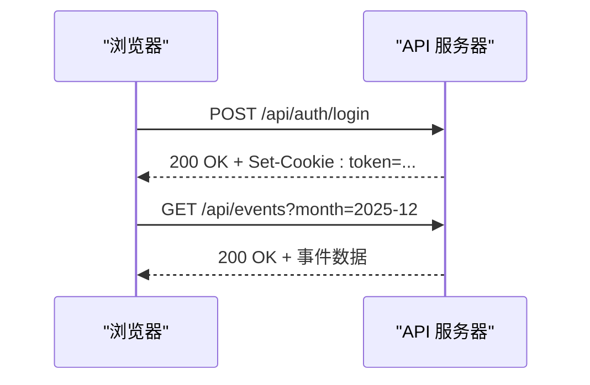
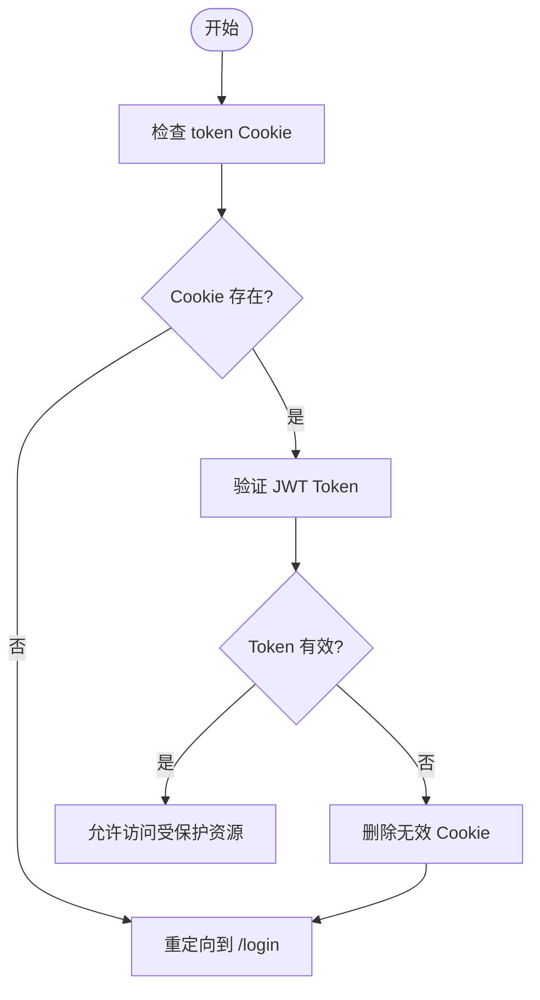
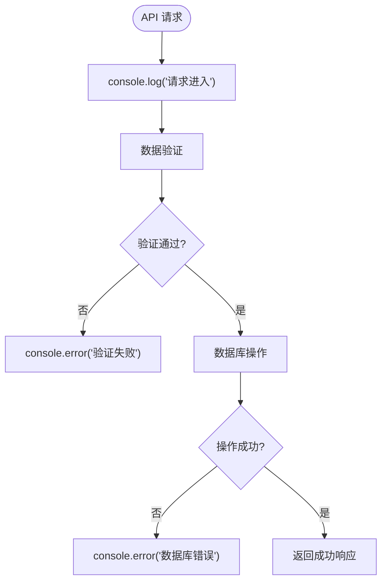
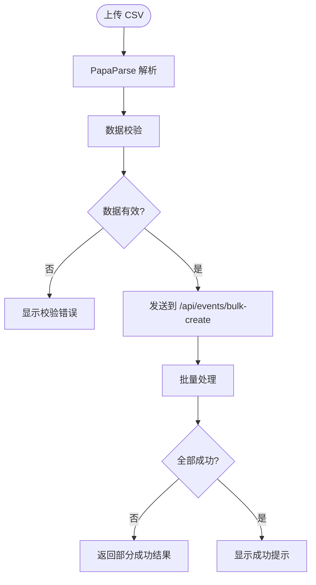
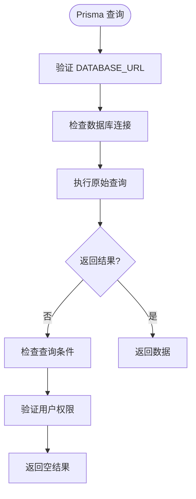

# 调试指南

<cite>
**本文档中引用的文件**  
- [middleware.ts](file://middleware.ts)
- [lib/auth.ts](file://lib/auth.ts)
- [app/api/auth/login/route.ts](file://app/api/auth/login/route.ts)
- [app/api/events/route.ts](file://app/api/events/route.ts)
- [app/api/events/bulk-create/route.ts](file://app/api/events/bulk-create/route.ts)
- [app/import/page.tsx](file://app/import/page.tsx)
- [components/EventDialog.tsx](file://components/EventDialog.tsx)
- [hooks/use-toast.ts](file://hooks/use-toast.ts)
- [lib/prisma.ts](file://lib/prisma.ts)
- [lib/reminder-jobs.ts](file://lib/reminder-jobs.ts)
- [app/api/scheduler/run/route.ts](file://app/api/scheduler/run/route.ts)
- [public/sw.js](file://public/sw.js)
- [package.json](file://package.json)
- [.env.example](file://.env.example)
</cite>

## 目录
1. [简介](#简介)
2. [前端调试技巧](#前端调试技巧)
3. [后端调试技巧](#后端调试技巧)
4. [Next.js App Router 特有调试](#nextjs-app-router-特有调试)
5. [典型场景调试](#典型场景调试)
6. [配置类问题排查](#配置类问题排查)
7. [总结](#总结)

## 简介
本调试指南旨在帮助开发者快速定位和解决 SimpleCalendar Reminder 应用中的常见问题。该应用是一个全栈日历提醒系统，支持用户认证、事件管理、CSV 批量导入、Web Push 通知和定时任务调度等功能。通过本指南，您将学习如何使用浏览器开发者工具监控网络请求、检查 JWT Cookie 状态、调试 React 组件状态变化，以及如何通过 console.log 和错误边界定位服务端路由错误。

**Section sources**
- [README.md](file://README.md#L1-L152)

## 前端调试技巧

### 使用浏览器开发者工具监控网络请求
在开发过程中，使用浏览器开发者工具的 Network 面板可以实时监控所有 API 请求和响应。重点关注以下几点：
- 检查请求的 URL、方法（GET、POST 等）、请求头和请求体
- 查看响应状态码和响应体内容
- 特别关注认证相关的请求，如登录、登出和受保护的 API 调用

例如，在登录过程中，可以通过 Network 面板验证 `/api/auth/login` 请求是否正确发送了用户名和密码，并检查响应中是否成功设置了 JWT Cookie。

**Diagram sources**
- [app/api/auth/login/route.ts](file://app/api/auth/login/route.ts#L11-L57)
- [app/api/events/route.ts](file://app/api/events/route.ts#L15-L129)

### 检查 JWT Cookie 状态
JWT Token 通过 HTTP-only Cookie 安全存储。在浏览器开发者工具的 Application 面板中，可以查看 Cookies 的状态：
- 确认 `token` Cookie 是否存在
- 检查 Cookie 的 Secure、HttpOnly 和 SameSite 属性是否正确设置
- 验证 Cookie 的过期时间

如果 Cookie 不存在或无效，用户将无法访问受保护的路由，系统会重定向到登录页面。

**Diagram sources**
- [middleware.ts](file://middleware.ts#L5-L50)
- [lib/auth.ts](file://lib/auth.ts#L22-L30)

### 调试 React 组件状态变化
对于 React 组件的状态调试，可以使用以下方法：
- 在组件中使用 `console.log` 输出关键状态变量
- 利用 React Developer Tools 浏览组件树和状态
- 监听表单提交和状态更新事件

以 `EventDialog` 组件为例，该组件使用 react-hook-form 管理表单状态。可以通过检查 `formState.errors` 来调试表单验证逻辑。

**Section sources**
- [components/EventDialog.tsx](file://components/EventDialog.tsx#L1-L227)
- [hooks/use-toast.ts](file://hooks/use-toast.ts#L1-L192)

## 后端调试技巧

### 使用 console.log 定位服务端路由错误
在 Next.js API 路由中，合理使用 `console.log` 可以帮助快速定位问题。建议在以下位置添加日志：
- 请求进入时记录请求方法和路径
- 数据验证失败时输出错误详情
- 数据库操作前后记录关键信息
- 异常捕获时输出完整错误堆栈

例如，在事件创建 API 中，当 Prisma 查询失败时，`console.error` 会输出详细的错误信息，帮助开发者快速定位数据库相关问题。

**Diagram sources**
- [app/api/events/route.ts](file://app/api/events/route.ts#L131-L200)
- [app/api/events/bulk-create/route.ts](file://app/api/events/bulk-create/route.ts#L19-L133)

### 使用错误边界捕获异常
虽然 Next.js App Router 主要使用服务端组件，但在客户端组件中仍可使用错误边界来捕获渲染异常。通过 `useEffect` 和状态管理，可以实现类似错误边界的机制，捕获并处理异步操作中的错误。

**Section sources**
- [app/import/page.tsx](file://app/import/page.tsx#L76-L106)
- [components/EventDialog.tsx](file://components/EventDialog.tsx#L86-L133)

## Next.js App Router 特有调试

### 区分服务端与客户端日志输出
在 Next.js App Router 中，服务端和客户端的日志输出需要特别注意：
- 服务端日志（如 API 路由）会输出到终端控制台
- 客户端日志（如 'use client' 组件）会输出到浏览器开发者工具的 Console 面板

这种区分有助于快速判断问题发生的位置。例如，`middleware.ts` 中的 `console.log` 会在服务端执行并输出到终端，而 `EventDialog.tsx` 中的 `console.log` 会在客户端执行并输出到浏览器。

**Section sources**
- [middleware.ts](file://middleware.ts#L5-L50)
- [components/EventDialog.tsx](file://components/EventDialog.tsx#L86-L133)

## 典型场景调试

### 事件创建失败
当事件创建失败时，按照以下步骤进行排查：
1. 检查前端表单验证是否通过
2. 查看网络请求是否成功发送
3. 验证 JWT Token 是否有效
4. 检查 Prisma 数据库连接和写入权限
5. 查看服务端日志中的具体错误信息

常见错误包括：输入数据格式不正确、Token 过期或无效、数据库连接失败等。

**Section sources**
- [app/api/events/route.ts](file://app/api/events/route.ts#L131-L200)
- [components/EventDialog.tsx](file://components/EventDialog.tsx#L86-L133)

### CSV 导入解析异常
CSV 导入功能涉及前端解析和后端批量创建，可能出现的异常包括：
- CSV 文件格式不正确
- 日期格式解析失败
- 批量创建时部分记录失败
- 数据库约束冲突

调试时应重点关注：
- 前端 PapaParse 解析结果
- 导入预览中的校验状态
- 后端批量创建 API 的错误返回
- 数据库事务的原子性保证

**Diagram sources**
- [app/import/page.tsx](file://app/import/page.tsx#L35-L73)
- [app/api/events/bulk-create/route.ts](file://app/api/events/bulk-create/route.ts#L19-L133)

## 配置类问题排查

### 环境变量加载失败
环境变量通过 `.env` 文件加载，常见问题包括：
- `.env` 文件未正确复制（应从 `.env.example` 复制）
- 环境变量名称拼写错误
- JWT_SECRET 等关键变量未设置

解决方案：
1. 确保 `.env` 文件存在且包含所有必需变量
2. 检查 `package.json` 中的启动脚本是否正确
3. 验证 `lib/auth.ts` 中的 `process.env.JWT_SECRET` 是否可访问

**Section sources**
- [.env.example](file://.env.example)
- [lib/auth.ts](file://lib/auth.ts#L4)
- [package.json](file://package.json#L6-L9)

### Prisma 查询为空
Prisma 查询返回空结果的可能原因：
- 数据库连接字符串配置错误
- 数据库中确实没有匹配的数据
- 查询条件有误
- 用户认证信息不匹配

排查步骤：
1. 验证 `DATABASE_URL` 环境变量
2. 使用 Prisma Studio 或数据库客户端直接查询数据
3. 检查查询条件中的用户 ID 是否正确
4. 确认中间件正确传递了用户身份信息

**Diagram sources**
- [lib/prisma.ts](file://lib/prisma.ts#L1-L20)
- [app/api/events/route.ts](file://app/api/events/route.ts#L27-L72)

## 总结
本指南涵盖了 SimpleCalendar Reminder 应用的全面调试方法，从前端到后端，从通用技巧到特定场景。通过合理使用开发者工具、日志输出和错误处理机制，可以快速定位和解决各类问题。记住，良好的调试习惯包括：详细记录日志、逐步排查问题、验证假设和及时修复。