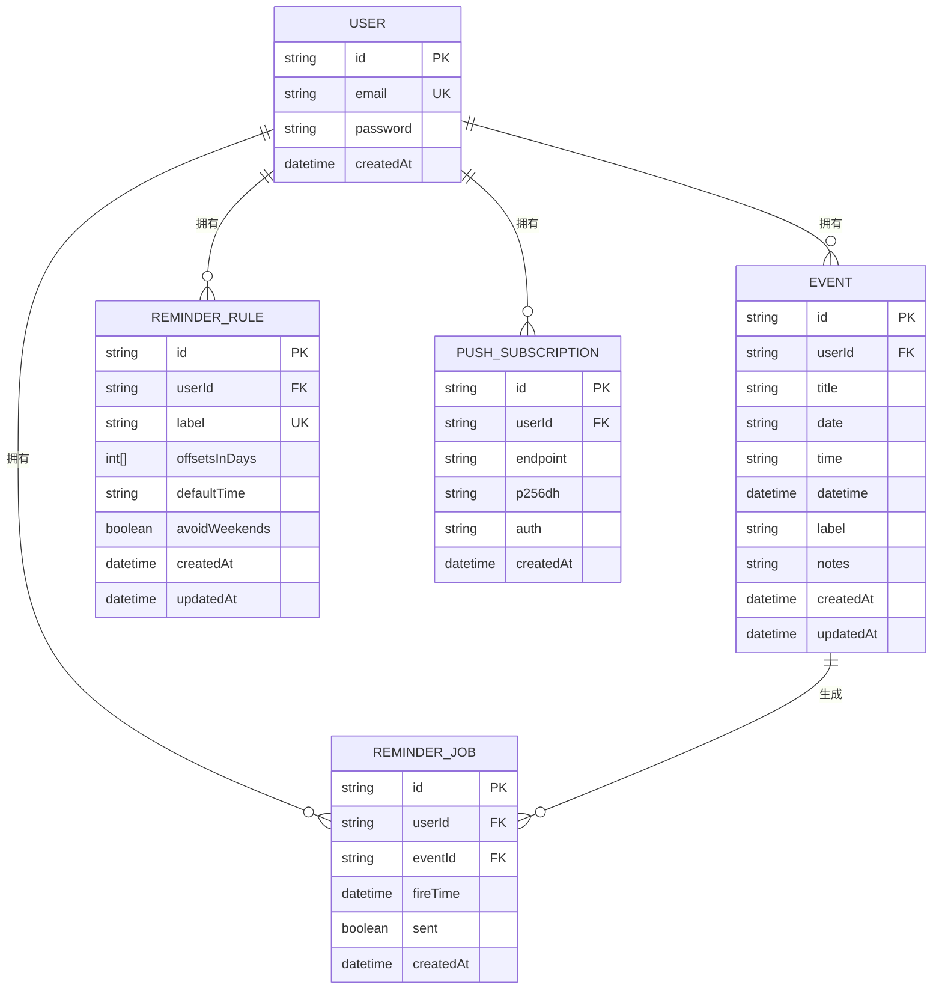
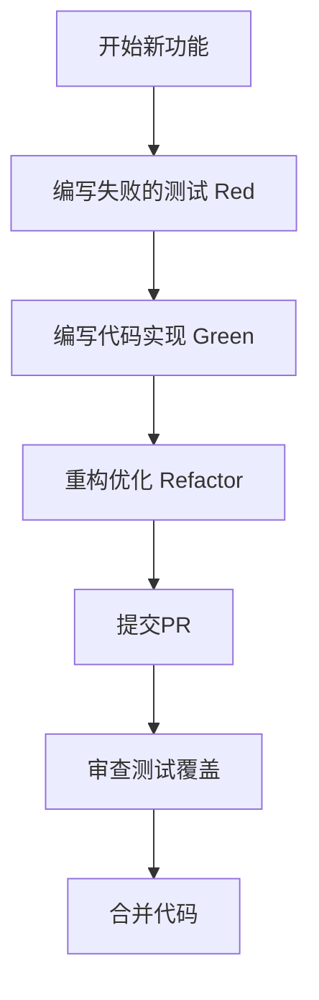

# 贡献规范

<cite>
**本文档引用文件**  
- [.cursorrules](file://.cursorrules)
- [eslint.config.mjs](file://eslint.config.mjs)
- [tsconfig.json](file://tsconfig.json)
- [package.json](file://package.json)
- [prisma/schema.prisma](file://prisma/schema.prisma)
- [vitest.config.ts](file://vitest.config.ts)
- [lib/prisma.ts](file://lib/prisma.ts)
- [lib/auth.ts](file://lib/auth.ts)
- [lib/reminder-jobs.ts](file://lib/reminder-jobs.ts)
- [app/api/events/route.ts](file://app/api/events/route.ts)
- [app/api/auth/register/route.ts](file://app/api/auth/register/route.ts)
- [components/EventDialog.tsx](file://components/EventDialog.tsx)
- [app/import/page.tsx](file://app/import/page.tsx)
- [README.md](file://README.md)
</cite>

## 目录
1. [简介](#简介)
2. [技术栈规范](#技术栈规范)
3. [代码质量标准](#代码质量标准)
4. [AI辅助开发规则](#ai辅助开发规则)
5. [Pull Request审查要点](#pull-request审查要点)
6. [流程规范](#流程规范)
7. [结论](#结论)

## 简介
本规范旨在为SimpleCalendar Reminder项目建立统一的代码贡献标准，确保团队协作的一致性和代码质量的可控性。文档依据项目根目录下的.cursorrules文件、技术实现代码及项目结构，明确了技术选型、代码质量、AI辅助开发、代码审查和流程管理等方面的详细要求。所有贡献者必须遵守本规范，以保障项目的长期可维护性和安全性。

## 技术栈规范
项目采用Next.js全栈架构，前后端统一在单仓库中管理。技术栈的选择严格遵循.cursorrules文件中的强制规定，确保技术方案的统一性和合理性。

**Section sources**
- [.cursorrules](file://.cursorrules#L7-L27)
- [package.json](file://package.json#L11-L37)
- [README.md](file://README.md#L69-L86)

### 数据库与ORM
项目必须使用Prisma作为唯一的ORM，并与PostgreSQL数据库配合使用，禁止引入其他数据库或ORM方案。

- **强制要求**：必须使用Prisma + PostgreSQL作为唯一持久化数据库。
- **禁止项**：不得使用SQLite、MySQL、MongoDB或其他任何数据库。
- **数据模型**：所有数据模型（如User、Event、ReminderJob等）均在`prisma/schema.prisma`中定义，任何数据结构变更必须通过Prisma Migrate进行管理。
- **数据库连接**：数据库连接通过`lib/prisma.ts`中的PrismaClient实例进行管理，该文件实现了连接复用和开发环境下的热重载优化。

**Diagram sources**
- [prisma/schema.prisma](file://prisma/schema.prisma#L16-L86)
- [.cursorrules](file://.cursorrules#L58-L80)

### 前端状态管理
项目严格禁止引入Redux、MobX等第三方状态管理库。

- **原则**：优先使用Next.js App Router的原生能力（如Server Components、Route Handlers）和React Hooks（如useState, useReducer, useContext）进行状态管理。
- **UI状态**：UI组件应保持无副作用，复杂的状态逻辑应封装在自定义Hook中。
- **数据获取**：数据获取和持久化操作必须通过`/app/api`下的Route Handler完成，严禁在前端直接操作数据库。

**Section sources**
- [.cursorrules](file://.cursorrules#L25-L26)
- [components/EventDialog.tsx](file://components/EventDialog.tsx#L3-L227)

## 代码质量标准
代码质量是项目稳定性和可维护性的基石。所有代码必须遵循严格的TypeScript规范和函数设计原则。

**Section sources**
- [.cursorrules](file://.cursorrules#L149-L153)
- [tsconfig.json](file://tsconfig.json#L1-L35)
- [eslint.config.mjs](file://eslint.config.mjs#L1-L19)

### TypeScript严格模式
项目必须启用TypeScript的严格模式，以最大化类型安全。

- **配置**：`tsconfig.json`中`"strict": true`已启用，包含`noImplicitAny`、`strictNullChecks`等所有严格检查。
- **类型定义**：所有函数参数、返回值和变量都应有明确的类型注解。避免使用`any`类型。
- **Zod验证**：API输入验证使用Zod库（如`app/api/events/route.ts`中的`eventSchema`），确保运行时类型安全。

### 函数设计规范
函数应保持简洁、单一职责，并遵循语义化命名。

- **函数长度**：单个函数的逻辑行数应尽量控制在20行以内。超过此限制的复杂逻辑必须拆分为多个辅助函数。
- **命名规范**：
  - 变量和函数名必须语义清晰，避免缩写（如`getUserById`优于`getU`）。
  - 使用驼峰命名法（camelCase）。
  - 布尔变量或返回布尔值的函数应以`is`、`has`、`can`等前缀开头。
- **示例**：`lib/reminder-jobs.ts`中的`generateReminderJobs`函数，其职责单一，命名清晰，且通过注释明确了其行为。

**Section sources**
- [.cursorrules](file://.cursorrules#L149-L151)
- [lib/reminder-jobs.ts](file://lib/reminder-jobs.ts#L1-L109)
- [app/api/events/route.ts](file://app/api/events/route.ts#L7-L14)

## AI辅助开发规则
AI在代码生成过程中扮演重要角色，但其行为必须受到.cursorrules文件的严格约束。

**Section sources**
- [.cursorrules](file://.cursorrules#L1-L240)

### 任务拆解规则
AI必须以“垂直切片”（vertical slice）的方式进行任务拆解和实现。

- **定义**：一个垂直切片是从用户界面到后端数据库的完整功能路径。
- **要求**：每个任务必须包含UI组件、前端交互、API端点、Prisma操作和至少一个测试。
- **示例**：“实现CSV预览页面 + `/api/events/bulk-create`，批量创建事件并刷新日历”是一个合格的垂直切片。
- **禁止项**：“实现后端”或“实现全部导入功能”等模糊、不完整的任务描述是不可接受的。

### 安全审计规则
在开发的最后阶段，AI必须扮演“Bad Cop”角色，对代码进行安全审计。

- **审计内容**：
  - **认证绕过**：检查所有API端点是否验证了用户身份（如`app/api/events/route.ts`中的`verifyToken`调用）。
  - **越权访问（IDOR）**：确保用户只能访问自己的数据，通过`userId`字段进行数据隔离。
  - **注入风险**：虽然Prisma能有效防止SQL注入，但仍需检查`where`条件是否正确构建。
  - **XSS风险**：检查是否将用户输入（如CSV内容）直接作为HTML插入。
- **输出**：审计必须给出明确的修复建议，并更新相关文档。

**Section sources**
- [.cursorrules](file://.cursorrules#L154-L162)
- [app/api/events/route.ts](file://app/api/events/route.ts#L15-L25)
- [app/api/auth/register/route.ts](file://app/api/auth/register/route.ts#L11-L53)

## Pull Request审查要点
Pull Request（PR）是代码合并前的最后一道质量关卡。审查者必须重点关注以下方面。

**Section sources**
- [.cursorrules](file://.cursorrules#L126-L135)
- [vitest.config.ts](file://vitest.config.ts#L1-L16)

### 垂直切片完整性
审查PR时，必须确认其是否完整地实现了一个垂直切片。

- **检查项**：
  - 是否有对应的UI变更？
  - 是否有前端状态和交互逻辑？
  - 是否有新的或修改的API Route Handler？
  - 是否有Prisma模型或查询的变更？
  - 是否有相应的测试？

### 测试覆盖
所有新功能和关键路径都必须有充分的测试覆盖。

- **测试框架**：使用Vitest + React Testing Library + supertest（或基于fetch的API测试）。
- **关键测试点**：
  - 注册登录流程（正确和错误密码）。
  - 未登录用户访问受保护API时返回401。
  - 用户只能访问自己的事件数据（防止IDOR）。
  - CSV解析能正确处理各种日期格式。
  - 提醒时间计算逻辑正确。
- **TDD实践**：鼓励采用测试驱动开发（TDD），先编写失败的测试，再实现功能。

**Diagram sources**
- [.cursorrules](file://.cursorrules#L126-L135)
- [vitest.config.ts](file://vitest.config.ts#L7-L10)

### 安全审计
PR审查必须包含安全审计环节。

- **IDOR检查**：重点审查所有API端点，确保`where`条件中包含了`userId`过滤，防止用户通过修改`eventId`等参数访问他人数据。
- **密码安全**：确保密码在存储前已使用bcrypt等算法进行哈希处理（如`lib/auth.ts`中的`hashPassword`函数）。
- **敏感信息**：检查代码中是否硬编码了数据库密码、API密钥等敏感信息，所有密钥必须通过环境变量管理。

**Section sources**
- [.cursorrules](file://.cursorrules#L140-L147)
- [lib/auth.ts](file://lib/auth.ts#L6-L8)

## 流程规范
为确保开发流程的顺畅和高效，团队需遵循以下流程规范。

**Section sources**
- [.cursorrules](file://.cursorrules#L164-L173)
- [package.json](file://package.json#L6-L9)

### 分支命名
采用清晰的分支命名约定，便于追踪和管理。

- **功能分支**：`feature/` + 简短描述（如`feature/csv-import`）。
- **修复分支**：`fix/` + 简短描述（如`fix/login-bug`）。
- **发布分支**：`release/` + 版本号（如`release/v1.0.0`）。

### 提交信息格式
提交信息应清晰、规范，便于生成变更日志。

- **格式**：`<type>: <description>`
- **类型**：`feat`（新功能）、`fix`（修复）、`docs`（文档）、`style`（格式）、`refactor`（重构）、`test`（测试）、`chore`（构建）。
- **示例**：`feat: implement csv import preview`，`fix: prevent IDOR in event deletion`。

### 代码格式化
使用ESLint进行代码格式化和静态检查。

- **配置**：ESLint配置基于`eslint-config-next`，并启用了核心Web Vitals和TypeScript支持。
- **执行**：在提交代码前，应运行`pnpm lint`命令检查代码。建议在编辑器中配置ESLint插件以实现实时提示。

**Section sources**
- [eslint.config.mjs](file://eslint.config.mjs#L1-L19)
- [package.json](file://package.json#L9)

## 结论
本贡献规范为SimpleCalendar Reminder项目提供了全面的技术和流程指导。通过严格遵守技术栈要求、代码质量标准、AI辅助开发规则、PR审查要点和流程规范，团队能够高效协作，持续交付高质量、安全可靠的代码。所有贡献者应将本规范作为日常开发的参考手册，共同维护项目的健康生态。