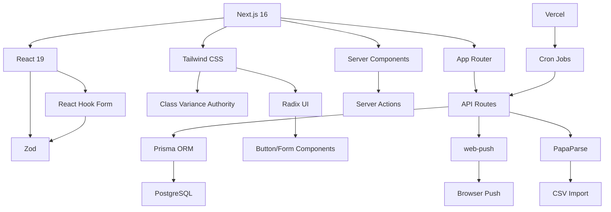

# 技术栈与依赖

<cite>
**本文档中引用的文件**   
- [package.json](file://package.json)
- [next.config.ts](file://next.config.ts)
- [tsconfig.json](file://tsconfig.json)
- [eslint.config.mjs](file://eslint.config.mjs)
- [vitest.config.ts](file://vitest.config.ts)
- [vercel.json](file://vercel.json)
- [prisma/schema.prisma](file://prisma/schema.prisma)
- [components.json](file://components.json)
- [lib/prisma.ts](file://lib/prisma.ts)
- [lib/web-push.ts](file://lib/web-push.ts)
- [lib/utils.ts](file://lib/utils.ts)
- [components/ui/button.tsx](file://components/ui/button.tsx)
- [components/ui/form.tsx](file://components/ui/form.tsx)
- [app/layout.tsx](file://app/layout.tsx)
- [postcss.config.mjs](file://postcss.config.mjs)
- [app/globals.css](file://app/globals.css)
</cite>

## 目录
1. [技术栈概览](#技术栈概览)
2. [核心框架与架构](#核心框架与架构)
3. [UI构建体系](#ui构建体系)
4. [数据层技术](#数据层技术)
5. [核心依赖项详解](#核心依赖项详解)
6. [开发工具链](#开发工具链)
7. [部署配置](#部署配置)
8. [技术组件关系图](#技术组件关系图)
9. [新开发者认知地图](#新开发者认知地图)

## 技术栈概览

todo-csv-import项目采用现代化全栈技术组合，构建了一个功能完整的日程提醒与CSV导入系统。项目技术栈以Next.js 16和React 19为核心，结合TypeScript静态类型系统，实现了服务端渲染与客户端交互的完美平衡。前端UI采用Tailwind CSS与Radix UI组件库构建响应式界面，数据层使用Prisma ORM管理PostgreSQL数据库，同时集成Zod、PapaParse、web-push等专业库实现数据校验、CSV解析和推送通知功能。开发工具链包含Vitest测试框架、ESLint代码检查工具，部署环境基于Vercel平台配置定时任务。

**Section sources**
- [package.json](file://package.json#L1-L62)
- [next.config.ts](file://next.config.ts#L1-L8)
- [tsconfig.json](file://tsconfig.json#L1-L35)

## 核心框架与架构

项目采用Next.js 16与React 19的最新技术组合，充分利用React Server Components（RSC）和App Router架构的优势。Next.js 16作为全栈React框架，提供了服务端渲染（SSR）、静态生成（SSG）和客户端渲染（CSR）的灵活选择，通过App Router实现了基于文件系统的路由机制，将路由与组件结构自然映射。React 19引入的Actions特性简化了表单处理和数据突变操作，与Next.js的Server Actions无缝集成，实现了服务端函数的直接调用而无需手动编写API路由。

项目目录结构遵循App Router规范，`app/`目录下的每个子目录代表一个路由段，`page.tsx`文件定义页面组件，`layout.tsx`提供布局模板。这种架构支持组件级数据获取，允许在组件层面使用async/await语法直接获取数据，提升了开发效率和代码可读性。`layout.tsx`中的`suppressHydrationWarning`属性解决了服务端渲染与客户端水合过程中的警告问题，确保了渲染一致性。

**Section sources**
- [package.json](file://package.json#L26-L31)
- [next.config.ts](file://next.config.ts#L1-L8)
- [app/layout.tsx](file://app/layout.tsx#L1-L40)
- [tsconfig.json](file://tsconfig.json#L14)

## UI构建体系

项目采用Tailwind CSS与Radix UI的现代化UI构建方案，实现了高效、一致且可访问的用户界面。Tailwind CSS作为实用优先的CSS框架，通过`app/globals.css`中的`@apply`指令与自定义主题变量，建立了统一的设计系统。项目使用OKLCH色彩空间定义深色/浅色模式主题，通过CSS变量实现了平滑的主题切换，`dark`类切换支持系统级暗色模式适配。

Radix UI作为无样式、可访问的原始组件库，提供了`@radix-ui/react-dialog`、`@radix-ui/react-select`等高质量的UI原语。项目通过`components/ui/`目录封装了基于Radix UI的定制组件，如`button.tsx`、`form.tsx`等，实现了设计系统的一致性。`class-variance-authority`（CVA）用于定义组件变体，`tailwind-merge`和`clsx`库处理类名合并，确保了类名的正确覆盖和条件渲染。

**Section sources**
- [app/globals.css](file://app/globals.css#L1-L123)
- [components/ui/button.tsx](file://components/ui/button.tsx#L1-L61)
- [components/ui/form.tsx](file://components/ui/form.tsx#L1-L168)
- [components.json](file://components.json#L1-L23)
- [lib/utils.ts](file://lib/utils.ts#L1-L7)

## 数据层技术

项目使用Prisma ORM作为TypeScript优先的数据库工具，简化了PostgreSQL数据库的操作。Prisma Schema定义了`User`、`Event`、`ReminderRule`、`ReminderJob`和`PushSubscription`五个核心模型，通过直观的DSL描述数据模型和关系。Prisma Client提供了类型安全的数据库查询API，结合`@prisma/adapter-pg`适配器，实现了与PostgreSQL的高效连接。

`lib/prisma.ts`中的单例模式确保了Prisma Client在开发环境下的热重载兼容性，通过全局变量缓存实例避免了重复创建连接。数据模型设计遵循规范化原则，`User`模型作为根实体，与其他模型建立一对多关系。索引优化（`@@index`）和唯一约束（`@@unique`）确保了查询性能和数据完整性。Prisma的`cuid()`函数用于生成唯一ID，`@updatedAt`装饰器自动管理更新时间戳。

**Section sources**
- [prisma/schema.prisma](file://prisma/schema.prisma#L1-L86)
- [lib/prisma.ts](file://lib/prisma.ts#L1-L20)
- [package.json](file://package.json#L13-L14)

## 核心依赖项详解

### Zod：数据校验
Zod作为TypeScript优先的模式声明和校验库，用于定义API请求/响应的数据结构和验证规则。它提供了运行时类型检查和静态类型推断，确保了数据流的安全性。

### PapaParse：CSV解析
PapaParse专门用于高效解析CSV文件，支持大文件流式处理、编码自动检测和错误处理。在导入功能中，它将CSV数据转换为JSON格式，便于后续的数据验证和批量创建操作。

### web-push：推送服务
web-push库实现了Web Push协议，用于向客户端发送推送通知。通过VAPID（Voluntary Application Server Identification）密钥对认证，`lib/web-push.ts`封装了发送通知和获取公钥的功能，支持浏览器级提醒功能。

### 其他关键依赖
- `react-hook-form`：高效处理表单状态和验证
- `jose`：JWT（JSON Web Token）生成与验证
- `date-fns`：日期格式化与计算
- `bcryptjs`：密码哈希存储
- `sonner`：现代化通知组件
- `lucide-react`：图标库

**Section sources**
- [package.json](file://package.json#L12-L36)
- [lib/web-push.ts](file://lib/web-push.ts#L1-L54)
- [components/ui/form.tsx](file://components/ui/form.tsx#L7-L14)

## 开发工具链

项目配置了现代化的开发工具链，确保代码质量和开发效率。TypeScript作为核心语言，通过`tsconfig.json`配置了严格的类型检查（`"strict": true`），`"esModuleInterop"`和`"moduleResolution": "bundler"`支持现代ES模块语法。路径别名`@/*`简化了模块导入。

ESLint使用`eslint-config-next`配置，继承了Next.js的最佳实践，通过`eslint.config.mjs`进行模块化配置。Vitest作为测试框架，配置了Node环境测试，通过`setupFiles`初始化测试上下文。PostCSS与Tailwind CSS集成，通过`postcss.config.mjs`处理CSS转换。

**Section sources**
- [tsconfig.json](file://tsconfig.json#L1-L35)
- [eslint.config.mjs](file://eslint.config.mjs#L1-L19)
- [vitest.config.ts](file://vitest.config.ts#L1-L16)
- [postcss.config.mjs](file://postcss.config.mjs#L1-L8)

## 部署配置

项目通过`vercel.json`配置Vercel平台的部署行为，特别是定时任务（Crons）的设置。配置文件定义了`/api/scheduler/run`端点的定时执行规则，使用Cron表达式`* * * * *`实现每分钟执行一次，用于检查待发送的提醒任务。这种配置方式将定时任务与API路由解耦，简化了服务器less架构下的后台任务管理。

Vercel的边缘网络和自动扩展能力确保了应用的高可用性，Next.js的增量静态再生（ISR）优化了页面性能。环境变量管理（如`DATABASE_URL`、VAPID密钥）通过Vercel控制台配置，确保了敏感信息的安全性。

**Section sources**
- [vercel.json](file://vercel.json#L1-L8)
- [package.json](file://package.json#L6-L8)

## 技术组件关系图

**Diagram sources**
- [package.json](file://package.json#L26-L36)
- [prisma/schema.prisma](file://prisma/schema.prisma#L1-L86)
- [app/api/events/bulk-create/route.ts](file://app/api/events/bulk-create/route.ts)
- [lib/web-push.ts](file://lib/web-push.ts#L1-L54)
- [vercel.json](file://vercel.json#L1-L8)

## 新开发者认知地图

对于新开发者，理解本项目的技术认知地图至关重要。项目以Next.js 16的App Router为架构核心，所有页面和API路由均位于`app/`目录下。UI组件分为基础组件（`components/ui/`）和业务组件（如`EventDialog.tsx`），遵循原子设计原则。

数据流从API路由（`app/api/`）开始，通过Prisma Client操作数据库，使用Zod验证输入，通过Server Actions更新状态。前端表单使用React Hook Form和Zod进行验证，UI状态通过React Context或组件props管理。推送功能依赖web-push库和Service Worker（`public/sw.js`），定时任务由Vercel Cron触发。

开发时，应遵循TypeScript类型优先原则，使用ESLint保持代码风格一致，通过Vitest编写单元测试。环境配置在`.env.local`中定义，部署配置在`vercel.json`中管理。此技术栈组合提供了高性能、可维护和可扩展的应用架构。

**Section sources**
- [app/page.tsx](file://app/page.tsx)
- [app/api/events/route.ts](file://app/api/events/route.ts)
- [components/EventDialog.tsx](file://components/EventDialog.tsx)
- [lib/utils.ts](file://lib/utils.ts)
- [hooks/use-toast.ts](file://hooks/use-toast.ts)