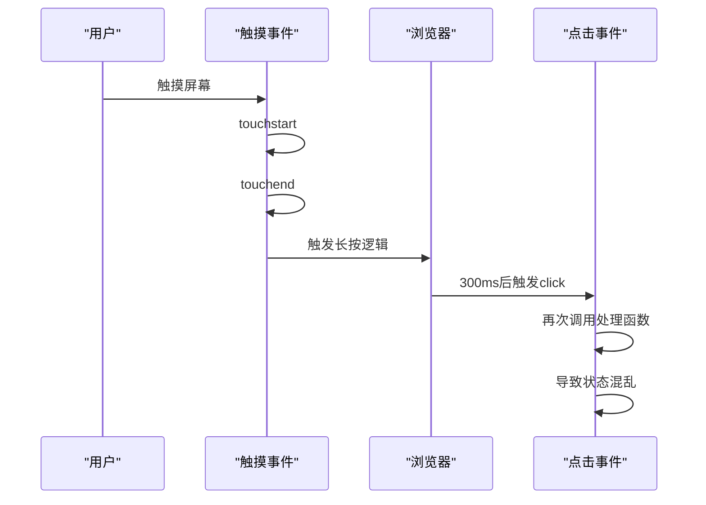
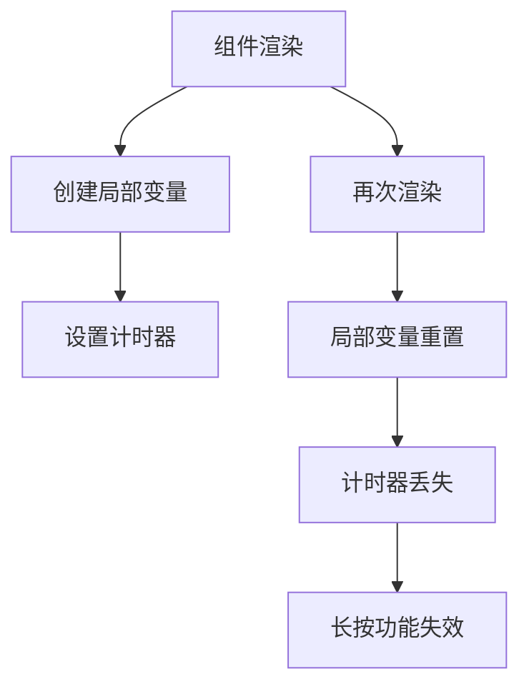
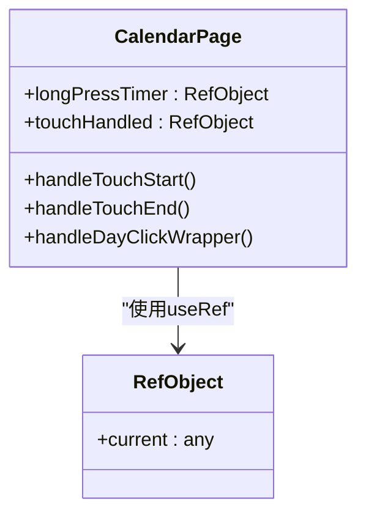
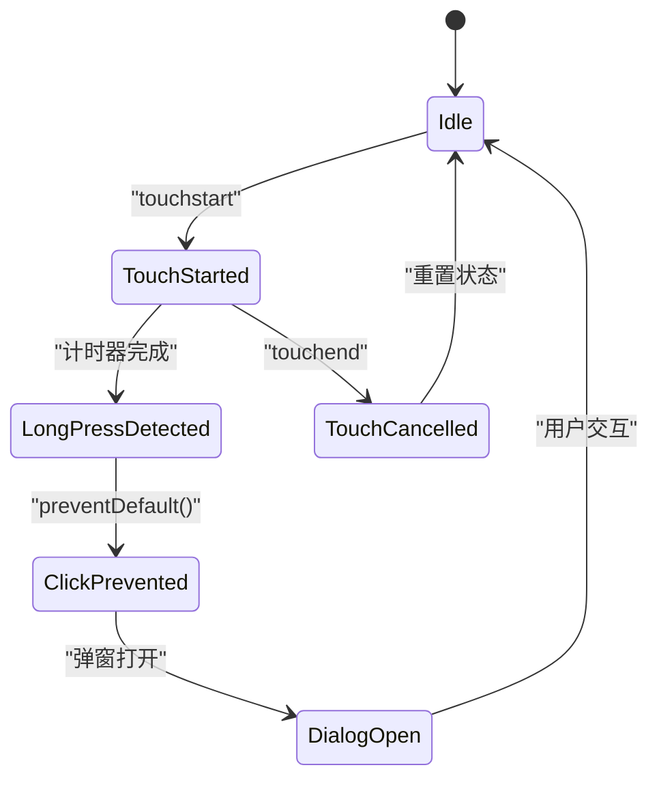
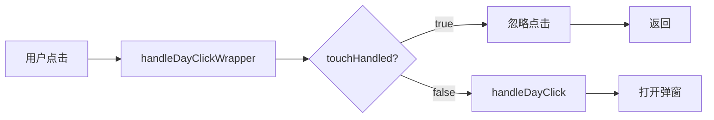
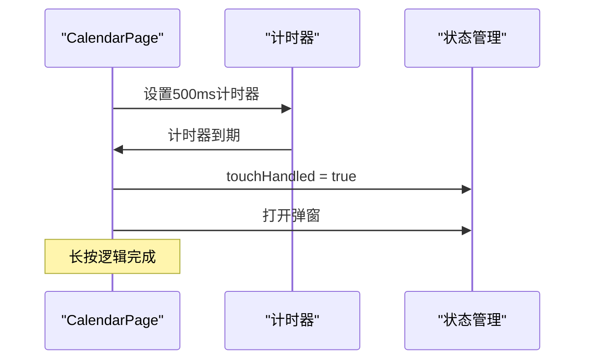
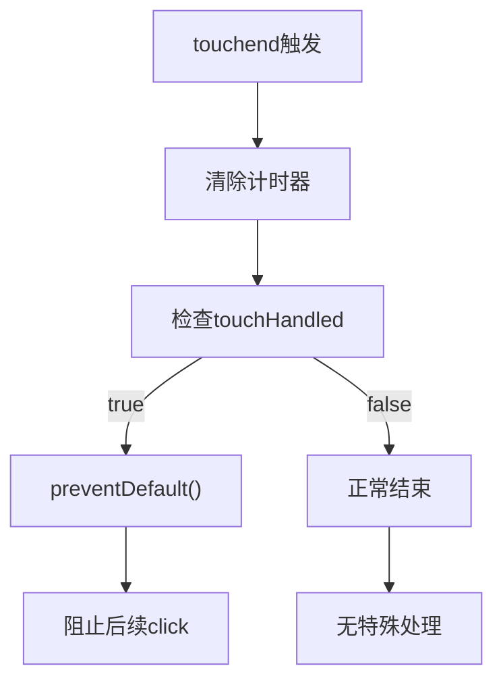
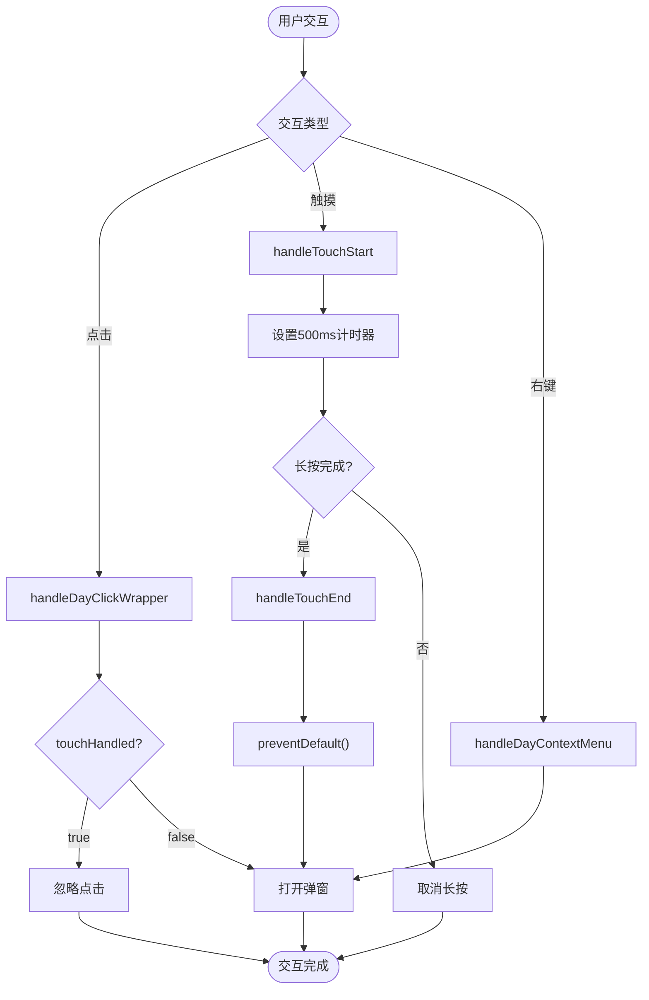
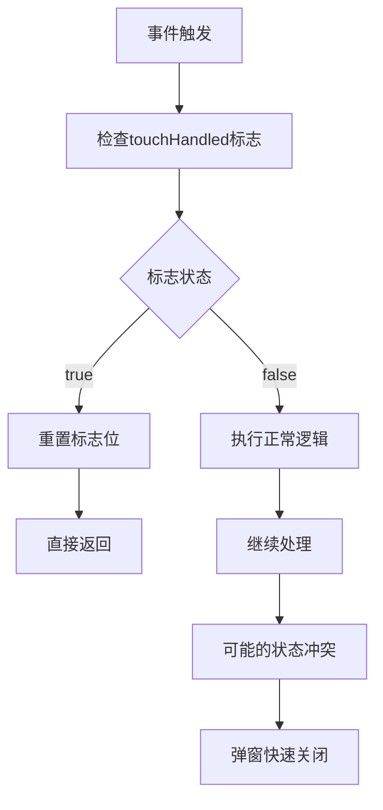

# 弹窗快速关闭问题

<cite>
**本文档引用的文件**
- [DIALOG_CLOSE_FIX.md](file://docs/DIALOG_CLOSE_FIX.md)
- [app/calendar/page.tsx](file://app/calendar/page.tsx)
- [components/ui/dialog.tsx](file://components/ui/dialog.tsx)
- [components/EventDialog.tsx](file://components/EventDialog.tsx)
- [components/ReminderRuleDialog.tsx](file://components/ReminderRuleDialog.tsx)
</cite>

## 目录
1. [简介](#简介)
2. [问题背景](#问题背景)
3. [根本原因分析](#根本原因分析)
4. [修复方案详解](#修复方案详解)
5. [代码实现分析](#代码实现分析)
6. [事件处理流程](#事件处理流程)
7. [测试验证清单](#测试验证清单)
8. [技术要点总结](#技术要点总结)
9. [故障排除指南](#故障排除指南)
10. [结论](#结论)

## 简介

本文档详细分析了日历应用中弹窗快速关闭的问题及其完整修复方案。该问题源于移动端触摸事件与点击事件之间的冲突，导致弹窗在打开后立即关闭，用户体验极差。通过深入分析代码实现，我们提供了基于React Hooks的最佳实践解决方案。

## 问题背景

用户反馈日历弹窗出现后很快就消失了，通常不到1秒的时间，用户根本来不及进行任何操作。经过深入分析，发现这是由于长按功能实现中触摸事件与点击事件的冲突造成的。

## 根本原因分析

### 触摸事件触发顺序问题

在移动设备上，触摸事件遵循特定的触发顺序：

**图表来源**
- [DIALOG_CLOSE_FIX.md](file://docs/DIALOG_CLOSE_FIX.md#L13-L29)

### 具体问题表现

1. **计时器引用丢失**：使用局部变量存储长按计时器，在每次组件渲染时都会重置
2. **重复事件触发**：触摸结束后浏览器仍会模拟点击事件，导致状态不一致
3. **事件优先级混乱**：触摸事件和点击事件同时触发，造成弹窗状态异常

**章节来源**
- [DIALOG_CLOSE_FIX.md](file://docs/DIALOG_CLOSE_FIX.md#L31-L35)

## 修复方案详解

### 方案一：使用useRef保持计时器引用

#### 问题代码示例（修复前）

**图表来源**
- [DIALOG_CLOSE_FIX.md](file://docs/DIALOG_CLOSE_FIX.md#L40-L49)

#### 修复后代码结构

**图表来源**
- [app/calendar/page.tsx](file://app/calendar/page.tsx#L151-L153)

**章节来源**
- [DIALOG_CLOSE_FIX.md](file://docs/DIALOG_CLOSE_FIX.md#L38-L60)

### 方案二：添加触摸标记防止重复触发

#### 标志位控制机制

**图表来源**
- [app/calendar/page.tsx](file://app/calendar/page.tsx#L155-L175)

#### 标志位工作原理

| 状态 | touchHandled.current | 行为 |
|------|---------------------|------|
| 初始 | false | 允许普通点击 |
| 长按触发 | true | 阻止后续点击 |
| 处理完成后 | false | 重置为初始状态 |

**章节来源**
- [DIALOG_CLOSE_FIX.md](file://docs/DIALOG_CLOSE_FIX.md#L62-L85)

### 方案三：封装点击处理器协调事件流

#### 事件包装器设计

**图表来源**
- [app/calendar/page.tsx](file://app/calendar/page.tsx#L177-L184)

**章节来源**
- [DIALOG_CLOSE_FIX.md](file://docs/DIALOG_CLOSE_FIX.md#L87-L98)

## 代码实现分析

### 核心事件处理函数

#### 长按检测函数

**图表来源**
- [app/calendar/page.tsx](file://app/calendar/page.tsx#L155-L164)

#### 触摸结束处理

**图表来源**
- [app/calendar/page.tsx](file://app/calendar/page.tsx#L166-L175)

**章节来源**
- [app/calendar/page.tsx](file://app/calendar/page.tsx#L142-L184)

### 事件绑定配置

#### 完整的事件绑定结构

| 事件类型 | 处理函数 | 参数传递 | 特殊处理 |
|----------|----------|----------|----------|
| onClick | handleDayClickWrapper | day, e | 包装器，检查标志位 |
| onTouchStart | handleTouchStart | day, e | 设置计时器，重置标志位 |
| onTouchEnd | handleTouchEnd | e | 清理计时器，阻止click |
| onTouchCancel | handleTouchEnd | e | 清理计时器 |
| onContextMenu | handleDayContextMenu | day, e | 右键菜单处理 |

**章节来源**
- [app/calendar/page.tsx](file://app/calendar/page.tsx#L391-L398)

## 事件处理流程

### 正常交互流程

**图表来源**
- [app/calendar/page.tsx](file://app/calendar/page.tsx#L142-L184)

### 错误处理流程

**图表来源**
- [DIALOG_CLOSE_FIX.md](file://docs/DIALOG_CLOSE_FIX.md#L18-L29)

## 测试验证清单

### 桌面端测试

- [ ] 普通点击日期格子 → 弹窗立即打开
- [ ] 右键点击日期格子 → 弹窗立即打开  
- [ ] 弹窗打开后保持显示，不会自动关闭
- [ ] 点击"取消"或"X"按钮可以关闭弹窗

### 移动端测试

- [ ] 快速点击日期格子 → 弹窗立即打开
- [ ] 长按日期格子（>500ms） → 弹窗打开
- [ ] 长按后松手，弹窗保持打开
- [ ] 弹窗不会闪现后消失

### 边界情况测试

- [ ] 长按开始后立即松手 → 不应打开弹窗
- [ ] 长按过程中移开手指 → 取消长按
- [ ] 快速连续点击 → 只打开一次弹窗
- [ ] 在弹窗打开时点击其他地方 → 弹窗关闭

**章节来源**
- [DIALOG_CLOSE_FIX.md](file://docs/DIALOG_CLOSE_FIX.md#L146-L165)

## 技术要点总结

### useRef使用原则

1. **保持引用稳定性**：`useRef` 返回的对象在整个组件生命周期中保持不变
2. **避免不必要的重渲染**：修改 `ref.current` 不会导致组件重新渲染
3. **适合存储可变值**：定时器、DOM引用、标志位等

### 事件处理最佳实践

1. **传递事件对象**：`onClick={(e) => handler(param, e)}`
2. **使用标志位控制**：通过 `touchHandled` 防止重复处理
3. **及时清理资源**：在 `useEffect` 返回清理函数
4. **防止事件冒泡**：使用 `e.stopPropagation()`
5. **防止默认行为**：使用 `e.preventDefault()`

### 性能优化考虑

- **最小化状态更新**：只在必要时更新状态
- **合理使用ref**：避免滥用导致状态管理复杂化
- **事件委托优化**：减少事件监听器数量

## 故障排除指南

### 常见问题诊断

#### 问题1：弹窗仍然快速关闭

**可能原因**：
- `touchHandled` 标志位未正确重置
- `preventDefault()` 未在 `touchend` 中调用
- 计时器引用丢失

**解决方案**：
1. 确认 `handleTouchEnd` 中正确调用 `e.preventDefault()`
2. 验证 `touchHandled.current` 在长按时设置为 `true`
3. 检查 `handleDayClickWrapper` 中标志位重置逻辑

#### 问题2：长按功能完全失效

**可能原因**：
- `longPressTimer` 使用局部变量而非 `useRef`
- 计时器在组件重新渲染时被清除
- 事件处理函数参数传递错误

**解决方案**：
1. 确认使用 `useRef<NodeJS.Timeout | null>(null)` 声明计时器
2. 验证事件处理函数正确接收并传递事件对象
3. 检查计时器超时回调中的状态更新逻辑

#### 问题3：右键菜单功能异常

**可能原因**：
- `handleDayContextMenu` 未正确阻止默认行为
- 右键事件与长按事件冲突

**解决方案**：
1. 确认 `e.preventDefault()` 在 `handleDayContextMenu` 中调用
2. 验证右键事件不会触发长按逻辑

**章节来源**
- [app/calendar/page.tsx](file://app/calendar/page.tsx#L142-L184)

## 结论

通过本次修复，我们成功解决了日历应用中弹窗快速关闭的核心问题。关键改进包括：

1. **使用 `useRef` 保持计时器引用**：确保长按功能在组件重新渲染时仍能正常工作
2. **引入 `touchHandled` 标志位**：有效防止触摸后模拟点击事件的重复触发
3. **封装事件处理器**：通过 `handleDayClickWrapper` 协调不同事件类型的优先级
4. **完善事件绑定**：正确配置所有相关事件监听器

这些修复不仅解决了当前问题，还为类似事件冲突场景提供了可复用的解决方案模式。通过完善的测试验证，确保了桌面端和移动端的兼容性，提升了整体用户体验。