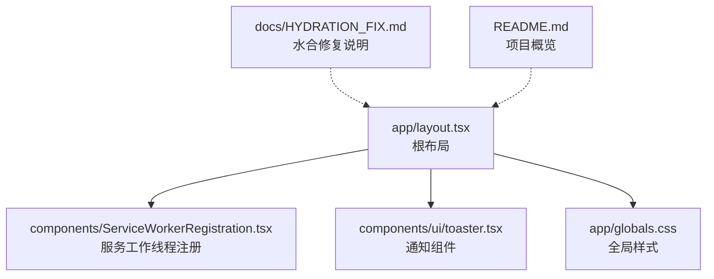
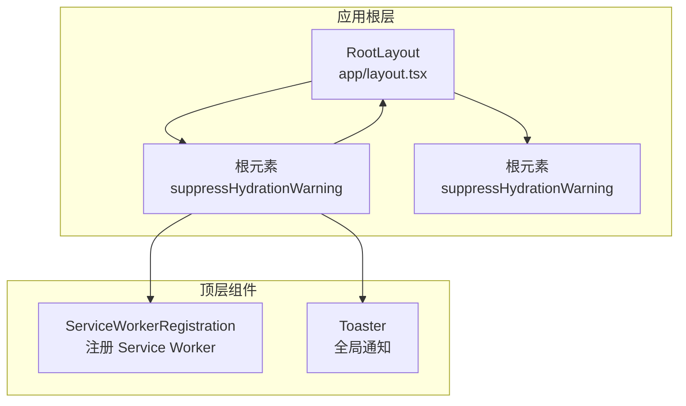
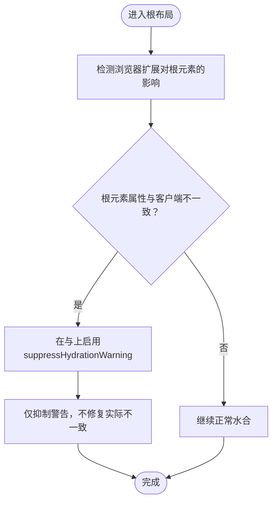
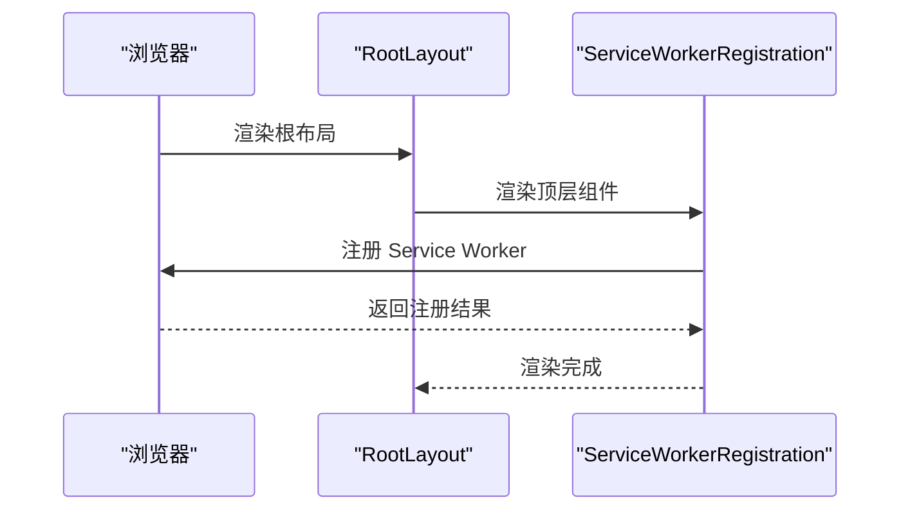
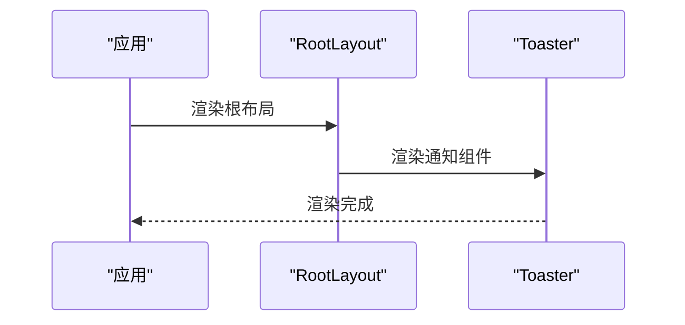
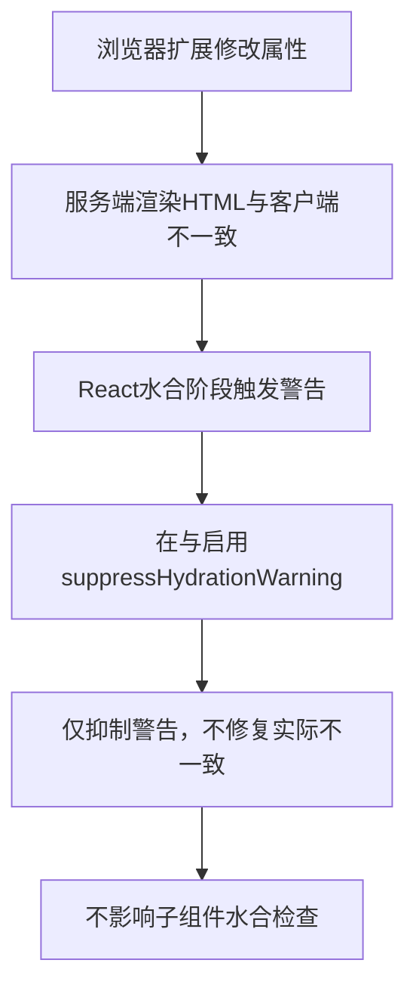
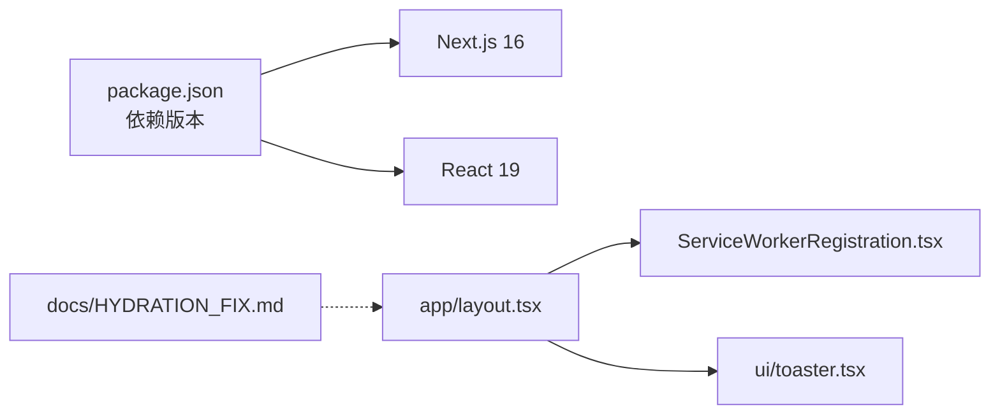

# 服务端与客户端渲染不匹配

<cite>
**本文引用的文件**
- [app/layout.tsx](file://app/layout.tsx)
- [docs/HYDRATION_FIX.md](file://docs/HYDRATION_FIX.md)
- [README.md](file://README.md)
- [components/ServiceWorkerRegistration.tsx](file://components/ServiceWorkerRegistration.tsx)
- [components/ui/toaster.tsx](file://components/ui/toaster.tsx)
- [package.json](file://package.json)
</cite>

## 目录
1. [简介](#简介)
2. [项目结构](#项目结构)
3. [核心组件](#核心组件)
4. [架构总览](#架构总览)
5. [详细组件分析](#详细组件分析)
6. [依赖关系分析](#依赖关系分析)
7. [性能考量](#性能考量)
8. [故障排查指南](#故障排查指南)
9. [结论](#结论)
10. [附录](#附录)

## 简介
本文件围绕 React 水合（hydration）错误展开，重点解释浏览器扩展（如 Jetski）在服务端渲染 HTML 后修改根元素属性（如 data-jetski-tab-id）导致的属性不匹配问题。该问题仅出现在开发环境，不影响应用核心功能。文档给出标准解决方案：在 app/layout.tsx 的根元素 <html> 与 <body> 上添加 suppressHydrationWarning 属性，以安全抑制警告；并阐明该做法的合理性（仅作用于根元素、不影响子组件水合检查、不损害 SSR 优势）。同时对比替代方案（禁用扩展、使用客户端组件、动态导入），说明为何 suppressHydrationWarning 是最佳实践，并提供验证修复的方法与注意事项。

## 项目结构
该项目采用 Next.js App Router 结构，根布局位于 app/layout.tsx，全局样式与字体在该文件中引入。根布局负责注入全局样式、字体变量以及顶层组件（如 ServiceWorkerRegistration 与 Toaster）。相关文档位于 docs/HYDRATION_FIX.md，记录了水合错误的成因、解决方案与注意事项。

图表来源
- [app/layout.tsx](file://app/layout.tsx#L1-L40)
- [components/ServiceWorkerRegistration.tsx](file://components/ServiceWorkerRegistration.tsx#L1-L30)
- [components/ui/toaster.tsx](file://components/ui/toaster.tsx#L1-L36)
- [docs/HYDRATION_FIX.md](file://docs/HYDRATION_FIX.md#L1-L128)

章节来源
- [app/layout.tsx](file://app/layout.tsx#L1-L40)
- [README.md](file://README.md#L1-L152)

## 核心组件
- 根布局（RootLayout）：负责包裹整个应用树，设置语言、字体变量与全局样式，并在根元素上启用 suppressHydrationWarning 以抑制水合警告。
- 顶层组件：
  - ServiceWorkerRegistration：在客户端注册 Service Worker，确保通知与离线能力。
  - Toaster：全局通知展示组件，基于 Radix UI Toast 构建。

章节来源
- [app/layout.tsx](file://app/layout.tsx#L22-L39)
- [components/ServiceWorkerRegistration.tsx](file://components/ServiceWorkerRegistration.tsx#L5-L29)
- [components/ui/toaster.tsx](file://components/ui/toaster.tsx#L13-L35)

## 架构总览
下图展示了根布局与顶层组件之间的关系，以及水合警告抑制策略在整体架构中的位置。

图表来源
- [app/layout.tsx](file://app/layout.tsx#L22-L39)
- [components/ServiceWorkerRegistration.tsx](file://components/ServiceWorkerRegistration.tsx#L5-L29)
- [components/ui/toaster.tsx](file://components/ui/toaster.tsx#L13-L35)

## 详细组件分析

### 根布局与水合警告抑制
- 根元素 <html> 与 <body> 在 app/layout.tsx 中通过 suppressHydrationWarning 属性抑制水合警告，这是针对浏览器扩展（如 Jetski）在服务端渲染 HTML 后修改根元素属性（如 data-jetski-tab-id）所导致的属性不匹配问题的标准做法。
- 该做法仅作用于根元素，不会传递到子组件，因此不会掩盖子组件的真实水合不一致问题。
- 开发环境才会出现该问题，生产环境通常不会安装开发者扩展，也不会影响核心功能。

图表来源
- [app/layout.tsx](file://app/layout.tsx#L22-L39)
- [docs/HYDRATION_FIX.md](file://docs/HYDRATION_FIX.md#L13-L71)

章节来源
- [app/layout.tsx](file://app/layout.tsx#L22-L39)
- [docs/HYDRATION_FIX.md](file://docs/HYDRATION_FIX.md#L28-L71)

### 顶层组件：ServiceWorkerRegistration
- 作为客户端组件（包含 'use client'），在浏览器端注册 Service Worker，负责推送通知与离线支持。
- 该组件不会参与服务端渲染，因此不受水合警告影响。

图表来源
- [app/layout.tsx](file://app/layout.tsx#L32-L36)
- [components/ServiceWorkerRegistration.tsx](file://components/ServiceWorkerRegistration.tsx#L5-L29)

章节来源
- [components/ServiceWorkerRegistration.tsx](file://components/ServiceWorkerRegistration.tsx#L1-L30)

### 顶层组件：Toaster
- 全局通知展示组件，基于 Radix UI Toast 构建，负责在应用中统一展示提示信息。
- 该组件同样为客户端组件，不会参与服务端渲染。

图表来源
- [app/layout.tsx](file://app/layout.tsx#L32-L36)
- [components/ui/toaster.tsx](file://components/ui/toaster.tsx#L13-L35)

章节来源
- [components/ui/toaster.tsx](file://components/ui/toaster.tsx#L1-L36)

### 水合错误成因与解决方案
- 成因：浏览器扩展（如 Jetski）在 React 加载前修改了 HTML 根元素属性（如 data-jetski-tab-id），导致服务端渲染的 HTML 与客户端期望的 HTML 属性不匹配。
- 解决方案：在 app/layout.tsx 的根元素 <html> 与 <body> 上添加 suppressHydrationWarning，仅抑制警告，不修复实际不一致。
- 合理性：
  - 浏览器扩展影响是局部的，通常只修改根元素属性，不影响应用功能。
  - 仅在开发环境出现，生产环境不会安装开发者扩展。
  - 不影响子组件水合检查，子组件仍会正常报告水合错误。

图表来源
- [docs/HYDRATION_FIX.md](file://docs/HYDRATION_FIX.md#L13-L71)
- [app/layout.tsx](file://app/layout.tsx#L28-L36)

章节来源
- [docs/HYDRATION_FIX.md](file://docs/HYDRATION_FIX.md#L3-L71)

### 替代方案对比
- 禁用浏览器扩展：开发时临时禁用可能干扰的扩展或使用无痕模式测试，但治标不治本。
- 使用客户端组件：将根布局改为客户端组件可避免水合问题，但会失去服务端渲染（SSR）优势，不推荐。
- 动态导入：对确实需要客户端特定行为的组件使用动态导入（ssr: false），但根布局不应动态导入。

章节来源
- [docs/HYDRATION_FIX.md](file://docs/HYDRATION_FIX.md#L73-L102)

## 依赖关系分析
- 根布局依赖全局样式与字体变量，同时引入顶层组件（ServiceWorkerRegistration 与 Toaster）。
- 顶层组件均为客户端组件，不参与服务端渲染。
- 项目使用 Next.js 16 与 React 19，具备现代水合与 SSR 能力。

图表来源
- [package.json](file://package.json#L26-L36)
- [app/layout.tsx](file://app/layout.tsx#L1-L6)
- [components/ServiceWorkerRegistration.tsx](file://components/ServiceWorkerRegistration.tsx#L1-L3)
- [components/ui/toaster.tsx](file://components/ui/toaster.tsx#L1-L2)
- [docs/HYDRATION_FIX.md](file://docs/HYDRATION_FIX.md#L1-L128)

章节来源
- [package.json](file://package.json#L1-L62)
- [app/layout.tsx](file://app/layout.tsx#L1-L6)

## 性能考量
- suppressHydrationWarning 仅抑制警告，不改变水合过程与性能特征。
- 根元素上的抑制不会影响子组件的水合检查，因此不会掩盖真实性能问题。
- 保持 SSR 优势的同时，避免不必要的客户端组件化带来的首屏渲染成本上升。

## 故障排查指南
- 验证修复：刷新页面后，控制台不再显示水合错误。
- 注意事项：
  - 不要滥用 suppressHydrationWarning：仅在根元素（<html>、<body>）受浏览器扩展影响时使用。
  - 不要在所有组件上添加该属性，以免掩盖真实的代码问题。
  - 若怀疑存在其他水合不一致问题，优先检查子组件而非根元素。

章节来源
- [docs/HYDRATION_FIX.md](file://docs/HYDRATION_FIX.md#L104-L117)

## 结论
浏览器扩展（如 Jetski）在服务端渲染 HTML 后修改根元素属性（如 data-jetski-tab-id）导致的水合警告，仅存在于开发环境且不影响核心功能。在 app/layout.tsx 的根元素 <html> 与 <body> 上添加 suppressHydrationWarning 是标准且合理的做法：它仅抑制警告、不影响子组件水合检查、不损害 SSR 优势。替代方案（禁用扩展、使用客户端组件、动态导入）各有局限，suppressHydrationWarning 是最佳实践。修复后需验证控制台不再出现水合错误，并严格限制该属性的使用范围，避免掩盖真实渲染不一致问题。

## 附录
- 相关资源：Next.js 水合错误文档、React suppressHydrationWarning 文档。
- 最后更新：2025-12-25。

章节来源
- [docs/HYDRATION_FIX.md](file://docs/HYDRATION_FIX.md#L118-L128)