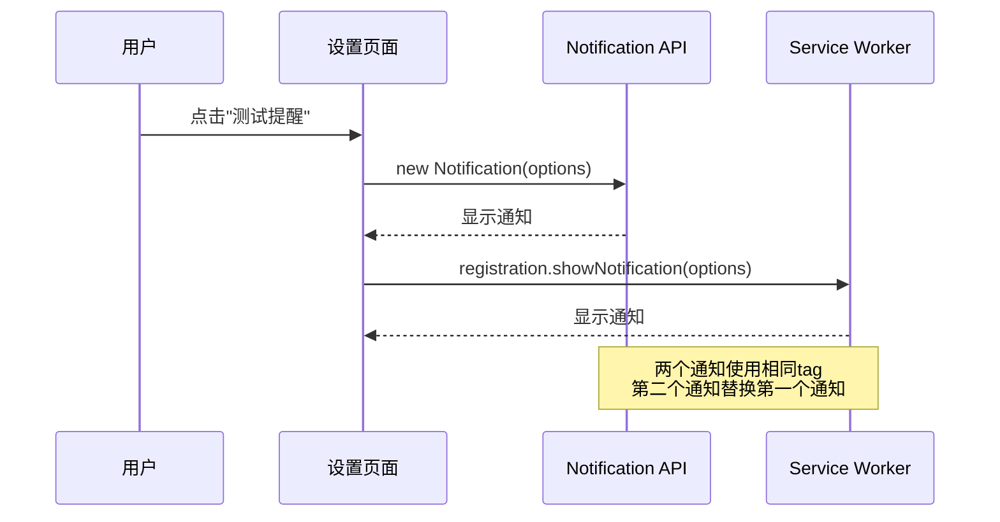
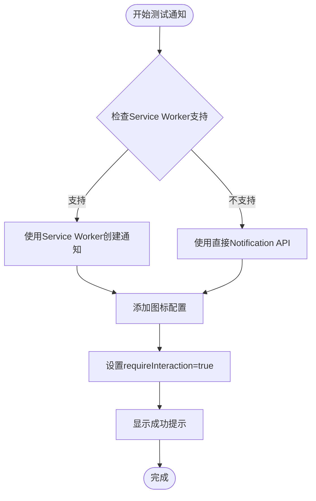
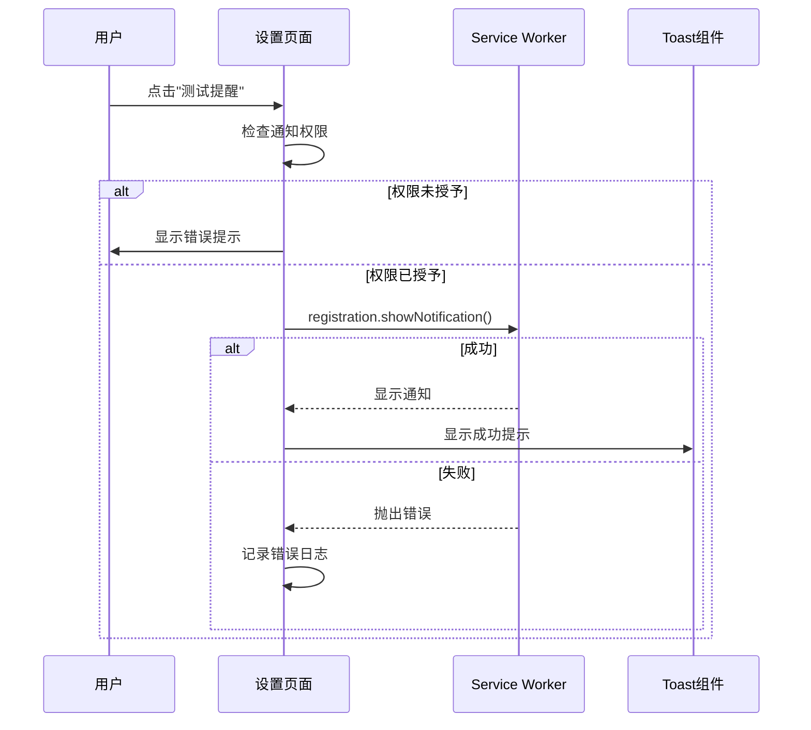
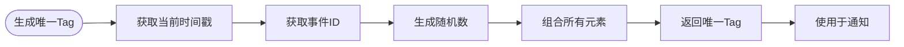
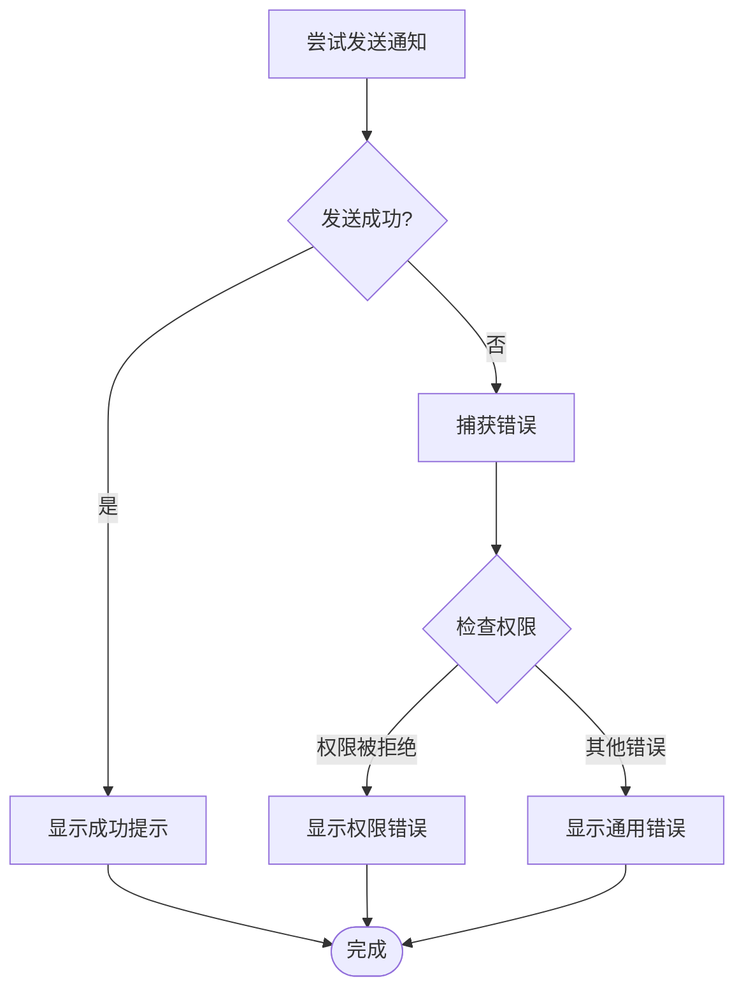
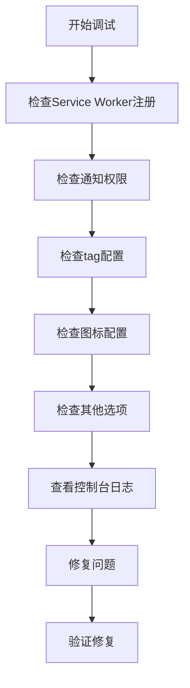

# 通知快速消失问题

<cite>
**本文档引用的文件**
- [NOTIFICATION_FIX.md](file://docs/NOTIFICATION_FIX.md)
- [app/settings/page.tsx](file://app/settings/page.tsx)
- [public/sw.js](file://public/sw.js)
- [components/ServiceWorkerRegistration.tsx](file://components/ServiceWorkerRegistration.tsx)
- [components/NotificationPermissionPrompt.tsx](file://components/NotificationPermissionPrompt.tsx)
- [lib/web-push.ts](file://lib/web-push.ts)
- [app/layout.tsx](file://app/layout.tsx)
- [app/api/push/subscribe/route.ts](file://app/api/push/subscribe/route.ts)
</cite>

## 目录
1. [简介](#简介)
2. [问题背景](#问题背景)
3. [根本原因分析](#根本原因分析)
4. [修复方案](#修复方案)
5. [实现细节](#实现细节)
6. [最佳实践](#最佳实践)
7. [验证方法](#验证方法)
8. [故障排除](#故障排除)
9. [总结](#总结)

## 简介

本文档深入分析了测试通知快速消失的根本原因，并提供了完整的修复方案。该问题源于同时调用 `new Notification()` 和 Service Worker 的 `showNotification()` 方法，且使用了相同的 `tag` 属性，导致后一个通知立即替换前一个通知。

## 问题背景

用户在设置页面点击"测试提醒"按钮后，浏览器通知弹窗出现后很快就消失了，出现时间不到1秒。经过详细分析发现，这是由于代码中同时使用了两种通知创建方式造成的。

## 根本原因分析

### 通知替换机制

根据 Web Notifications API 规范，`tag` 属性用于标识可以被替换的通知。当两个通知具有相同的 `tag` 时，新通知会替换旧通知。



**图表来源**
- [app/settings/page.tsx](file://app/settings/page.tsx#L145-L171)
- [public/sw.js](file://public/sw.js#L38-L46)

### 问题流程详解

1. **第一个通知**：通过 `new Notification()` 创建，`tag` 为 `demo-notification`
2. **第二个通知**：通过 Service Worker 创建，`tag` 也是 `demo-notification`
3. **浏览器行为**：当两个通知有相同的 `tag` 时，新通知会替换旧通知
4. **用户体验**：第一个通知刚出现就被第二个替换，看起来像是"闪现后消失"

**章节来源**
- [NOTIFICATION_FIX.md](file://docs/NOTIFICATION_FIX.md#L9-L48)

## 修复方案

### 单一创建路径策略

修复的核心是**只使用一种方式创建通知**，优先使用 Service Worker，因为其具有更好的兼容性和后台支持能力。



**图表来源**
- [app/settings/page.tsx](file://app/settings/page.tsx#L145-L171)

### 修复要点

1. **单一创建路径**：只使用一种方式创建通知
2. **优先 Service Worker**：更好的后台支持和兼容性
3. **降级方案**：如果不支持 Service Worker，使用直接 API
4. **添加图标**：`icon: '/favicon.ico'` 让通知更美观
5. **更好的错误处理**：捕获并显示具体错误信息

**章节来源**
- [NOTIFICATION_FIX.md](file://docs/NOTIFICATION_FIX.md#L58-L100)

## 实现细节

### 修复后的 triggerTestNotification 函数

修复后的函数实现了以下关键功能：



**图表来源**
- [app/settings/page.tsx](file://app/settings/page.tsx#L145-L171)

### 关键实现特性

1. **权限检查**：在发送通知前检查并请求必要的权限
2. **服务检测**：优先使用 Service Worker，不支持时降级
3. **错误处理**：完善的 try-catch 机制和用户反馈
4. **图标配置**：设置 `icon: '/favicon.ico'` 提升视觉体验
5. **持久化选项**：设置 `requireInteraction: true` 确保通知不自动消失

**章节来源**
- [app/settings/page.tsx](file://app/settings/page.tsx#L145-L171)

## 最佳实践

### 唯一 tag 生成策略

为了确保通知的正确管理和避免意外替换，应该为每个通知生成唯一标识符：



**图表来源**
- [NOTIFICATION_FIX.md](file://docs/NOTIFICATION_FIX.md#L181-L189)

### 交互选项配置

对于重要的提醒通知，应该设置 `requireInteraction: true`：

| 选项 | 值 | 行为描述 |
|------|-----|----------|
| `requireInteraction` | `true` | 通知不会自动消失，需要用户手动关闭 |
| `requireInteraction` | `false` | 通知会在几秒后自动消失 |
| `icon` | `/favicon.ico` | 自定义通知图标 |
| `badge` | `/favicon.ico` | 小徽章图标 |

**章节来源**
- [NOTIFICATION_FIX.md](file://docs/NOTIFICATION_FIX.md#L143-L156)

### 错误处理策略



**图表来源**
- [app/settings/page.tsx](file://app/settings/page.tsx#L164-L170)

## 验证方法

### 控制台日志验证

修复后，控制台应该只显示一条日志，确认只创建了一个通知：

```
[Push] Test notification sent via Service Worker
```

### 活动通知检查

通过浏览器开发者工具检查活动通知状态：

```javascript
// 在控制台执行
Active notifications count: 2
Notification title: 测试提醒
```

### 用户体验验证

- 通知正常显示，不会自动消失
- 点击通知可以关闭
- 多次点击测试按钮，旧通知被替换（相同tag）
- 通知显示正确的标题和内容

**章节来源**
- [NOTIFICATION_FIX.md](file://docs/NOTIFICATION_FIX.md#L102-L125)

## 故障排除

### 常见问题及解决方案

1. **Service Worker 不支持**
   - 检查浏览器兼容性
   - 确认 HTTPS 环境
   - 验证 Service Worker 文件路径

2. **通知权限被拒绝**
   - 引导用户在浏览器设置中开启通知
   - 提供清晰的错误提示

3. **图标显示异常**
   - 确认图标文件路径正确
   - 检查文件访问权限
   - 验证图标格式支持

### 调试技巧



**图表来源**
- [components/ServiceWorkerRegistration.tsx](file://components/ServiceWorkerRegistration.tsx#L9-L25)

## 总结

通过本次修复，我们解决了测试通知快速消失的问题。核心改进包括：

1. **单一通知创建路径**：避免了双重发送导致的替换问题
2. **优先使用 Service Worker**：提供了更好的兼容性和后台支持
3. **完善的错误处理**：提升了用户体验和系统的健壮性
4. **最佳实践应用**：包括唯一 tag 生成、图标配置和交互选项设置

这些改进确保了通知能够持久显示直至用户手动关闭，为用户提供更好的提醒体验。