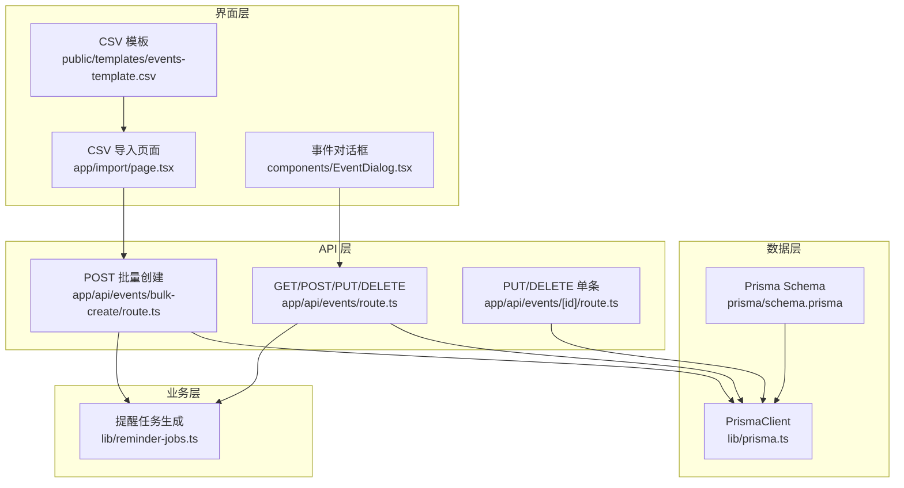
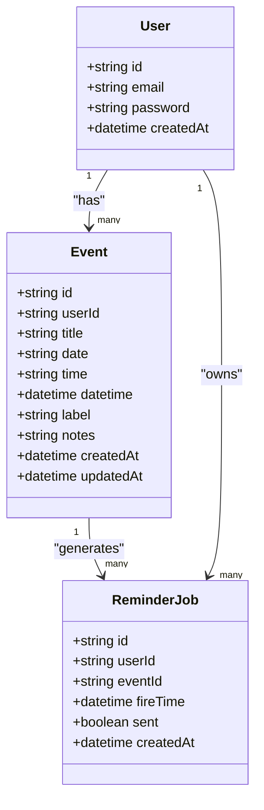
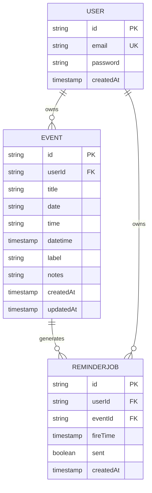
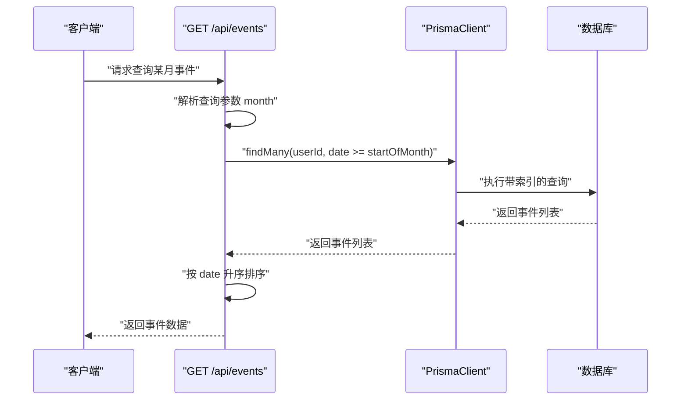
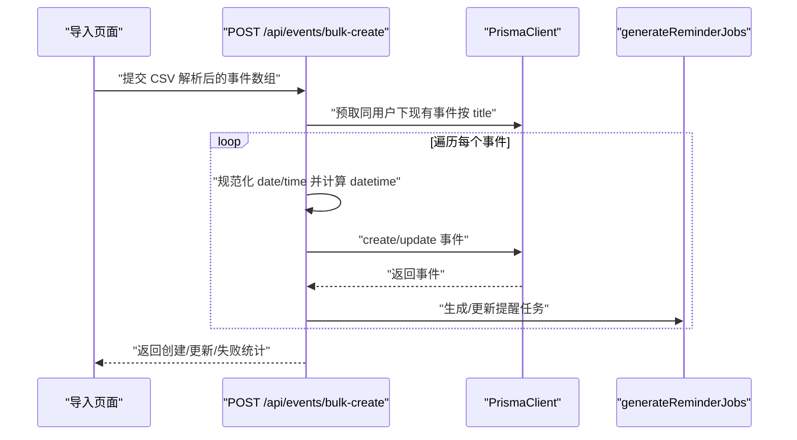
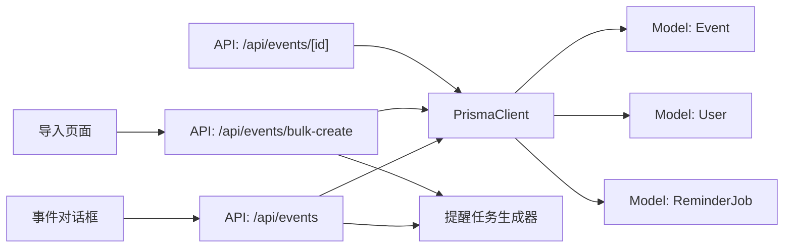

# 事件模型 (Event)

<cite>
**本文引用的文件**
- [prisma/schema.prisma](file://prisma/schema.prisma)
- [lib/prisma.ts](file://lib/prisma.ts)
- [app/api/events/route.ts](file://app/api/events/route.ts)
- [app/api/events/bulk-create/route.ts](file://app/api/events/bulk-create/route.ts)
- [app/api/events/[id]/route.ts](file://app/api/events/[id]/route.ts)
- [lib/reminder-jobs.ts](file://lib/reminder-jobs.ts)
- [components/EventDialog.tsx](file://components/EventDialog.tsx)
- [app/import/page.tsx](file://app/import/page.tsx)
- [public/templates/events-template.csv](file://public/templates/events-template.csv)
</cite>

## 目录
1. [简介](#简介)
2. [项目结构](#项目结构)
3. [核心组件](#核心组件)
4. [架构总览](#架构总览)
5. [详细组件分析](#详细组件分析)
6. [依赖关系分析](#依赖关系分析)
7. [性能考量](#性能考量)
8. [故障排查指南](#故障排查指南)
9. [结论](#结论)
10. [附录](#附录)

## 简介
本文件系统化阐述 Event 模型的结构与设计意图，重点覆盖以下方面：
- 字段定义与用途：title、date、time、datetime、label、notes 的数据类型与语义
- 排序与查询设计：datetime 作为排序与查询的核心字段，date 保留字符串格式的前端兼容性
- 外键与关联：userId 与 User 模型的关联机制与级联行为
- 性能优化：复合索引 @@index([userId, date]) 对批量事件查询的作用
- 数据访问：结合 lib/prisma.ts 中的 PrismaClient，演示按用户与日期范围查询事件
- 批量导入：CSV 导入时创建多个事件的流程与事务特性

## 项目结构
Event 模型位于 Prisma Schema 中，并通过 Next.js API 路由提供 CRUD 与批量导入能力，同时配合提醒任务生成器与前端对话框组件共同构成完整的日程管理功能。

图表来源
- [prisma/schema.prisma](file://prisma/schema.prisma#L28-L45)
- [lib/prisma.ts](file://lib/prisma.ts#L1-L20)
- [app/api/events/route.ts](file://app/api/events/route.ts#L1-L200)
- [app/api/events/bulk-create/route.ts](file://app/api/events/bulk-create/route.ts#L1-L133)
- [app/api/events/[id]/route.ts](file://app/api/events/[id]/route.ts#L1-L119)
- [lib/reminder-jobs.ts](file://lib/reminder-jobs.ts#L1-L109)
- [app/import/page.tsx](file://app/import/page.tsx#L1-L218)
- [components/EventDialog.tsx](file://components/EventDialog.tsx#L1-L227)
- [public/templates/events-template.csv](file://public/templates/events-template.csv#L1-L5)

章节来源
- [prisma/schema.prisma](file://prisma/schema.prisma#L28-L45)
- [lib/prisma.ts](file://lib/prisma.ts#L1-L20)

## 核心组件
- Event 模型字段与约束
  - id：主键
  - userId：外键，指向 User.id
  - user：@relation 关系，字段映射与引用
  - title：字符串，必填
  - date：字符串，YYYY-MM-DD，用于前端显示与筛选
  - time：字符串，HH:mm，可空
  - datetime：DateTime，ISO 时间戳，用于排序与高效查询
  - label：字符串，可空，用于提醒规则匹配
  - notes：字符串，可空
  - createdAt/updatedAt：自动维护
  - 复合索引：@@index([userId, date])

- User 模型
  - id、email、password、createdAt
  - 与 Event 的一对多关系：events

- ReminderJob 模型
  - eventId 外键，@relation(onDelete: Cascade)，与 Event 关联并启用级联删除

章节来源
- [prisma/schema.prisma](file://prisma/schema.prisma#L16-L26)
- [prisma/schema.prisma](file://prisma/schema.prisma#L28-L45)
- [prisma/schema.prisma](file://prisma/schema.prisma#L62-L74)

## 架构总览
Event 模型围绕“日期字符串 + ISO 时间戳”的双字段策略构建：
- date 字段保持 YYYY-MM-DD 字符串，便于前端输入、显示与筛选
- datetime 字段为 ISO DateTime，用于精确排序与高效查询
- 两者协同：前端以 date 进行 UI 交互，后端以 datetime 进行排序与索引优化

图表来源
- [prisma/schema.prisma](file://prisma/schema.prisma#L16-L26)
- [prisma/schema.prisma](file://prisma/schema.prisma#L28-L45)
- [prisma/schema.prisma](file://prisma/schema.prisma#L62-L74)

## 详细组件分析

### Event 模型字段详解
- id：自动生成的 cuid 主键
- userId：外键，指向 User.id
- user：关系字段，字段映射与引用均指向 User.id
- title：必填字符串，作为去重与更新的关键依据之一
- date：字符串，YYYY-MM-DD，用于前端日期输入与 UI 展示
- time：字符串，HH:mm，可空；为空时默认使用 10:00
- datetime：DateTime，ISO 时间戳，用于排序与查询
- label：字符串，可空；用于匹配 ReminderRule 规则
- notes：字符串，可空
- createdAt/updatedAt：自动维护
- 复合索引：@@index([userId, date])，提升按用户与日期范围查询的性能

字段用途与数据类型说明
- title：事件标题，字符串，必填
- date：日期字符串，YYYY-MM-DD，字符串类型，便于前端输入与显示
- time：时间字符串，HH:mm，字符串类型，可空
- datetime：时间戳，DateTime 类型，用于排序与高效查询
- label：标签，字符串，可空
- notes：备注，字符串，可空

章节来源
- [prisma/schema.prisma](file://prisma/schema.prisma#L28-L45)

### 外键与关联机制
- userId 与 User 的关系
  - @relation(fields: [userId], references: [id]) 明确字段映射
  - User.events 为一对多关系，Event.user 为多对一
- 级联行为
  - ReminderJob.eventId 与 Event.id 关联，onDelete: Cascade
  - 删除 Event 会级联删除其对应的 ReminderJob 记录，避免悬挂任务

图表来源
- [prisma/schema.prisma](file://prisma/schema.prisma#L16-L26)
- [prisma/schema.prisma](file://prisma/schema.prisma#L28-L45)
- [prisma/schema.prisma](file://prisma/schema.prisma#L62-L74)

章节来源
- [prisma/schema.prisma](file://prisma/schema.prisma#L16-L26)
- [prisma/schema.prisma](file://prisma/schema.prisma#L28-L45)
- [prisma/schema.prisma](file://prisma/schema.prisma#L62-L74)

### 排序与查询设计：datetime 与 date 的协作
- datetime 作为排序与查询的核心
  - 在按月查询事件时，API 使用 datetime 或 date 进行排序与范围过滤
  - 该字段具备索引支持，有利于大规模数据的高效检索
- date 保留字符串格式的前端兼容性
  - 前端以 date 进行输入与显示，保持 YYYY-MM-DD 格式
  - 后端在创建/更新时将 date 与 time 组合成 datetime，确保排序一致性

图表来源
- [app/api/events/route.ts](file://app/api/events/route.ts#L15-L129)

章节来源
- [app/api/events/route.ts](file://app/api/events/route.ts#L15-L129)

### 性能优化：复合索引 @@index([userId, date])
- 设计意图
  - 事件查询通常按用户与日期范围进行过滤
  - 复合索引 [userId, date] 能够显著降低查询成本，提升按用户分组与日期范围扫描的效率
- 典型查询场景
  - 用户维度：按 userId 过滤
  - 时间维度：按 date 或 datetime 的范围过滤
- 影响范围
  - 适用于 GET /api/events 的按月查询
  - 适用于批量导入时的去重与更新判断（基于 userId + title）

章节来源
- [prisma/schema.prisma](file://prisma/schema.prisma#L44-L44)
- [app/api/events/route.ts](file://app/api/events/route.ts#L53-L71)

### 结合 PrismaClient 的按用户与日期范围查询
- 查询入口
  - GET /api/events：接收 month 参数（YYYY-MM），按用户与日期范围查询事件
- 查询逻辑要点
  - 验证 token 并解析 userId
  - 使用 date >= `${month}-01` 限定起始日期
  - orderBy: { date: 'asc' } 实现按日期升序排序
  - select 指定必要字段，减少传输与序列化开销
- 提示
  - 若需要更细粒度的时间范围，可在 where 子句中增加 date <= 结束日期条件

章节来源
- [app/api/events/route.ts](file://app/api/events/route.ts#L15-L129)
- [lib/prisma.ts](file://lib/prisma.ts#L1-L20)

### 批量事件创建与事务特性
- 批量导入流程
  - 前端 CSV 解析与校验：app/import/page.tsx
  - 后端批量创建：app/api/events/bulk-create/route.ts
  - 逐条处理并生成提醒任务：lib/reminder-jobs.ts
- 事务与幂等性
  - 后端逐条创建/更新事件，遇到错误记录并继续处理
  - 通过预取现有事件（按 title 去重）实现同名事件的覆盖更新
  - 生成提醒任务时先清理旧任务，再创建新任务，保证一致性
- 错误处理
  - 对每条记录捕获异常并返回索引与错误信息，便于前端提示

图表来源
- [app/import/page.tsx](file://app/import/page.tsx#L76-L106)
- [app/api/events/bulk-create/route.ts](file://app/api/events/bulk-create/route.ts#L19-L132)
- [lib/reminder-jobs.ts](file://lib/reminder-jobs.ts#L15-L72)

章节来源
- [app/import/page.tsx](file://app/import/page.tsx#L19-L106)
- [app/api/events/bulk-create/route.ts](file://app/api/events/bulk-create/route.ts#L19-L132)
- [lib/reminder-jobs.ts](file://lib/reminder-jobs.ts#L15-L72)

### 单条事件操作与提醒任务更新
- PUT /api/events/[id]：更新事件并重新生成提醒任务
- DELETE /api/events/[id]：删除事件并级联删除提醒任务
- 两个接口均包含权限校验（token 验证与 userId 对比）

章节来源
- [app/api/events/[id]/route.ts](file://app/api/events/[id]/route.ts#L15-L119)

### 前端交互与数据流
- EventDialog.tsx
  - 表单校验：title、date、time、label、notes
  - 日期格式规范化：将输入中的斜杠替换为连字符，确保 YYYY-MM-DD
  - 提交时将空字符串转换为 null，确保后端校验通过
- 导入页面
  - 支持下载模板、解析 CSV、预览与校验
  - 提交后跳转至日历页面并反馈导入结果

章节来源
- [components/EventDialog.tsx](file://components/EventDialog.tsx#L86-L133)
- [app/import/page.tsx](file://app/import/page.tsx#L19-L106)
- [public/templates/events-template.csv](file://public/templates/events-template.csv#L1-L5)

## 依赖关系分析
- 模型依赖
  - Event 依赖 User（外键）与 ReminderJob（生成提醒任务）
  - ReminderJob 依赖 Event（onDelete: Cascade）
- 服务依赖
  - API 路由依赖 PrismaClient
  - 事件创建/更新依赖提醒任务生成器
- 前端依赖
  - 导入页面依赖 CSV 解析库与模板
  - 事件对话框依赖表单验证与 Toast 提示

图表来源
- [app/api/events/route.ts](file://app/api/events/route.ts#L1-L200)
- [app/api/events/bulk-create/route.ts](file://app/api/events/bulk-create/route.ts#L1-L133)
- [app/api/events/[id]/route.ts](file://app/api/events/[id]/route.ts#L1-L119)
- [lib/reminder-jobs.ts](file://lib/reminder-jobs.ts#L1-L109)
- [prisma/schema.prisma](file://prisma/schema.prisma#L16-L26)
- [prisma/schema.prisma](file://prisma/schema.prisma#L28-L45)
- [prisma/schema.prisma](file://prisma/schema.prisma#L62-L74)

章节来源
- [app/api/events/route.ts](file://app/api/events/route.ts#L1-L200)
- [app/api/events/bulk-create/route.ts](file://app/api/events/bulk-create/route.ts#L1-L133)
- [app/api/events/[id]/route.ts](file://app/api/events/[id]/route.ts#L1-L119)
- [lib/reminder-jobs.ts](file://lib/reminder-jobs.ts#L1-L109)
- [prisma/schema.prisma](file://prisma/schema.prisma#L16-L26)
- [prisma/schema.prisma](file://prisma/schema.prisma#L28-L45)
- [prisma/schema.prisma](file://prisma/schema.prisma#L62-L74)

## 性能考量
- 复合索引 [userId, date]
  - 适合按用户与日期范围的查询模式，减少全表扫描
  - 在大量事件数据下显著提升查询速度
- datetime 字段的排序优势
  - 作为 DateTime 类型，天然支持精确排序与范围比较
  - 与索引配合，可实现高效的分页与聚合
- 前端日期格式化
  - 将输入统一为 YYYY-MM-DD，避免跨浏览器差异导致的解析问题
- 批量导入的幂等性
  - 通过预取现有事件并按 title 去重，避免重复创建
  - 逐条处理并在失败时记录索引，便于定位问题

章节来源
- [prisma/schema.prisma](file://prisma/schema.prisma#L44-L44)
- [app/api/events/route.ts](file://app/api/events/route.ts#L53-L71)
- [components/EventDialog.tsx](file://components/EventDialog.tsx#L89-L99)
- [app/api/events/bulk-create/route.ts](file://app/api/events/bulk-create/route.ts#L41-L49)

## 故障排查指南
- 401 未授权
  - 确认请求携带有效 token，且与当前用户匹配
- 400 输入校验失败
  - 检查 date 是否符合 YYYY-MM-DD，time 是否符合 HH:mm
  - 批量导入时注意日期与时间的规范化
- 404 事件不存在或 403 禁止访问
  - 确认事件 ID 存在且属于当前用户
- 导入失败
  - 查看返回的错误数组，定位具体行号与错误原因
  - 检查 CSV 列名是否与模板一致（title、date、time、label、notes）

章节来源
- [app/api/events/route.ts](file://app/api/events/route.ts#L17-L25)
- [app/api/events/route.ts](file://app/api/events/route.ts#L144-L148)
- [app/api/events/[id]/route.ts](file://app/api/events/[id]/route.ts#L20-L28)
- [app/api/events/[id]/route.ts](file://app/api/events/[id]/route.ts#L36-L46)
- [app/api/events/bulk-create/route.ts](file://app/api/events/bulk-create/route.ts#L34-L36)
- [app/import/page.tsx](file://app/import/page.tsx#L76-L106)

## 结论
Event 模型通过“字符串日期 + ISO 时间戳”的设计，在前端兼容性与后端性能之间取得平衡。复合索引与明确的关系映射，使得按用户与日期范围的查询高效稳定。结合提醒任务生成器与批量导入流程，系统实现了从数据采集到通知提醒的完整闭环。

## 附录
- CSV 模板字段说明
  - title：必填，事件标题
  - date：必填，YYYY-MM-DD 或 YYYY/MM/DD
  - time：选填，HH:mm
  - label：选填，标签（用于提醒规则匹配）
  - notes：选填，备注

章节来源
- [public/templates/events-template.csv](file://public/templates/events-template.csv#L1-L5)
- [app/import/page.tsx](file://app/import/page.tsx#L129-L135)