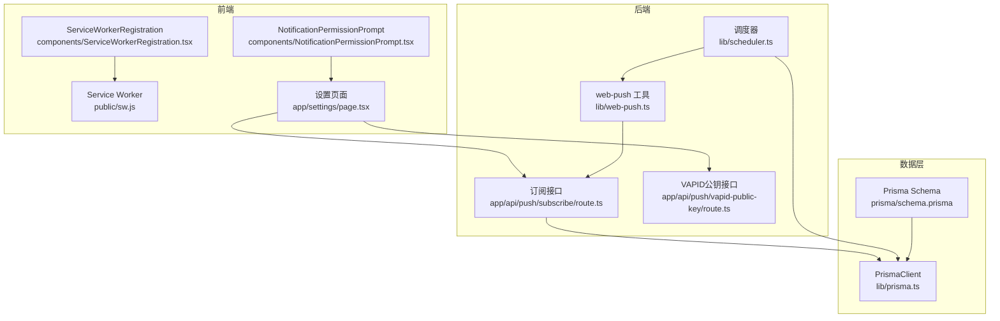
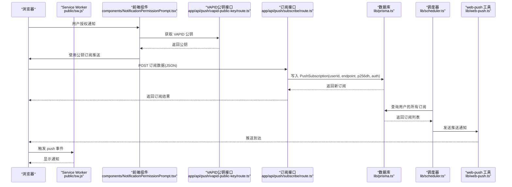
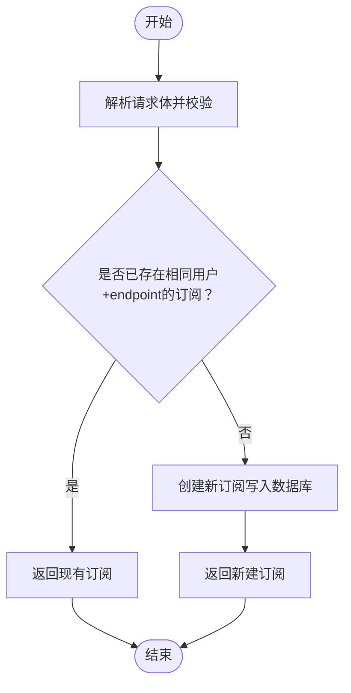
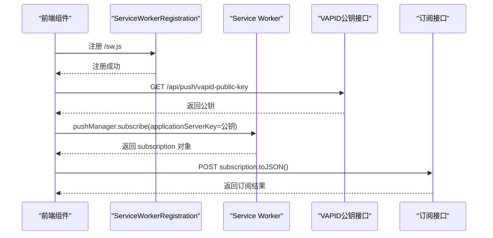
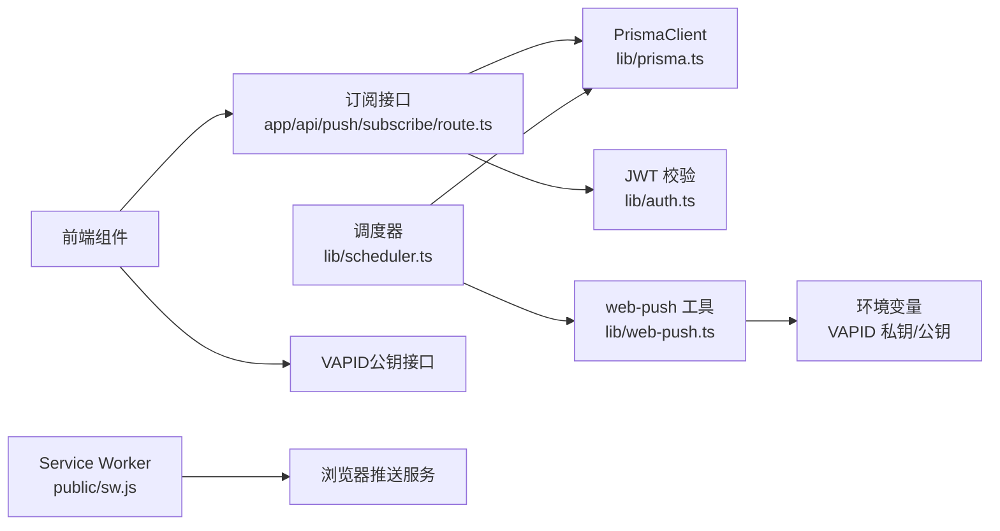

# 推送订阅模型 (PushSubscription)

<cite>
**本文引用的文件**
- [prisma/schema.prisma](file://prisma/schema.prisma)
- [lib/prisma.ts](file://lib/prisma.ts)
- [app/api/push/subscribe/route.ts](file://app/api/push/subscribe/route.ts)
- [app/api/push/vapid-public-key/route.ts](file://app/api/push/vapid-public-key/route.ts)
- [lib/web-push.ts](file://lib/web-push.ts)
- [public/sw.js](file://public/sw.js)
- [components/ServiceWorkerRegistration.tsx](file://components/ServiceWorkerRegistration.tsx)
- [components/NotificationPermissionPrompt.tsx](file://components/NotificationPermissionPrompt.tsx)
- [app/settings/page.tsx](file://app/settings/page.tsx)
- [lib/scheduler.ts](file://lib/scheduler.ts)
</cite>

## 目录
1. [简介](#简介)
2. [项目结构](#项目结构)
3. [核心组件](#核心组件)
4. [架构总览](#架构总览)
5. [详细组件分析](#详细组件分析)
6. [依赖关系分析](#依赖关系分析)
7. [性能考量](#性能考量)
8. [故障排查指南](#故障排查指南)
9. [结论](#结论)
10. [附录](#附录)

## 简介
本文件围绕 PushSubscription 模型进行深入解析，重点说明：
- endpoint、p256dh、auth 字段的来源与在 Web Push 协议中的作用
- 如何通过 userId 关联用户，实现个性化消息推送
- 结合 lib/prisma.ts 中的 PrismaClient，描述保存新订阅与按用户查询订阅列表的流程
- 提供从 public/sw.js 到后端 API 的订阅数据流转示例
- 强调敏感字段（p256dh、auth）的存储安全考虑，并建议使用环境变量加密

## 项目结构
该项目采用 Next.js 应用结构，推送相关代码分布在以下位置：
- 数据模型定义：prisma/schema.prisma
- 数据访问层：lib/prisma.ts
- 前端 Service Worker：public/sw.js
- 前端注册与订阅：components/ServiceWorkerRegistration.tsx、components/NotificationPermissionPrompt.tsx、app/settings/page.tsx
- 后端 API：app/api/push/subscribe/route.ts、app/api/push/vapid-public-key/route.ts
- 推送发送工具：lib/web-push.ts
- 调度器：lib/scheduler.ts

图表来源
- [public/sw.js](file://public/sw.js#L1-L78)
- [components/ServiceWorkerRegistration.tsx](file://components/ServiceWorkerRegistration.tsx#L1-L30)
- [components/NotificationPermissionPrompt.tsx](file://components/NotificationPermissionPrompt.tsx#L37-L76)
- [app/settings/page.tsx](file://app/settings/page.tsx#L125-L143)
- [app/api/push/subscribe/route.ts](file://app/api/push/subscribe/route.ts#L1-L96)
- [app/api/push/vapid-public-key/route.ts](file://app/api/push/vapid-public-key/route.ts#L1-L13)
- [lib/web-push.ts](file://lib/web-push.ts#L1-L54)
- [lib/scheduler.ts](file://lib/scheduler.ts#L1-L86)
- [lib/prisma.ts](file://lib/prisma.ts#L1-L20)
- [prisma/schema.prisma](file://prisma/schema.prisma#L76-L85)

章节来源
- [prisma/schema.prisma](file://prisma/schema.prisma#L76-L85)
- [lib/prisma.ts](file://lib/prisma.ts#L1-L20)
- [app/api/push/subscribe/route.ts](file://app/api/push/subscribe/route.ts#L1-L96)
- [app/api/push/vapid-public-key/route.ts](file://app/api/push/vapid-public-key/route.ts#L1-L13)
- [lib/web-push.ts](file://lib/web-push.ts#L1-L54)
- [public/sw.js](file://public/sw.js#L1-L78)
- [components/ServiceWorkerRegistration.tsx](file://components/ServiceWorkerRegistration.tsx#L1-L30)
- [components/NotificationPermissionPrompt.tsx](file://components/NotificationPermissionPrompt.tsx#L37-L76)
- [app/settings/page.tsx](file://app/settings/page.tsx#L125-L143)
- [lib/scheduler.ts](file://lib/scheduler.ts#L1-L86)

## 核心组件
- PushSubscription 数据模型：包含 id、userId、endpoint、p256dh、auth、createdAt 等字段，用于存储用户的推送订阅信息。
- PrismaClient：通过 lib/prisma.ts 初始化，连接 PostgreSQL 数据库，提供对 PushSubscription 的增删查操作。
- 订阅 API：app/api/push/subscribe/route.ts 提供 POST（保存订阅）与 DELETE（取消订阅）接口，使用 Zod 校验输入，使用 PrismaClient 写入数据库。
- VAPID 公钥 API：app/api/push/vapid-public-key/route.ts 返回 VAPID 公钥，供前端订阅时使用。
- web-push 工具：lib/web-push.ts 配置 VAPID 凭据，封装发送推送通知的函数。
- 调度器：lib/scheduler.ts 定期查询待发送的提醒任务，按用户查询其所有订阅并逐一发送，处理 410 错误自动清理无效订阅。

章节来源
- [prisma/schema.prisma](file://prisma/schema.prisma#L76-L85)
- [lib/prisma.ts](file://lib/prisma.ts#L1-L20)
- [app/api/push/subscribe/route.ts](file://app/api/push/subscribe/route.ts#L1-L96)
- [app/api/push/vapid-public-key/route.ts](file://app/api/push/vapid-public-key/route.ts#L1-L13)
- [lib/web-push.ts](file://lib/web-push.ts#L1-L54)
- [lib/scheduler.ts](file://lib/scheduler.ts#L1-L86)

## 架构总览
下图展示了从浏览器前端到后端 API，再到数据库与推送服务的整体流程。

图表来源
- [components/NotificationPermissionPrompt.tsx](file://components/NotificationPermissionPrompt.tsx#L51-L72)
- [app/api/push/vapid-public-key/route.ts](file://app/api/push/vapid-public-key/route.ts#L1-L13)
- [app/api/push/subscribe/route.ts](file://app/api/push/subscribe/route.ts#L14-L62)
- [lib/prisma.ts](file://lib/prisma.ts#L1-L20)
- [lib/scheduler.ts](file://lib/scheduler.ts#L17-L73)
- [lib/web-push.ts](file://lib/web-push.ts#L28-L46)
- [public/sw.js](file://public/sw.js#L12-L49)

## 详细组件分析

### PushSubscription 模型与字段语义
- 字段定义与关系
  - id：主键
  - userId：外键，关联 User 模型
  - endpoint：推送目标端点，由浏览器推送服务提供
  - p256dh：椭圆曲线密钥，用于 ECDH 导出共享密钥
  - auth：认证标签，用于推送消息的认证
  - createdAt：创建时间

- 在 Web Push 协议中的作用
  - endpoint：标识设备上特定的订阅实例，服务器通过它向客户端推送消息
  - p256dh：与服务器的 VAPID 私钥配对，用于派生会话密钥以加密推送负载
  - auth：与 p256dh 配合，确保推送消息的完整性与来源可信性

- 与用户关联
  - 通过 userId 将订阅与用户绑定，实现“按用户个性化推送”
  - 调度器按 userId 查询该用户的所有订阅，逐一发送通知

章节来源
- [prisma/schema.prisma](file://prisma/schema.prisma#L76-L85)
- [lib/scheduler.ts](file://lib/scheduler.ts#L19-L24)

### 保存新订阅与查询订阅列表（PrismaClient 流程）
- 保存新订阅
  - 前端获取 VAPID 公钥后发起订阅，得到包含 endpoint、keys（p256dh、auth）的订阅对象
  - 前端将订阅对象 JSON 化并 POST 至 /api/push/subscribe
  - 后端校验 JWT，解析 userId，Zod 校验输入，去重检查，最终写入数据库
  - 返回新建的订阅对象

- 查询订阅列表
  - 调度器按 userId 查询该用户的所有 PushSubscription
  - 对每个订阅调用 web-push 发送通知
  - 若收到 410（Gone），删除该订阅

图表来源
- [app/api/push/subscribe/route.ts](file://app/api/push/subscribe/route.ts#L35-L57)

章节来源
- [app/api/push/subscribe/route.ts](file://app/api/push/subscribe/route.ts#L14-L62)
- [lib/prisma.ts](file://lib/prisma.ts#L1-L20)
- [lib/scheduler.ts](file://lib/scheduler.ts#L19-L24)

### 从 public/sw.js 到后端 API 的订阅数据流转示例
- 前端流程
  - 注册 Service Worker（components/ServiceWorkerRegistration.tsx）
  - 请求通知权限（components/NotificationPermissionPrompt.tsx 或 app/settings/page.tsx）
  - 获取 VAPID 公钥（/api/push/vapid-public-key）
  - 使用公钥订阅推送（registration.pushManager.subscribe）
  - 将 subscription.toJSON() 发送到 /api/push/subscribe

- 后端流程
  - /api/push/vapid-public-key 返回 VAPID 公钥
  - /api/push/subscribe 接收订阅数据，校验 JWT，Zod 校验，写入数据库

- Service Worker 行为
  - public/sw.js 处理 push 事件，显示通知

图表来源
- [components/ServiceWorkerRegistration.tsx](file://components/ServiceWorkerRegistration.tsx#L5-L26)
- [components/NotificationPermissionPrompt.tsx](file://components/NotificationPermissionPrompt.tsx#L51-L72)
- [app/settings/page.tsx](file://app/settings/page.tsx#L125-L143)
- [app/api/push/vapid-public-key/route.ts](file://app/api/push/vapid-public-key/route.ts#L1-L13)
- [app/api/push/subscribe/route.ts](file://app/api/push/subscribe/route.ts#L14-L62)
- [public/sw.js](file://public/sw.js#L12-L49)

章节来源
- [components/ServiceWorkerRegistration.tsx](file://components/ServiceWorkerRegistration.tsx#L1-L30)
- [components/NotificationPermissionPrompt.tsx](file://components/NotificationPermissionPrompt.tsx#L37-L76)
- [app/settings/page.tsx](file://app/settings/page.tsx#L125-L143)
- [app/api/push/vapid-public-key/route.ts](file://app/api/push/vapid-public-key/route.ts#L1-L13)
- [app/api/push/subscribe/route.ts](file://app/api/push/subscribe/route.ts#L14-L62)
- [public/sw.js](file://public/sw.js#L1-L78)

### 敏感字段存储安全与环境变量建议
- 当前实现
  - p256dh、auth 字段直接存储于数据库（schema.prisma 中定义）
  - VAPID 私钥通过环境变量注入（lib/web-push.ts）

- 安全建议
  - 对敏感字段进行加密存储：在写入数据库前对 p256dh、auth 进行对称加密，读取时解密
  - 使用强密钥管理：密钥由专门的密钥管理系统（KMS）或硬件安全模块（HSM）保护
  - 最小化暴露面：仅在必要时解密，避免在日志或错误堆栈中输出明文
  - 环境变量加密：VAPID 私钥等敏感配置使用加密存储并在运行时解密
  - 审计与轮换：记录访问日志并定期轮换密钥与 VAPID 凭据

章节来源
- [prisma/schema.prisma](file://prisma/schema.prisma#L76-L85)
- [lib/web-push.ts](file://lib/web-push.ts#L5-L7)

## 依赖关系分析
- 组件耦合
  - app/api/push/subscribe/route.ts 依赖 lib/prisma.ts 与 lib/auth（JWT 校验）
  - lib/scheduler.ts 依赖 lib/prisma.ts 与 lib/web-push.ts
  - lib/web-push.ts 依赖 web-push 库与环境变量
  - 前端组件依赖浏览器推送 API 与 Next.js 路由

- 外部依赖
  - web-push：用于发送推送通知与配置 VAPID
  - Prisma：ORM 层，连接 PostgreSQL
  - 浏览器推送 API：提供 pushManager.subscribe 与 Service Worker

图表来源
- [app/api/push/subscribe/route.ts](file://app/api/push/subscribe/route.ts#L1-L96)
- [lib/prisma.ts](file://lib/prisma.ts#L1-L20)
- [lib/scheduler.ts](file://lib/scheduler.ts#L1-L86)
- [lib/web-push.ts](file://lib/web-push.ts#L1-L54)
- [public/sw.js](file://public/sw.js#L1-L78)

章节来源
- [app/api/push/subscribe/route.ts](file://app/api/push/subscribe/route.ts#L1-L96)
- [lib/scheduler.ts](file://lib/scheduler.ts#L1-L86)
- [lib/web-push.ts](file://lib/web-push.ts#L1-L54)
- [lib/prisma.ts](file://lib/prisma.ts#L1-L20)

## 性能考量
- 批量发送优化
  - 调度器逐条发送通知，若订阅数量较多，可考虑并发限制与退避策略，避免触发推送服务限流
- 数据库查询
  - 按 userId 查询订阅时，建议在 userId 上建立索引（schema.prisma 已默认为主键索引）
- 缓存与去重
  - 前端订阅时先查询是否存在相同 endpoint 的订阅，避免重复写入
- 日志与监控
  - 对发送失败（特别是 410）进行统计与告警，定期清理无效订阅

## 故障排查指南
- 常见问题
  - 410 Gone：订阅失效，需删除无效订阅并提示用户重新订阅
  - 未授权：缺少 JWT 或 userId 解析失败，检查前端登录状态与 Cookie
  - 输入校验失败：subscription JSON 不符合 Zod 规范，检查前端 subscription.toJSON() 输出
  - VAPID 未配置：/api/push/vapid-public-key 返回未配置错误，检查环境变量

- 排查步骤
  - 查看后端日志：订阅与发送过程中的错误信息
  - 检查数据库：确认 PushSubscription 是否正确写入
  - 验证 Service Worker：确认 /sw.js 正常加载与激活
  - 测试推送：手动调用 /api/push/subscribe 并观察返回

章节来源
- [app/api/push/subscribe/route.ts](file://app/api/push/subscribe/route.ts#L58-L61)
- [lib/scheduler.ts](file://lib/scheduler.ts#L58-L68)
- [app/api/push/vapid-public-key/route.ts](file://app/api/push/vapid-public-key/route.ts#L7-L9)

## 结论
PushSubscription 模型通过 endpoint、p256dh、auth 三个关键字段实现了与 Web Push 协议的无缝对接，并借助 userId 实现了面向用户的个性化推送。结合 PrismaClient 的数据持久化能力与调度器的定时发送机制，系统能够稳定地向用户设备推送提醒通知。建议进一步强化敏感字段的加密存储与密钥管理，提升整体安全性。

## 附录
- 相关文件路径
  - 数据模型：prisma/schema.prisma
  - 数据访问：lib/prisma.ts
  - 订阅接口：app/api/push/subscribe/route.ts
  - VAPID 公钥接口：app/api/push/vapid-public-key/route.ts
  - 推送工具：lib/web-push.ts
  - Service Worker：public/sw.js
  - 前端注册组件：components/ServiceWorkerRegistration.tsx、components/NotificationPermissionPrompt.tsx、app/settings/page.tsx
  - 调度器：lib/scheduler.ts