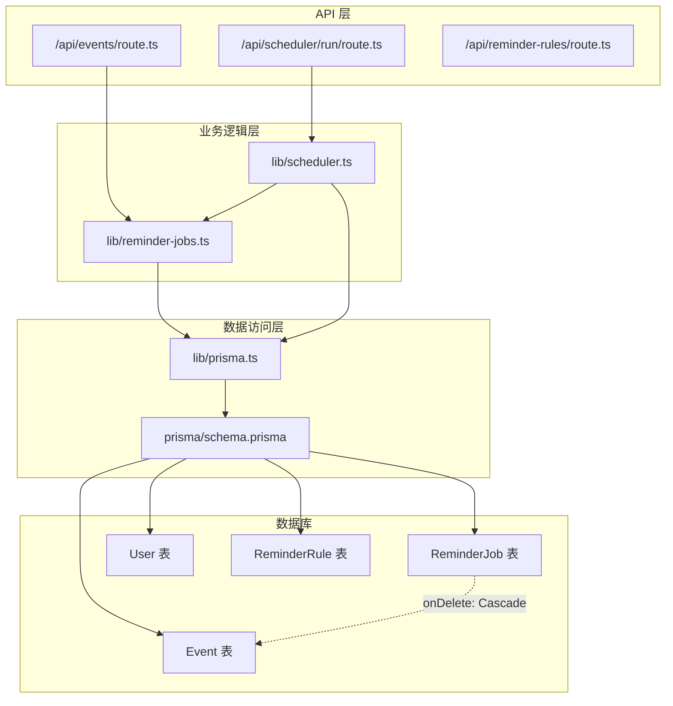
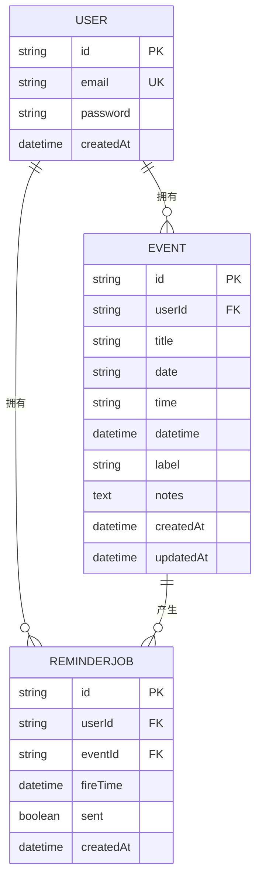
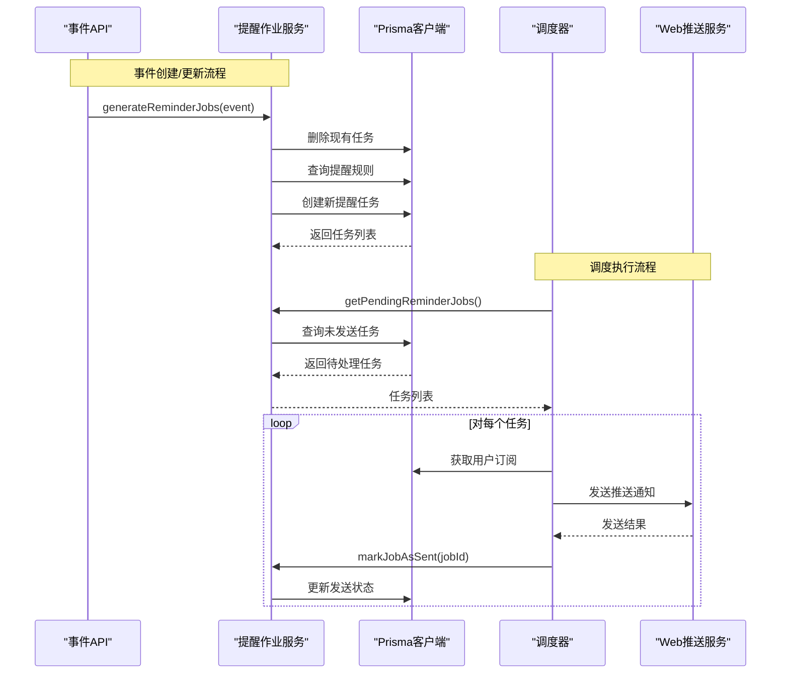
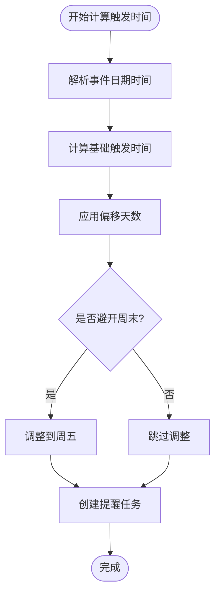
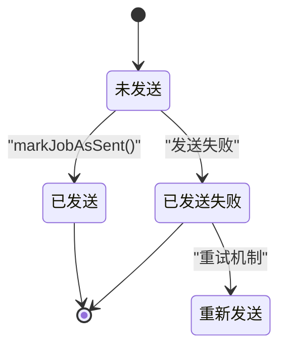
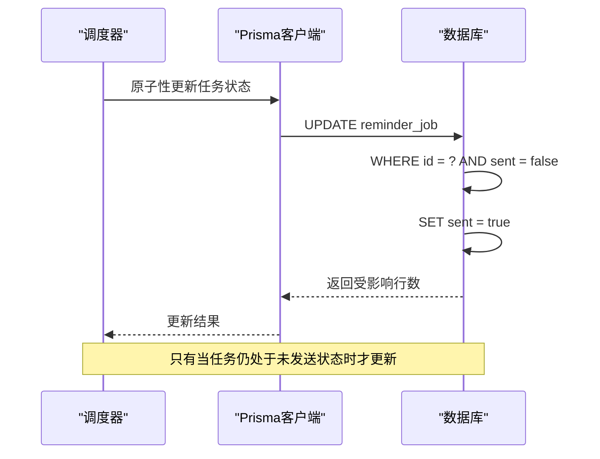
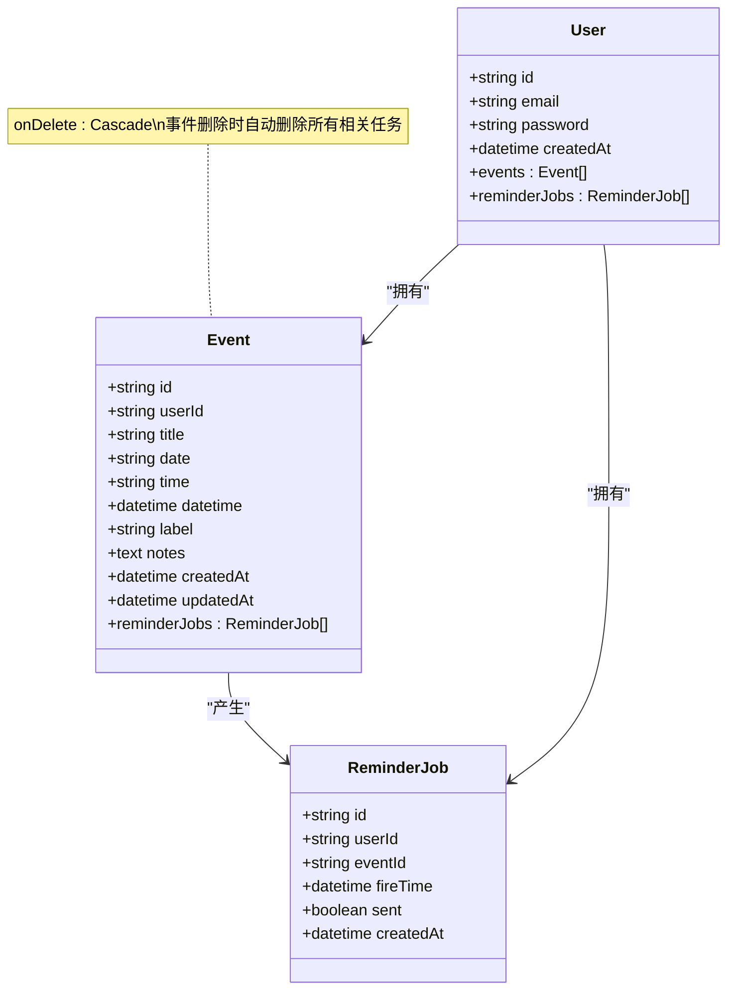
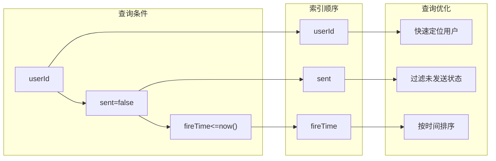
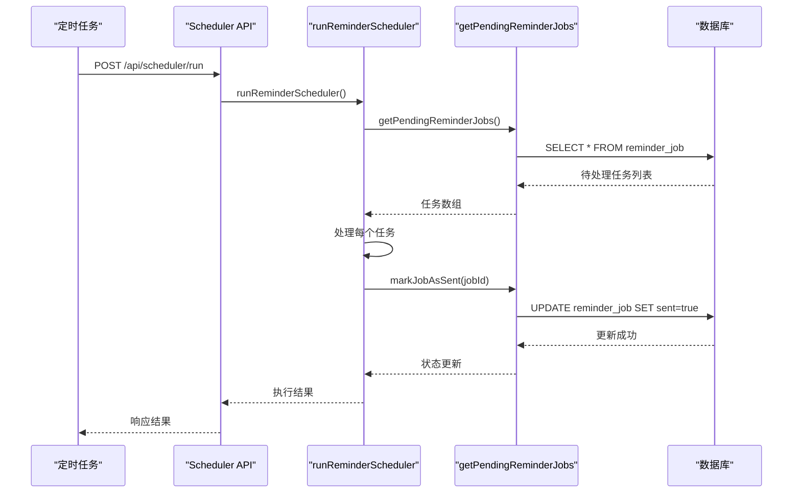
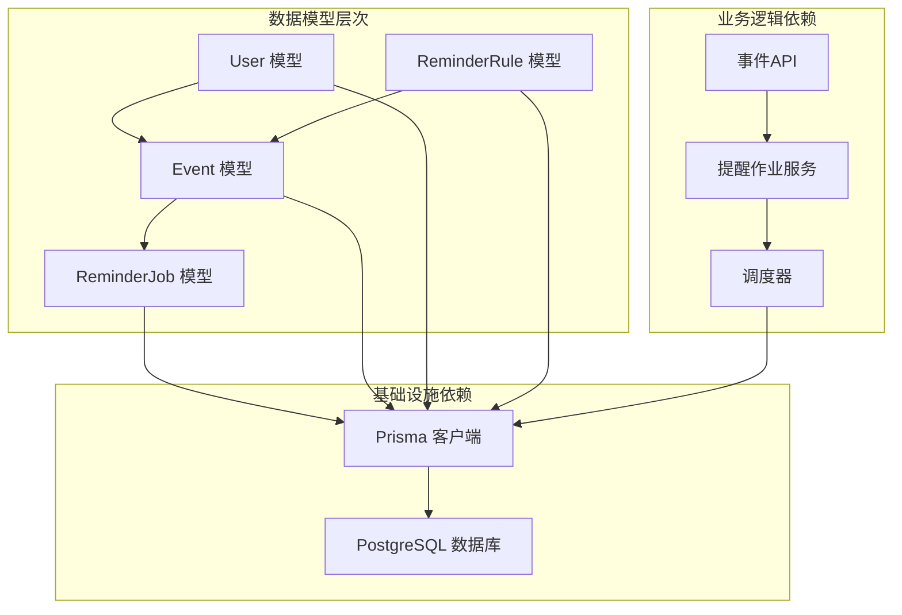

# 提醒任务模型 (ReminderJob)

<cite>
**本文档引用的文件**
- [prisma/schema.prisma](file://prisma/schema.prisma)
- [lib/prisma.ts](file://lib/prisma.ts)
- [lib/reminder-jobs.ts](file://lib/reminder-jobs.ts)
- [lib/scheduler.ts](file://lib/scheduler.ts)
- [app/api/scheduler/run/route.ts](file://app/api/scheduler/run/route.ts)
- [app/api/events/route.ts](file://app/api/events/route.ts)
- [docs/SCHEDULER_SETUP.md](file://docs/SCHEDULER_SETUP.md)
</cite>

## 目录
1. [简介](#简介)
2. [项目结构](#项目结构)
3. [核心组件](#核心组件)
4. [架构概览](#架构概览)
5. [详细组件分析](#详细组件分析)
6. [依赖关系分析](#依赖关系分析)
7. [性能考虑](#性能考虑)
8. [故障排除指南](#故障排除指南)
9. [结论](#结论)

## 简介

ReminderJob 模型是本项目提醒系统的核心数据结构，负责管理用户的提醒任务调度。该模型通过 fireTime（触发时间）和 sent（发送状态）两个关键字段，实现了高效的提醒任务调度机制。模型采用 PostgreSQL 数据库存储，通过 Prisma ORM 提供类型安全的数据访问层。

本模型具有以下关键特性：
- 通过 eventId 与 Event 模型建立外键关联
- 配置 onDelete: Cascade 实现事件删除时自动清理相关任务
- 使用复合索引 @@index([userId, sent, fireTime]) 优化查询性能
- 支持用户级提醒任务隔离和高效检索

## 项目结构

项目采用基于功能模块的组织方式，ReminderJob 模型位于数据层，调度逻辑位于业务层，API 层负责对外接口。



**图表来源**
- [prisma/schema.prisma](file://prisma/schema.prisma#L62-L74)
- [lib/scheduler.ts](file://lib/scheduler.ts#L1-L86)
- [lib/reminder-jobs.ts](file://lib/reminder-jobs.ts#L1-L109)

**章节来源**
- [prisma/schema.prisma](file://prisma/schema.prisma#L1-L86)
- [lib/prisma.ts](file://lib/prisma.ts#L1-L20)

## 核心组件

### ReminderJob 模型定义

ReminderJob 模型包含以下核心字段：

| 字段名 | 类型 | 描述 | 约束 |
|--------|------|------|------|
| id | String | 主键，使用 cuid() 生成 | @id @default(cuid()) |
| userId | String | 用户标识符 | 外键到 User 表 |
| eventId | String | 事件标识符 | 外键到 Event 表 |
| fireTime | DateTime | 任务触发时间 | 必填 |
| sent | Boolean | 发送状态，默认 false | @default(false) |
| createdAt | DateTime | 创建时间 | @default(now()) |

### 关系映射



**图表来源**
- [prisma/schema.prisma](file://prisma/schema.prisma#L16-L74)

**章节来源**
- [prisma/schema.prisma](file://prisma/schema.prisma#L62-L74)

## 架构概览

ReminderJob 模型在整个提醒系统中扮演着关键角色，连接了事件管理、提醒规则配置和通知推送三个核心功能模块。



**图表来源**
- [app/api/events/route.ts](file://app/api/events/route.ts#L185-L193)
- [lib/reminder-jobs.ts](file://lib/reminder-jobs.ts#L77-L98)
- [lib/scheduler.ts](file://lib/scheduler.ts#L8-L85)

## 详细组件分析

### fireTime（触发时间）字段分析

fireTime 是 ReminderJob 模型的核心调度字段，决定了任务何时被触发执行。

#### 触发时间计算逻辑



**图表来源**
- [lib/reminder-jobs.ts](file://lib/reminder-jobs.ts#L38-L54)

#### 触发时间查询策略

调度器使用 fireTime 字段进行高效的任务筛选：

```mermaid
flowchart TD
QueryStart([开始查询]) --> FilterByStatus["过滤已发送状态"]
FilterByStatus --> FilterByTime["过滤触发时间<=当前时间"]
FilterByTime --> SortByTime["按触发时间升序排序"]
SortByTime --> ReturnResults["返回结果集"]
ReturnResults --> QueryEnd([查询结束])
FilterByStatus --> |sent=false| FilterByTime
FilterByTime --> |fireTime<=now()| SortByTime
SortByTime --> |fireTime asc| ReturnResults
```

**图表来源**
- [lib/reminder-jobs.ts](file://lib/reminder-jobs.ts#L77-L98)

**章节来源**
- [lib/reminder-jobs.ts](file://lib/reminder-jobs.ts#L38-L62)
- [lib/reminder-jobs.ts](file://lib/reminder-jobs.ts#L77-L98)

### sent（发送状态）字段分析

sent 字段用于跟踪提醒任务的发送状态，确保每个任务只被处理一次。

#### 状态流转图



#### 原子性更新操作

虽然当前实现使用简单的 update 操作，但可以升级为更高效的原子性操作：



**图表来源**
- [lib/reminder-jobs.ts](file://lib/reminder-jobs.ts#L103-L108)

**章节来源**
- [lib/reminder-jobs.ts](file://lib/reminder-jobs.ts#L103-L108)

### 外键关联与级联删除

ReminderJob 模型通过 eventId 与 Event 模型建立外键关联，并配置 onDelete: Cascade 实现级联删除。

#### 关联关系设计



**图表来源**
- [prisma/schema.prisma](file://prisma/schema.prisma#L28-L74)

**章节来源**
- [prisma/schema.prisma](file://prisma/schema.prisma#L67)

### 复合索引优化

@@index([userId, sent, fireTime]) 是调度器高效检索待发送任务的关键。

#### 索引设计原理



**图表来源**
- [prisma/schema.prisma](file://prisma/schema.prisma#L73)

#### 查询性能分析

该复合索引支持以下查询模式：
- 用户级任务过滤：快速定位特定用户的提醒任务
- 状态过滤：高效筛选未发送的任务
- 时间范围查询：支持按触发时间范围的精确查询
- 排序优化：天然支持按触发时间升序排列

**章节来源**
- [prisma/schema.prisma](file://prisma/schema.prisma#L73)

### 调度器集成

调度器通过 lib/reminder-jobs.ts 中的 getPendingReminderJobs() 方法使用 Prisma 查询未发送且触发时间已到的任务。

#### 调度执行流程



**图表来源**
- [app/api/scheduler/run/route.ts](file://app/api/scheduler/run/route.ts#L8-L26)
- [lib/scheduler.ts](file://lib/scheduler.ts#L8-L85)
- [lib/reminder-jobs.ts](file://lib/reminder-jobs.ts#L77-L98)

**章节来源**
- [lib/scheduler.ts](file://lib/scheduler.ts#L8-L85)
- [lib/reminder-jobs.ts](file://lib/reminder-jobs.ts#L77-L98)

## 依赖关系分析

### 数据模型依赖



**图表来源**
- [prisma/schema.prisma](file://prisma/schema.prisma#L16-L85)
- [lib/reminder-jobs.ts](file://lib/reminder-jobs.ts#L1-L109)
- [lib/scheduler.ts](file://lib/scheduler.ts#L1-L86)

### 外部依赖

- **Prisma ORM**: 提供类型安全的数据库访问
- **PostgreSQL**: 作为主要数据存储
- **Web Push API**: 用于推送通知
- **Vercel Cron**: 生产环境调度执行

**章节来源**
- [lib/prisma.ts](file://lib/prisma.ts#L1-L20)
- [docs/SCHEDULER_SETUP.md](file://docs/SCHEDULER_SETUP.md#L1-L88)

## 性能考虑

### 查询优化策略

1. **复合索引利用**: @@index([userId, sent, fireTime]) 确保查询效率
2. **分页处理**: 对大量任务进行分批处理避免内存溢出
3. **并发控制**: 调度器使用串行处理确保数据一致性
4. **缓存策略**: 用户订阅信息可适当缓存减少查询次数

### 存储优化

- **数据类型选择**: 使用 DateTime 类型存储时间戳，支持精确的时间比较
- **布尔字段**: sent 字段使用布尔类型，占用空间小且查询效率高
- **外键约束**: 确保数据完整性的同时支持级联删除

### 扩展性考虑

- **水平扩展**: 可以通过添加更多调度器实例实现负载分担
- **队列系统**: 大规模部署时可引入消息队列系统
- **读写分离**: 高并发场景下可考虑读写分离架构

## 故障排除指南

### 常见问题及解决方案

#### 1. 调度器不执行任务

**症状**: 调度器运行但没有发送任何通知
**排查步骤**:
1. 检查数据库连接配置
2. 验证定时任务配置
3. 查看日志输出确认执行状态

#### 2. 任务重复发送

**症状**: 同一任务被多次发送
**排查步骤**:
1. 检查 sent 字段更新逻辑
2. 验证数据库事务处理
3. 确认调度器并发控制

#### 3. 任务无法删除

**症状**: 删除事件后相关任务仍然存在
**排查步骤**:
1. 验证外键约束配置
2. 检查数据库级联删除设置
3. 确认 Prisma 版本兼容性

### 调试工具

- **数据库监控**: 使用 PostgreSQL 的 EXPLAIN 分析查询性能
- **日志分析**: 查看调度器执行日志和错误信息
- **指标监控**: 监控任务处理数量和成功率

**章节来源**
- [lib/scheduler.ts](file://lib/scheduler.ts#L74-L84)
- [docs/SCHEDULER_SETUP.md](file://docs/SCHEDULER_SETUP.md#L68-L88)

## 结论

ReminderJob 模型通过精心设计的字段结构、关系映射和索引策略，为整个提醒系统提供了高效可靠的基础。fireTime 和 sent 字段的组合使用确保了任务调度的准确性和可靠性，而复合索引的设计则保证了大规模数据下的查询性能。

该模型的成功实施体现了以下设计原则：
- **数据完整性**: 通过外键约束和级联删除确保数据一致性
- **查询效率**: 复合索引优化支持高频查询场景
- **扩展性**: 模块化设计便于功能扩展和维护
- **可靠性**: 原子性更新和错误处理机制保障系统稳定运行

未来可以在现有基础上进一步优化，如引入更高级的并发控制机制、实现任务重试策略、增加监控告警等功能，以适应更大规模的应用场景。