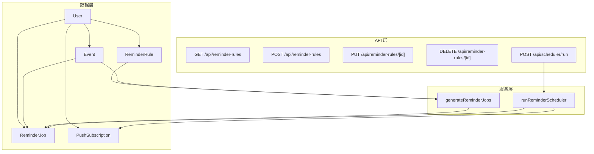
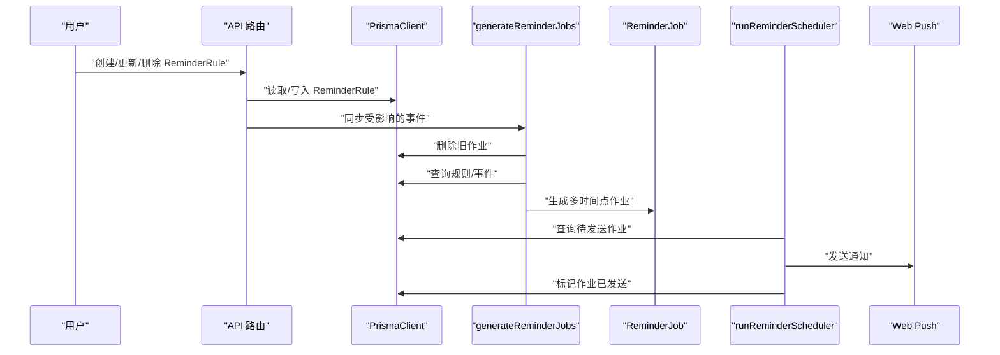
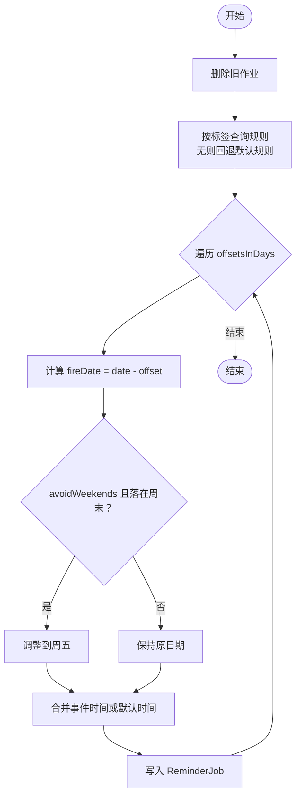
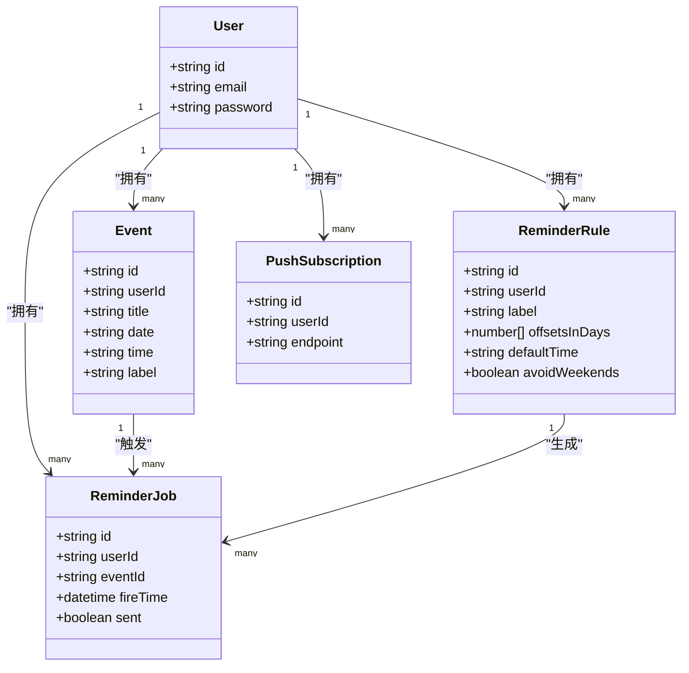
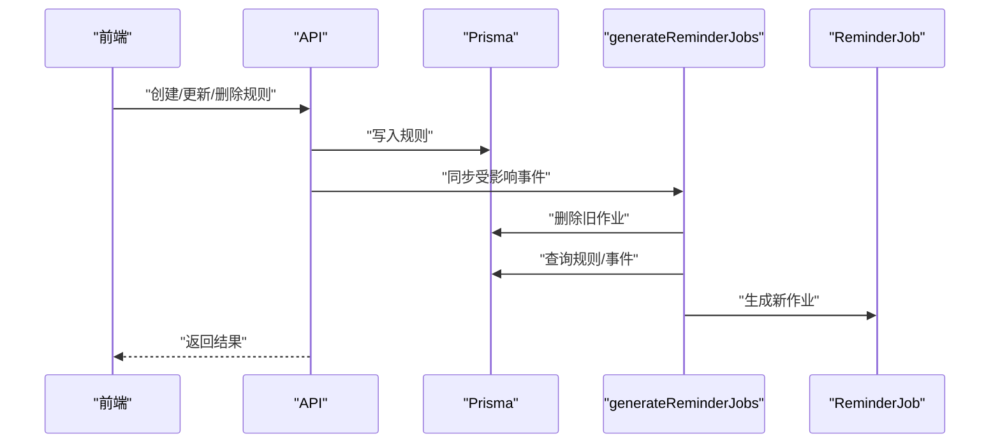

# 提醒规则模型 (ReminderRule)

<cite>
**本文引用的文件列表**
- [prisma/schema.prisma](file://prisma/schema.prisma)
- [lib/prisma.ts](file://lib/prisma.ts)
- [app/api/reminder-rules/route.ts](file://app/api/reminder-rules/route.ts)
- [app/api/reminder-rules/[id]/route.ts](file://app/api/reminder-rules/[id]/route.ts)
- [lib/reminder-jobs.ts](file://lib/reminder-jobs.ts)
- [lib/scheduler.ts](file://lib/scheduler.ts)
- [app/api/scheduler/run/route.ts](file://app/api/scheduler/run/route.ts)
- [components/ReminderRuleDialog.tsx](file://components/ReminderRuleDialog.tsx)
- [docs/PRD.md](file://docs/PRD.md)
- [docs/SCHEDULER_SETUP.md](file://docs/SCHEDULER_SETUP.md)
</cite>

## 目录
1. [简介](#简介)
2. [项目结构](#项目结构)
3. [核心组件](#核心组件)
4. [架构总览](#架构总览)
5. [详细组件分析](#详细组件分析)
6. [依赖关系分析](#依赖关系分析)
7. [性能考量](#性能考量)
8. [故障排查指南](#故障排查指南)
9. [结论](#结论)
10. [附录](#附录)

## 简介
本文件深入解析 ReminderRule 模型及其在系统中的作用，重点说明以下方面：
- 字段语义：label、offsetsInDays、defaultTime、avoidWeekends 的业务含义
- offsetsInDays 使用整型数组实现多时间点提醒的技术优势
- @@unique([userId, label]) 约束如何防止同一用户创建重复标签规则
- 结合 lib/prisma.ts，演示如何通过 PrismaClient 查询用户专属规则
- 规则匹配事件的伪代码逻辑（当事件 label 匹配时触发提醒任务生成）
- avoidWeekends=true 时对 fireTime 计算的影响

## 项目结构
ReminderRule 模型位于数据层，配合事件模型与提醒作业模型共同构成“基于标签的多时间点提醒”体系。API 层负责规则的增删改查与同步，作业生成层负责根据规则计算并落库提醒任务，调度层负责扫描并发送通知。

图表来源
- [prisma/schema.prisma](file://prisma/schema.prisma#L16-L85)
- [app/api/reminder-rules/route.ts](file://app/api/reminder-rules/route.ts#L13-L39)
- [app/api/reminder-rules/[id]/route.ts](file://app/api/reminder-rules/[id]/route.ts#L13-L92)
- [lib/reminder-jobs.ts](file://lib/reminder-jobs.ts#L15-L72)
- [lib/scheduler.ts](file://lib/scheduler.ts#L8-L85)
- [app/api/scheduler/run/route.ts](file://app/api/scheduler/run/route.ts#L8-L26)

章节来源
- [prisma/schema.prisma](file://prisma/schema.prisma#L16-L85)
- [app/api/reminder-rules/route.ts](file://app/api/reminder-rules/route.ts#L13-L39)
- [app/api/reminder-rules/[id]/route.ts](file://app/api/reminder-rules/[id]/route.ts#L13-L92)
- [lib/reminder-jobs.ts](file://lib/reminder-jobs.ts#L15-L72)
- [lib/scheduler.ts](file://lib/scheduler.ts#L8-L85)
- [app/api/scheduler/run/route.ts](file://app/api/scheduler/run/route.ts#L8-L26)

## 核心组件
- ReminderRule：按用户与标签维度配置的提醒规则，包含多时间点偏移、默认提醒时间、周末规避策略。
- Event：事件实体，带 label 与日期时间，驱动提醒规则匹配与作业生成。
- ReminderJob：具体提醒任务，包含 fireTime、是否已发送等状态。
- API 路由：提供规则的增删改查与同步逻辑。
- 作业生成器：根据规则计算 fireTime，并考虑周末规避。
- 调度器：扫描待发送作业并推送通知。

章节来源
- [prisma/schema.prisma](file://prisma/schema.prisma#L47-L60)
- [lib/reminder-jobs.ts](file://lib/reminder-jobs.ts#L15-L72)
- [lib/scheduler.ts](file://lib/scheduler.ts#L8-L85)

## 架构总览
ReminderRule 与 Event 通过 label 进行关联，生成 ReminderJob。调度器定期扫描 ReminderJob，向用户推送 Web Push 通知。

图表来源
- [app/api/reminder-rules/route.ts](file://app/api/reminder-rules/route.ts#L62-L101)
- [app/api/reminder-rules/[id]/route.ts](file://app/api/reminder-rules/[id]/route.ts#L58-L82)
- [lib/reminder-jobs.ts](file://lib/reminder-jobs.ts#L15-L72)
- [lib/scheduler.ts](file://lib/scheduler.ts#L8-L85)

## 详细组件分析

### ReminderRule 模型字段语义
- label：规则所针对的事件标签。同一用户下，每个 label 仅允许存在一条规则（见唯一性约束）。
- offsetsInDays：整型数组，表示“距离事件日期提前多少天”的多个时间点。例如 [7, 3, 1] 表示提前一周、三天、一天各生成一次提醒。
- defaultTime：默认提醒时间（HH:mm）。当事件未指定时间时，使用该时间与事件日期组合成 fireTime。
- avoidWeekends：布尔标志，启用后若计算出的 fireTime 落在周末，则自动调整到周五。

章节来源
- [prisma/schema.prisma](file://prisma/schema.prisma#L47-L60)
- [docs/PRD.md](file://docs/PRD.md#L231-L273)

### 多时间点提醒的技术优势（offsetsInDays 使用整型数组）
- 灵活配置：支持一次性声明多个提前天数，无需为每个天数单独建模。
- 性能友好：在生成阶段一次性遍历数组，避免多次查询与循环。
- 易于扩展：新增或调整提醒节奏只需修改数组元素，无需改动数据结构。
- 一致性：同一规则下的多个提醒点共享 defaultTime 与 avoidWeekends 策略，保持行为一致。

章节来源
- [lib/reminder-jobs.ts](file://lib/reminder-jobs.ts#L42-L62)

### 唯一性约束 @@unique([userId, label]) 的作用
- 防止重复：同一用户不能对同一 label 创建多条规则，避免规则冲突与重复提醒。
- 简化匹配：查询时无需考虑多条规则，直接按 userId+label 获取唯一规则。
- 业务清晰：每个标签对应一套提醒策略，便于用户理解与维护。

章节来源
- [prisma/schema.prisma](file://prisma/schema.prisma#L59)

### 通过 PrismaClient 查询用户专属规则
- 查询方式：按 userId 过滤，返回该用户的所有规则；或按 userId+label 精确匹配。
- 实际调用位置：API 层在创建/更新/删除规则时均进行用户归属校验与查询。
- 示例路径：
  - 获取用户全部规则：[app/api/reminder-rules/route.ts](file://app/api/reminder-rules/route.ts#L25-L32)
  - 按标签查找规则：[lib/reminder-jobs.ts](file://lib/reminder-jobs.ts#L22-L30)

章节来源
- [app/api/reminder-rules/route.ts](file://app/api/reminder-rules/route.ts#L25-L32)
- [lib/reminder-jobs.ts](file://lib/reminder-jobs.ts#L22-L30)
- [lib/prisma.ts](file://lib/prisma.ts#L13-L15)

### 规则匹配事件的伪代码逻辑
- 输入：事件对象（含 userId、label、date、time）
- 步骤：
  1) 删除该事件已有的提醒作业
  2) 根据事件 label 查询用户专属规则；若无规则则回退到默认规则（提前1天，10:00）
  3) 对 offsetsInDays 中的每个 d：
     - 计算 fireDate = date - d天
     - 若 avoidWeekends 为真且 fireDate 为周六/周日，则调整到周五
     - fireTime = fireDate + 对应时间（事件 time 或 defaultTime）
  4) 将所有 fireTime 写入 ReminderJob
- 参考实现路径：
  - 作业生成函数：[lib/reminder-jobs.ts](file://lib/reminder-jobs.ts#L15-L72)

图表来源
- [lib/reminder-jobs.ts](file://lib/reminder-jobs.ts#L15-L72)

章节来源
- [lib/reminder-jobs.ts](file://lib/reminder-jobs.ts#L15-L72)

### avoidWeekends=true 对 fireTime 计算的影响
- 计算逻辑：若 fireTime 的星期为周日（0）或周六（6），则分别回退到周五（-2天或-1天）。
- 业务价值：确保提醒在工作日发出，避免周末被忽略。
- 参考实现路径：
  - 周末规避逻辑：[lib/reminder-jobs.ts](file://lib/reminder-jobs.ts#L46-L54)
  - PRD 中的说明与示例：[docs/PRD.md](file://docs/PRD.md#L233-L256)

章节来源
- [lib/reminder-jobs.ts](file://lib/reminder-jobs.ts#L46-L54)
- [docs/PRD.md](file://docs/PRD.md#L233-L256)

### API 与前端交互要点
- 创建规则：校验输入、检查重复、创建规则并同步受影响事件。
  - 路径参考：[app/api/reminder-rules/route.ts](file://app/api/reminder-rules/route.ts#L41-L108)
- 更新规则：校验输入、归属校验、更新规则并同步旧/新标签下的事件。
  - 路径参考：[app/api/reminder-rules/[id]/route.ts](file://app/api/reminder-rules/[id]/route.ts#L13-L92)
- 删除规则：删除规则并同步受影响事件。
  - 路径参考：[app/api/reminder-rules/[id]/route.ts](file://app/api/reminder-rules/[id]/route.ts#L94-L157)
- 前端表单：支持多时间点输入（逗号分隔，兼容中英文逗号），默认值与周末规避开关。
  - 路径参考：[components/ReminderRuleDialog.tsx](file://components/ReminderRuleDialog.tsx#L25-L109)

章节来源
- [app/api/reminder-rules/route.ts](file://app/api/reminder-rules/route.ts#L41-L108)
- [app/api/reminder-rules/[id]/route.ts](file://app/api/reminder-rules/[id]/route.ts#L13-L157)
- [components/ReminderRuleDialog.tsx](file://components/ReminderRuleDialog.tsx#L25-L109)

## 依赖关系分析

图表来源
- [prisma/schema.prisma](file://prisma/schema.prisma#L16-L85)

章节来源
- [prisma/schema.prisma](file://prisma/schema.prisma#L16-L85)

## 性能考量
- 查询优化：按 userId 过滤规则与事件，避免跨用户扫描。
- 生成效率：offsetsInDays 为数组映射，时间复杂度 O(n)，n 为提前天数数量。
- 周末规避：仅进行少量日期运算，影响极小。
- 批量写入：生成 ReminderJob 时使用 createMany，减少往返次数。
- 调度频率：建议每分钟执行一次，兼顾实时性与资源消耗。

章节来源
- [lib/reminder-jobs.ts](file://lib/reminder-jobs.ts#L65-L69)
- [docs/SCHEDULER_SETUP.md](file://docs/SCHEDULER_SETUP.md#L5-L16)

## 故障排查指南
- 规则重复创建失败
  - 现象：创建规则时报“该标签已有规则”。
  - 原因：唯一性约束阻止重复标签。
  - 处理：先更新或删除旧规则，再创建新规则。
  - 参考：[app/api/reminder-rules/route.ts](file://app/api/reminder-rules/route.ts#L62-L72)
- 规则归属校验失败
  - 现象：更新/删除时报“规则不存在或禁止访问”。
  - 原因：规则不属于当前用户。
  - 处理：确认 JWT 有效且与规则 userId 匹配。
  - 参考：[app/api/reminder-rules/[id]/route.ts](file://app/api/reminder-rules/[id]/route.ts#L33-L44)
- 未生成提醒作业
  - 现象：事件更新后未产生提醒。
  - 排查：确认事件 label 是否与规则 label 匹配；确认调度器是否正常运行。
  - 参考：[lib/reminder-jobs.ts](file://lib/reminder-jobs.ts#L21-L30)
- 周末提醒未调整
  - 现象：提醒仍落在周六/周日。
  - 排查：确认 avoidWeekends 已启用；确认事件日期与偏移计算正确。
  - 参考：[lib/reminder-jobs.ts](file://lib/reminder-jobs.ts#L46-L54)
- 通知未送达
  - 现象：调度器扫描到作业但未发送。
  - 排查：确认用户存在有效订阅；检查 web-push 返回状态与无效订阅清理逻辑。
  - 参考：[lib/scheduler.ts](file://lib/scheduler.ts#L19-L73)

章节来源
- [app/api/reminder-rules/route.ts](file://app/api/reminder-rules/route.ts#L62-L72)
- [app/api/reminder-rules/[id]/route.ts](file://app/api/reminder-rules/[id]/route.ts#L33-L44)
- [lib/reminder-jobs.ts](file://lib/reminder-jobs.ts#L21-L30)
- [lib/reminder-jobs.ts](file://lib/reminder-jobs.ts#L46-L54)
- [lib/scheduler.ts](file://lib/scheduler.ts#L19-L73)

## 结论
ReminderRule 通过“标签+多时间点+周末规避”的组合，提供了灵活、可靠且易维护的提醒策略。其唯一性约束确保了规则的一致性，PrismaClient 的高效查询与 createMany 的批量写入保障了性能。结合调度器的定期扫描与 Web Push 通知，系统实现了从规则到提醒的完整闭环。

## 附录

### 规则匹配与作业生成的端到端流程

图表来源
- [app/api/reminder-rules/route.ts](file://app/api/reminder-rules/route.ts#L84-L101)
- [app/api/reminder-rules/[id]/route.ts](file://app/api/reminder-rules/[id]/route.ts#L58-L82)
- [lib/reminder-jobs.ts](file://lib/reminder-jobs.ts#L15-L72)