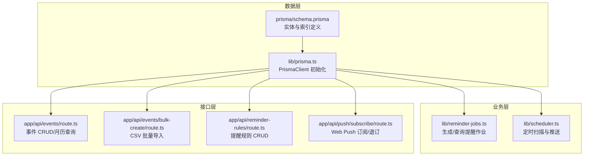
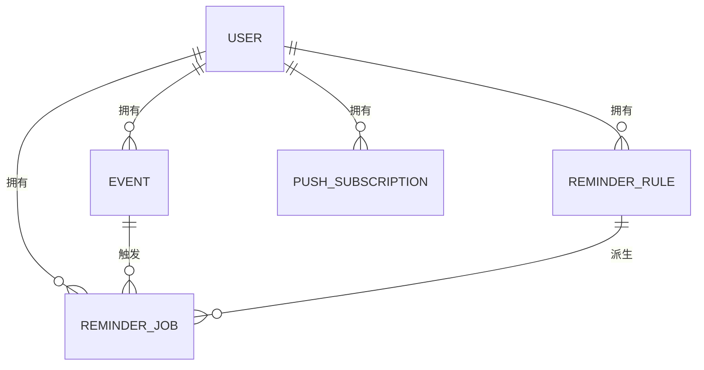
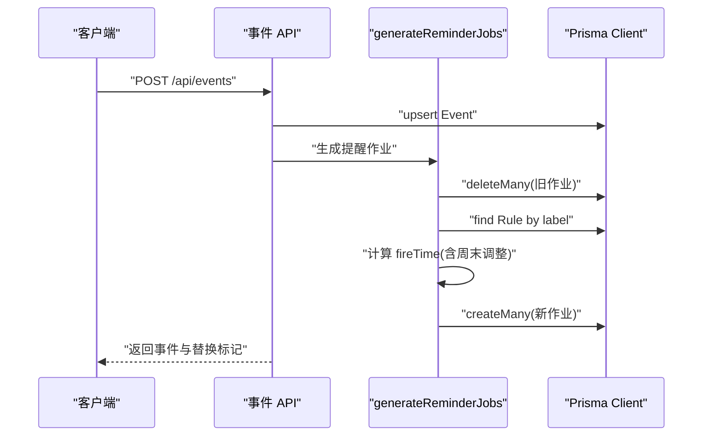
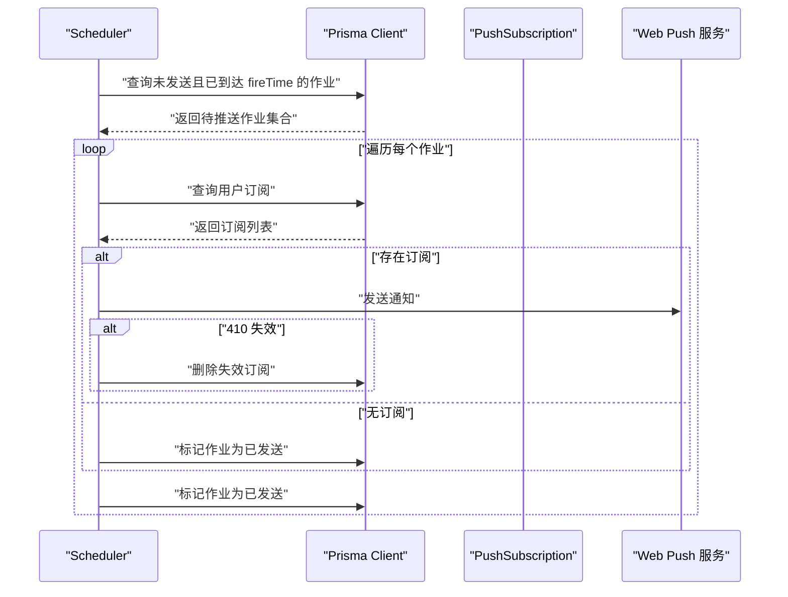
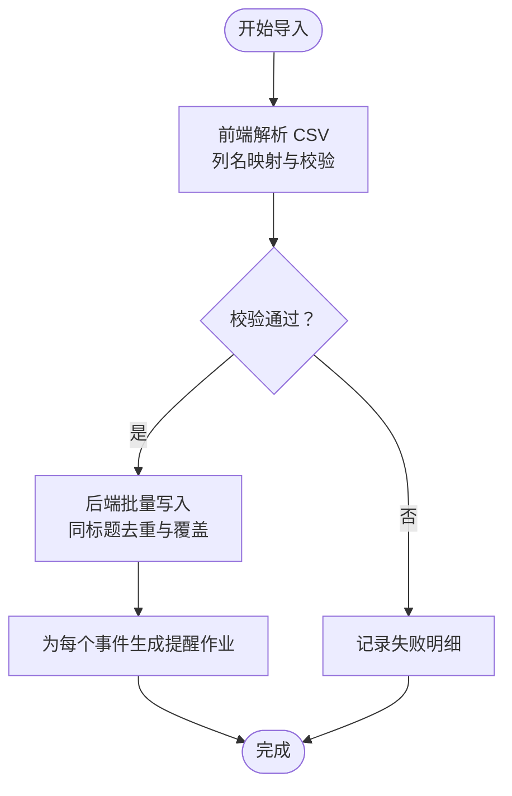
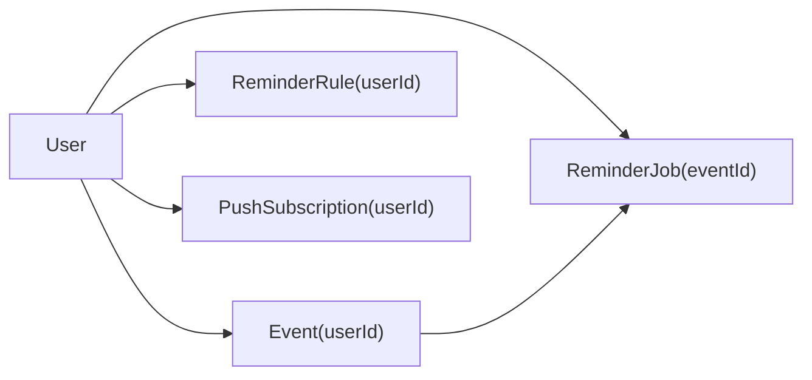

# 数据模型

<cite>
**本文引用的文件**
- [prisma/schema.prisma](file://prisma/schema.prisma)
- [lib/prisma.ts](file://lib/prisma.ts)
- [lib/reminder-jobs.ts](file://lib/reminder-jobs.ts)
- [lib/scheduler.ts](file://lib/scheduler.ts)
- [app/api/events/route.ts](file://app/api/events/route.ts)
- [app/api/events/bulk-create/route.ts](file://app/api/events/bulk-create/route.ts)
- [app/api/reminder-rules/route.ts](file://app/api/reminder-rules/route.ts)
- [app/api/push/subscribe/route.ts](file://app/api/push/subscribe/route.ts)
- [_legacy_backup/docs/PRD.md](file://_legacy_backup/docs/PRD.md)
</cite>

## 目录
1. [简介](#简介)
2. [项目结构](#项目结构)
3. [核心组件](#核心组件)
4. [架构总览](#架构总览)
5. [详细组件分析](#详细组件分析)
6. [依赖分析](#依赖分析)
7. [性能考虑](#性能考虑)
8. [故障排查指南](#故障排查指南)
9. [结论](#结论)
10. [附录](#附录)

## 简介
本文件面向 todo-csv-import 项目的数据模型，基于 schema.prisma 描述核心实体 User、Event、ReminderRule、ReminderJob 和 PushSubscription 的字段定义、数据类型、主外键关系与约束条件；结合 lib/prisma.ts 的 Prisma Client 初始化与连接管理机制，解释索引设计对查询性能的影响；并总结数据生命周期管理策略（如软删除与通知记录保留周期）。

## 项目结构
围绕数据模型的关键文件组织如下：
- 数据模型定义：prisma/schema.prisma
- Prisma 客户端初始化与连接池：lib/prisma.ts
- 提醒作业生成与调度：lib/reminder-jobs.ts、lib/scheduler.ts
- API 层（事件、提醒规则、Web Push 订阅）：app/api/* 路由处理器
- 历史文档与需求说明：_legacy_backup/docs/PRD.md

图表来源
- [lib/prisma.ts](file://lib/prisma.ts#L1-L20)
- [prisma/schema.prisma](file://prisma/schema.prisma#L1-L86)
- [lib/reminder-jobs.ts](file://lib/reminder-jobs.ts#L1-L109)
- [lib/scheduler.ts](file://lib/scheduler.ts#L1-L86)
- [app/api/events/route.ts](file://app/api/events/route.ts#L1-L200)
- [app/api/events/bulk-create/route.ts](file://app/api/events/bulk-create/route.ts#L1-L133)
- [app/api/reminder-rules/route.ts](file://app/api/reminder-rules/route.ts#L1-L109)
- [app/api/push/subscribe/route.ts](file://app/api/push/subscribe/route.ts#L1-L96)

章节来源
- [prisma/schema.prisma](file://prisma/schema.prisma#L1-L86)
- [lib/prisma.ts](file://lib/prisma.ts#L1-L20)

## 核心组件
本节从数据模型角度，逐个梳理五类实体的字段、类型、主外键与约束。

- User（用户）
  - 字段与类型：id(String, 主键), email(String, 唯一), password(String), createdAt(DateTime)
  - 关系：一对多到 Event、ReminderRule、ReminderJob、PushSubscription
  - 约束：email 唯一

- Event（事件）
  - 字段与类型：id(String, 主键), userId(String 外键), user(User), title(String), date(String, YYYY-MM-DD), time(String?, HH:mm), datetime(DateTime, 排序/查询用), label(String?), notes(String?)
  - 时间戳：createdAt(DateTime), updatedAt(DateTime)
  - 索引：(@@index([userId, date]))

- ReminderRule（提醒规则）
  - 字段与类型：id(String, 主键), userId(String 外键), user(User), label(String, 规则标识), offsetsInDays(Int[]), defaultTime(String), avoidWeekends(Boolean)
  - 时间戳：createdAt(DateTime), updatedAt(DateTime)
  - 约束：(@@unique([userId, label]))

- ReminderJob（提醒作业）
  - 字段与类型：id(String, 主键), userId(String 外键), user(User), eventId(String 外键), event(Event, 级联删除), fireTime(DateTime), sent(Boolean)
  - 时间戳：createdAt(DateTime)
  - 索引：(@@index([userId, sent, fireTime]))

- PushSubscription（Web Push 订阅）
  - 字段与类型：id(String, 主键), userId(String 外键), user(User), endpoint(String), p256dh(String), auth(String)
  - 时间戳：createdAt(DateTime)

章节来源
- [prisma/schema.prisma](file://prisma/schema.prisma#L16-L85)

## 架构总览
下图展示实体间的关系与典型调用链路（事件创建/更新触发提醒作业生成，调度器扫描并推送通知）。

图表来源
- [prisma/schema.prisma](file://prisma/schema.prisma#L16-L85)

## 详细组件分析

### Prisma Client 初始化与连接管理
- 连接适配器：使用 @prisma/adapter-pg 与 pg.Pool 建立连接池，通过 DATABASE_URL 环境变量配置连接字符串。
- 单例模式：通过全局对象缓存 PrismaClient 实例，开发环境避免重复实例化，生产环境通过 NODE_ENV 控制缓存行为。
- 作用：为后续所有数据访问提供统一的客户端，支持事务、查询优化与索引利用。

章节来源
- [lib/prisma.ts](file://lib/prisma.ts#L1-L20)

### 事件模型与提醒作业生成
- 事件创建/更新流程：API 接收事件数据，计算 datetime，去重（同用户同标题），写入 Event；随后调用 generateReminderJobs 生成 ReminderJob。
- 生成规则：根据事件 label 查找对应 ReminderRule；若不存在则使用默认规则（1 天前、默认时间 10:00）；若开启避免周末，则将触发日期调整至周五。
- 查询与扩展：API 在月历查询时，会将事件与其提醒实例合并展示，支持跨月的提醒日期扩展。

图表来源
- [app/api/events/route.ts](file://app/api/events/route.ts#L131-L199)
- [lib/reminder-jobs.ts](file://lib/reminder-jobs.ts#L15-L72)

章节来源
- [app/api/events/route.ts](file://app/api/events/route.ts#L131-L199)
- [lib/reminder-jobs.ts](file://lib/reminder-jobs.ts#L15-L72)

### 提醒规则管理
- 创建规则：校验 label 唯一性，写入 ReminderRule；随后同步现有同 label 的事件，重新生成提醒作业。
- 查询规则：按用户过滤，按创建时间倒序返回。

章节来源
- [app/api/reminder-rules/route.ts](file://app/api/reminder-rules/route.ts#L41-L108)

### Web Push 订阅与通知推送
- 订阅：校验 endpoint 唯一性，写入 PushSubscription。
- 推送：调度器扫描未发送且已到达 fireTime 的 ReminderJob，获取用户订阅列表，逐个发送；若收到 410 则删除失效订阅。
- 退订：按 endpoint 删除订阅。

图表来源
- [lib/scheduler.ts](file://lib/scheduler.ts#L8-L85)
- [app/api/push/subscribe/route.ts](file://app/api/push/subscribe/route.ts#L14-L62)

章节来源
- [lib/scheduler.ts](file://lib/scheduler.ts#L1-L86)
- [app/api/push/subscribe/route.ts](file://app/api/push/subscribe/route.ts#L1-L96)

### CSV 批量导入与数据生命周期
- 前端解析：使用 Papa Parse 解析 CSV，支持中英列名别名，进行基础校验（标题必填、日期格式）。
- 后端批量写入：按标题去重，同一导入批次内后出现的同标题覆盖先出现的；写入后为每个事件生成提醒作业。
- 导入结果：返回成功创建/更新数量与失败明细。

图表来源
- [app/import/page.tsx](file://app/import/page.tsx#L35-L106)
- [app/api/events/bulk-create/route.ts](file://app/api/events/bulk-create/route.ts#L19-L132)

章节来源
- [app/import/page.tsx](file://app/import/page.tsx#L1-L218)
- [app/api/events/bulk-create/route.ts](file://app/api/events/bulk-create/route.ts#L1-L133)

## 依赖分析
- 实体依赖
  - Event.userId → User.id
  - ReminderRule.userId → User.id
  - ReminderJob.userId → User.id；ReminderJob.eventId → Event.id（级联删除）
  - PushSubscription.userId → User.id
- 查询依赖
  - 事件按用户+日期查询（索引：userId,date）
  - 作业按用户+是否发送+到达时间查询（索引：userId,sent,fireTime）

图表来源
- [prisma/schema.prisma](file://prisma/schema.prisma#L28-L85)

章节来源
- [prisma/schema.prisma](file://prisma/schema.prisma#L16-L85)

## 性能考虑
- 索引设计
  - 事件查询：按 userId 与 date 组合索引，支持月历按用户分页与日期范围查询。
  - 作业查询：按 userId、sent、fireTime 组合索引，支持调度器高效扫描待推送作业。
- 时间字段
  - Event.datetime 用于排序与查询，确保跨标签、跨日期的统一排序与筛选。
- 批量写入
  - 批量导入时对标题进行预取与去重，减少重复写入与重复生成作业的成本。
- 事务与一致性
  - 批量导入在单次请求中处理，建议在更高层使用事务保障一致性（当前路由未显式开启事务，但可作为优化方向）。

章节来源
- [prisma/schema.prisma](file://prisma/schema.prisma#L44-L74)
- [app/api/events/bulk-create/route.ts](file://app/api/events/bulk-create/route.ts#L41-L49)

## 故障排查指南
- 订阅失效清理
  - 调度器在发送失败且返回 410 时，会删除失效订阅，避免后续重复尝试。
- 未授权访问
  - 所有 API 均通过 Cookie 中的 token 校验用户身份，缺失或无效将返回 401。
- 输入校验
  - 事件与规则 API 使用 Zod 校验输入，非法参数返回 400 并附带错误详情。
- 通知未送达
  - 若用户无订阅，调度器会直接标记作业为已发送；检查 PushSubscription 是否存在。

章节来源
- [lib/scheduler.ts](file://lib/scheduler.ts#L61-L68)
- [app/api/events/route.ts](file://app/api/events/route.ts#L17-L25)
- [app/api/reminder-rules/route.ts](file://app/api/reminder-rules/route.ts#L54-L58)
- [app/api/push/subscribe/route.ts](file://app/api/push/subscribe/route.ts#L16-L24)

## 结论
本数据模型围绕用户、事件、规则、作业与订阅五大实体构建，通过明确的主外键关系与索引设计，支撑事件管理、提醒规则与 Web Push 通知的完整闭环。Prisma Client 采用连接池与单例模式，既满足开发体验又兼顾生产可用性。建议在批量导入等关键路径引入显式事务，进一步提升一致性与可观测性。

## 附录
- 数据生命周期管理策略
  - 软删除：当前 schema 未见软删除字段；如需软删除，可在实体上增加 deletedAt/active 等字段，并在查询时默认过滤。
  - 通知记录保留：当前 schema 未见专门的通知历史表；如需审计或回溯，可在 ReminderJob 上增加 sentAt、sentVia 等字段，并定期归档/清理。
  - 清理策略建议：可按用户维度定期清理超过 N 天的历史作业或订阅，或在用户注销时级联清理。

章节来源
- [prisma/schema.prisma](file://prisma/schema.prisma#L16-L85)
- [_legacy_backup/docs/PRD.md](file://_legacy_backup/docs/PRD.md#L923-L929)