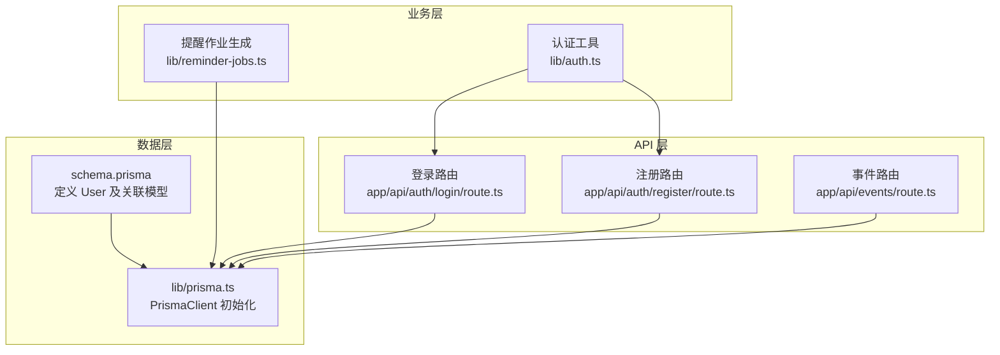
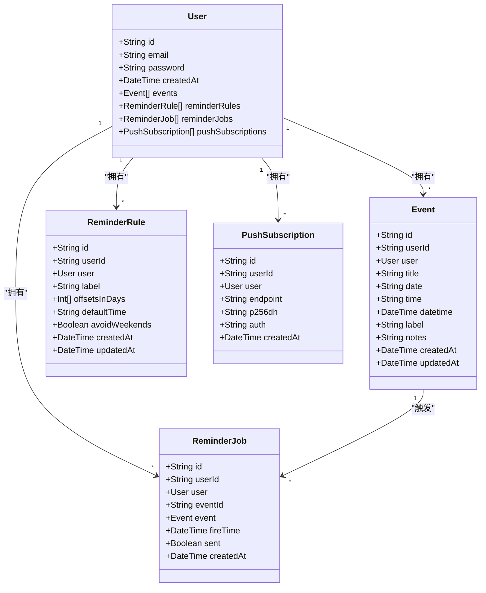
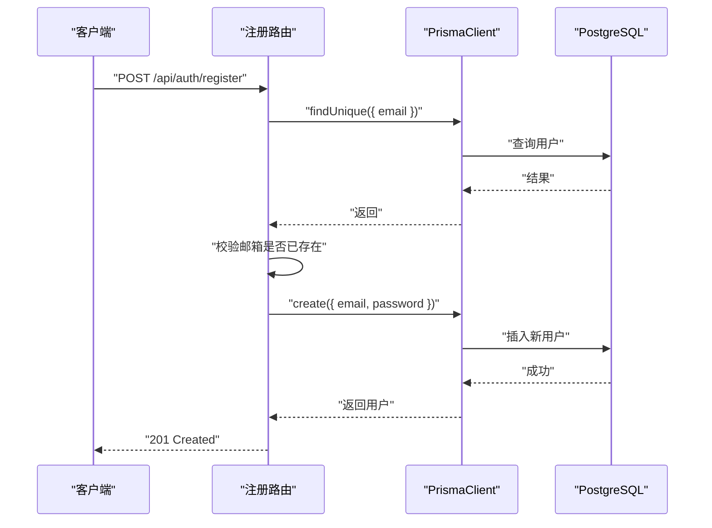
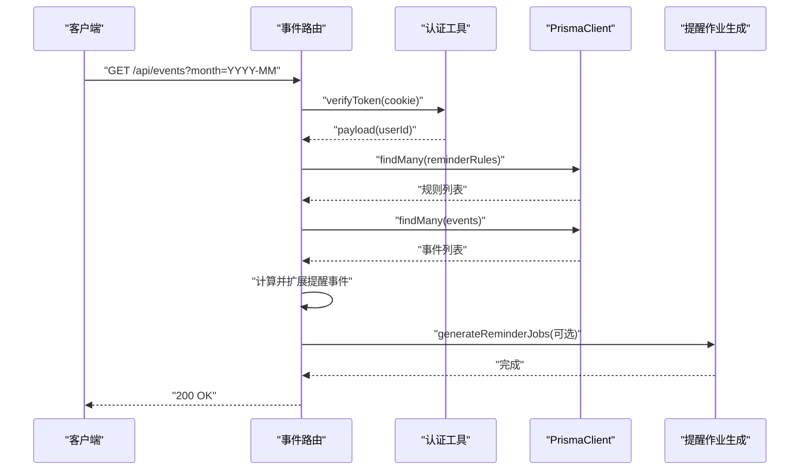
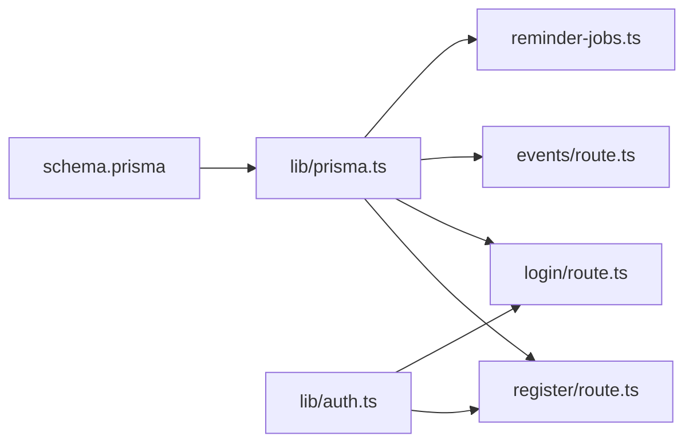

# 用户模型 (User)

<cite>
**本文引用的文件**
- [prisma/schema.prisma](file://prisma/schema.prisma)
- [lib/prisma.ts](file://lib/prisma.ts)
- [app/api/auth/register/route.ts](file://app/api/auth/register/route.ts)
- [app/api/auth/login/route.ts](file://app/api/auth/login/route.ts)
- [app/api/events/route.ts](file://app/api/events/route.ts)
- [lib/reminder-jobs.ts](file://lib/reminder-jobs.ts)
- [lib/auth.ts](file://lib/auth.ts)
</cite>

## 目录
1. [简介](#简介)
2. [项目结构](#项目结构)
3. [核心组件](#核心组件)
4. [架构总览](#架构总览)
5. [详细组件分析](#详细组件分析)
6. [依赖分析](#依赖分析)
7. [性能考虑](#性能考虑)
8. [故障排除指南](#故障排除指南)
9. [结论](#结论)
10. [附录](#附录)

## 简介
本文件面向数据库与后端开发者，系统性梳理仓库中 User 模型的字段定义、约束、与关联实体的关系映射，以及在应用中如何通过 Prisma 访问数据。重点覆盖：
- User 字段的数据类型与约束（如唯一性、默认值）
- 与 Event、ReminderRule、ReminderJob、PushSubscription 的 1:N 关系
- Prisma relation 的实现方式与外键映射
- 基于 lib/prisma.ts 初始化的 PrismaClient 使用方式
- 创建用户与查询用户事件的实践路径
- cuid() 作为 ID 生成策略的优势
- 常见问题：邮箱重复注册的错误处理

## 项目结构
围绕 User 模型的关键文件与职责如下：
- 数据模型定义：prisma/schema.prisma
- Prisma 客户端初始化：lib/prisma.ts
- 注册与登录接口：app/api/auth/register/route.ts、app/api/auth/login/route.ts
- 事件查询接口：app/api/events/route.ts
- 提醒作业生成：lib/reminder-jobs.ts
- 认证工具：lib/auth.ts

图表来源
- [prisma/schema.prisma](file://prisma/schema.prisma#L16-L26)
- [lib/prisma.ts](file://lib/prisma.ts#L1-L20)
- [app/api/auth/register/route.ts](file://app/api/auth/register/route.ts#L1-L53)
- [app/api/auth/login/route.ts](file://app/api/auth/login/route.ts#L1-L57)
- [app/api/events/route.ts](file://app/api/events/route.ts#L1-L200)
- [lib/reminder-jobs.ts](file://lib/reminder-jobs.ts#L1-L109)
- [lib/auth.ts](file://lib/auth.ts#L1-L30)

章节来源
- [prisma/schema.prisma](file://prisma/schema.prisma#L16-L26)
- [lib/prisma.ts](file://lib/prisma.ts#L1-L20)

## 核心组件
- User 实体：包含 id、email、password、createdAt 等字段，定义了与多个子实体的一对多关系。
- Event：每个事件属于一个用户，支持按日期范围查询与提醒扩展。
- ReminderRule：为用户标签设置提醒规则，用于生成 ReminderJob。
- ReminderJob：具体提醒任务，记录触发时间与发送状态。
- PushSubscription：用户的 Web Push 订阅信息，用于推送通知。

章节来源
- [prisma/schema.prisma](file://prisma/schema.prisma#L16-L26)
- [prisma/schema.prisma](file://prisma/schema.prisma#L28-L45)
- [prisma/schema.prisma](file://prisma/schema.prisma#L47-L60)
- [prisma/schema.prisma](file://prisma/schema.prisma#L62-L74)
- [prisma/schema.prisma](file://prisma/schema.prisma#L76-L85)

## 架构总览
下图展示 User 与其关联实体之间的关系与典型调用链。

图表来源
- [prisma/schema.prisma](file://prisma/schema.prisma#L16-L26)
- [prisma/schema.prisma](file://prisma/schema.prisma#L28-L45)
- [prisma/schema.prisma](file://prisma/schema.prisma#L47-L60)
- [prisma/schema.prisma](file://prisma/schema.prisma#L62-L74)
- [prisma/schema.prisma](file://prisma/schema.prisma#L76-L85)

## 详细组件分析

### User 字段与约束
- id: String 类型，主键，使用 cuid() 作为默认值生成策略，具备全局唯一性与排序友好性。
- email: String 类型，@unique 约束，确保邮箱唯一。
- password: String 类型，存储加密后的密码。
- createdAt: DateTime 类型，@default(now())，自动记录创建时间。
- 关联集合：
  - events: 与 Event 的一对多关系
  - reminderRules: 与 ReminderRule 的一对多关系
  - reminderJobs: 与 ReminderJob 的一对多关系
  - pushSubscriptions: 与 PushSubscription 的一对多关系

章节来源
- [prisma/schema.prisma](file://prisma/schema.prisma#L16-L26)

### Prisma relation 实现方式
- User 与 Event：通过 Event.userId 外键与 User.id 引用，使用 relation 映射 fields 与 references。
- User 与 ReminderRule：同上，一对一标签规则，按 userId+label 唯一。
- User 与 ReminderJob：同上，一对多。
- User 与 PushSubscription：同上，一对多。
- 删除行为：Event 与 ReminderJob 的关系在删除时采用级联（onDelete: Cascade），确保事件删除时清理相关提醒作业。

章节来源
- [prisma/schema.prisma](file://prisma/schema.prisma#L28-L45)
- [prisma/schema.prisma](file://prisma/schema.prisma#L47-L60)
- [prisma/schema.prisma](file://prisma/schema.prisma#L62-L74)
- [prisma/schema.prisma](file://prisma/schema.prisma#L76-L85)

### PrismaClient 初始化与访问
- 初始化：lib/prisma.ts 通过 @prisma/adapter-pg 与 pg 连接池创建 PrismaClient，并以单例模式导出，避免重复实例化。
- 访问方式：在各路由或服务中直接从 lib/prisma 导入 prisma，即可通过 prisma.user、prisma.event 等进行数据访问。

图表来源
- [lib/prisma.ts](file://lib/prisma.ts#L1-L20)
- [app/api/auth/register/route.ts](file://app/api/auth/register/route.ts#L22-L42)

章节来源
- [lib/prisma.ts](file://lib/prisma.ts#L1-L20)
- [app/api/auth/register/route.ts](file://app/api/auth/register/route.ts#L1-L53)

### 创建用户流程
- 输入验证：使用 Zod 对请求体进行校验（邮箱格式、密码长度）。
- 去重检查：通过 prisma.user.findUnique 按 email 查询是否存在。
- 密码加密：使用 bcryptjs 对明文密码进行哈希。
- 写入数据库：prisma.user.create 插入新用户，并仅返回 id、email、createdAt。
- 错误处理：捕获异常并返回统一的 500 错误响应。

章节来源
- [app/api/auth/register/route.ts](file://app/api/auth/register/route.ts#L6-L52)
- [lib/auth.ts](file://lib/auth.ts#L6-L12)

### 查询用户事件流程
- 身份验证：从 Cookie 中读取 token，使用 jose 验证并解析出 userId。
- 获取提醒规则：prisma.reminderRule.findMany 按 userId 加载标签到偏移的映射。
- 查询事件：prisma.event.findMany 按 userId 和日期范围筛选，按日期升序排列。
- 生成提醒事件：根据规则计算提醒日期，必要时调整至工作日，过滤出目标月份内的虚拟提醒事件。
- 返回结果：合并原始事件与提醒事件，返回给前端。

图表来源
- [app/api/events/route.ts](file://app/api/events/route.ts#L15-L124)
- [lib/reminder-jobs.ts](file://lib/reminder-jobs.ts#L15-L72)
- [lib/auth.ts](file://lib/auth.ts#L22-L29)

章节来源
- [app/api/events/route.ts](file://app/api/events/route.ts#L15-L124)
- [lib/reminder-jobs.ts](file://lib/reminder-jobs.ts#L15-L72)

### cuid() 作为 ID 生成策略的优势
- 全局唯一性：cuid() 生成的字符串在分布式环境下仍保持唯一，适合多实例部署。
- 排序友好：cuid() 生成的字符串具有近似的时间有序性，有利于索引与查询性能。
- 安全性：相比自增 ID，cuid() 不暴露序列号，降低信息泄露风险。
- 兼容性：在 PostgreSQL 等数据库中作为字符串主键使用无额外开销。

章节来源
- [prisma/schema.prisma](file://prisma/schema.prisma#L17-L18)

### 常见问题：邮箱重复注册的错误处理
- 重复检测：注册前先通过 prisma.user.findUnique 按 email 查询，若存在则返回 400。
- 响应语义：明确提示“用户已存在”，便于前端提示与用户体验优化。
- 并发场景：建议在数据库层面增加唯一索引（schema 已定义 @unique），并在应用层做幂等处理（例如重试时再次检查）。

章节来源
- [app/api/auth/register/route.ts](file://app/api/auth/register/route.ts#L22-L28)

## 依赖分析
- 数据模型依赖：User 依赖 Event、ReminderRule、ReminderJob、PushSubscription 的外键与关系映射。
- 运行时依赖：lib/prisma.ts 提供 PrismaClient 单例；认证路由依赖 lib/auth.ts 的密码哈希与 JWT 工具。
- 业务依赖：事件路由依赖提醒规则生成器；调度器依赖推送订阅表进行通知分发。

图表来源
- [prisma/schema.prisma](file://prisma/schema.prisma#L16-L26)
- [lib/prisma.ts](file://lib/prisma.ts#L1-L20)
- [app/api/auth/register/route.ts](file://app/api/auth/register/route.ts#L1-L53)
- [app/api/auth/login/route.ts](file://app/api/auth/login/route.ts#L1-L57)
- [app/api/events/route.ts](file://app/api/events/route.ts#L1-L200)
- [lib/reminder-jobs.ts](file://lib/reminder-jobs.ts#L1-L109)
- [lib/auth.ts](file://lib/auth.ts#L1-L30)

章节来源
- [prisma/schema.prisma](file://prisma/schema.prisma#L16-L26)
- [lib/prisma.ts](file://lib/prisma.ts#L1-L20)
- [lib/auth.ts](file://lib/auth.ts#L1-L30)

## 性能考虑
- 索引设计：Event 模型对 [userId, date] 建有索引，有利于按用户与日期范围查询。
- 查询范围：事件查询按月份边界限定，避免全量扫描。
- 提醒作业：ReminderJob 对 [userId, sent, fireTime] 建有索引，便于高效检索待发送任务。
- 分页与选择字段：事件查询使用 select 仅返回必要字段，减少网络与序列化开销。
- 缓存与去重：批量导入时预取标题集合，减少重复查询。

章节来源
- [prisma/schema.prisma](file://prisma/schema.prisma#L44-L44)
- [prisma/schema.prisma](file://prisma/schema.prisma#L73-L73)
- [app/api/events/route.ts](file://app/api/events/route.ts#L53-L71)

## 故障排除指南
- 邮箱重复注册
  - 现象：注册接口返回“用户已存在”。
  - 处理：确认邮箱唯一性约束；在前端进行输入校验与提示；在并发场景下做好幂等处理。
- 登录失败
  - 现象：返回“无效凭据”。
  - 处理：确认用户存在且密码正确；检查 JWT 秘钥配置；核对 Cookie 设置参数。
- 事件查询无结果
  - 现象：返回空数组或未包含提醒事件。
  - 处理：确认 token 解析成功且 userId 正确；检查提醒规则是否存在；确认日期格式与月份参数。
- 提醒作业未触发
  - 现象：调度器未发送通知。
  - 处理：检查 ReminderJob 的 sent 与 fireTime；确认用户存在推送订阅；核对调度器运行状态。

章节来源
- [app/api/auth/register/route.ts](file://app/api/auth/register/route.ts#L22-L28)
- [app/api/auth/login/route.ts](file://app/api/auth/login/route.ts#L22-L33)
- [app/api/events/route.ts](file://app/api/events/route.ts#L53-L71)
- [lib/reminder-jobs.ts](file://lib/reminder-jobs.ts#L77-L98)

## 结论
User 模型在 schema.prisma 中定义清晰，配合 Prisma 的 relation 映射与索引设计，实现了与事件、提醒规则、提醒作业及推送订阅的强关联。通过 lib/prisma.ts 的单例初始化，应用在各路由中以 prisma.user 统一访问数据。结合 cuid() 的 ID 生成策略与 @unique 约束，既保证了数据一致性，又兼顾了性能与安全性。建议在生产环境完善数据库唯一索引与事务控制，并持续监控提醒作业与推送订阅的健康度。

## 附录
- 代码示例路径（不展示具体代码内容）
  - 创建用户：参见 [注册路由](file://app/api/auth/register/route.ts#L32-L42)
  - 查询用户事件：参见 [事件路由](file://app/api/events/route.ts#L53-L124)
  - 认证工具：参见 [认证工具](file://lib/auth.ts#L6-L20)