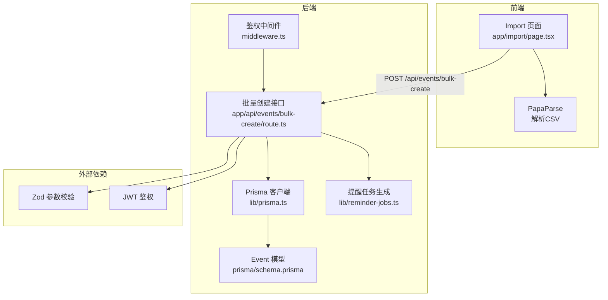
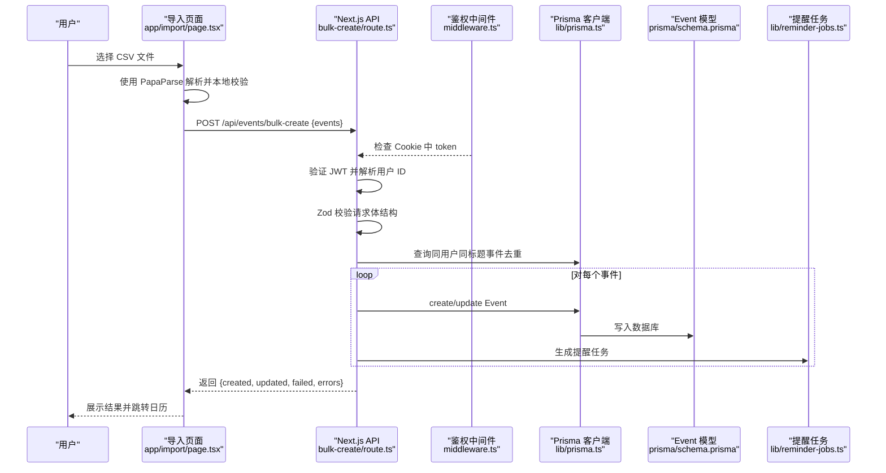
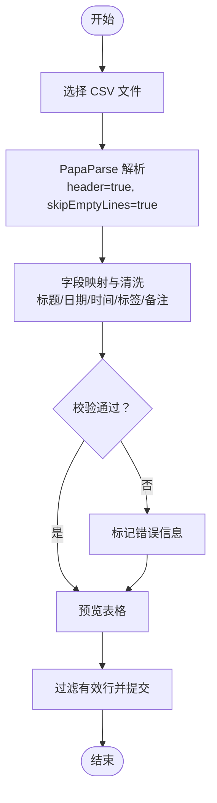
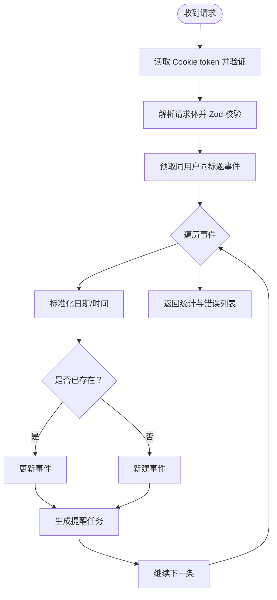
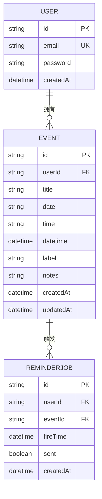
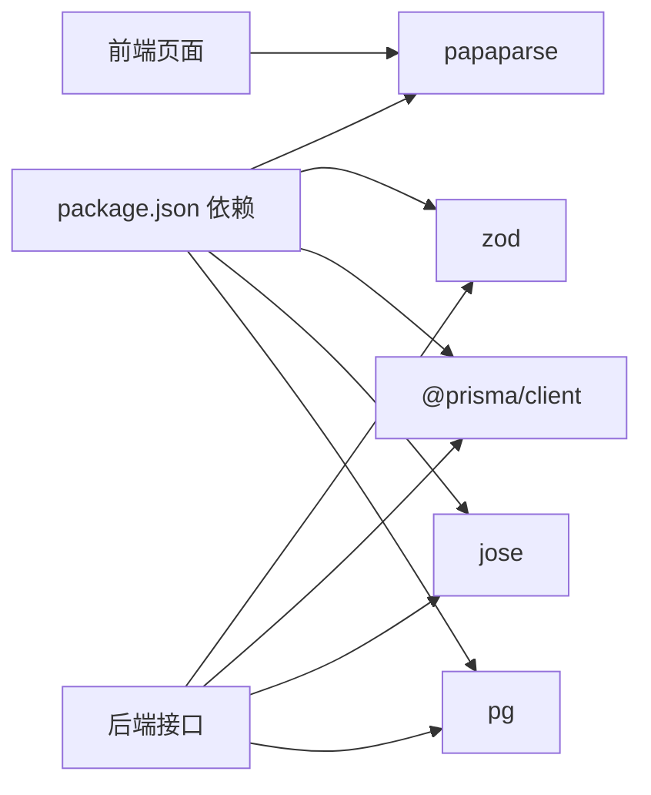

# CSV批量导入

<cite>
**本文引用的文件**
- [app/import/page.tsx](file://app/import/page.tsx)
- [app/api/events/bulk-create/route.ts](file://app/api/events/bulk-create/route.ts)
- [prisma/schema.prisma](file://prisma/schema.prisma)
- [public/templates/events-template.csv](file://public/templates/events-template.csv)
- [lib/prisma.ts](file://lib/prisma.ts)
- [lib/auth.ts](file://lib/auth.ts)
- [lib/reminder-jobs.ts](file://lib/reminder-jobs.ts)
- [middleware.ts](file://middleware.ts)
- [components/ui/button.tsx](file://components/ui/button.tsx)
- [components/ui/input.tsx](file://components/ui/input.tsx)
- [components/ui/card.tsx](file://components/ui/card.tsx)
- [package.json](file://package.json)
</cite>

## 目录
1. [简介](#简介)
2. [项目结构](#项目结构)
3. [核心组件](#核心组件)
4. [架构总览](#架构总览)
5. [详细组件分析](#详细组件分析)
6. [依赖关系分析](#依赖关系分析)
7. [性能考量](#性能考量)
8. [故障排查指南](#故障排查指南)
9. [结论](#结论)
10. [附录](#附录)

## 简介
本文件面向“CSV批量导入”功能，系统性说明从前端上传解析到后端批量创建事件的完整流程。重点覆盖：
- 前端使用 PapaParse 解析 CSV 的处理逻辑、数据预览与表单提交
- 后端接口对请求体的鉴权与数据校验、批量插入与重复项处理
- 错误处理与回滚策略
- 字段映射规则、数据清洗策略与安全校验
- 与 Event 数据模型的关联及提醒任务生成

## 项目结构
该功能涉及以下关键文件与职责：
- 前端页面：app/import/page.tsx 负责文件上传、CSV 解析、本地校验、数据预览与提交
- 后端接口：app/api/events/bulk-create/route.ts 负责鉴权、参数校验、批量创建/更新事件、生成提醒任务
- 数据模型：prisma/schema.prisma 定义 Event 模型及其索引
- 工具库：lib/prisma.ts 提供 Prisma 客户端；lib/auth.ts 提供 JWT 鉴权；lib/reminder-jobs.ts 生成提醒任务
- UI 组件：components/ui/* 提供按钮、输入框、卡片等基础 UI
- 模板文件：public/templates/events-template.csv 提供标准 CSV 模板

图表来源
- [app/import/page.tsx](file://app/import/page.tsx#L1-L218)
- [app/api/events/bulk-create/route.ts](file://app/api/events/bulk-create/route.ts#L1-L133)
- [lib/prisma.ts](file://lib/prisma.ts#L1-L20)
- [prisma/schema.prisma](file://prisma/schema.prisma#L28-L45)
- [lib/reminder-jobs.ts](file://lib/reminder-jobs.ts#L1-L109)
- [middleware.ts](file://middleware.ts#L1-L50)

章节来源
- [app/import/page.tsx](file://app/import/page.tsx#L1-L218)
- [app/api/events/bulk-create/route.ts](file://app/api/events/bulk-create/route.ts#L1-L133)
- [prisma/schema.prisma](file://prisma/schema.prisma#L28-L45)
- [lib/prisma.ts](file://lib/prisma.ts#L1-L20)
- [lib/reminder-jobs.ts](file://lib/reminder-jobs.ts#L1-L109)
- [middleware.ts](file://middleware.ts#L1-L50)

## 核心组件
- 前端导入页面：负责文件选择、CSV 解析、本地字段映射与校验、预览与提交
- 批量创建接口：负责鉴权、参数校验、去重与合并、批量插入/更新、生成提醒任务
- 数据模型：Event 模型定义字段与索引，确保查询与排序效率
- 工具库：Prisma 客户端、JWT 鉴权、提醒任务生成

章节来源
- [app/import/page.tsx](file://app/import/page.tsx#L19-L218)
- [app/api/events/bulk-create/route.ts](file://app/api/events/bulk-create/route.ts#L19-L133)
- [prisma/schema.prisma](file://prisma/schema.prisma#L28-L45)
- [lib/prisma.ts](file://lib/prisma.ts#L1-L20)
- [lib/auth.ts](file://lib/auth.ts#L1-L30)
- [lib/reminder-jobs.ts](file://lib/reminder-jobs.ts#L1-L109)

## 架构总览
从用户上传 CSV 到数据库落库的端到端流程如下：

图表来源
- [app/import/page.tsx](file://app/import/page.tsx#L35-L106)
- [app/api/events/bulk-create/route.ts](file://app/api/events/bulk-create/route.ts#L19-L127)
- [middleware.ts](file://middleware.ts#L5-L44)
- [lib/prisma.ts](file://lib/prisma.ts#L13-L15)
- [prisma/schema.prisma](file://prisma/schema.prisma#L28-L45)
- [lib/reminder-jobs.ts](file://lib/reminder-jobs.ts#L15-L72)

## 详细组件分析

### 前端：CSV 文件输入、解析与预览
- 文件输入处理
  - 接受 .csv 文件，禁用状态下禁止操作
  - 触发解析回调，启用跳过空行
- 字段映射与清洗
  - 支持英文/中文列名（标题、日期、时间、标签、备注）
  - 日期标准化为 YYYY-MM-DD（将 / 替换为 -）
  - 时间标准化：若为 h:mm 格式则补前导零至 HH:mm
  - 标题必填；日期格式必须为 YYYY-MM-DD 或 YYYY/MM/DD
- 数据预览
  - 渲染表格，高亮校验失败行
  - 统计“通过/未通过”数量
- 表单提交
  - 过滤掉带错误的行
  - 发送 POST 请求到 /api/events/bulk-create
  - 成功后自动跳转到日历页

图表来源
- [app/import/page.tsx](file://app/import/page.tsx#L27-L74)
- [app/import/page.tsx](file://app/import/page.tsx#L76-L106)

章节来源
- [app/import/page.tsx](file://app/import/page.tsx#L19-L218)
- [components/ui/input.tsx](file://components/ui/input.tsx#L1-L22)
- [components/ui/button.tsx](file://components/ui/button.tsx#L1-L61)
- [components/ui/card.tsx](file://components/ui/card.tsx#L1-L93)

### 后端：批量创建接口
- 鉴权
  - 从 Cookie 读取 token，不存在返回 401
  - 使用 JWT 验证 token，解析出 userId
- 参数校验
  - 使用 Zod schema 校验 events 数组结构
  - 标题非空；日期格式 YYYY-MM-DD 或 YYYY/MM/DD；时间可选且 HH:mm
- 去重与合并策略
  - 预先查询当前用户相同标题的事件，构建标题 -> 事件 映射
  - 若存在则更新，否则新建；同一导入批次内后续重复标题覆盖最新一条
- 批量插入/更新
  - 日期标准化为 YYYY-MM-DD；时间标准化为 HH:mm
  - 计算 datetime（默认时间为 10:00）
  - create/update 写入数据库
- 提醒任务生成
  - 删除旧提醒任务
  - 基于事件标签查找自定义提醒规则，否则使用默认规则
  - 生成多个偏移天数的任务，必要时调整到周五
- 错误处理
  - 单条事件异常记录 index、标题与错误信息
  - 返回 created/updated/failed/errors
  - 其他异常统一返回 500

图表来源
- [app/api/events/bulk-create/route.ts](file://app/api/events/bulk-create/route.ts#L19-L127)
- [lib/auth.ts](file://lib/auth.ts#L22-L29)
- [lib/reminder-jobs.ts](file://lib/reminder-jobs.ts#L15-L72)

章节来源
- [app/api/events/bulk-create/route.ts](file://app/api/events/bulk-create/route.ts#L19-L133)
- [lib/auth.ts](file://lib/auth.ts#L1-L30)
- [lib/reminder-jobs.ts](file://lib/reminder-jobs.ts#L1-L109)

### 数据模型与关联
- Event 模型包含：
  - 用户外键、标题、日期（YYYY-MM-DD）、时间（HH:mm）、datetime（用于排序/查询）
  - 标签与备注
  - createdAt/updatedAt
  - 索引：(userId, date)
- 与 User 的一对多关系
- 与 ReminderJob 的一对多关系（级联删除）

图表来源
- [prisma/schema.prisma](file://prisma/schema.prisma#L16-L45)

章节来源
- [prisma/schema.prisma](file://prisma/schema.prisma#L28-L45)

### 安全与权限控制
- 鉴权中间件
  - 对受保护路径拦截，要求 Cookie 中存在 token
  - 在 Edge 环境验证 JWT，无效则重定向登录并清除 token
- API 层鉴权
  - 接口显式读取 token 并验证，解析 userId
  - 仅允许当前用户的数据被创建/更新
- CSRF/跨站风险
  - 采用 Cookie 中 token 的方式，配合 SameSite/HTTPS 等最佳实践
- 输入校验
  - 前端本地校验（标题/日期格式）
  - 后端 Zod 强约束（结构、类型、格式）

章节来源
- [middleware.ts](file://middleware.ts#L5-L44)
- [app/api/events/bulk-create/route.ts](file://app/api/events/bulk-create/route.ts#L20-L36)
- [app/import/page.tsx](file://app/import/page.tsx#L58-L62)

### 字段映射与数据清洗规则
- 字段映射
  - 标题：title（必填）
  - 日期：date（YYYY-MM-DD 或 YYYY/MM/DD）
  - 时间：time（HH:mm，可选）
  - 标签：label（可选）
  - 备注：notes（可选）
- 清洗策略
  - 日期：统一替换斜杠为短横线
  - 时间：若为 h:mm 则补前导零为 HH:mm
  - 默认时间：若缺失则使用 10:00
  - 缺失字段：保留为空或 null（由 Prisma 模型决定）
- 模板参考
  - 提供标准 CSV 模板，包含必填列与示例行

章节来源
- [app/import/page.tsx](file://app/import/page.tsx#L40-L55)
- [app/import/page.tsx](file://app/import/page.tsx#L58-L62)
- [public/templates/events-template.csv](file://public/templates/events-template.csv#L1-L5)
- [app/api/events/bulk-create/route.ts](file://app/api/events/bulk-create/route.ts#L59-L67)

### 错误处理与回滚行为
- 前端
  - 解析失败提示；无有效数据时阻止提交
  - 提交异常统一弹窗提示
- 后端
  - 单条事件异常记录 index、标题与错误信息，不影响其他事件
  - 返回 created/updated/failed/errors，便于前端展示
  - 其他异常统一返回 500
- 回滚
  - 当前实现为逐条处理，不进行事务级回滚
  - 若需要强一致性，建议引入 Prisma 事务包裹整个批量流程

章节来源
- [app/import/page.tsx](file://app/import/page.tsx#L69-L74)
- [app/import/page.tsx](file://app/import/page.tsx#L100-L105)
- [app/api/events/bulk-create/route.ts](file://app/api/events/bulk-create/route.ts#L112-L119)
- [app/api/events/bulk-create/route.ts](file://app/api/events/bulk-create/route.ts#L128-L131)

## 依赖关系分析
- 前端依赖
  - PapaParse：CSV 解析
  - UI 组件：按钮、输入框、卡片
- 后端依赖
  - Zod：参数校验
  - Prisma：数据库访问
  - jose：JWT 鉴权
  - 自定义工具：鉴权、提醒任务生成

图表来源
- [package.json](file://package.json#L11-L36)
- [app/import/page.tsx](file://app/import/page.tsx#L5-L6)
- [app/api/events/bulk-create/route.ts](file://app/api/events/bulk-create/route.ts#L2-L5)

章节来源
- [package.json](file://package.json#L11-L36)

## 性能考量
- 前端
  - PapaParse 流式解析，skipEmptyLines 减少无效行处理
  - 本地校验避免无效请求
- 后端
  - 预取同用户同标题事件，减少重复查询
  - 批量创建/更新在循环内执行，建议在大量数据时考虑分批或事务
  - 提醒任务生成在每次事件后执行，建议异步化或批量生成

## 故障排查指南
- 文件编码错误
  - 症状：解析失败或乱码
  - 解决：确保 CSV 保存为 UTF-8 编码；前端未强制指定编码，建议在模板中注明
- 字段缺失
  - 症状：标题为空或日期格式不符
  - 解决：使用模板文件；前端会标注错误并阻止提交
- 大小限制
  - 症状：请求过大导致 413
  - 解决：后端默认限制可能较严格，建议在服务器配置中放宽或拆分文件
- 重复标题覆盖
  - 症状：同标题事件被覆盖
  - 解决：导入前确认标题唯一性，或在模板中加入唯一标识列
- 提醒任务异常
  - 症状：提醒未生成或时间不正确
  - 解决：检查标签对应的提醒规则是否存在；默认时间为 10:00

章节来源
- [app/import/page.tsx](file://app/import/page.tsx#L58-L62)
- [app/api/events/bulk-create/route.ts](file://app/api/events/bulk-create/route.ts#L112-L119)
- [lib/reminder-jobs.ts](file://lib/reminder-jobs.ts#L15-L72)

## 结论
该 CSV 批量导入功能通过前端本地清洗与后端强校验相结合，实现了高效、可靠的事件批量创建/更新。其设计兼顾易用性与安全性，同时为后续扩展（如事务回滚、异步任务、更大规模数据分批处理）提供了清晰的改进方向。

## 附录
- 模板下载：页面提供模板下载链接，建议用户按模板填写
- 字段说明：必填列与选填列在页面明确列出
- 跳转逻辑：导入成功后自动跳转到日历页

章节来源
- [app/import/page.tsx](file://app/import/page.tsx#L120-L139)
- [public/templates/events-template.csv](file://public/templates/events-template.csv#L1-L5)