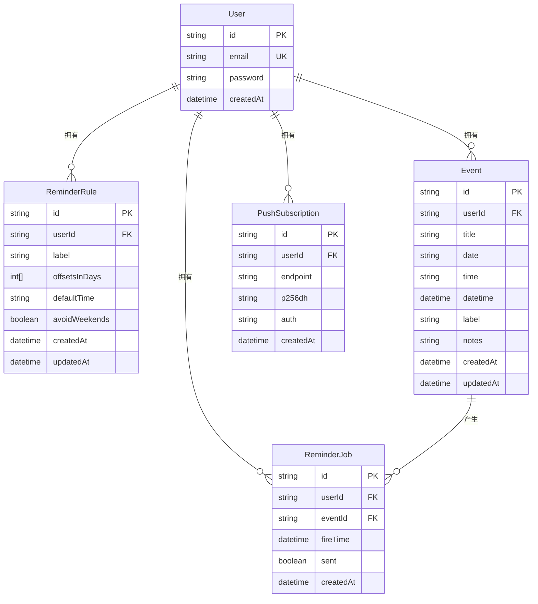
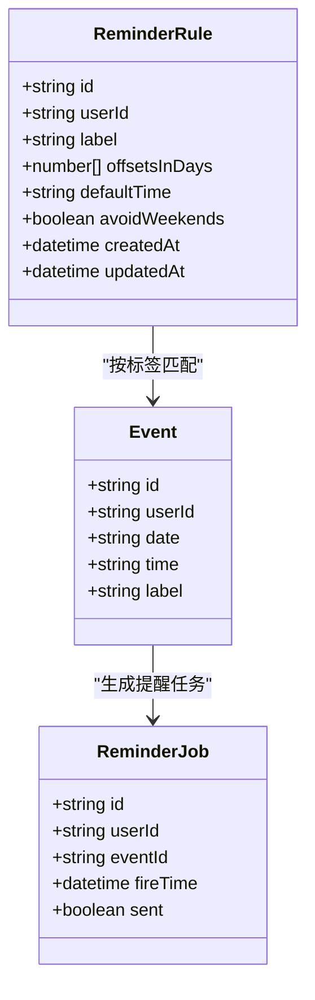
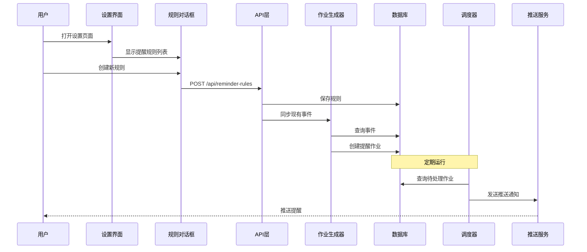
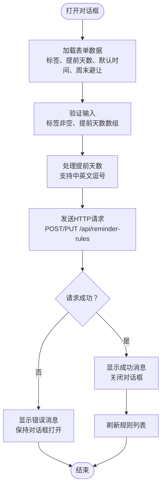
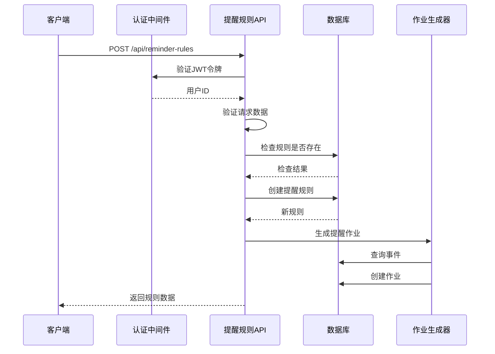
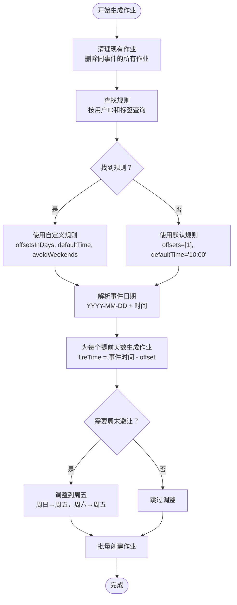
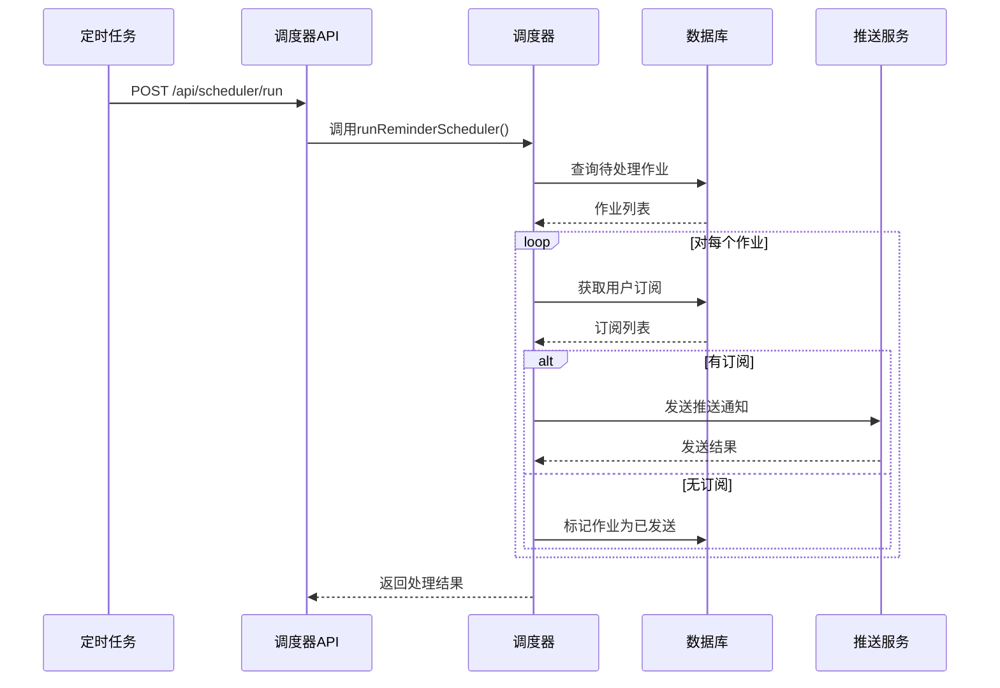
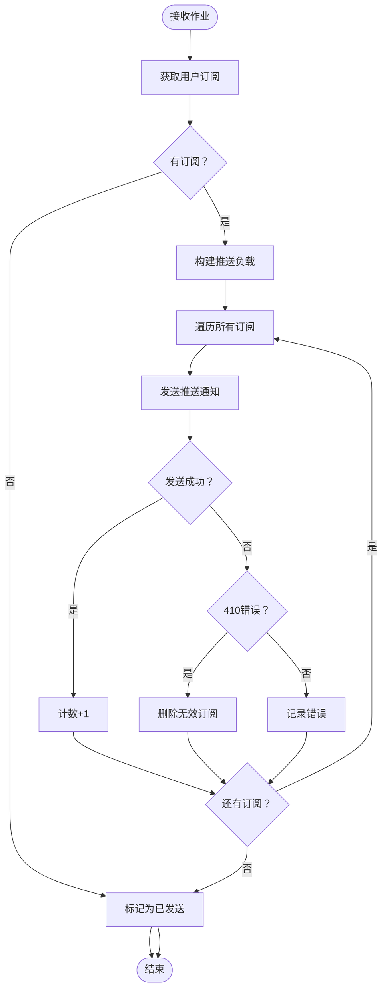
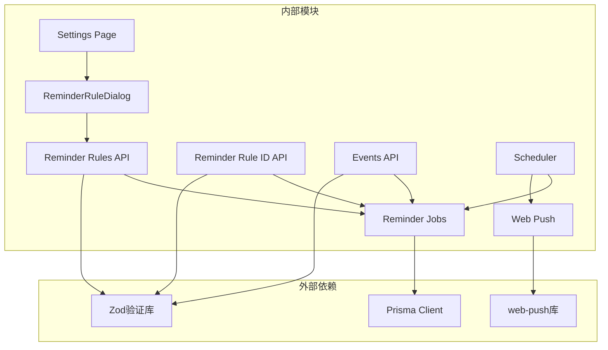
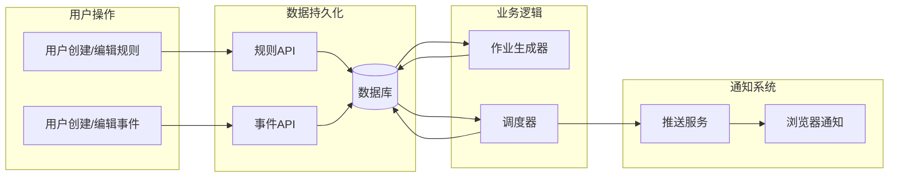

# 提醒规则引擎

<cite>
**本文档引用的文件**
- [app/settings/page.tsx](file://app/settings/page.tsx)
- [components/ReminderRuleDialog.tsx](file://components/ReminderRuleDialog.tsx)
- [lib/reminder-jobs.ts](file://lib/reminder-jobs.ts)
- [app/api/reminder-rules/route.ts](file://app/api/reminder-rules/route.ts)
- [app/api/reminder-rules/[id]/route.ts](file://app/api/reminder-rules/[id]/route.ts)
- [lib/scheduler.ts](file://lib/scheduler.ts)
- [app/api/scheduler/run/route.ts](file://app/api/scheduler/run/route.ts)
- [lib/web-push.ts](file://lib/web-push.ts)
- [prisma/schema.prisma](file://prisma/schema.prisma)
- [app/api/events/route.ts](file://app/api/events/route.ts)
</cite>

## 目录
1. [简介](#简介)
2. [项目结构](#项目结构)
3. [核心组件](#核心组件)
4. [架构概览](#架构概览)
5. [详细组件分析](#详细组件分析)
6. [依赖关系分析](#依赖关系分析)
7. [性能考虑](#性能考虑)
8. [故障排除指南](#故障排除指南)
9. [结论](#结论)

## 简介

提醒规则引擎是一个基于标签的智能提醒系统，允许用户为不同类型的事件设置个性化的提醒规则。该系统通过标签匹配机制，动态生成提醒任务，并通过Web推送通知向用户发送提醒。

系统的核心特性包括：
- 基于标签的规则配置
- 支持多个提前天数的复合提醒
- 周末自动避让功能
- 动态任务生成和调度
- Web推送通知集成

## 项目结构

提醒规则引擎涉及以下关键模块：

```mermaid
graph TB
subgraph "前端界面层"
Settings[设置页面<br/>app/settings/page.tsx]
Dialog[提醒规则对话框<br/>components/ReminderRuleDialog.tsx]
end
subgraph "API接口层"
RuleAPI[提醒规则API<br/>app/api/reminder-rules/route.ts]
RuleIdAPI[提醒规则ID API<br/>app/api/reminder-rules/[id]/route.ts]
EventAPI[事件API<br/>app/api/events/route.ts]
SchedulerAPI[调度器API<br/>app/api/scheduler/run/route.ts]
end
subgraph "业务逻辑层"
ReminderJobs[提醒作业生成<br/>lib/reminder-jobs.ts]
Scheduler[调度器<br/>lib/scheduler.ts]
end
subgraph "数据访问层"
Prisma[Prisma ORM<br/>prisma/schema.prisma]
WebPush[Web推送<br/>lib/web-push.ts]
end
Settings --> Dialog
Dialog --> RuleAPI
RuleAPI --> ReminderJobs
RuleIdAPI --> ReminderJobs
EventAPI --> ReminderJobs
ReminderJobs --> Prisma
Scheduler --> ReminderJobs
Scheduler --> WebPush
SchedulerAPI --> Scheduler
```

**图表来源**
- [app/settings/page.tsx](file://app/settings/page.tsx#L1-L287)
- [components/ReminderRuleDialog.tsx](file://components/ReminderRuleDialog.tsx#L1-L173)
- [lib/reminder-jobs.ts](file://lib/reminder-jobs.ts#L1-L109)
- [lib/scheduler.ts](file://lib/scheduler.ts#L1-L86)

**章节来源**
- [app/settings/page.tsx](file://app/settings/page.tsx#L1-L287)
- [components/ReminderRuleDialog.tsx](file://components/ReminderRuleDialog.tsx#L1-L173)
- [prisma/schema.prisma](file://prisma/schema.prisma#L1-L86)

## 核心组件

### 数据模型设计

系统采用Prisma ORM进行数据建模，包含以下核心实体：



**图表来源**
- [prisma/schema.prisma](file://prisma/schema.prisma#L16-L86)

### 规则数据结构



**图表来源**
- [prisma/schema.prisma](file://prisma/schema.prisma#L47-L74)
- [lib/reminder-jobs.ts](file://lib/reminder-jobs.ts#L3-L9)

**章节来源**
- [prisma/schema.prisma](file://prisma/schema.prisma#L1-L86)
- [lib/reminder-jobs.ts](file://lib/reminder-jobs.ts#L1-L109)

## 架构概览

提醒规则引擎采用分层架构设计，实现了清晰的关注点分离：



**图表来源**
- [app/settings/page.tsx](file://app/settings/page.tsx#L278-L283)
- [components/ReminderRuleDialog.tsx](file://components/ReminderRuleDialog.tsx#L74-L94)
- [app/api/reminder-rules/route.ts](file://app/api/reminder-rules/route.ts#L41-L103)
- [lib/reminder-jobs.ts](file://lib/reminder-jobs.ts#L15-L72)
- [lib/scheduler.ts](file://lib/scheduler.ts#L8-L85)

## 详细组件分析

### 用户界面组件

#### ReminderRuleDialog 组件

ReminderRuleDialog 是用户创建和编辑提醒规则的主要界面组件：



**图表来源**
- [components/ReminderRuleDialog.tsx](file://components/ReminderRuleDialog.tsx#L55-L109)

**章节来源**
- [components/ReminderRuleDialog.tsx](file://components/ReminderRuleDialog.tsx#L1-L173)

### API 层实现

#### 提醒规则管理 API



**图表来源**
- [app/api/reminder-rules/route.ts](file://app/api/reminder-rules/route.ts#L41-L103)
- [app/api/reminder-rules/[id]/route.ts](file://app/api/reminder-rules/[id]/route.ts#L13-L91)

**章节来源**
- [app/api/reminder-rules/route.ts](file://app/api/reminder-rules/route.ts#L1-L109)
- [app/api/reminder-rules/[id]/route.ts](file://app/api/reminder-rules/[id]/route.ts#L1-L158)

### 核心业务逻辑

#### 提醒作业生成器

generateReminderJobs 函数是整个系统的核心，负责根据事件标签匹配规则并生成提醒作业：



**图表来源**
- [lib/reminder-jobs.ts](file://lib/reminder-jobs.ts#L15-L72)

**章节来源**
- [lib/reminder-jobs.ts](file://lib/reminder-jobs.ts#L1-L109)

### 调度系统

#### 定时调度器



**图表来源**
- [lib/scheduler.ts](file://lib/scheduler.ts#L8-L85)
- [app/api/scheduler/run/route.ts](file://app/api/scheduler/run/route.ts#L8-L26)

**章节来源**
- [lib/scheduler.ts](file://lib/scheduler.ts#L1-L86)
- [app/api/scheduler/run/route.ts](file://app/api/scheduler/run/route.ts#L1-L37)

### Web 推送通知

#### 推送通知发送流程



**图表来源**
- [lib/scheduler.ts](file://lib/scheduler.ts#L17-L77)
- [lib/web-push.ts](file://lib/web-push.ts#L28-L46)

**章节来源**
- [lib/web-push.ts](file://lib/web-push.ts#L1-L54)

## 依赖关系分析

### 组件间依赖关系



**图表来源**
- [lib/reminder-jobs.ts](file://lib/reminder-jobs.ts#L1)
- [lib/scheduler.ts](file://lib/scheduler.ts#L1-L3)
- [lib/web-push.ts](file://lib/web-push.ts#L1-L7)

### 数据流分析



**图表来源**
- [app/api/reminder-rules/route.ts](file://app/api/reminder-rules/route.ts#L41-L103)
- [app/api/events/route.ts](file://app/api/events/route.ts#L131-L199)
- [lib/reminder-jobs.ts](file://lib/reminder-jobs.ts#L15-L72)
- [lib/scheduler.ts](file://lib/scheduler.ts#L8-L85)

**章节来源**
- [app/api/reminder-rules/route.ts](file://app/api/reminder-rules/route.ts#L1-L109)
- [app/api/events/route.ts](file://app/api/events/route.ts#L1-L200)
- [lib/reminder-jobs.ts](file://lib/reminder-jobs.ts#L1-L109)
- [lib/scheduler.ts](file://lib/scheduler.ts#L1-L86)

## 性能考虑

### 数据库优化

1. **索引策略**
   - `Event(userId, date)` 复合索引用于快速查询
   - `ReminderJob(userId, sent, fireTime)` 复合索引用于调度查询

2. **查询优化**
   - 使用 `findMany` 批量操作减少数据库往返
   - 条件查询避免全表扫描

3. **内存管理**
   - 分批处理大量事件和作业
   - 及时清理已处理的作业

### 系统扩展性

1. **并发处理**
   - 支持多用户并发操作
   - 异步作业处理避免阻塞

2. **缓存策略**
   - 用户规则缓存减少数据库查询
   - 作业状态缓存提高查询效率

3. **水平扩展**
   - 无状态设计支持多实例部署
   - 数据库连接池优化

## 故障排除指南

### 常见问题诊断

#### 规则未生效

**可能原因**：
1. 规则标签与事件标签不匹配
2. 用户认证失败
3. 数据库连接异常
4. 调度器未正确运行

**排查步骤**：
1. 验证规则标签是否完全匹配事件标签
2. 检查JWT令牌有效性
3. 确认数据库连接状态
4. 查看调度器日志输出

**章节来源**
- [lib/reminder-jobs.ts](file://lib/reminder-jobs.ts#L21-L30)
- [app/api/reminder-rules/route.ts](file://app/api/reminder-rules/route.ts#L14-L23)

#### 时间偏差问题

**可能原因**：
1. 时区设置不正确
2. 服务器时间不同步
3. 浏览器本地时间设置错误

**解决方案**：
1. 确保使用统一的时区（+08:00）
2. 同步服务器时间
3. 检查客户端时钟设置

#### 推送通知失败

**可能原因**：
1. 用户未授权通知权限
2. 推送订阅失效
3. VAPID密钥配置错误

**排查方法**：
1. 检查浏览器通知权限状态
2. 验证推送订阅的有效性
3. 确认VAPID密钥配置正确

**章节来源**
- [lib/scheduler.ts](file://lib/scheduler.ts#L26-L30)
- [lib/web-push.ts](file://lib/web-push.ts#L9-L15)

### 调试技巧

1. **启用详细日志**
   ```bash
   # 在生产环境中查看日志
   npm run build
   npm run start
   ```

2. **手动触发调度器**
   ```bash
   curl -X POST http://localhost:3000/api/scheduler/run
   ```

3. **检查数据库状态**
   ```sql
   -- 查看待处理作业
   SELECT COUNT(*) FROM "ReminderJob" WHERE "sent" = false;
   
   -- 查看最近创建的规则
   SELECT * FROM "ReminderRule" ORDER BY "createdAt" DESC LIMIT 10;
   ```

## 结论

提醒规则引擎通过模块化的设计和清晰的职责分离，实现了高效、可扩展的提醒系统。系统的关键优势包括：

1. **灵活的规则配置**：基于标签的匹配机制支持复杂的业务场景
2. **可靠的作业管理**：完善的作业生命周期管理和错误处理
3. **高效的调度系统**：定时调度和异步处理确保系统性能
4. **完整的通知链路**：从规则配置到最终通知的完整闭环

未来可以考虑的功能扩展：
- 支持更多触发条件（如事件状态变化）
- 添加规则优先级和冲突解决机制
- 实现规则继承和模板功能
- 增加规则测试和预览功能

该系统为用户提供了一个强大而易用的提醒管理工具，能够有效提升用户的事件管理效率。