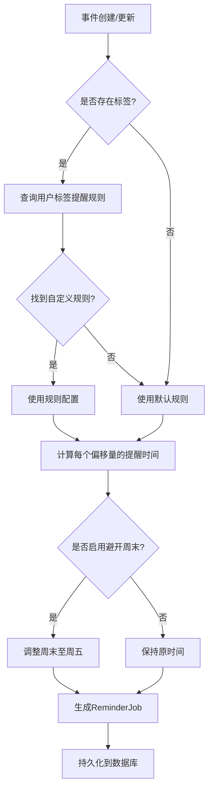
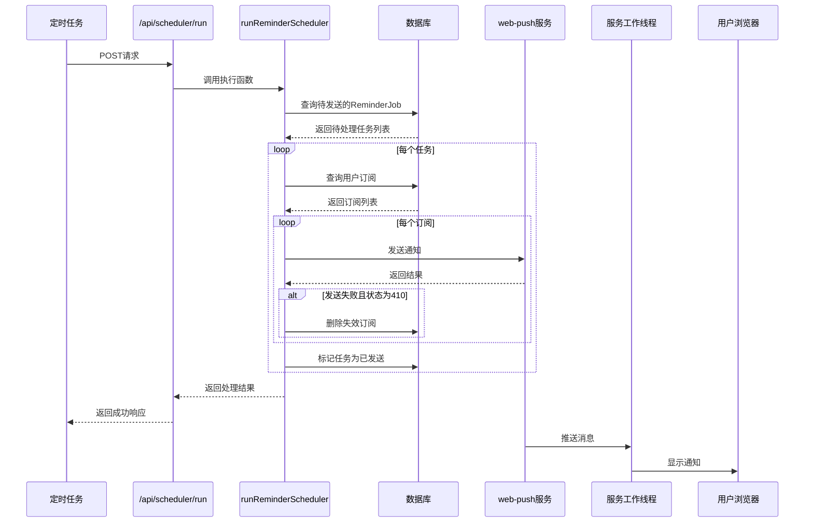
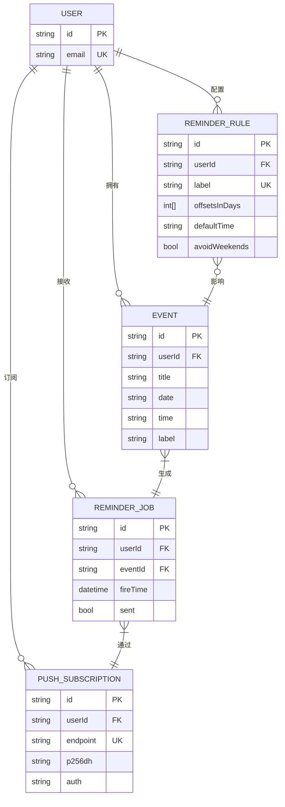

# 核心功能

<cite>
**本文档中引用的文件**  
- [import/page.tsx](file://app/import/page.tsx)
- [events/bulk-create/route.ts](file://app/api/events/bulk-create/route.ts)
- [reminder-jobs.ts](file://lib/reminder-jobs.ts)
- [scheduler.ts](file://lib/scheduler.ts)
- [scheduler/run/route.ts](file://app/api/scheduler/run/route.ts)
- [web-push.ts](file://lib/web-push.ts)
- [reminder-rules/route.ts](file://app/api/reminder-rules/route.ts)
- [schema.prisma](file://prisma/schema.prisma)
- [sw.js](file://public/sw.js)
</cite>

## 目录
1. [CSV批量导入功能](#csv批量导入功能)
2. [提醒规则引擎机制](#提醒规则引擎机制)
3. [调度系统工作流程](#调度系统工作流程)
4. [模块间调用时序与数据依赖](#模块间调用时序与数据依赖)

## CSV批量导入功能

该功能允许用户通过上传CSV文件批量导入日程事件。前端使用PapaParse库解析文件内容，后端通过`/api/events/bulk-create`接口接收并处理数据。

用户在`/import`页面上传CSV文件后，前端组件`app/import/page.tsx`调用PapaParse进行本地解析，支持多语言列名（如“标题”、“日期”等），并对数据进行初步校验。校验通过后，有效数据通过POST请求发送至`/api/events/bulk-create`接口。

后端接口`app/api/events/bulk-create/route.ts`首先验证用户身份，然后使用Zod对请求体进行结构化校验。系统会预查询用户已存在的事件标题，以支持更新或创建操作。对于每条事件数据，系统会标准化日期和时间格式，计算完整的`datetime`字段，并持久化到数据库。若事件已存在（基于标题匹配），则执行更新操作；否则创建新事件。

在事件创建或更新后，系统立即调用`generateReminderJobs`函数，根据事件的标签生成相应的提醒任务。

**Section sources**
- [import/page.tsx](file://app/import/page.tsx#L1-L218)
- [events/bulk-create/route.ts](file://app/api/events/bulk-create/route.ts#L1-L133)

## 提醒规则引擎机制

系统支持基于标签的提醒规则配置。用户可在设置界面为特定标签（如“合同”）定义提醒策略，包括提前天数、默认提醒时间以及是否避开周末。

当用户创建或更新提醒规则时，`app/api/reminder-rules/route.ts`接口接收请求并验证输入。规则数据存储在`ReminderRule`模型中，确保每个用户-标签组合的唯一性。创建新规则后，系统会自动为该用户所有具有相同标签的现有事件重新生成提醒任务，确保规则即时生效。

每当有新事件创建或更新时（无论是通过单个创建还是批量导入），系统都会调用`lib/reminder-jobs.ts`中的`generateReminderJobs`函数。该函数首先删除该事件已有的提醒任务，然后根据事件的标签查找对应的提醒规则。若未找到自定义规则，则使用默认规则（提前1天，上午10:00）。对于每个提前天数偏移量，系统计算出提醒触发时间，并考虑“避开周末”选项，将落在周末的提醒自动调整至周五。最终，生成的提醒任务被批量写入`ReminderJob`表。

**Diagram sources**
- [reminder-jobs.ts](file://lib/reminder-jobs.ts#L15-L72)
- [reminder-rules/route.ts](file://app/api/reminder-rules/route.ts#L41-L109)

**Section sources**
- [reminder-jobs.ts](file://lib/reminder-jobs.ts#L1-L109)
- [reminder-rules/route.ts](file://app/api/reminder-rules/route.ts#L1-L109)
- [schema.prisma](file://prisma/schema.prisma#L47-L60)

## 调度系统工作流程

调度系统负责定期检查并发送待执行的提醒通知。其核心是`lib/scheduler.ts`中的`runReminderScheduler`函数，该函数通过`/api/scheduler/run`接口被外部触发。

生产环境中，该接口由定时任务（如Vercel Cron）每分钟调用一次。调度器首先查询所有`sent`字段为`false`且`fireTime`小于等于当前时间的`ReminderJob`记录。对于每个待处理的任务，系统获取该用户的所有推送订阅（`PushSubscription`）。

系统使用`web-push`库向每个订阅端点发送通知。通知载荷包含标题、正文和事件链接等数据。若推送成功，任务的`sent`字段被标记为`true`。若推送失败且错误为410（Gone），表明订阅已失效，系统会自动从数据库中删除该订阅记录，以保持数据清洁。

前端通过`ServiceWorkerRegistration`组件注册`public/sw.js`服务工作线程。当推送消息到达时，服务工作线程触发本地通知。用户点击通知后，浏览器会自动打开关联的事件页面。

**Diagram sources**
- [scheduler.ts](file://lib/scheduler.ts#L8-L86)
- [scheduler/run/route.ts](file://app/api/scheduler/run/route.ts#L1-L37)
- [web-push.ts](file://lib/web-push.ts#L1-L54)
- [sw.js](file://public/sw.js#L1-L78)

**Section sources**
- [scheduler.ts](file://lib/scheduler.ts#L1-L86)
- [scheduler/run/route.ts](file://app/api/scheduler/run/route.ts#L1-L37)
- [web-push.ts](file://lib/web-push.ts#L1-L54)
- [sw.js](file://public/sw.js#L1-L78)
- [docs/SCHEDULER_SETUP.md](file://docs/SCHEDULER_SETUP.md#L1-L88)

## 模块间调用时序与数据依赖

系统各模块通过清晰的API接口和数据模型进行交互。CSV导入、提醒规则和调度系统三大功能通过`Event`、`ReminderRule`和`ReminderJob`三个核心数据模型紧密耦合。

数据流始于前端导入页面，经由API网关进入业务逻辑层。`Event`模型的变更直接触发`ReminderJob`的生成，体现了事件驱动的设计思想。`ReminderJob`作为调度系统的输入，其状态变更（`sent`字段）又反馈回数据层，形成闭环。

**Diagram sources**
- [schema.prisma](file://prisma/schema.prisma#L16-L86)
- [events/bulk-create/route.ts](file://app/api/events/bulk-create/route.ts#L38-L111)
- [reminder-jobs.ts](file://lib/reminder-jobs.ts#L15-L72)
- [scheduler.ts](file://lib/scheduler.ts#L13-L73)