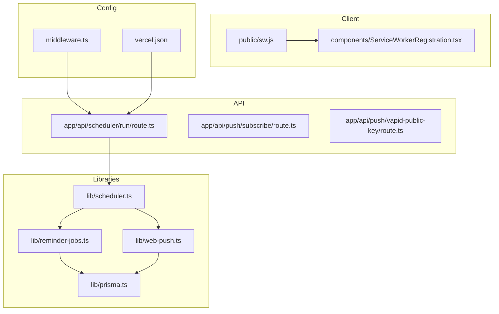
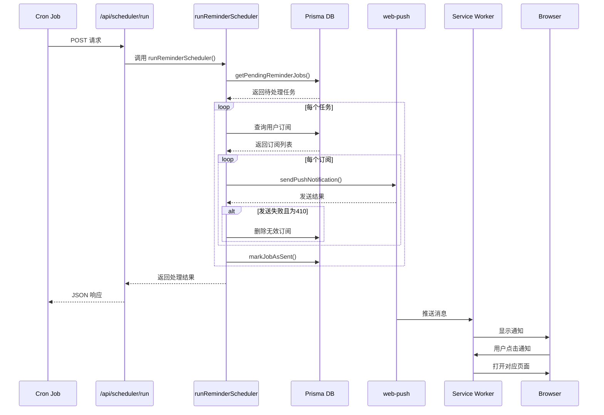
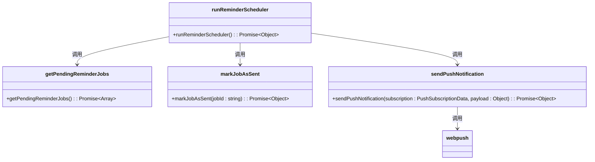
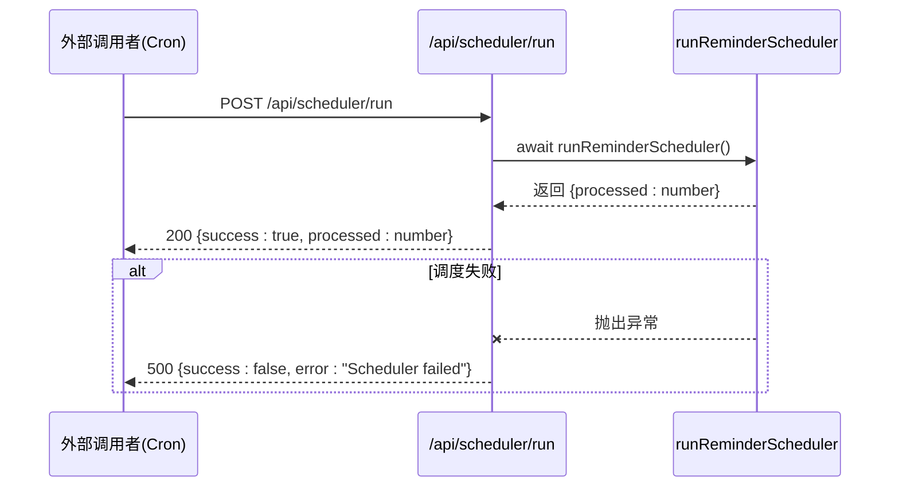
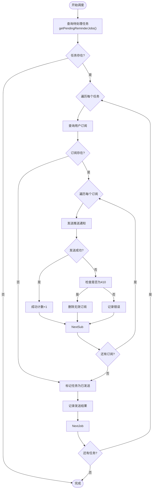
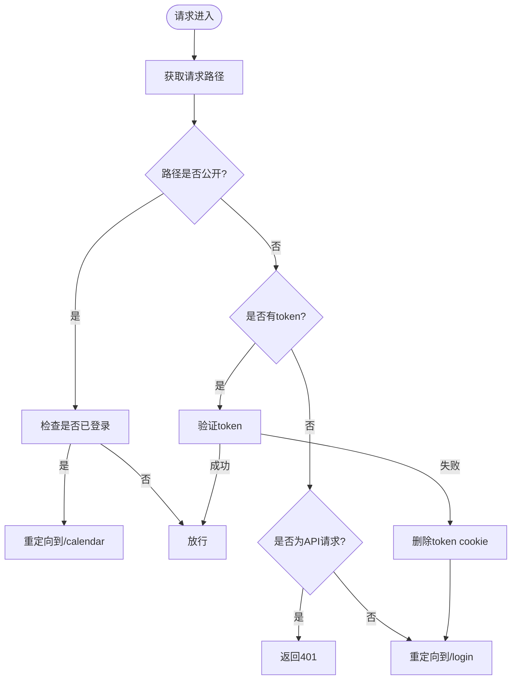
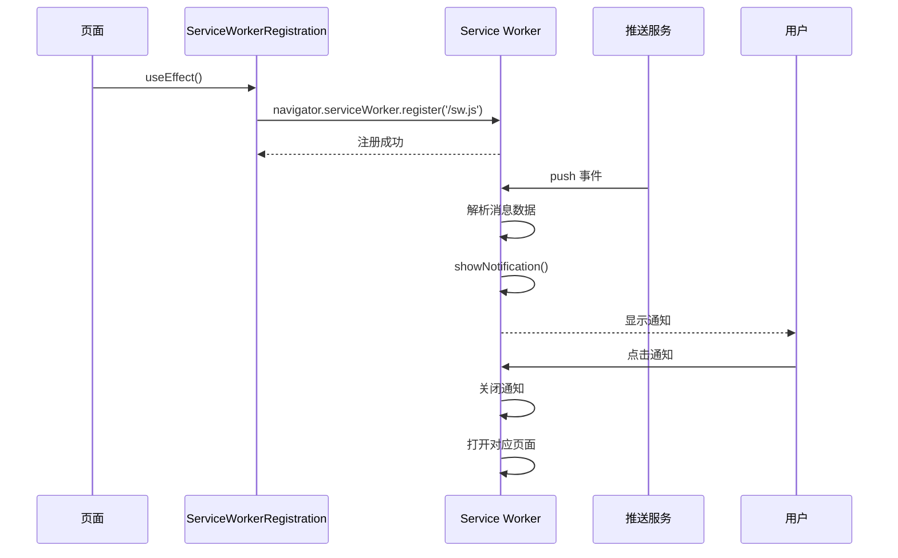
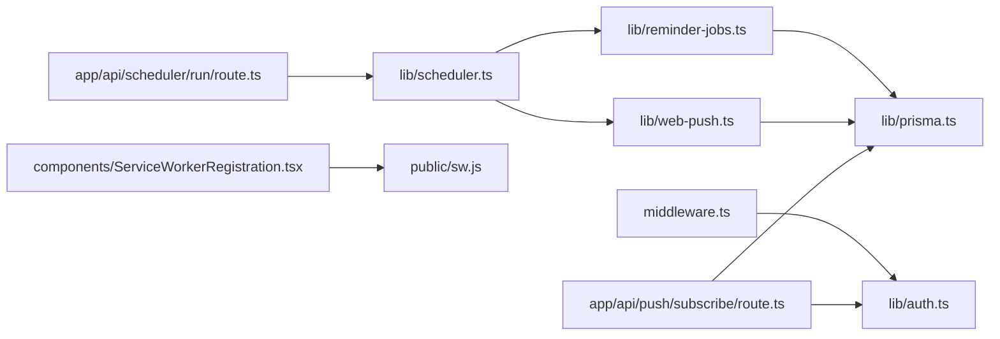

# 调度系统执行

<cite>
**本文档引用的文件**  
- [scheduler.ts](file://lib/scheduler.ts)
- [route.ts](file://app/api/scheduler/run/route.ts)
- [middleware.ts](file://middleware.ts)
- [sw.js](file://public/sw.js)
- [web-push.ts](file://lib/web-push.ts)
- [reminder-jobs.ts](file://lib/reminder-jobs.ts)
- [prisma.ts](file://lib/prisma.ts)
- [subscribe/route.ts](file://app/api/push/subscribe/route.ts)
- [vapid-public-key/route.ts](file://app/api/push/vapid-public-key/route.ts)
- [ServiceWorkerRegistration.tsx](file://components/ServiceWorkerRegistration.tsx)
- [vercel.json](file://vercel.json)
- [SCHEDULER_SETUP.md](file://docs/SCHEDULER_SETUP.md)
- [WEB_PUSH_DEBUG.md](file://docs/WEB_PUSH_DEBUG.md)
</cite>

## 目录
1. [简介](#简介)
2. [项目结构](#项目结构)
3. [核心组件](#核心组件)
4. [架构概览](#架构概览)
5. [详细组件分析](#详细组件分析)
6. [依赖分析](#依赖分析)
7. [性能考虑](#性能考虑)
8. [故障排查指南](#故障排查指南)
9. [结论](#结论)

## 简介
本系统实现了一个基于定时任务的提醒调度机制，通过 `lib/scheduler.ts` 定义调度逻辑，由外部触发入口 `app/api/scheduler/run/route.ts` 启动。系统查询待执行的 `ReminderJob`，利用 `web-push` 服务向客户端推送通知，并更新任务状态。接口访问通过 `middleware.ts` 实现控制，确保仅授权调用者可触发调度。与 Service Worker（`sw.js`）协作完成浏览器端的消息投递。本文档全面说明其运行机制，并提供性能优化与故障恢复方案。

## 项目结构
系统采用标准的 Next.js 应用结构，核心调度功能位于 `lib/scheduler.ts`，API 路由在 `app/api/scheduler/run/route.ts`，中间件控制访问在 `middleware.ts`，Service Worker 脚本位于 `public/sw.js`。数据访问通过 Prisma ORM 实现，推送服务封装在 `lib/web-push.ts`。

**Diagram sources**  
- [scheduler.ts](file://lib/scheduler.ts)
- [route.ts](file://app/api/scheduler/run/route.ts)
- [middleware.ts](file://middleware.ts)
- [sw.js](file://public/sw.js)
- [web-push.ts](file://lib/web-push.ts)
- [reminder-jobs.ts](file://lib/reminder-jobs.ts)
- [prisma.ts](file://lib/prisma.ts)
- [subscribe/route.ts](file://app/api/push/subscribe/route.ts)
- [vapid-public-key/route.ts](file://app/api/push/vapid-public-key/route.ts)
- [ServiceWorkerRegistration.tsx](file://components/ServiceWorkerRegistration.tsx)
- [vercel.json](file://vercel.json)

**Section sources**  
- [lib/scheduler.ts](file://lib/scheduler.ts)
- [app/api/scheduler/run/route.ts](file://app/api/scheduler/run/route.ts)
- [middleware.ts](file://middleware.ts)
- [public/sw.js](file://public/sw.js)

## 核心组件
核心组件包括调度器 `runReminderScheduler`，负责查询待处理的提醒任务并发送推送；API 入口 `POST /api/scheduler/run`，作为外部触发点；中间件 `middleware.ts`，提供访问控制；以及 `sw.js`，处理浏览器端的通知展示与交互。

**Section sources**  
- [scheduler.ts](file://lib/scheduler.ts#L8-L85)
- [route.ts](file://app/api/scheduler/run/route.ts#L8-L26)
- [middleware.ts](file://middleware.ts#L5-L49)
- [sw.js](file://public/sw.js#L1-L78)

## 架构概览
系统采用分层架构，前端通过 Service Worker 注册推送订阅，后端定时查询数据库中的待发送任务，调用 Web Push 服务推送消息，浏览器 Service Worker 接收并显示通知。

**Diagram sources**  
- [scheduler.ts](file://lib/scheduler.ts)
- [route.ts](file://app/api/scheduler/run/route.ts)
- [web-push.ts](file://lib/web-push.ts)
- [sw.js](file://public/sw.js)
- [prisma.ts](file://lib/prisma.ts)

## 详细组件分析

### 调度器实现分析
`lib/scheduler.ts` 中的 `runReminderScheduler` 函数是调度系统的核心。它首先查询所有待处理的提醒任务，然后遍历每个任务，获取用户的推送订阅，发送通知，并更新任务状态。

#### 调度器类图

**Diagram sources**  
- [scheduler.ts](file://lib/scheduler.ts#L8-L85)
- [reminder-jobs.ts](file://lib/reminder-jobs.ts#L77-L108)
- [web-push.ts](file://lib/web-push.ts#L28-L45)

**Section sources**  
- [scheduler.ts](file://lib/scheduler.ts#L8-L85)

### API 触发入口分析
`app/api/scheduler/run/route.ts` 提供了外部触发调度的 API 接口。`POST` 方法调用调度器，`GET` 方法返回状态信息。

#### API 调用序列图

**Diagram sources**  
- [route.ts](file://app/api/scheduler/run/route.ts#L8-L26)

**Section sources**  
- [route.ts](file://app/api/scheduler/run/route.ts#L8-L26)

### 推送服务与状态更新
系统通过 `web-push` 库与浏览器推送服务通信。发送成功后，将 `ReminderJob` 的 `sent` 字段更新为 `true`，防止重复发送。

#### 状态更新流程图

**Diagram sources**  
- [scheduler.ts](file://lib/scheduler.ts#L13-L78)
- [web-push.ts](file://lib/web-push.ts#L28-L45)
- [reminder-jobs.ts](file://lib/reminder-jobs.ts#L103-L107)

**Section sources**  
- [scheduler.ts](file://lib/scheduler.ts#L13-L78)

### 接口访问控制策略
`middleware.ts` 文件定义了全局中间件，对 `/calendar` 和 `/api/events` 路径进行保护。它检查请求中的 `token` cookie，验证 JWT 令牌，确保用户已登录。

#### 访问控制流程图

**Diagram sources**  
- [middleware.ts](file://middleware.ts#L5-L49)

**Section sources**  
- [middleware.ts](file://middleware.ts#L5-L49)

### Service Worker 协作流程
`public/sw.js` 是注册的 Service Worker，负责接收推送消息并显示通知。前端组件 `ServiceWorkerRegistration.tsx` 在客户端注册该 Worker。

#### Service Worker 交互序列图

**Diagram sources**  
- [sw.js](file://public/sw.js#L1-L78)
- [ServiceWorkerRegistration.tsx](file://components/ServiceWorkerRegistration.tsx#L1-L30)

**Section sources**  
- [sw.js](file://public/sw.js#L1-L78)
- [ServiceWorkerRegistration.tsx](file://components/ServiceWorkerRegistration.tsx#L1-L30)

## 依赖分析
系统依赖关系清晰，API 路由依赖调度器，调度器依赖数据库操作和推送服务，推送服务依赖 VAPID 密钥配置。中间件独立保护路由，Service Worker 独立处理客户端通知。

**Diagram sources**  
- [route.ts](file://app/api/scheduler/run/route.ts)
- [scheduler.ts](file://lib/scheduler.ts)
- [reminder-jobs.ts](file://lib/reminder-jobs.ts)
- [web-push.ts](file://lib/web-push.ts)
- [prisma.ts](file://lib/prisma.ts)
- [middleware.ts](file://middleware.ts)
- [auth.ts](file://lib/auth.ts)
- [subscribe/route.ts](file://app/api/push/subscribe/route.ts)
- [ServiceWorkerRegistration.tsx](file://components/ServiceWorkerRegistration.tsx)
- [sw.js](file://public/sw.js)

**Section sources**  
- [route.ts](file://app/api/scheduler/run/route.ts)
- [scheduler.ts](file://lib/scheduler.ts)
- [reminder-jobs.ts](file://lib/reminder-jobs.ts)
- [web-push.ts](file://lib/web-push.ts)
- [prisma.ts](file://lib/prisma.ts)
- [middleware.ts](file://middleware.ts)
- [auth.ts](file://lib/auth.ts)
- [subscribe/route.ts](file://app/api/push/subscribe/route.ts)
- [ServiceWorkerRegistration.tsx](file://components/ServiceWorkerRegistration.tsx)
- [sw.js](file://public/sw.js)

## 性能考虑
### 性能优化建议
1. **批量处理**：当前调度器逐个处理任务，可优化为批量发送推送，减少网络开销。
2. **并发控制**：对大量订阅的用户，可使用并发控制（如 p-limit）限制同时发送的请求数量，避免资源耗尽。
3. **错误重试机制**：对于临时性网络错误，应实现指数退避重试机制，而非直接标记为失败。
4. **数据库索引**：确保 `ReminderJob` 表的 `sent` 和 `fireTime` 字段有复合索引，加速查询。
5. **缓存**：可缓存用户的订阅信息，减少数据库查询次数。

### 常见问题与解决方案
- **任务堆积**：若调度频率过高或处理过慢，可能导致任务堆积。建议监控 `pendingJobs.length`，并根据负载调整调度频率。
- **推送失败**：系统已处理 410 错误（订阅失效），但其他错误仅记录。建议对 5xx 错误实现重试队列。
- **监控方案**：可通过日志聚合（如 ELK）监控调度器的执行时间、成功/失败率。关键指标包括：待处理任务数、发送成功率、平均处理时间。
- **恢复方案**：对于失败任务，可设计一个后台任务定期重试标记为失败但非 410 的任务。

**Section sources**  
- [scheduler.ts](file://lib/scheduler.ts)
- [docs/SCHEDULER_SETUP.md](file://docs/SCHEDULER_SETUP.md)
- [WEB_PUSH_DEBUG.md](file://docs/WEB_PUSH_DEBUG.md)

## 故障排查指南
当调度系统出现问题时，可按以下步骤排查：
1. **检查调度触发**：确认 `vercel.json` 或外部 Cron 服务是否正常调用 `POST /api/scheduler/run`。
2. **查看日志**：检查 `runReminderScheduler` 的日志输出，确认是否找到待处理任务。
3. **验证订阅**：通过数据库检查用户是否有有效的 `pushSubscription`。
4. **测试推送**：使用 `web-push` 命令行工具直接测试推送是否可达。
5. **检查 Service Worker**：在浏览器开发者工具中确认 `sw.js` 是否正确注册并激活。

**Section sources**  
- [scheduler.ts](file://lib/scheduler.ts)
- [route.ts](file://app/api/scheduler/run/route.ts)
- [sw.js](file://public/sw.js)
- [WEB_PUSH_DEBUG.md](file://docs/WEB_PUSH_DEBUG.md)

## 结论
本调度系统实现了完整的定时提醒功能，从后端调度、推送服务到前端通知展示形成了闭环。通过 `vercel.json` 配置实现了自动化调度，`middleware.ts` 确保了接口安全。系统具备基本的错误处理能力，但仍可在批量处理、并发控制和重试机制方面进一步优化。建议实施监控方案以及时发现和解决任务堆积、推送失败等问题。