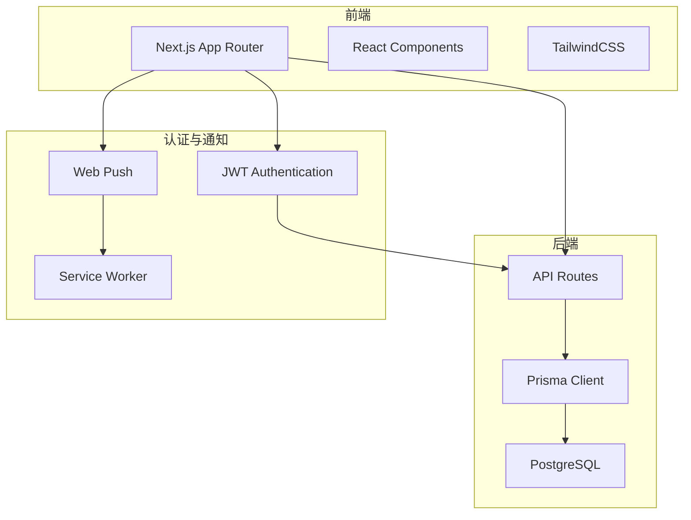
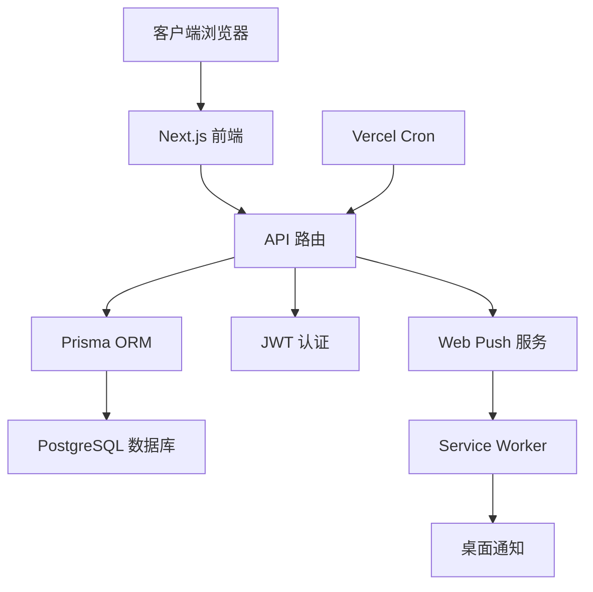
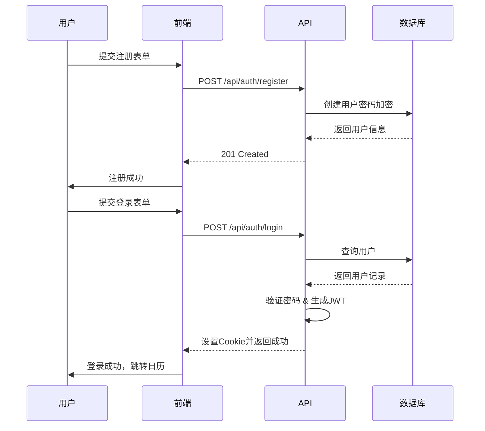
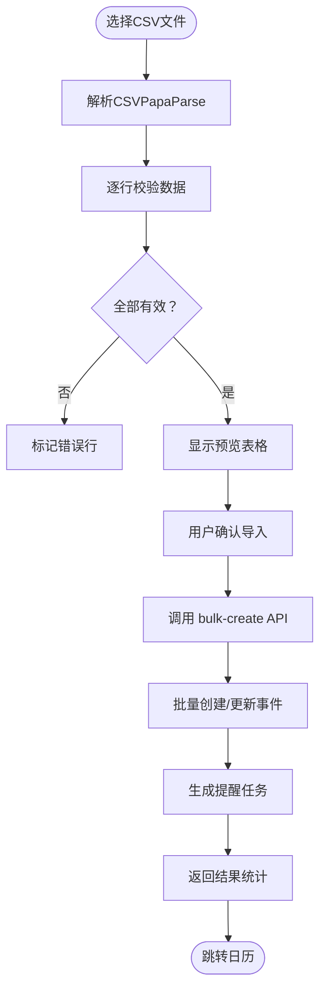
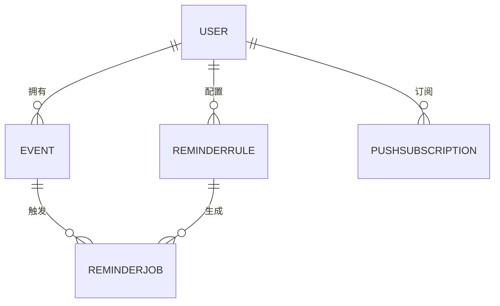

# 系统概述

<cite>
**本文档引用文件**  
- [README.md](file://README.md)
- [package.json](file://package.json)
- [prisma/schema.prisma](file://prisma/schema.prisma)
- [app/layout.tsx](file://app/layout.tsx)
- [middleware.ts](file://middleware.ts)
- [lib/auth.ts](file://lib/auth.ts)
- [lib/prisma.ts](file://lib/prisma.ts)
- [lib/web-push.ts](file://lib/web-push.ts)
- [lib/scheduler.ts](file://lib/scheduler.ts)
- [app/page.tsx](file://app/page.tsx)
- [app/api/auth/register/route.ts](file://app/api/auth/register/route.ts)
- [app/api/auth/login/route.ts](file://app/api/auth/login/route.ts)
- [app/api/events/bulk-create/route.ts](file://app/api/events/bulk-create/route.ts)
- [app/import/page.tsx](file://app/import/page.tsx)
- [components/ServiceWorkerRegistration.tsx](file://components/ServiceWorkerRegistration.tsx)
</cite>

## 目录
1. [简介](#简介)
2. [项目结构](#项目结构)
3. [核心组件](#核心组件)
4. [架构概览](#架构概览)
5. [详细组件分析](#详细组件分析)
6. [依赖分析](#依赖分析)
7. [性能考虑](#性能考虑)
8. [故障排除指南](#故障排除指南)
9. [结论](#结论)

## 简介
SimpleCalendar Reminder 是一个专为人力外包行业设计的全栈待办事件管理系统，旨在通过自动化提醒机制管理合同、证件、证书等周期性事务的到期提醒。系统支持通过CSV文件批量导入事件，并基于用户定义的规则自动生成提醒任务。前端采用Next.js与TypeScript构建，后端使用Prisma ORM连接PostgreSQL数据库，结合JWT认证和Web Push技术实现安全的身份验证和桌面通知功能。本系统特别适用于需要定期跟踪重要日期的企业场景，如合同续约、员工资质审核等。

**Section sources**
- [README.md](file://README.md#L1-L152)

## 项目结构
项目采用Next.js App Router架构组织代码，主要分为以下几个目录：
- `app/`：包含所有路由页面及API接口，采用TypeScript编写。
- `components/`：存放可复用UI组件，基于Shadcn UI构建。
- `lib/`：核心逻辑库，包括认证、数据库连接、推送服务和调度器。
- `prisma/`：数据模型定义与迁移配置。
- `public/`：静态资源文件，如Service Worker脚本和CSV模板。
- `docs/`：项目文档，涵盖需求说明、使用指南和技术细节。

整体结构清晰，前后端分离明确，便于维护和扩展。

**Diagram sources**
- [app/page.tsx](file://app/page.tsx#L1-L6)
- [app/layout.tsx](file://app/layout.tsx#L1-L40)

**Section sources**
- [app/page.tsx](file://app/page.tsx#L1-L6)
- [app/layout.tsx](file://app/layout.tsx#L1-L40)

## 核心组件
系统的核心功能围绕事件管理、提醒规则、CSV批量导入和Web Push通知展开。用户可通过注册登录进入系统，在日历界面查看和管理事件。通过“导入CSV”页面上传符合格式的文件，系统将解析并预览数据，确认后批量创建事件并自动生成对应的提醒任务。提醒规则支持按标签配置多个提前天数，并可选择是否跳过周末发送。所有通知通过浏览器推送服务实现，即使在离线状态下也能接收提醒。

**Section sources**
- [README.md](file://README.md#L1-L152)
- [app/import/page.tsx](file://app/import/page.tsx#L1-L218)

## 架构概览
系统采用分层架构设计，从前端到后端各层职责分明：
- **表现层**：Next.js负责渲染UI，使用React Server Components提升首屏加载性能。
- **应用层**：API路由处理业务逻辑，如用户认证、事件创建、批量导入和提醒调度。
- **数据层**：Prisma ORM操作PostgreSQL数据库，确保数据一致性与高效查询。
- **安全层**：JWT配合HTTP-only Cookie实现无状态会话管理，防止XSS攻击。
- **通知层**：Web Push结合VAPID协议实现跨平台桌面通知，Service Worker保障离线可达性。

整个系统部署于Vercel平台，定时任务由Vercel Cron触发，确保每日自动扫描待发送提醒。

**Diagram sources**
- [lib/prisma.ts](file://lib/prisma.ts#L1-L20)
- [lib/web-push.ts](file://lib/web-push.ts#L1-L54)
- [lib/scheduler.ts](file://lib/scheduler.ts#L1-L86)

**Section sources**
- [lib/prisma.ts](file://lib/prisma.ts#L1-L20)
- [lib/web-push.ts](file://lib/web-push.ts#L1-L54)
- [lib/scheduler.ts](file://lib/scheduler.ts#L1-L86)

## 详细组件分析
### 用户认证分析
系统采用JWT进行无状态认证，用户注册时密码经bcrypt加密存储，登录成功后返回签名Token并写入HTTP-only Cookie，有效防止CSRF和XSS攻击。中间件统一拦截受保护路由，验证Token有效性，确保只有合法用户可访问核心功能。

**Diagram sources**
- [app/api/auth/register/route.ts](file://app/api/auth/register/route.ts#L1-L53)
- [app/api/auth/login/route.ts](file://app/api/auth/login/route.ts#L1-L57)
- [lib/auth.ts](file://lib/auth.ts#L1-L30)

**Section sources**
- [app/api/auth/register/route.ts](file://app/api/auth/register/route.ts#L1-L53)
- [app/api/auth/login/route.ts](file://app/api/auth/login/route.ts#L1-L57)
- [lib/auth.ts](file://lib/auth.ts#L1-L30)

### CSV批量导入分析
CSV导入功能通过PapaParse库在客户端完成解析，支持中英文字段映射（如title/标题、date/日期），并进行格式校验。用户上传文件后可预览数据，系统标记无效行（如缺少标题或日期格式错误）。确认后调用`/api/events/bulk-create`接口批量创建或更新事件，并为每条事件生成相应的提醒任务。

**Diagram sources**
- [app/import/page.tsx](file://app/import/page.tsx#L1-L218)
- [app/api/events/bulk-create/route.ts](file://app/api/events/bulk-create/route.ts#L1-L133)

**Section sources**
- [app/import/page.tsx](file://app/import/page.tsx#L1-L218)
- [app/api/events/bulk-create/route.ts](file://app/api/events/bulk-create/route.ts#L1-L133)

## 依赖分析
系统依赖关系清晰，前端依赖Next.js生态（React、TailwindCSS、Shadcn UI），后端依赖Node.js运行时与PostgreSQL数据库。通过Prisma Adapter集成pg驱动，确保数据库操作的类型安全。Web Push库用于发送加密推送消息，VAPID密钥由环境变量注入，保障通信安全。所有外部依赖均通过pnpm管理，版本锁定在`pnpm-lock.yaml`中，确保构建一致性。

**Diagram sources**
- [prisma/schema.prisma](file://prisma/schema.prisma#L1-L86)

**Section sources**
- [prisma/schema.prisma](file://prisma/schema.prisma#L1-L86)
- [package.json](file://package.json#L1-L62)

## 性能考虑
系统在多个层面进行了性能优化：
- 使用React Server Components减少客户端JS体积，提升首屏渲染速度。
- Prisma查询添加索引（如`userId + date`）以加速事件检索。
- 批量导入时预加载已有事件标题，避免重复插入。
- 调度器每次仅处理待发送提醒，避免全表扫描。
- Service Worker缓存静态资源，提升离线体验。

此外，JWT本地验证避免了每次请求查询数据库，提高了API响应速度。

## 故障排除指南
常见问题及解决方案：
- **无法接收通知**：检查浏览器是否允许通知权限，确认Service Worker注册成功（查看控制台日志）。
- **CSV导入失败**：确保文件为UTF-8编码，日期格式为YYYY-MM-DD或YYYY/MM/DD，标题列必填。
- **登录后跳转空白页**：清除Cookie并重新登录，检查JWT密钥配置是否一致。
- **提醒未发送**：确认已启用通知订阅，检查Vercel Cron是否正常执行调度任务。

更多调试信息可参考`docs/WEB_PUSH_DEBUG.md`和`docs/SCHEDULER_SETUP.md`。

**Section sources**
- [docs/WEB_PUSH_DEBUG.md](file://docs/WEB_PUSH_DEBUG.md)
- [docs/SCHEDULER_SETUP.md](file://docs/SCHEDULER_SETUP.md)
- [components/ServiceWorkerRegistration.tsx](file://components/ServiceWorkerRegistration.tsx#L1-L30)

## 结论
todo-csv-import项目成功实现了面向企业用户的自动化提醒系统，其核心价值在于通过CSV批量导入大幅降低人工录入成本，结合灵活的提醒规则和可靠的Web Push通知机制，确保关键事务不会遗漏。技术选型上，Next.js App Router与React Server Components提升了用户体验，Prisma与PostgreSQL保障了数据可靠性，JWT与Service Worker增强了安全性与离线能力。该系统不仅适用于人力外包场景，也可扩展至项目管理、客户跟进等多个领域，具有良好的通用性和可维护性。