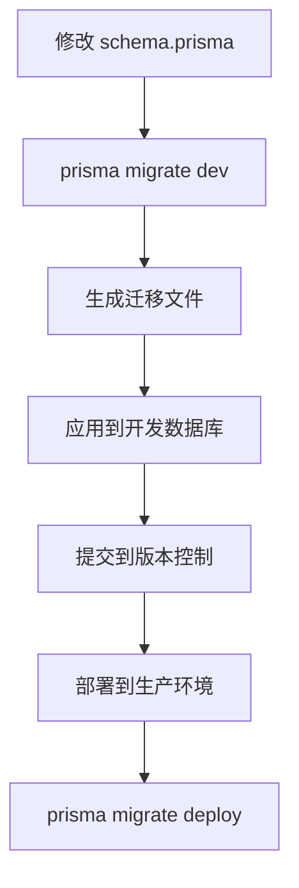
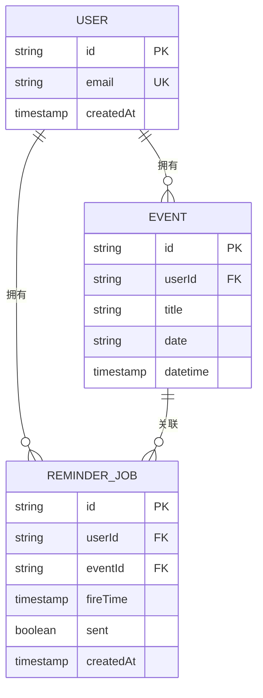
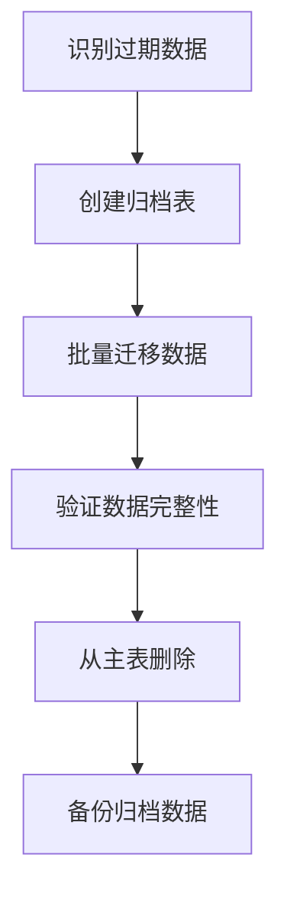

# 数据库维护

<cite>
**本文档引用的文件**   
- [schema.prisma](file://prisma/schema.prisma)
- [prisma.config.ts](file://prisma.config.ts)
- [lib/prisma.ts](file://lib/prisma.ts)
- [lib/reminder-jobs.ts](file://lib/reminder-jobs.ts)
- [lib/scheduler.ts](file://lib/scheduler.ts)
- [app/api/scheduler/run/route.ts](file://app/api/scheduler/run/route.ts)
- [vercel.json](file://vercel.json)
- [docs/SCHEDULER_SETUP.md](file://docs/SCHEDULER_SETUP.md)
</cite>

## 目录
1. [简介](#简介)
2. [Prisma数据库版本控制流程](#prisma数据库版本控制流程)
3. [数据备份策略](#数据备份策略)
4. [性能优化与索引建议](#性能优化与索引建议)
5. [数据归档与清理策略](#数据归档与清理策略)
6. [监控与维护](#监控与维护)

## 简介
本指南详细说明了基于Prisma的数据库维护策略，涵盖生产环境下的数据备份、迁移、性能优化和数据生命周期管理。系统使用PostgreSQL作为持久化数据库，通过Prisma进行数据库版本控制和迁移管理。核心功能包括事件提醒、批量导入和用户管理，其中提醒系统依赖于定时任务调度器和数据库查询。

**Section sources**
- [schema.prisma](file://prisma/schema.prisma)
- [lib/prisma.ts](file://lib/prisma.ts)

## Prisma数据库版本控制流程
Prisma提供了强大的数据库版本控制和迁移功能，确保数据库模式变更的安全性和可追溯性。系统使用Prisma Migrate进行数据库迁移管理。

### 迁移流程
1. **定义模式变更**：在`prisma/schema.prisma`文件中修改数据模型
2. **生成迁移**：使用`prisma migrate dev`命令生成新的迁移文件
3. **应用迁移**：在开发环境中自动应用迁移并更新数据库
4. **生产环境部署**：使用`prisma migrate deploy`命令在生产环境中应用迁移

迁移文件存储在`prisma/migrations`目录中，每个迁移包含SQL脚本和元数据，确保迁移的可重复性和一致性。



**Diagram sources**
- [prisma/schema.prisma](file://prisma/schema.prisma)
- [prisma.config.ts](file://prisma.config.ts)

**Section sources**
- [prisma/schema.prisma](file://prisma/schema.prisma)
- [prisma.config.ts](file://prisma.config.ts)

## 数据备份策略
为确保数据安全和可恢复性，系统采用多层次的备份策略。

### Vercel Postgres自动备份
系统部署在Vercel平台，使用Vercel Postgres作为数据库服务。Vercel Postgres提供自动备份功能：
- 每日自动备份
- 保留最近7天的备份
- 支持一键恢复到任意备份点
- 备份数据加密存储

### 手动备份方案
对于需要更灵活备份策略的场景，推荐使用`pg_dump`命令进行手动备份：

```bash
# 完整数据库备份
pg_dump -h your-host -U your-user -d your-database -F c -b -v -f backup.dump

# 压缩备份
pg_dump -h your-host -U your-user -d your-database | gzip > backup.sql.gz

# 恢复备份
pg_restore -h your-host -U your-user -d your-database -v backup.dump
```

### 备份计划
建议的备份计划：
- **每日备份**：使用Vercel自动备份功能
- **每周完整备份**：使用`pg_dump`导出完整数据库
- **每月归档备份**：将重要数据归档到长期存储

**Section sources**
- [vercel.json](file://vercel.json)
- [docs/SCHEDULER_SETUP.md](file://docs/SCHEDULER_SETUP.md)

## 性能优化与索引建议
为确保系统在高负载下的性能表现，需要对关键表和查询进行优化。

### 提醒系统相关表分析
系统中的提醒功能依赖于`ReminderJob`和`Event`表，这些表的查询性能直接影响用户体验。



**Diagram sources**
- [schema.prisma](file://prisma/schema.prisma)

### 索引优化建议
根据查询模式分析，建议以下索引优化：

1. **ReminderJob表索引**：
   - 现有索引：`@@index([userId, sent, fireTime])`
   - 建议增强：考虑添加复合索引以优化特定查询模式

2. **Event表索引**：
   - 现有索引：`@@index([userId, date])`
   - 建议添加：`@@index([userId, label])` 用于按标签筛选

3. **查询性能调优**：
   - 定期分析查询执行计划
   - 使用`EXPLAIN ANALYZE`识别慢查询
   - 考虑对频繁查询的字段添加覆盖索引

### 查询优化示例
提醒调度器的关键查询：

```typescript
// 获取待处理的提醒任务
await prisma.reminderJob.findMany({
  where: {
    sent: false,
    fireTime: {
      lte: new Date(),
    },
  },
  include: {
    event: true,
    user: {
      select: {
        id: true,
        email: true,
      },
    },
  },
  orderBy: {
    fireTime: 'asc',
  },
})
```

此查询已通过`[userId, sent, fireTime]`索引优化，确保快速检索待处理的提醒任务。

**Section sources**
- [schema.prisma](file://prisma/schema.prisma)
- [lib/reminder-jobs.ts](file://lib/reminder-jobs.ts)
- [lib/scheduler.ts](file://lib/scheduler.ts)

## 数据归档与清理策略
为防止历史数据过度积累导致性能下降，需要制定数据归档和清理策略。

### 数据生命周期管理
1. **活跃数据**（最近6个月）：保留在主数据库中，正常访问
2. **历史数据**（6-24个月）：归档到单独的归档表或数据库
3. **过期数据**（超过24个月）：定期清理或永久归档

### 归档策略
建议的归档流程：



**Diagram sources**
- [schema.prisma](file://prisma/schema.prisma)

### 清理脚本示例
```typescript
// 定期清理已发送的提醒任务
async function cleanupOldReminderJobs() {
  const cutoffDate = new Date()
  cutoffDate.setMonth(cutoffDate.getMonth() - 6)
  
  const result = await prisma.reminderJob.deleteMany({
    where: {
      sent: true,
      createdAt: {
        lt: cutoffDate,
      },
    },
  })
  
  console.log(`清理了 ${result.count} 条过期提醒任务`)
}
```

### 自动化执行
通过Vercel Cron配置定期执行清理任务：

```json
{
  "crons": [
    {
      "path": "/api/scheduler/run",
      "schedule": "* * * * *"
    }
  ]
}
```

**Section sources**
- [lib/scheduler.ts](file://lib/scheduler.ts)
- [app/api/scheduler/run/route.ts](file://app/api/scheduler/run/route.ts)
- [vercel.json](file://vercel.json)

## 监控与维护
为确保数据库的稳定运行，需要建立完善的监控和维护机制。

### 监控指标
关键监控指标包括：
- 数据库连接数
- 查询响应时间
- 磁盘使用率
- 备份状态
- 迁移执行情况

### 维护计划
定期维护任务：
- 每周：检查备份完整性
- 每月：分析查询性能
- 每季度：评估索引有效性
- 每年：审查数据归档策略

### 故障恢复
建立故障恢复预案：
1. 确认故障类型和影响范围
2. 启动备用系统（如有）
3. 从最近备份恢复数据
4. 验证数据完整性和一致性
5. 通知相关方恢复情况

**Section sources**
- [docs/SCHEDULER_SETUP.md](file://docs/SCHEDULER_SETUP.md)
- [vercel.json](file://vercel.json)