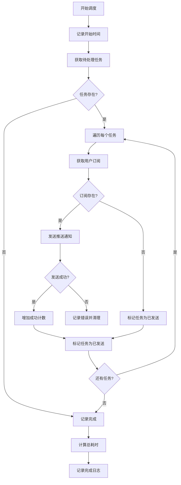

# 监控与日志

<cite>
**本文档中引用的文件**  
- [scheduler.ts](file://lib/scheduler.ts)
- [route.ts](file://app/api/scheduler/run/route.ts)
- [web-push.ts](file://lib/web-push.ts)
- [reminder-jobs.ts](file://lib/reminder-jobs.ts)
- [prisma.ts](file://lib/prisma.ts)
- [vercel.json](file://vercel.json)
- [SCHEDULER_SETUP.md](file://docs/SCHEDULER_SETUP.md)
- [middleware.ts](file://middleware.ts)
</cite>

## 目录
1. [引言](#引言)
2. [关键API调用日志记录](#关键api调用日志记录)
3. [错误追踪机制集成](#错误追踪机制集成)
4. [性能监控建议](#性能监控建议)
5. [告警机制设计](#告警机制设计)
6. [日志保留与敏感信息处理](#日志保留与敏感信息处理)
7. [总结](#总结)

## 引言
本系统是一个全栈日历提醒应用，核心功能包括事件管理、提醒规则配置、CSV批量导入以及基于Web Push的定时通知调度。其中，`/api/scheduler/run` 是关键的定时任务API，负责触发每日提醒的发送流程。为确保系统的稳定性、可维护性和可观测性，必须建立完善的监控与日志记录策略。本文档将详细说明如何捕获关键API的调用日志、集成错误追踪、实施性能监控、设置告警机制，并规范日志保留和敏感信息脱敏处理。

## 关键API调用日志记录
系统中的 `/api/scheduler/run` API 是调度器的核心入口，其调用日志对于追踪系统行为至关重要。当前实现已在代码中通过 `console.log` 和 `console.error` 记录了详细的执行信息。

### 成功执行日志
当调度器成功运行时，系统会记录以下关键信息：
- 调度器启动和完成的标记日志
- 待处理任务的数量
- 每个任务的发送情况（成功发送的订阅数量）
- 整体处理结果

这些日志以结构化的前缀 `[Scheduler]` 开头，便于在生产环境的日志聚合系统中进行过滤和搜索。

### 异常情况记录
系统对异常情况进行了分层记录：
1.  **API层异常**：在 `route.ts` 文件中，`POST` 方法的 `catch` 块会捕获任何未处理的错误，并通过 `console.error` 记录错误详情，同时返回500状态码。
2.  **调度器内部异常**：在 `scheduler.ts` 文件中，主逻辑和每个任务处理的 `try-catch` 块会捕获并记录更细粒度的错误，例如处理单个任务时的失败。
3.  **推送服务异常**：在 `web-push.ts` 文件中，`sendPushNotification` 函数会捕获推送失败的错误，并区分410（订阅失效）等特定状态码，执行相应的清理操作。

**Section sources**
- [route.ts](file://app/api/scheduler/run/route.ts#L1-L37)
- [scheduler.ts](file://lib/scheduler.ts#L1-L86)
- [web-push.ts](file://lib/web-push.ts#L1-L54)

## 错误追踪机制集成
为了实现更高级的错误追踪和告警，建议集成专业的错误监控服务。

### 集成Sentry
Sentry 是一个强大的开源错误追踪平台。集成步骤如下：
1.  在项目中安装 `@sentry/nextjs` 包。
2.  在 `middleware.ts` 或 API 路由中初始化 Sentry。
3.  使用 `Sentry.captureException(error)` 替换或补充 `console.error` 语句，将错误上报到 Sentry 服务器。
4.  配置环境变量（如 `SENTRY_DSN`）以连接到您的 Sentry 实例。

这将提供错误的堆栈跟踪、发生频率、影响的用户和版本等详细信息，并支持设置基于错误率的告警。

### 使用Vercel Analytics
如果应用部署在 Vercel 上，可以利用其内置的 Analytics 功能：
1.  在 Vercel 项目设置中启用 Analytics。
2.  Vercel 会自动收集 API 路由的性能和错误数据。
3.  在 Vercel 仪表板中，可以查看 `/api/scheduler/run` 的调用次数、错误率、响应时间等指标。
4.  可以设置自定义告警，当错误率超过阈值时通知团队。

**Section sources**
- [SCHEDULER_SETUP.md](file://docs/SCHEDULER_SETUP.md#L68-L87)
- [middleware.ts](file://middleware.ts#L1-L50)

## 性能监控建议
为了确保调度器的高效运行，需要监控关键性能指标。

### 调度器执行时间
应测量从 `runReminderScheduler` 函数开始到结束的总耗时。可以通过在函数开始和结束时记录时间戳来实现：
```typescript
const startTime = Date.now();
// ... 调度器主逻辑 ...
const duration = Date.now() - startTime;
console.log(`[Scheduler] Scheduler run completed in ${duration}ms`);
```
此指标可以帮助识别性能瓶颈，例如当待处理任务数量激增时。

### 数据库查询延迟
调度器的核心操作依赖于数据库查询，如获取待处理任务 (`getPendingReminderJobs`) 和用户订阅。建议：
-  使用 Prisma 的 `log` 选项来记录所有查询及其执行时间。
-  在生产环境中，将慢查询日志（例如超过100ms的查询）单独记录，以便进行优化。
-  监控 `prisma.reminderJob.findMany` 和 `prisma.pushSubscription.findMany` 等关键查询的平均和P95延迟。

### 推送服务性能
`web-push` 库的 `sendNotification` 调用是外部依赖，其性能直接影响用户体验。应监控：
-  单次推送的平均耗时。
-  推送失败率（`success: false` 的返回比例）。
-  不同错误类型（网络错误、认证错误、订阅失效等）的分布。



**Diagram sources**
- [scheduler.ts](file://lib/scheduler.ts#L8-L85)
- [reminder-jobs.ts](file://lib/reminder-jobs.ts#L74-L97)

**Section sources**
- [scheduler.ts](file://lib/scheduler.ts#L1-L86)
- [prisma.ts](file://lib/prisma.ts#L1-L20)
- [web-push.ts](file://lib/web-push.ts#L1-L54)

## 告警机制设计
当系统出现异常时，应能及时通知管理员。

### 连续调度失败告警
当 `/api/scheduler/run` API 连续多次返回500错误时，表明调度器存在严重问题。可以通过以下方式实现告警：
1.  **基于Vercel Cron**：如果使用 Vercel Cron，其失败日志会自动记录。可以编写一个脚本定期检查日志，或使用第三方服务（如 Better Uptime）监控该API的可用性。
2.  **基于外部监控**：使用 cron-job.org 或 GitHub Actions 调用调度器时，这些服务通常提供失败通知功能。可以配置邮件或Slack通知。

### 推送成功率下降告警
推送成功率是衡量系统健康的关键指标。建议：
1.  在 `runReminderScheduler` 函数的返回结果中，增加 `sentCount` 和 `failedCount` 字段。
2.  将这些指标上报到监控系统（如 Sentry、Datadog 或 Prometheus）。
3.  设置告警规则，例如“过去1小时内推送失败率超过20%”，并通过邮件、短信或Slack通知管理员。

## 日志保留策略和敏感信息脱敏处理
合理的日志管理对于安全和成本控制至关重要。

### 日志保留策略
-  **生产环境**：建议将日志集中存储到云日志服务（如 AWS CloudWatch Logs、Google Cloud Logging 或 Vercel Logs）。保留周期可设置为30-90天，以满足审计需求并控制成本。
-  **开发/测试环境**：日志可以保留较短时间（如7天），或仅在需要时启用详细日志。

### 敏感信息脱敏处理
当前代码中存在潜在的敏感信息泄露风险，必须进行脱敏处理：
1.  **避免记录敏感数据**：`console.log` 和 `console.error` 不应直接输出完整的用户数据、订阅端点（`endpoint`）或认证密钥（`p256dh`, `auth`）。在 `scheduler.ts` 中，记录错误时应避免打印 `subscription` 对象的完整内容。
2.  **环境变量保护**：确保 `VAPID_PRIVATE_KEY`、`DATABASE_URL` 等敏感环境变量不会被意外记录。Vercel 等平台会自动保护这些变量。
3.  **错误信息处理**：向客户端返回的错误信息应保持通用（如 "Scheduler failed"），避免暴露内部实现细节。

**Section sources**
- [scheduler.ts](file://lib/scheduler.ts#L19-L30)
- [web-push.ts](file://lib/web-push.ts#L5-L7)
- [vercel.json](file://vercel.json#L1-L8)

## 总结
本系统已具备基础的日志记录能力，但要达到生产级的可观测性，还需进一步完善。建议立即实施以下措施：首先，集成 Sentry 或利用 Vercel Analytics 实现集中化的错误追踪；其次，为关键性能指标（如调度器执行时间、数据库查询延迟）添加监控；然后，建立基于连续失败和推送成功率下降的告警机制；最后，审查并修正日志记录代码，确保所有敏感信息都经过脱敏处理，并制定合理的日志保留策略。通过这些措施，可以显著提升系统的稳定性和可维护性。