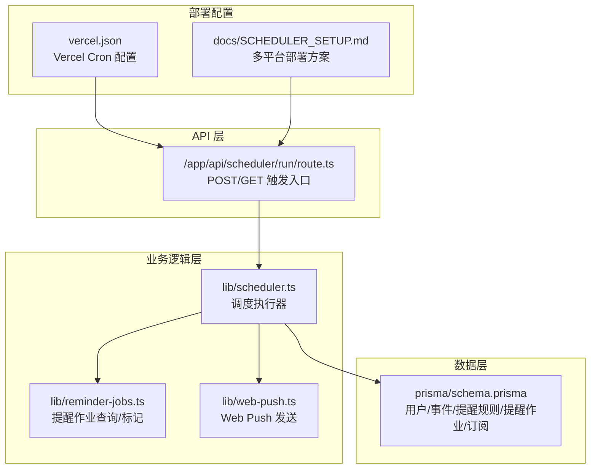
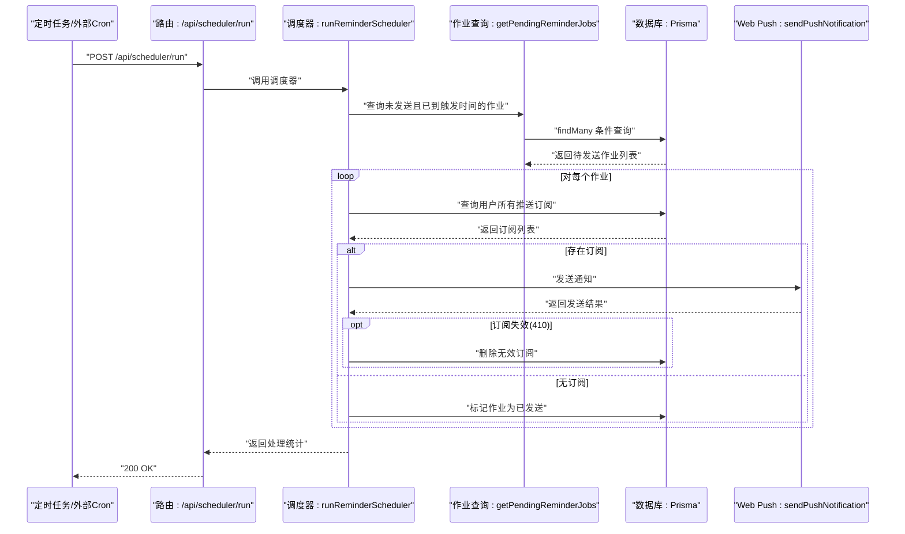
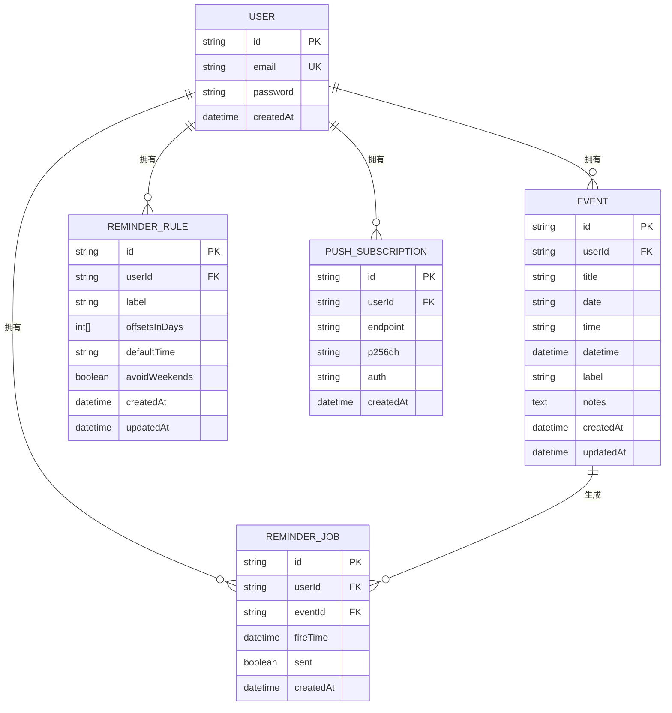
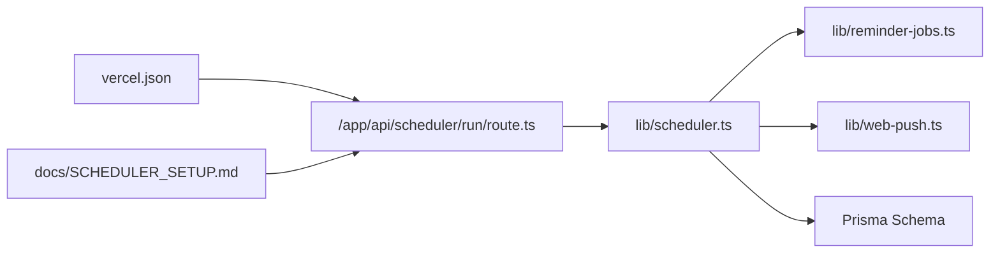

# 调度器运维

<cite>
**本文引用的文件**
- [app/api/scheduler/run/route.ts](file://app/api/scheduler/run/route.ts)
- [lib/scheduler.ts](file://lib/scheduler.ts)
- [lib/reminder-jobs.ts](file://lib/reminder-jobs.ts)
- [lib/web-push.ts](file://lib/web-push.ts)
- [docs/SCHEDULER_SETUP.md](file://docs/SCHEDULER_SETUP.md)
- [vercel.json](file://vercel.json)
- [prisma/schema.prisma](file://prisma/schema.prisma)
- [package.json](file://package.json)
</cite>

## 目录
1. [简介](#简介)
2. [项目结构](#项目结构)
3. [核心组件](#核心组件)
4. [架构总览](#架构总览)
5. [详细组件分析](#详细组件分析)
6. [依赖关系分析](#依赖关系分析)
7. [性能考量](#性能考量)
8. [故障排查指南](#故障排查指南)
9. [结论](#结论)
10. [附录](#附录)

## 简介
本文件面向生产环境的提醒调度器运维，围绕 /api/scheduler/run 端点的 POST 和 GET 方法进行深入解析，说明其作为外部触发入口的作用，并结合 SCHEDULER_SETUP.md 文档对比 Vercel Cron、外部 Cron 服务（cron-job.org、EasyCron）、GitHub Actions 以及自托管 Cron 四种部署方案的优缺点与配置步骤。同时重点给出安全建议（SCHEDULER_SECRET 与 Bearer Token 认证）、错误处理与重试策略建议，帮助团队在不同平台与场景下稳定运行提醒通知调度。

## 项目结构
该应用采用 Next.js App Router 结构，调度器相关代码集中在以下位置：
- API 层：/app/api/scheduler/run/route.ts 提供对外触发接口
- 核心调度逻辑：/lib/scheduler.ts 实现周期性任务执行
- 作业管理：/lib/reminder-jobs.ts 负责查询/标记待发送的提醒作业
- Web Push 发送：/lib/web-push.ts 封装 VAPID 配置与推送发送
- 数据模型：/prisma/schema.prisma 定义用户、事件、提醒规则、提醒作业、推送订阅等实体
- 生产调度配置：/docs/SCHEDULER_SETUP.md 与 /vercel.json 提供部署与定时配置参考

图表来源
- [app/api/scheduler/run/route.ts](file://app/api/scheduler/run/route.ts#L1-L37)
- [lib/scheduler.ts](file://lib/scheduler.ts#L1-L86)
- [lib/reminder-jobs.ts](file://lib/reminder-jobs.ts#L1-L109)
- [lib/web-push.ts](file://lib/web-push.ts#L1-L54)
- [prisma/schema.prisma](file://prisma/schema.prisma#L1-L86)
- [vercel.json](file://vercel.json#L1-L8)
- [docs/SCHEDULER_SETUP.md](file://docs/SCHEDULER_SETUP.md#L1-L88)

章节来源
- [app/api/scheduler/run/route.ts](file://app/api/scheduler/run/route.ts#L1-L37)
- [lib/scheduler.ts](file://lib/scheduler.ts#L1-L86)
- [lib/reminder-jobs.ts](file://lib/reminder-jobs.ts#L1-L109)
- [lib/web-push.ts](file://lib/web-push.ts#L1-L54)
- [prisma/schema.prisma](file://prisma/schema.prisma#L1-L86)
- [vercel.json](file://vercel.json#L1-L8)
- [docs/SCHEDULER_SETUP.md](file://docs/SCHEDULER_SETUP.md#L1-L88)

## 核心组件
- 外部触发入口（/api/scheduler/run）：提供 POST 手动触发与 GET 健康检查能力，用于对接 Vercel Cron 或其他外部定时任务服务。
- 调度执行器（runReminderScheduler）：扫描待发送的提醒作业，逐个向用户订阅的设备发送 Web Push 通知，并在成功后标记作业状态。
- 作业管理（getPendingReminderJobs/markJobAsSent）：查询未发送且已到触发时间的作业，完成后更新为已发送。
- Web Push 发送（sendPushNotification）：封装 VAPID 凭据，发送通知并对无效订阅（如 410）进行清理。
- 数据模型（Prisma）：用户、事件、提醒规则、提醒作业、推送订阅之间的关联关系清晰，支持高效查询与级联删除。

章节来源
- [app/api/scheduler/run/route.ts](file://app/api/scheduler/run/route.ts#L1-L37)
- [lib/scheduler.ts](file://lib/scheduler.ts#L1-L86)
- [lib/reminder-jobs.ts](file://lib/reminder-jobs.ts#L1-L109)
- [lib/web-push.ts](file://lib/web-push.ts#L1-L54)
- [prisma/schema.prisma](file://prisma/schema.prisma#L1-L86)

## 架构总览
调度器以“定时触发 + 业务执行 + 推送通知”的流水线方式工作。定时任务调用 /api/scheduler/run POST，内部执行调度器函数，扫描数据库中的待发送作业，逐一发送 Web Push 通知，并维护作业状态与无效订阅清理。

图表来源
- [app/api/scheduler/run/route.ts](file://app/api/scheduler/run/route.ts#L8-L26)
- [lib/scheduler.ts](file://lib/scheduler.ts#L8-L85)
- [lib/reminder-jobs.ts](file://lib/reminder-jobs.ts#L77-L98)
- [lib/web-push.ts](file://lib/web-push.ts#L28-L46)
- [prisma/schema.prisma](file://prisma/schema.prisma#L62-L85)

## 详细组件分析

### /api/scheduler/run 端点（POST/GET）
- POST：接收外部定时任务触发，调用调度器执行业务逻辑，返回成功状态与处理统计；异常时返回 500 并记录错误日志。
- GET：返回健康检查响应，提示使用 POST 触发，便于监控与验证可用性。

运维要点
- 在生产环境中，应通过定时任务服务（Vercel Cron 或外部 Cron）定期调用该端点。
- 当前实现未内置鉴权，建议通过 SCHEDULER_SECRET 与 Bearer Token 进行保护（见“安全建议”）。

章节来源
- [app/api/scheduler/run/route.ts](file://app/api/scheduler/run/route.ts#L8-L36)

### 调度器执行器（runReminderScheduler）
职责
- 扫描待发送的提醒作业（fireTime ≤ 当前时间且未发送）
- 获取用户的所有推送订阅，逐个发送通知
- 成功则增加计数，失败则记录错误；对 410 的无效订阅进行删除
- 每个作业处理完成后标记为已发送

复杂度与性能
- 时间复杂度：O(N×M)，N 为待发送作业数，M 为每个用户的平均订阅数
- 建议：在高并发场景下，可考虑分页批量处理或引入队列异步化

章节来源
- [lib/scheduler.ts](file://lib/scheduler.ts#L8-L85)

### 作业管理（getPendingReminderJobs/markJobAsSent）
- 查询条件：未发送且触发时间已到，包含事件与用户信息，按触发时间升序排列
- 标记逻辑：单条作业更新 sent 字段为 true

章节来源
- [lib/reminder-jobs.ts](file://lib/reminder-jobs.ts#L77-L108)
- [prisma/schema.prisma](file://prisma/schema.prisma#L62-L74)

### Web Push 发送（sendPushNotification）
- 初始化：从环境变量读取 VAPID 公私钥与主题，若存在则设置 VAPID
- 发送：序列化负载并调用 web-push 库发送通知
- 错误处理：捕获异常并返回结果；当收到 410 时删除无效订阅

章节来源
- [lib/web-push.ts](file://lib/web-push.ts#L1-L54)

### 数据模型（Prisma）
- 用户与事件：一对多关系，事件包含日期、时间与标签，用于生成提醒规则
- 提醒规则：按标签与用户维度配置偏移天数、默认时间与是否避开周末
- 提醒作业：按事件与用户生成，记录触发时间与发送状态
- 推送订阅：用户设备的订阅信息，用于发送 Web Push

图表来源
- [prisma/schema.prisma](file://prisma/schema.prisma#L16-L85)

## 依赖关系分析
- 路由层依赖调度器模块
- 调度器依赖作业管理与 Web Push 模块，并访问数据库
- Web Push 依赖 VAPID 环境变量
- 部署配置通过 vercel.json 与 SCHEDULER_SETUP.md 提供定时触发方案

图表来源
- [app/api/scheduler/run/route.ts](file://app/api/scheduler/run/route.ts#L1-L37)
- [lib/scheduler.ts](file://lib/scheduler.ts#L1-L86)
- [lib/reminder-jobs.ts](file://lib/reminder-jobs.ts#L1-L109)
- [lib/web-push.ts](file://lib/web-push.ts#L1-L54)
- [prisma/schema.prisma](file://prisma/schema.prisma#L1-L86)
- [vercel.json](file://vercel.json#L1-L8)
- [docs/SCHEDULER_SETUP.md](file://docs/SCHEDULER_SETUP.md#L1-L88)

章节来源
- [app/api/scheduler/run/route.ts](file://app/api/scheduler/run/route.ts#L1-L37)
- [lib/scheduler.ts](file://lib/scheduler.ts#L1-L86)
- [lib/reminder-jobs.ts](file://lib/reminder-jobs.ts#L1-L109)
- [lib/web-push.ts](file://lib/web-push.ts#L1-L54)
- [prisma/schema.prisma](file://prisma/schema.prisma#L1-L86)
- [vercel.json](file://vercel.json#L1-L8)
- [docs/SCHEDULER_SETUP.md](file://docs/SCHEDULER_SETUP.md#L1-L88)

## 性能考量
- 批量处理：当前实现逐条处理作业与订阅，建议在高负载场景下引入分页或批量处理策略，减少数据库往返次数。
- 异步化：可将发送通知放入消息队列（如 Redis/Cloud Task），由后台工作者异步消费，降低请求延迟。
- 并发控制：限制每分钟最大触发次数，避免数据库与推送服务压力过大。
- 缓存与索引：确保 Prisma 查询使用了合适的索引（如提醒作业的索引），减少查询耗时。
- 超时与重试：为外部推送服务设置合理超时与指数退避重试，避免阻塞主流程。

## 故障排查指南
常见问题与定位思路
- 无法触发：确认定时任务是否正确调用 /api/scheduler/run，检查网络连通性与域名解析。
- 返回 500：查看 API 日志中“Scheduler API error”与“Scheduler error”，定位具体异常。
- 无通知：检查用户是否存在有效订阅；确认 VAPID 凭据配置正确；关注 410 错误并清理无效订阅。
- 作业未发送：确认提醒作业的 fireTime 是否已到达；检查 sent 字段是否被正确更新。

建议的日志与监控
- 记录每次调度开始、结束与处理数量
- 记录每个作业的发送结果与失败原因
- 对外部服务（推送）调用增加超时与重试统计

章节来源
- [app/api/scheduler/run/route.ts](file://app/api/scheduler/run/route.ts#L19-L25)
- [lib/scheduler.ts](file://lib/scheduler.ts#L74-L84)
- [lib/web-push.ts](file://lib/web-push.ts#L42-L45)

## 结论
调度器通过 /api/scheduler/run 提供统一的外部触发入口，结合 runReminderScheduler 的作业扫描与 Web Push 发送能力，形成完整的提醒通知流水线。在生产环境中，建议优先采用 Vercel Cron（Pro 计划），或使用 cron-job.org/EasyCron/GitHub Actions 自托管 Cron 作为替代方案。务必启用 SCHEDULER_SECRET 与 Bearer Token 认证，配合合理的错误处理与重试策略，确保系统稳定可靠。

## 附录

### 外部触发入口与定时任务方案对比
- Vercel Cron（推荐）
  - 优点：集成度高、无需额外服务器、易于管理
  - 缺点：仅 Pro 计划及以上可用
  - 配置：vercel.json 中定义 /api/scheduler/run 每分钟触发
- 外部 Cron 服务（cron-job.org、EasyCron）
  - 优点：免费、简单易用
  - 缺点：第三方可靠性与稳定性需评估
  - 配置：创建 POST 请求，定时表达式为每分钟
- GitHub Actions（免费公开仓库）
  - 优点：CI/CD 工具链内建，可手动触发
  - 缺点：需要仓库公开或付费计划
  - 配置：创建 workflow，使用 curl 调用 API
- 自托管 Cron（Linux/macOS）
  - 优点：完全可控
  - 缺点：需要维护服务器与网络配置
  - 配置：crontab 中添加 curl 命令

章节来源
- [docs/SCHEDULER_SETUP.md](file://docs/SCHEDULER_SETUP.md#L3-L66)
- [vercel.json](file://vercel.json#L1-L8)

### 安全建议：SCHEDULER_SECRET 与 Bearer Token
- 在 /api/scheduler/run/route.ts 中增加 Authorization 头校验，要求 Bearer + SCHEDULER_SECRET
- 将 SCHEDULER_SECRET 设置为环境变量，并在各定时任务中携带该 Token
- 建议：仅在受信网络与 HTTPS 环境下暴露该端点，避免明文传输

章节来源
- [docs/SCHEDULER_SETUP.md](file://docs/SCHEDULER_SETUP.md#L68-L87)
- [app/api/scheduler/run/route.ts](file://app/api/scheduler/run/route.ts#L8-L26)

### 错误处理与重试策略建议
- 内部错误：API 层捕获异常并返回 500，记录详细日志
- 推送失败：区分网络错误与 410 无效订阅，对后者执行清理
- 重试策略：对外部推送服务采用指数退避重试，避免雪崩效应
- 超时控制：为推送与数据库操作设置合理超时，防止长时间阻塞

章节来源
- [app/api/scheduler/run/route.ts](file://app/api/scheduler/run/route.ts#L19-L25)
- [lib/scheduler.ts](file://lib/scheduler.ts#L56-L76)
- [lib/web-push.ts](file://lib/web-push.ts#L42-L45)